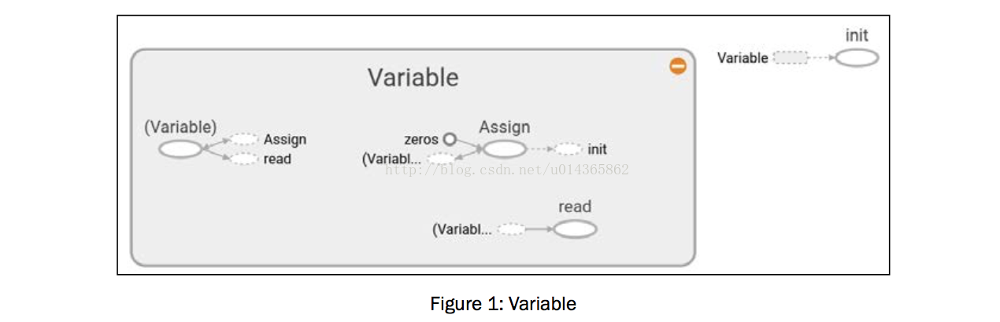
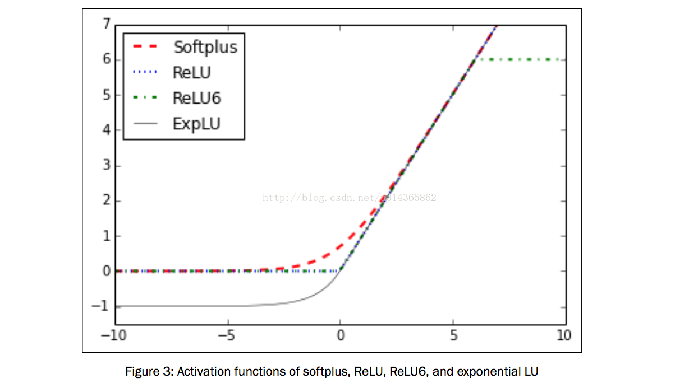
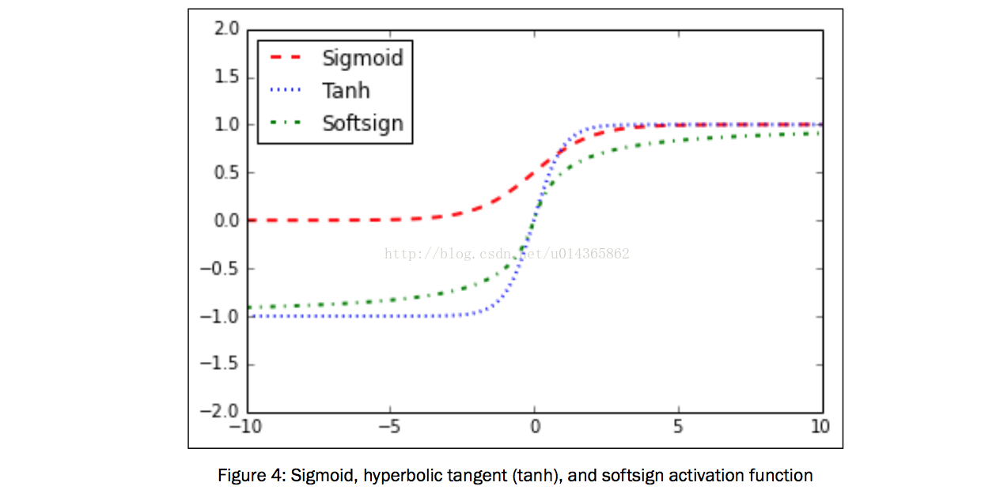
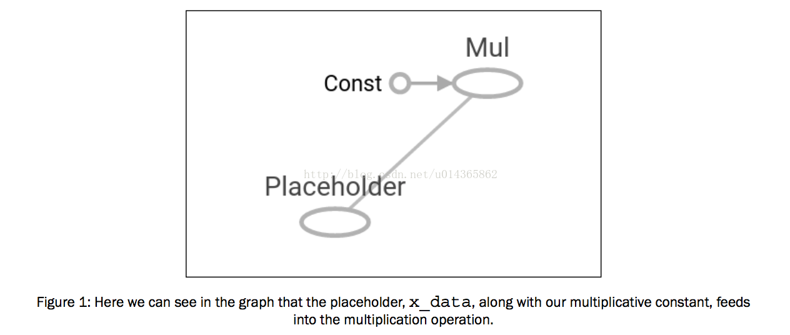
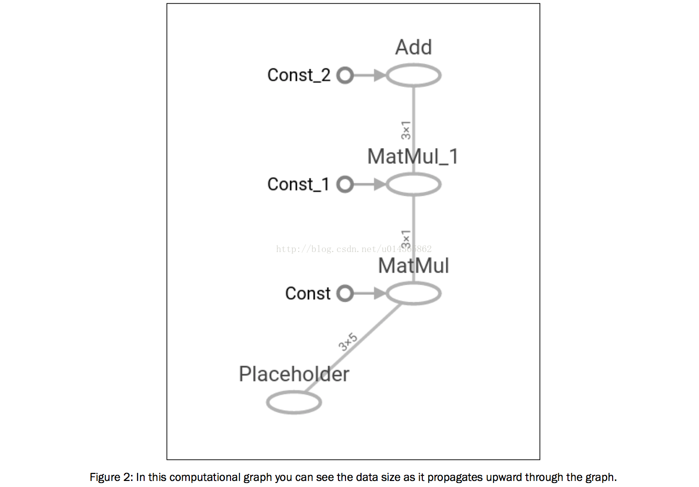
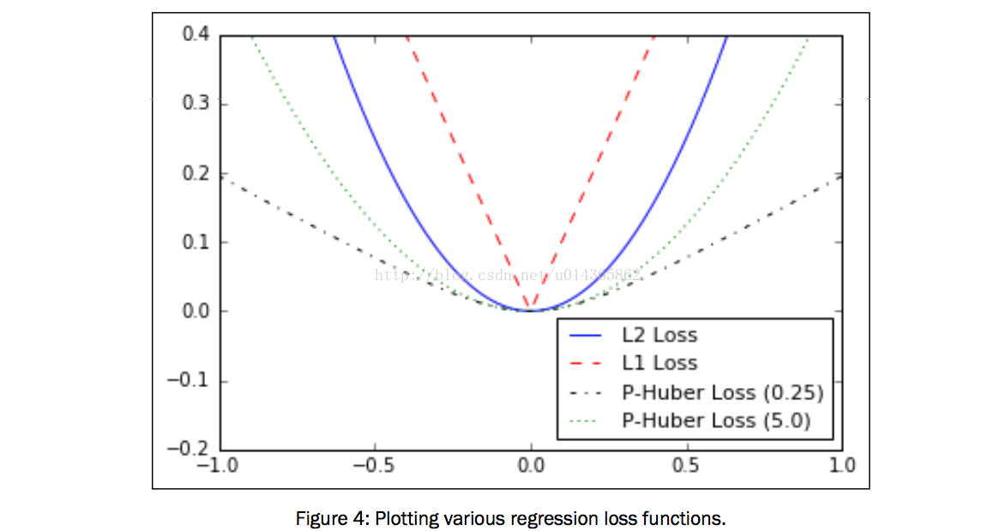
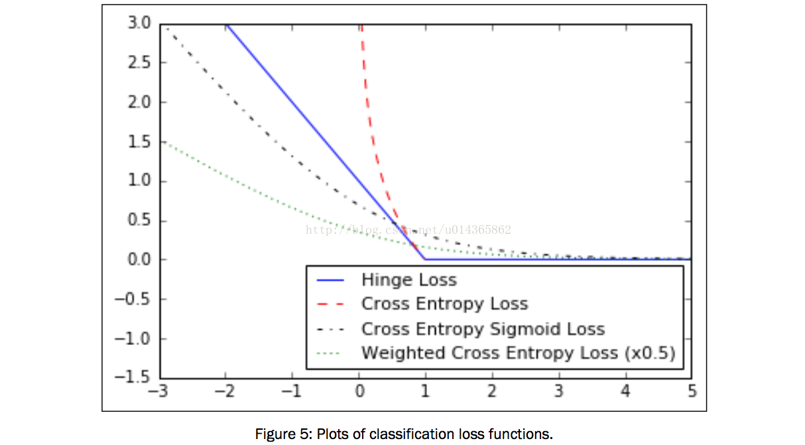
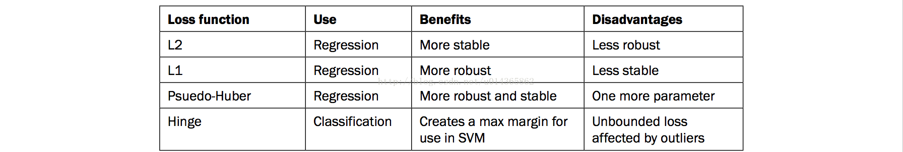
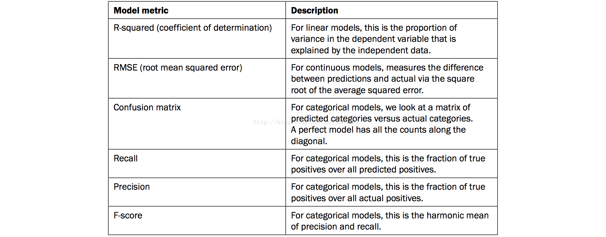

TensorFlow入门
===

Google的TensorFlow引擎具有独特的解决问题的方法。 这种独特的方式允许我们非常有效地解决机器学习问题。 机器学习几乎在使用所有的生活和工作领域，但一些更着名的领域是计算机视觉，语音识别，语言翻译和医疗保健。 我们将介绍基本步骤，以了解TensorFlow如何运行，并最终在本书后面建立生产代码技术。 这些基础知识对于了解本书其余部分的内容很重要。

How TensorFlow Works？


首先，TensorFlow中的计算可能看起来不必要的复杂。 但是有一个原因：由于TensorFlow如何处理计算，开发更复杂的算法比较容易。 该内容将引导我们通过TensorFlow算法的伪代码。

Getting ready：

目前，Linux，Mac和Windows都支持TensorFlow。本书的代码已经在Linux系统上创建并运行，但是也应该在其他系统上运行。该书的代码可在GitHub上获取，网址为https://github.com/nfmcclure/tensorflow_ cookbookTensorFlow。在本书中，我们将仅关注TensorFlow的Python库包装器，尽管TensorFlow的大部分原始核心代码都是用C ++编写的。本书将使用Python 3.4+（https://www.python.org）和TensorFlow 0.12（https://www.tensorflow.org）。 TensorFlow在cial GitHub网站上提供了一个1.0.0 alpha版本，本书中的代码已经被审查以与该版本兼容。虽然TensorFlow可以在CPU上运行，但是如果在GPU上处理，则大多数算法运行得更快，并且在具有Nvidia Compute Capability v4.0 +（推荐使用v5.1）。 TensorFlow的热门GPU是Nvidia Tesla架构和具有至少4 GB视频RAM的Pascal架构。要在GPU上运行，您还需要下载并安装Nvidia Cuda Toolkit以及v 5.x +（https://developer.nvidia.com/cuda-downloads）。一些配方将依赖于当前安装的Python包：Scipy，Numpy和Scikit-Learn。这些附带的软件包也都包含在Anaconda软件包（https://www.continuum.io/downloads）中。

How to do it...：

这里我们将介绍TensorFlow算法的一般流程。 大多数内容将遵循这个大纲：

* 1.导入或生成数据集：我们所有的机器学习算法将依赖于数据集。 在本书中，我们将生成数据或使用外部数据集源。 有时最好依靠生成的数据，因为我们只想知道预期的结果。 大多数情况下，我们将访问给定食谱的公共数据集，有关访问这些信息的详细信息，请参见本章第8节。

* 2.转换和归一化数据：通常，输入数据集不会以TensorFlow的形式出现，因此我们需要将TensorFlow转换为接受的形状。 数据通常不在我们的算法期望的正确维度或类型。 我们将不得不转换我们的数据，然后才能使用它。 大多数算法也期望归一化数据，我们也将在这里做。 TensorFlow具有内置函数，可以为您规范数据，如下所示：


```python
data = tf.nn.batch_norm_with_global_normalization(...)
```


* 3.将数据集划分为训练集，测试和验证集：我们通常希望在我们接受过培训的不同集上测试我们的算法。 此外，许多算法需要超参数调整，因此我们放置一个验证集来确定最佳的超参数集。

* 4.设置算法参数（超参数）：我们的算法通常具有一组在整个过程中保持不变的参数。 例如，这可以是我们选择的迭代次数，学习率或其他有效参数。 将这些一起初始化是很好的形式，因此读者或用户可以很容易地找到它们，如下所示：


```python

learning_rate = 0.01
batch_size = 100
iterations = 1000

```


 * 5.初始化变量和占位符：TensorFlow取决于知道它可以和不能修改什么。 TensorFlow将在优化期间修改/调整变量和权重/偏差，以最大限度地减少损失函数。 为了实现这一点，我们通过占位符来提供数据。 我们需要初始化这两个变量和占位符的大小和类型，以便TensorFlow知道预期。 TensorFlow还需要知道要预期的数据类型：对于本书的大部分，我们将使用float32。 TensorFlow还提供了float64和float16。 请注意，精度较高的字节会导致较慢的算法，但是我们使用的结果越少，精度越低。 请参阅以下代码：


```python

a_var = tf.constant(42)
x_input = tf.placeholder(tf.float32, [None, input_size])
y_input = tf.placeholder(tf.float32, [None, num_classes])

```

* 6.定义模型结构：在我们拥有数据并初始化了变量和占位符后，我们必须对模型进行定义。 这是通过构建计算图来完成的。 TensorFlow选择哪些操作和价值必须是变量和占位符来达到我们的模型结果。 我们在第2章“TensorFlow方法”中的计算图中的运算中的计算图更详细地讨论了TensorFlow配方。 我们这个例子的模型将是一个线性模型：


```python

y_pred = tf.add(tf.mul(x_input, weight_matrix), b_matrix)

```


* 7.声明损失函数：在定义模型之后，我们必须能够评估输出。 这是我们声明损失函数的地方。 损失函数非常重要，因为它告诉我们我们的预测与实际值有多远。 不同类型的损失函数将在第2章“TensorFlow方法”中的“实施反向传播配方”中进行了详细的探讨。

```python
loss = tf.reduce_mean(tf.square(y_actual – y_pred))
```

* 8.初始化和训练模型：现在我们已经有了一切，我们需要创建一个图表的实例，通过占位符提供数据，并让TensorFlow更改变量以更好地预测我们的训练数据。 这是初始化计算图的一种方法：

```python
with tf.Session(graph=graph) as session:
       ...
       session.run(...)
       ...
#Note that we can also initiate our graph with:
       session = tf.Session(graph=graph)
       session.run(...)
```

* 9.评估模型：一旦我们建立并训练了模型，我们就应该通过一些具体的标准来评估新模型的效果。 我们对训练和测试集进行评估，这些评估将使我们看到该模型是否在t或以上。 我们将在以后的食谱中解决这些问题。

* 10.调整超参数：大多数情况下，我们将根据模型性能返回并更改一些超级参数。 然后，我们用不同的超参数重复上述步骤，并对验证集进行评估。

* 11.部署/预测新结果：了解如何对新的，未见的数据进行预测也很重要。

How it works...：

在TensorFlow中，我们必须在我们之前设置数据，变量，占位符和模型告诉程序训练和更改变量以改进预测。 TensorFlow通过计算图完成了这一点。 这些计算图是没有递归的有向图，这允许计算并行性。 我们为TensorFlow创建一个损失函数，以最小化。TensorFlow通过修改计算图中的变量来实现。 Tensor ow知道如何修改变量，因为它跟踪模型中的计算，并自动计算每个变量的梯度。 因此，我们可以看到进行更改以及尝试不同的数据源有多么容易。

See also：

可以浏览Tensor ow Python API部分的cial文档，网址为https://www.tensorflow.org/api_docs/python/
      还有以下教程：https://www.tensorflow.org/ tutorials /

Declaring Tensors：


Tensor是TensorFlow用于在计算图上操作的主要数据结构。 我们可以将这些张量声明为变量，并将它们作为占位符进行馈送。 首先我们必须知道如何创建张量。


Getting ready：

当我们创建一个张量并将其声明为一个变量时，TensorFlow在我们的计算图中创建了几个图形结构。 同样重要的是要指出，只要创建一个张量，TensorFlow就不会对计算图添加任何东西。 TensorFlow只有在创建可用的张量之后才能做到这一点。 有关更多信息，请参阅下一节变量和占位符。


How to do it...


这里我们将介绍在TensorFlow中创建张量的主要方法：

1. Fixed tensors:

创建零填充张量。 使用以下内容：

```python       
zero_tsr = tf.zeros([row_dim, col_dim])
```

创建1填充的张量。 使用以下内容：

```python     
ones_tsr = tf.ones([row_dim, col_dim])
```

创建一个常量填充的张量。 使用以下内容：

```python       
filled_tsr = tf.fill([row_dim, col_dim], 42)
```

从现有常数中创建张量。 使用以下内容：
```python     
constant_tsr = tf.constant([1,2,3])
```
** 请注意，tf.constant（）函数可用于将数值广播到数组中，通过写入tf.constant（42，[row_dim，col_dim]）来模拟 tf.fill（）的行为

2. Tensors of similar shape:

我们也可以根据其他张量的形状初始化变量，如下所示：

```python                      
zeros_similar = tf.zeros_like(constant_tsr)

ones_similar = tf.ones_like(constant_tsr)
```

** 注意，由于这些张量依赖于先前的张量，我们必须按顺序初始化它们。 试图一次全部初始化所有张量将会导致错误。 请参阅下一章末尾有关变量和占位符的部分。


3. Sequence tensors:

ensorFlow允许我们指定包含定义的间隔的张量。 以下函数的行为与range（）输出和numpy的linspace（）输出非常相似。请参阅以下功能：

```python                      
linear_tsr = tf.linspace(start=0, stop=1, start=3)
```

所得到的张量是序列[0.0,0.5,1.0]。 注意这个功能包括指定的停止值。 请参阅以下功能：

```python                      
nteger_seq_tsr = tf.range(start=6, limit=15, delta=3)
```

** 结果是序列[6,9,12]。 请注意，此功能不包括限制值。

4. Random tensors:

以下生成的随机数来自均匀分布：

```python                                     
randunif_tsr = tf.random_uniform([row_dim, col_dim],minval=0, maxval=1)
```

** 请注意，该随机均匀分布从包括最小值但不是maxval（minval <= x <maxval）的间隔中抽取。

要从正态分布得到一个随机抽样的张量，如下所示:

```python
randnorm_tsr = tf.random_normal([row_dim, col_dim],mean=0.0, stddev=1.0)
```

还有一些时候，我们希望生成一定范围内保证的正常随机值。 truncated_normal（）函数总是在指定均值的两个标准偏差内选择正常值。 请参阅以下内容：

```                                     
runcnorm_tsr = tf.truncated_normal([row_dim, col_dim],mean=0.0, stddev=1.0)
```


我们也可能对数组的条目进行随机化。 为了实现这一点，有两个功能可以帮助我们：random_shuffle（）和random_crop（）。 请参阅以下内容：

```python
shuffled_output = tf.random_shuffle(input_tensor)
```

```python
cropped_output = tf.random_crop(input_tensor, crop_size)
```


在本书的后面，我们将有兴趣随机裁剪大小（高，宽，3）的图像，其中有三个颜色光谱。 要修复cropped_output中的维度，您必须在该维度中给出最大尺寸：

```python
cropped_image = tf.random_crop(my_image, [height/2, width/2,3])
```

How it works...：

一旦我们决定如何创建张量，那么我们也可以通过在Variable（）函数中包裹张量来创建相应的变量，如下所示。 更多关于这一点在下一节：

```python
my_var = tf.Variable(tf.zeros([row_dim, col_dim]))
```

There's more...：

我们不限于内置功能。 我们可以使用函数convert_to_tensor（）将任何numpy数组转换为Python列表，或将常量转换为张量。 请注意，如果我们希望推广函数内的计算，该函数也可以接受张量作为输入。


Using Placeholders and Variables：

占位符和变量是在TensorFlow中使用计算图的关键工具。 我们必须了解差异，什么时候最好地利用它们来实现我们的优势。

Getting ready：

使用数据最重要的区别之一是它是占位符还是变量。 变量是算法的参数，TensorFlow跟踪如何改变这些来优化算法。 占位符是允许您提供特定类型和形状的数据的对象，并且取决于计算图的结果，例如计算的预期结果。

How to do it...：

创建变量的主要方法是使用Variable（）函数，它将一张张量作为输入并输出一个变量。 这是声明，我们仍然需要初始化变量。 初始化是将变量与相应的方法放在计算图上。 以下是创建和初始化变量的示例：

```python
my_var = tf.Variable(tf.zeros([2,3]))
sess = tf.Session()
initialize_op = tf.global_variables_initializer ()
sess.run(initialize_op)
```

要在创建和初始化变量之后查看计算图形的外观，请参阅此配方中的下一部分。

占位符只是将数据放入图表中。 占位符从会话中的feed_dict参数获取数据。 要在图表中放置占位符，我们必须对占位符执行至少一个操作。 我们初始化图形，将x声明为占位符，并将其定义为x上的身份操作，它只返回x。 然后，我们创建数据以进入x占位符并运行身份操作。 值得注意的是，TensorFlow不会在feed字典中返回一个自引用的占位符。 代码如下所示，结果图显示在下一节                

```python
sess = tf.Session()
x = tf.placeholder(tf.float32, shape=[2,2])
y = tf.identity(x)
x_vals = np.random.rand(2,2)
sess.run(y, feed_dict={x: x_vals})
# Note that sess.run(x, feed_dict={x: x_vals}) will result in a self-referencing error.
```

How it works...：

将变量初始化为零张量的计算图如下所示：

 


 在图1中，我们可以看到，只有一个变量，初始化为全零，计算图表的详细信息。 灰色阴影区域是涉及的操作和常数的非常详细的视图。 具有较少细节的主要计算图是右上角灰色区域外的较小图。 有关创建和可视化图形的更多详细信息，请参见第10章“将TensorFlow转换为生产”一节。


类似地，将numpy阵列馈入占位符的计算图可以在下面的例子中看到：

 


 There's more...：

在计算图的运行期间，我们必须告诉TensorFlow何时初始化我们创建的变量。 必须通知TensorFlow可以初始化变量的时间。 虽然每个变量都有一个初始化器方法，但最常用的方法是使用helper函数，它是global_variables_initializer（）。该函数在图形中创建一个初始化所有创建的变量的操作，如下所示：

```python
initializer_op = tf.global_variables_initializer ()
```

但是，如果要根据初始化另一个变量的结果初始化一个变量，我们必须按照我们想要的顺序初始化变量，如下所示：

```python
sess = tf.Session()
first_var = tf.Variable(tf.zeros([2,3]))
sess.run(first_var.initializer)
second_var = tf.Variable(tf.zeros_like(first_var))
# Depends on first_var
sess.run(second_var.initializer)
```

Working with Matrices：

了解TensorFlow如何使用矩阵对于通过计算图理解数据流非常重要。

Getting ready：

许多算法依赖矩阵运算。 TensorFlow为我们提供了易于使用的操作来执行这种矩阵计算。 对于以下所有示例，我们可以通过运行以下代码创建图表会话（graph session）：

```python
import tensorflow as tf
sess = tf.Session()
```

1.创建矩阵：

我们可以从numpy数组或嵌套列表创建二维矩阵，如前面在张量部分中所述。 我们还可以使用张量创建函数，并为诸如zeros（），ones（），truncated_normal（）等功能指定二维形式。 TensorFlow还允许我们从具有函数diag（）的一维数组或列表创建一个对角矩阵，如下所示：  

```python
identity_matrix = tf.diag([1.0, 1.0, 1.0])
A = tf.truncated_normal([2, 3])
B = tf.fill([2,3], 5.0)
C = tf.random_uniform([3,2])
D = tf.convert_to_tensor(np.array([[1., 2., 3.],[-3., -7.,-1.],[0., 5., -2.]]))
print(sess.run(identity_matrix))
[[ 1. 0. 0.]
[ 0. 1. 0.]
[ 0. 0. 1.]]
```

** 请注意，如果我们再次运行sess.run（C），我们将重新初始化随机变量，并最终得到不同的随机值。


2.加法和减法使用以下功能：

```python
print(sess.run(A+B))
```
[[ 4.61596632 5.39771316 4.4325695 ]
[ 3.26702736 5.14477345 4.98265553]]
```python
print(sess.run(B-B))
```
[[ 0. 0. 0.]
[ 0. 0. 0.]]

Multiplication
```python
print(sess.run(tf.matmul(B, identity_matrix)))
```
[[ 5. 5. 5.]
[ 5. 5. 5.]]

3.另外，函数matmul（）也有参数指定是否转置乘法前的参数或每个矩阵是否是稀疏的。

4.转换参数如下：
```python
print(sess.run(tf.transpose(C)))
```
[[ 0.67124544 0.26766731 0.99068872]
[ 0.25006068 0.86560275 0.58411312]]

5.再次，值得一提的是，重新初始化给了我们与以前不同的值。

6.对于行列式，请使用以下内容：

```python
print(sess.run(tf.matrix_determinant(D)))
```        

-38.0
```python        
print(sess.run(tf.matrix_inverse(D)))
```      

[[-0.5 -0.5 -0.5 ]
[ 0.15789474 0.05263158 0.21052632]
[ 0.39473684 0.13157895 0.02631579]]

** 注意，逆方法是基于Cholesky分解，如果矩阵是对称正定律或否则LU分解。

7.分解：

对于Cholesky分解，请使用以下内容：

```python        
print(sess.run(tf.cholesky(identity_matrix)))
```        

[[ 1. 0. 1.]
[ 0. 1. 0.]
[ 0. 0. 1.]]

8.对于特征值和特征向量，请使用以下代码：

```python
print(sess.run(tf.self_adjoint_eig(D)))
```

** 请注意，函数self_adjoint_eig（）输出第一行中的特征值和剩余向量中的后续向量。 在数学中，这被称为矩阵的特征分解。


How it works...：

TensorFlow提供了所有的工具，让我们开始进行数值计算，并将这些计算添加到我们的图表中。 对于简单的矩阵运算，这种符号似乎很重。 请记住，我们将这些操作添加到图表中，并告诉TensorFlow通过这些操作运行的张量。 虽然这可能现在看起来很冗长，但是有助于了解后续章节中的符号，当这种计算方式使得更容易实现我们的目标时。

Implementing Activation Functions：

Getting ready：

当我们开始使用神经网络时，我们将使用激活函数，因为激活函数是任何神经网络的必需部分。 激活功能的目标是调整重量和偏差。 在TensorFlow中，激活函数是作用于张量的非线性运算。 它们是以与之前的数学运算相似的方式操作的功能。 激活功能有很多用途，但是一些主要的概念是，在对输出进行规范化时，它们将非线性引入到图中。 使用以下命令启动TensorFlow图：


import tensorflow as tf
sess = tf.Session()


How to do it：

激活功能存在于TensorFlow的神经网络（nn）库中。 除了使用内置的激活功能，我们还可以使用TensorFlow操作来设计自己的功能。 我们可以导入预定义的激活函数（导入tensorflow.nn为nn），或者在我们的函数调用中显式输入.nn。 在这里，我们选择对每个函数调用是明确的：

1.被称为ReLU的整流线性单元是将非线性引入神经网络的最常见和最基本的方法。 该函数只是max（0，x）。 这是连续但不顺利的。 看起来如下：

```python
print(sess.run(tf.nn.relu([-3., 3., 10.])))
```
[ 0. 3. 10.]


2.有时候我们希望把上一个ReLU激活功能的线性增加部分加起来。 我们可以通过将max（0，x）函数嵌套到这里来实现一个min（）函数。 TensorFlow的实现被称为ReLU6功能。 这被定义为min（max（0，x），6）。 这是一个hard-Sigmoid函数的版本，计算速度更快，并且不会消失（在零点附近）或爆炸值。 当我们在第8章卷积神经网络和第9章循环神经网络中讨论更深层的神经网络时，这将会派上用场。 看起来如下：

```python
print(sess.run(tf.nn.relu6([-3., 3., 10.])))
```
[ 0. 3. 6.]

3.sigmoid是最常见的连续和平滑激活功能。 它也称为逻辑函数，并具有形式1 /（1 + exp（-x））。 由于在训练期间排除反向传播术语的倾向，sigmoid并不经常被使用。 看起来如下：

```python
print(sess.run(tf.nn.sigmoid([-1., 0., 1.])))
```
[ 0.26894143 0.5 0.7310586 ]

** 我们应该意识到，一些激活函数不是以零为中心，如sigmoid。 这将需要我们在大多数计算图算法中使用它之前将数据归零。

4.另一个平滑的激活功能是超切线。 超切线函数非常类似于sigmoid，除了不是在0和1之间的范围内，它的范围在-1和1之间。该函数具有双曲余弦的双曲正弦比的形式。 但是另一种写法是（（exp（x） - exp（-x））/（exp（x）+ exp（-x）），如下所示：

```python
print(sess.run(tf.nn.tanh([-1., 0., 1.])))
```
[-0.76159418 0. 0.76159418 ]

5.softsign功能也被用作激活功能。 该函数的形式为x /（abs（x）+ 1）。 softsign函数应该是对符号函数的连续逼近。 看起来如下：

```python
print(sess.run(tf.nn.softsign([-1., 0., -1.])))
```

[-0.5 0. 0.5]

6.另一个功能，softplus，是ReLU功能的平滑版本。 该函数的形式是log（exp（x）+ 1）。 看起来如下：    

```python
print(sess.run(tf.nn.softplus([-1., 0., -1.])))
```
[ 0.31326166 0.69314718 1.31326163]

**  随着输入增加，softplus进入无穷大，而softsign变为1.随着输入变小，softplus接近零，softsign变为-1。

7. 指数线性单位（ELU）非常类似于softplus函数，除了底部渐近线为-1而不是0.如果x <0，则形式为（exp（x）+1）。 看起来如下：

```python
print(sess.run(tf.nn.elu([-1., 0., -1.])))
```
[-0.63212055 0. 1. ]

How it works...：

这些激活函数是将来在神经网络或其他计算图中引入非线性的方法。 重要的是要注意我们网络中使用激活功能的位置。 如果激活函数的范围在0和1之间（sigmoid），则计算图只能输出0和1之间的值。

如果激活函数在节点之间并在其间隐藏，那么我们想知道当我们通过它们时，范围可以对我们的张量产生影响。 如果我们的张量被缩放为零，我们将需要使用一个激活函数，保留尽可能多的变化在零附近。 这意味着我们想要选择激活函数，如双曲正切（tanh）或softsign。 如果张量被缩放为正数，那么我们理想地选择一个激活函数，保留正域中的方差。

There's more...：

以下是两个图表，说明不同的激活功能。 以下表格显示了以下功能ReLU，ReLU6，softplus，expLU，sigmoid，softsign和双曲正切：

在图3中，我们可以看到四个激活函数，softplus，ReLU，ReLU6和指数LU。 除了ReLU6，其最大值为6：这些函数在零的左边，并且线性增加到零的右边。

在图4中，我们有激活函数sigmoid，双曲正切（tanh）和softsign。 这些激活功能都是平滑的，并具有S n形状。 请注意，这些功能有两个水平渐近线。






Introduction：

现在我们介绍了TensorFlow如何创建张量，使用变量和占位符，我们将介绍如何在计算图中对这些对象采取处理。 从此，我们可以设置一个简单的分类器，看看它的表现如何。

Operations in a Computational Graph：

Getting ready：

要启动图形，我们加载TensorFlow并创建一个会话，如下所示：

```python
import tensorflow as tf
sess = tf.Session()
```

How to do it...：

在这个例子中，我们将结合我们所学到的和在列表中输入每个数字通过计算图操作并打印输出：

1.首先我们声明我们的张量和占位符。 这里我们将创建一个numpy数组来进入我们的操作：

```python
import numpy as np
x_vals = np.array([1., 3., 5., 7., 9.])
x_data = tf.placeholder(tf.float32)
m_const = tf.constant(3.)
my_product = tf.mul(x_data, m_const)
for x_val in x_vals:
  print(sess.run(my_product, feed_dict={x_data: x_val}))
```


How it works...：


步骤1和2在计算图上创建数据和操作。 然后，在步骤3中，我们通过图形提供数据并打印输出。 这是计算图形的样子：




Layering Nested Operations：

Getting ready：

了解如何将操作连接在一起很重要。 这将在计算图中设置分层操作。 对于演示，我们将乘以一个占位符两个矩阵，然后执行加法。 我们将以三维numpy数组的形式提供两个矩阵：

```python
import tensorflow as tf
sess = tf.Session()
```

How to do it...：

注意数据在通过时如何改变形状也很重要。 我们将提供两个大小为3x5的数组。 我们将乘以每个矩阵大小为5x1的常数，这将导致大小为3x1的矩阵。 然后，我们将乘以1x1矩阵，再次产生3x1矩阵。 最后，我们最后添加一个3x1矩阵，如下所示：

1.首先，我们创建数据传回和相应的占位符：

```python
my_array = np.array([[1., 3., 5., 7., 9.], [-2., 0., 2., 4., 6.],[-6., -3., 0., 3., 6.]])
x_vals = np.array([my_array, my_array + 1])
x_data = tf.placeholder(tf.float32, shape=(3, 5))
```

2.接下来，我们创建我们将用于矩阵乘法和加法的常数：

```python
m1 = tf.constant([[1.],[0.],[-1.],[2.],[4.]])
m2 = tf.constant([[2.]])
a1 = tf.constant([[10.]])
```        

3.现在我们声明操作并将它们添加到图中：
```python
prod1 = tf.matmul(x_data, m1)
prod2 = tf.matmul(prod1, m2)
add1 = tf.add(prod2, a1)
```

4.最后，我们通过图表提供数据：

```python        
for x_val in x_vals:
  print(sess.run(add1, feed_dict={x_data: x_val}))
```      
[[ 102.]
[ 66.]
[ 58.]]

[[ 114.]
[ 78.]
[ 70.]]

How it works...：

我们刚刚创建的计算图可以用Tensorboard来显示。 检测板是TensorFlow的一个功能，它允许我们可视化该图中的计算图和值。 这些功能本身提供，与其他机器学习框架不同。 要了解如何完成此操作，请参阅第11章“更多与TensorFlow”中的“Tensorboard配方”中的“可视化图”。 这是我们的分层图如下所示：





There's more...：

在通过图形运行数据之前，我们必须声明数据的shape并知道操作的结果shape。 情况并非如此。 可能有一个或两个我们不知道或可以改变的维度。 为了实现这一点，我们指定可以变化或未知的维值为无值。 例如，要使先前的数据占位符的列数不明，我们将写下列行：

```python
x_data = tf.placeholder（tf.float32，shape =（3，None））
```

这允许我们打破矩阵乘法规则，我们仍然必须遵守乘法常数必须具有相同的相应行数的事实。 我们可以在我们的图表中提供数据时动态生成或重新整形x_data。 当我们在多个批次中提供数据时，这将在后面的章节中派上用场。

Implementing Loss Functions：

损失函数是非常重要的机器学习算法。他们测量模型输出和目标（真理）值之间的距离。

Getting ready：

为了优化我们的机器学习算法，我们将需要评估的结果。结果tensorflow评价取决于指定损失函数。损失函数告诉TensorFlow如何好或坏的预测进行了比较理想的结果。在大多数情况下，我们将有一组数据和一个目标来训练我们的算法。损失函数比较目标的预测，并给出了两者之间的数值距离。

如下，我们将覆盖主要的损失函数，我们可以实现在TensorFlow。

为了了解不同的损失函数如何操作，我们将在这个配方中绘制它们。我们将rststart计算图和负载matplotlib，Python绘图库，如下：

```python
import matplotlib.pyplot as plt
import tensorflow as tf

How to do it...：

首先，我们将讨论损失函数的回归，即，预测连续因变量。首先，我们将创建一个序列，我们的预测和目标作为一个张量。我们将结果输出在500 x 1和1之间。见下一节的输出图。使用以下代码：

```python
x_vals = tf.linspace(-1., 1., 500)
target = tf.constant(0.)
```

1. L2 loss损失也称为欧氏损失函数。它只是距离目标的距离的平方。在这里，如果目标是零，我们将计算的损失函数。L2范数是一个伟大的损失函数，因为它是非常弯曲的目标附近，算法可以使用这个事实收敛到目标更慢，越接近，得到如下：

```python
l2_y_vals = tf.square(target - x_vals)
l2_y_out = sess.run(l2_y_vals)
```

** TensorFlow有一个内置的L2范数，称为nn.l2_loss()。这个函数实际上是一半以上的L2范数。换句话说，它和以前一样，但除以2。

2. L1 loss也称为绝对损失函数。我们没有取差额，而是取绝对值。L1范数是更好的离群值比L2范数，因为它不是陡峭的较大值。要注意的一个问题是在目标的L1范数是不光滑的，这可能会导致算法不收敛良好。如下所示：

```python
l1_y_vals = tf.abs(target - x_vals)
l1_y_out = sess.run(l1_y_vals)
```

3. Pseudo Huber loss是一个连续光滑逼近的胡贝尔损失函数。这种损失函数试图采取最好的L1和L2规范的凸附近的目标和陡峭的极端值。该窗体依赖于一个额外的参数，delta，它决定了它将是多么陡峭。我们将图两种形式，Delta1 = 0.25和Delta2 = 5以示区别，如下：

delta1 = 0.25 and delta2 = 5 to show the difference, as follows:

```python
delta1 = tf.constant(0.25)
phuber1_y_vals = tf.mul(tf.square(delta1), tf.sqrt(1. + tf.square((target - x_vals)/delta1)) - 1.)
phuber1_y_out = sess.run(phuber1_y_vals)
delta2 = tf.constant(5.)
phuber2_y_vals = tf.mul(tf.square(delta2), tf.sqrt(1. + tf.square((target - x_vals)/delta2)) - 1.)
phuber2_y_out = sess.run(phuber2_y_vals)
```

4. 分类的损失函数来评估损失预测分类结果。
5. 我们需要设定我们的预测（x_vals）和target。我们将保存输出并在下一节中绘制它们。使用以下：

```python
x_vals = tf.linspace(-3., 5., 500)
target = tf.constant(1.)
targets = tf.fill([500,], 1.)
```

6. Hinge loss主要用于支持向量机，但也可以用于神经网络。它的目的是计算两个目标类之间的损失，1和- 1。在下面的代码中，我们使用目标值1，这样越接近我们的预测接近到1，损失值越低：

```python
hinge_y_vals = tf.maximum(0., 1. - tf.mul(target, x_vals))
hinge_y_out = sess.run(hinge_y_vals)
```

7. Cross-entropy loss的二进制的情况下，有时也被称为逻辑损失函数。它来时，我们预测这两个班0或1。我们希望测量实际类（0或1）到预测值之间的距离，这个值通常是在0到1之间的实数。为了测量这个距离，我们可以使用交叉熵公式从信息理论，如下：

```python
xentropy_y_vals = - tf.mul(target, tf.log(x_vals)) - tf.mul((1. - target), tf.log(1. - x_vals))
xentropy_y_out = sess.run(xentropy_y_vals)
```

8. Sigmoid cross entropy loss是以前的损失函数非常相似，除了将x的Sigmoid函数之前，我们把他们的交叉熵损失，如下：

```python
xentropy_sigmoid_y_vals = tf.nn.sigmoid_cross_entropy_with_logits(x_vals, targets)
xentropy_sigmoid_y_out = sess.run(xentropy_sigmoid_y_vals)
```

9. Weighted cross entropy loss是一个加权版本的 sigmoid cross entropy loss。我们提供了一个权重的积极目标。举个例子，我们将0.5的正目标加权如下：

```python
weight = tf.constant(0.5)
xentropy_weighted_y_vals = tf.nn.weighted_cross_entropy_with_logits(x_vals, targets, weight)
xentropy_weighted_y_out = sess.run(xentropy_weighted_y_vals)
```

10. Softmax cross-entropy loss在非归一化输出。这个函数是用来测量损失时，只有一个目标类别，而不是多个。因此，功能转换的输出通过softmax函数的概率分布，然后计算损失函数从一个真实的概率分布，如下：

```python
unscaled_logits = tf.constant([[1., -3., 10.]])
target_dist = tf.constant([[0.1, 0.02, 0.88]])
softmax_xentropy = tf.nn.softmax_cross_entropy_with_logits(unscaled_logits, target_dist)
print(sess.run(softmax_xentropy))
```
[ 1.16012561]


11. Sparse softmax cross-entropy loss是以前一样，只不过是一个概率分布的目标，它是一个指数的范畴是真实的。而不是一个稀疏的全零目标向量的一个值，我们只是传递的指数，其中类别是真正的价值，如下：

```python
unscaled_logits = tf.constant([[1., -3., 10.]])
sparse_target_dist = tf.constant([2])
sparse_xentropy = tf.nn.sparse_softmax_cross_entropy_with_logits(unscaled_logits, sparse_target_dist)
print(sess.run(sparse_xentropy))
```

[ 0.00012564]


How it works...：
这里介绍的是如何用Matplotlib绘制回归的损失函数：
```python
x_array = sess.run(x_vals)
plt.plot(x_array, l2_y_out, 'b-', label='L2 Loss')
plt.plot(x_array, l1_y_out, 'r--', label='L1 Loss')
plt.plot(x_array, phuber1_y_out, 'k-.', label='P-Huber Loss (0.25)')
plt.plot(x_array, phuber2_y_out, 'g:', label='P-Huber Loss (5.0)')
plt.ylim(-0.2, 0.4)
plt.legend(loc='lower right', prop={'size': 11})
plt.show()
```
 


这里是如何使用Matplotlib绘制各种分类损失函数：

```python
x_array = sess.run(x_vals)
plt.plot(x_array, hinge_y_out, 'b-', label='Hinge Loss')
plt.plot(x_array, xentropy_y_out, 'r--', label='Cross Entropy Loss')
plt.plot(x_array, xentropy_sigmoid_y_out, 'k-.', label='Cross Entropy Sigmoid Loss')
plt.plot(x_array, xentropy_weighted_y_out, 'g:', label='Weighted Cross Enropy Loss (x0.5)')
plt.ylim(-1.5, 3)
plt.legend(loc='lower right', prop={'size': 11})
plt.show()

```


There's more...：

  这里是一个表总结了不同的损失函数：



 在评估一个模型时还有许多其他的指标要看。以下是一些需要考虑的列表：




Implementing Back Propagation
---

使用TensorFlow的好处之一是可以跟踪操作，并根据反向传播自动更新模型变量。如下，我们将介绍如何在训练机器学习模型时将这一方面作为优势。

Getting ready：

现在我们将介绍如何在模型中改变我们的变量，使损失函数最小化。 我们已经了解了如何使用对象和操作，并创建了可以测量我们的预测和目标之间距离的损失函数。 现在我们只需要告诉TensorFlow如何通过我们的计算来传播错误图形更新变量并最大限度地减少损失函数。 这是通过声明优化函数来完成的。 一旦我们有一个声明的优化函数，TensorFlow将通过并计算出图中我们所有计算的反向传播项。 当我们提供数据并减少损失函数时，TensorFlow将相应地修改图中的变量。

具体实现看下面例子：

How to do it...:

以下是回归示例的工作原理：

1. 我们从加载数字Python包，numpy和tensorflow开始：

```python
import numpy as np
import tensorflow as tf
```

2. graph session:

```python
sess = tf.Session()
```

3. 接下来我们创建数据，占位符和A变量：

```python
x_vals = np.random.normal(1, 0.1, 100)
y_vals = np.repeat(10., 100)
x_data = tf.placeholder(shape=[1], dtype=tf.float32)
y_target = tf.placeholder(shape=[1], dtype=tf.float32)
A = tf.Variable(tf.random_normal(shape=[1]))
```

4. 我们将乘法运算添加到我们的graph中：
```python
my_output = tf.mul(x_data, A)
```
5. 接下来我们在乘法输出和目标之间增加L2损失函数：

```python
loss = tf.square(my_output - y_target)
```

6. 在我们run之前，必须初始化变量：

```python
init = tf.initialize_all_variables()
sess.run(init)
```

7. 现在我们必须声明一种在图中优化变量的方法。 我们声明一个优化器算法。 大多数优化算法需要知道每次迭代有多远。 该距离由学习率控制。 如果我们的学习率太大，我们的算法可能会超出最小值，但是如果我们的学习率太小，则算法可能需要太长的时间才能收敛; 这与梯度消失和梯度爆炸问题有关。 学习率对收敛性有很大的影响，我们将在本节末尾进行讨论。 在这里，我们使用标准梯度下降算法，有许多不同的优化算法运行不同，可以根据问题做更好或更差。 有关不同优化算法的很好的概述，请参阅Sebastian Ruder在本配方末尾的另见部分的论文：

```python
my_opt = tf.train.GradientDescentOptimizer(learning_rate=0.02)
train_step = my_opt.minimize(loss)
```


8. 第一步是循环使用训练算法，并告诉TensorFlow训练多次。 我们会做这101次，每25次迭代打印一次结果。 要训练，我们将选择一个随机的x和y条目，并通过图表进行输入。 TensorFlow将自动计算损失，并略微改变A偏差以最大限度地减少损失：

```python
for i in range(100):
  rand_index = np.random.choice(100)
  rand_x = [x_vals[rand_index]]
  rand_y = [y_vals[rand_index]]
  sess.run(train_step, feed_dict={x_data: rand_x, y_target: rand_y})
  if (i+1)%25==0:
    print('Step #' + str(i+1) + ' A = ' + str(sess.run(A)))
    print('Loss = ' + str(sess.run(loss, feed_dict={x_data: rand_x, y_target: rand_y})))
```

9. 现在我们将介绍简单分类示例的代码。 如果我们首先重新设置图形，我们可以使用相同的TensorFlow脚本。 请记住，我们将尝试找到一个最佳的translation，A将将两个分布转换为原始，而Sigmoid函数会将两个分割分成两个不同的类。

10. 首先我们重新设置graph并重新初始化graph session：

```python
from tensorflow.python.framework import ops
ops.reset_default_graph()
sess = tf.Session()
```

11. 接下来，我们将从两个不同的正态分布N（-1,1）和N（3,1）创建数据。 我们还将生成目标标签，数据占位符和偏差变量A：

```python
x_vals = np.concatenate((np.random.normal(-1, 1, 50), np.random.normal(3, 1, 50)))
y_vals = np.concatenate((np.repeat(0., 50), np.repeat(1., 50)))
x_data = tf.placeholder(shape=[1], dtype=tf.float32)
y_target = tf.placeholder(shape=[1], dtype=tf.float32)
A = tf.Variable(tf.random_normal(mean=10, shape=[1]))
```

** 请注意，我们将A初始化为大约10的值，远离理论值-1。 我们这样做是为了显示算法如何从值10收敛到最优值-1。

12. 接下来，我们将翻译操作添加到图形。 请记住，我们不需要将其包装在一个sigmoid函数中，因为损失函数将为我们做到这一点：

```python
my_output = tf.add(x_data, A)
```

13. 因为特定的损失函数需要具有与它们相关联的额外维度的批次数据（附加维度是批次号），我们将使用函数expand_dims（）向输出添加一个额外的维度。在下一节中， 将讨论如何在培训中使用可变大小的批次。 现在我们一次只会使用一个随机数据点：

```python
my_output_expanded = tf.expand_dims(my_output, 0)       
y_target_expanded = tf.expand_dims(y_target, 0)
```

14. 接下来我们将初始化一个变量A：

```python
init = tf.initialize_all_variables()
sess.run(init)
```

15. 现在我们声明损失函数。 将使用不规范的交叉熵用Sigmoid函数转换它们。 TensorFlow有一个函数叫做nn.sigmoid_cross_ entropy_with_logits（）。 如前所述，它希望这些论据具有特定的维度，因此我们必须相应地使用扩展的输出和目标：

```python
xentropy = tf.nn.sigmoid_cross_entropy_with_logits( my_output_expanded, y_target_expanded)
```

16. 就像回归的例子，我们需要添加一个优化函数的图，TensorFlow知道如何更新图中的偏差变量：

```python
my_opt = tf.train.GradientDescentOptimizer(0.05)
train_step = my_opt.minimize(xentropy)
```

17. 最后，我们通过随机选择的数据点循环数百次，并更新相应的变量。每200次迭代，我们将打印出一个值和损失：

```python

for i in range(1400):
  rand_index = np.random.choice(100)
  rand_x = [x_vals[rand_index]]
  rand_y = [y_vals[rand_index]]
  sess.run(train_step, feed_dict={x_data: rand_x, y_target: rand_y})
  if (i+1)%200==0:
    print('Step #' + str(i+1) + ' A = ' + str(sess.run(A)))
    print('Loss = ' + str(sess.run(xentropy, feed_dict={x_data: rand_x, y_target: rand_y})))

```

How it works...：

作为一个总的来说，这两个例子中，我们做了以下：

1. 数据的构建。

2. 初始化占位符和变量。

3. 构建模型。

4. 构造loss function。

5. 设置优化算法。

6. 最后，遍历随机样本数据迭代更新我们的变量。


Evaluating Models：

我们已经学会了如何在TensorFlow的回归和分类算法。完成后，我们必须能够评估模型的预测，以确定它有多好。

Getting ready：

评价模型是非常重要的，每一个后续的模型将有某种形式的模型评价。使用tensorflow，我们必须建立这个功能的计算图，称之为期间和/或之后，我们的模型训练。

评估模型在训练过程中给我们洞察算法，并可能给我们提示调试它，改善它，或完全改变模型。而训练不是必要的评价过程中，我们将展示如何做到这两者的回归和分类。

训练后，我们需要量化模型如何执行的数据。理想情况下，我们有一个单独的训练和测试集（甚至验证集），我们可以评估模型。

当我们想评估一个模型，我们会想这样做的一个大批量的数据点。如果我们已经实施批处理培训，我们可以重用我们的模型，这样的一批预测。如果我们已经实施随机训练，我们可能需要创建一个单独的评价程序，可以处理数据分批。

How to do it...：

回归模型试图预测连续数。目标不是一个类别，而是一个期望的数字。为了评估这些回归预测的实际目标，我们需要一个总的测量两者之间的距离。大多数情况下，一个有意义的损失函数将满足这些标准。这里是如何改变从上面的简单的回归算法打印输出在训练回路中的损失和评估的损失在最后。对于一个例子，我们将重新审视和重写我们的回归例子，在此之前实施反向传播。

分类模型预测一类基于数值输入。实际的目标序列的1和0，我们必须测量真实值和预测值多么接近。对分类模型的损失函数通常不是有助于解释我们的模型做的。通常，我们需要某种分类的精度，这是通常的百分比预测正确的类别。

How it works...：

```Python

import matplotlib.pyplot as plt
import numpy as np
import tensorflow as tf
sess = tf.Session()
x_vals = np.random.normal(1, 0.1, 100)
y_vals = np.repeat(10., 100)
x_data = tf.placeholder(shape=[None, 1], dtype=tf.float32)
y_target = tf.placeholder(shape=[None, 1], dtype=tf.float32)
batch_size = 25
train_indices = np.random.choice(len(x_vals), round(len(x_vals)*0.8), replace=False)
test_indices = np.array(list(set(range(len(x_vals))) - set(train_indices)))
x_vals_train = x_vals[train_indices]
x_vals_test = x_vals[test_indices]
y_vals_train = y_vals[train_indices]
y_vals_test = y_vals[test_indices]
A = tf.Variable(tf.random_normal(shape=[1,1]))
my_output = tf.matmul(x_data, A)
loss = tf.reduce_mean(tf.square(my_output - y_target))
init = tf.initialize_all_variables()
sess.run(init)
my_opt = tf.train.GradientDescentOptimizer(0.02)
train_step = my_opt.minimize(loss)
for i in range(100):
     rand_index = np.random.choice(len(x_vals_train), size=batch_size)
    rand_x = np.transpose([x_vals_train[rand_index]])
    rand_y = np.transpose([y_vals_train[rand_index]])
    sess.run(train_step, feed_dict={x_data: rand_x, y_target:rand_y})
if (i+1)%25==0:
    print('Step #' + str(i+1) + ' A = ' + str(sess.run(A)))
    print('Loss = ' + str(sess.run(loss, feed_dict={x_data:rand_x, y_target: rand_y})))
Step #25 A = [[ 6.39879179]]
Loss = 13.7903
Step #50 A = [[ 8.64770794]]
Loss = 2.53685
Step #75 A = [[ 9.40029907]]
Loss = 0.818259
Step #100 A = [[ 9.6809473]]
Loss = 1.10908

mse_test = sess.run(loss, feed_dict={x_data: np.transpose([x_vals_test]), y_target: np.transpose([y_vals_test])})
mse_train = sess.run(loss, feed_dict={x_data: np.transpose([x_vals_train]), y_target: np.transpose([y_vals_train])})
print('MSE' on test:' + str(np.round(mse_test, 2)))
print('MSE' on train:' + str(np.round(mse_train, 2)))
MSE on test:1.35
MSE on train:0.88

```


```python
from tensorflow.python.framework import ops
ops.reset_default_graph()
sess = tf.Session()
batch_size = 25
x_vals = np.concatenate((np.random.normal(-1, 1, 50), np.random.normal(2, 1, 50)))
y_vals = np.concatenate((np.repeat(0., 50), np.repeat(1., 50)))
x_data = tf.placeholder(shape=[1, None], dtype=tf.float32)
y_target = tf.placeholder(shape=[1, None], dtype=tf.float32)
train_indices = np.random.choice(len(x_vals), round(len(x_vals)*0.8), replace=False)
test_indices = np.array(list(set(range(len(x_vals))) - set(train_indices)))
x_vals_train = x_vals[train_indices]
x_vals_test = x_vals[test_indices]
y_vals_train = y_vals[train_indices]
y_vals_test = y_vals[test_indices]
A = tf.Variable(tf.random_normal(mean=10, shape=[1]))
my_output = tf.add(x_data, A)
init = tf.initialize_all_variables()
sess.run(init)
xentropy = tf.reduce_mean(tf.nn.sigmoid_cross_entropy_with_logits(my_output, y_target))
my_opt = tf.train.GradientDescentOptimizer(0.05)
train_step = my_opt.minimize(xentropy)
for i in range(1800):
    rand_index = np.random.choice(len(x_vals_train), size=batch_size)
    rand_x = [x_vals_train[rand_index]]
    rand_y = [y_vals_train[rand_index]]
    sess.run(train_step, feed_dict={x_data: rand_x, y_target:rand_y})
    if (i+1)%200==0:
        print('Step #' + str(i+1) + ' A = ' + str(sess.run(A)))
        print('Loss = ' + str(sess.run(xentropy, feed_dict={x_data: rand_x, y_target: rand_y})))
Step #200 A = [ 6.64970636]
Loss = 3.39434
Step #400 A = [ 2.2884655]
Loss = 0.456173
Step #600 A = [ 0.29109824]
Loss = 0.312162
Step #800 A = [-0.20045301]
Loss = 0.241349
Step #1000 A = [-0.33634067]
Loss = 0.376786
Step #1200 A = [-0.36866501]
Loss = 0.271654
Step #1400 A = [-0.3727718]
Loss = 0.294866
Step #1600 A = [-0.39153299]
Loss = 0.202275
Step #1800 A = [-0.36630616]
Loss = 0.358463

y_prediction = tf.squeeze(tf.round(tf.nn.sigmoid(tf.add(x_data,A))))
correct_prediction = tf.equal(y_prediction, y_target)
accuracy = tf.reduce_mean(tf.cast(correct_prediction, tf.float32))
acc_value_test = sess.run(accuracy, feed_dict={x_data: [x_vals_test], y_target: [y_vals_test]})
acc_value_train = sess.run(accuracy, feed_dict={x_data: [x_vals_train], y_target: [y_vals_train]})
print('Accuracy' on train set: ' + str(acc_value_train))
print('Accuracy' on test set: ' + str(acc_value_test))
Accuracy on train set: 0.925
Accuracy on test set: 0.95


```
