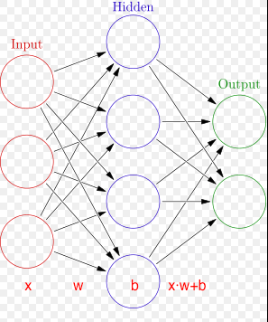
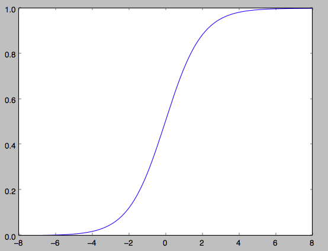
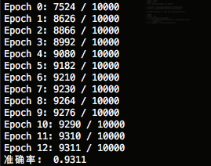
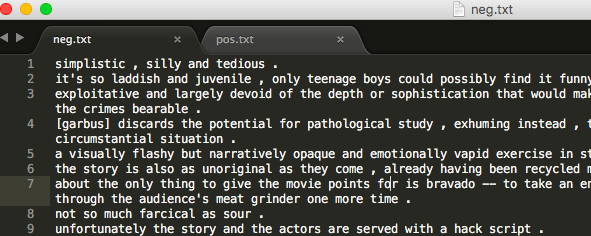
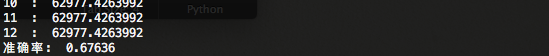

安装 Tensorflow(GPU支持)
===

要想安装Tensorflow GPU版本，你需要有一个新一点的Nvidia显卡。

Tensorflow CPU版本的安装
---

```
$ sudo apt-get install python-pip python-dev python-virtualenv    # python 2.7
$ sudo apt-get install python3-pip python3-dev python3-virtualenv # python 3.4+
```

使用虚拟环境

```
$ virtualenv --system-site-packages ~/tensorflow
$ source ~/tensorflow/bin/activate
```

```
# Ubuntu/Linux 64-bit, CPU only, Python 2.7
$ export TF_BINARY_URL=https://storage.googleapis.com/tensorflow/linux/cpu/tensorflow-0.11.0rc1-cp27-none-linux_x86_64.whl

# Ubuntu/Linux 64-bit, CPU only, Python 3.4
$ export TF_BINARY_URL=https://storage.googleapis.com/tensorflow/linux/cpu/tensorflow-0.11.0rc1-cp34-cp34m-linux_x86_64.whl

# Ubuntu/Linux 64-bit, CPU only, Python 3.5
$ export TF_BINARY_URL=https://storage.googleapis.com/tensorflow/linux/cpu/tensorflow-0.11.0rc1-cp35-cp35m-linux_x86_64.whl
```

安装Tensorflow：

```
# Python 2
$ sudo pip install --upgrade $TF_BINARY_URL

# Python 3
$ sudo pip3 install --upgrade $TF_BINARY_URL

```
 如果要升级Tensorflow，替换新版本的TF_BINARY_URL。https://www.tensorflow.org

 编译安装Tensorflow（GPU支持）
 ---

安装NVidia显卡驱动，你可以在Ubuntu内置的附加驱动中安装。

```
$ sudo add-apt-repository ppa:graphics-drivers/ppa
$ sudo apt update
```

安装CUDA:

```
#下载安装：
#https://developer.nvidia.com/cuda-toolkit
$ sudo sh cuda_8.0.44_linux.run --override   # 安装位置: /usr/local/cuda

# 默认仓库中的版本较旧
#$ sudo apt install nvidia-cuda-toolkit nvidia-cuda-dev   # 安装位置: /usr
```

安装CudNN V5：https://developer.nvidia.com/cudnn

在~/.bashrc文件中添加环境变量：

```
export LD_LIBRARY_PATH="$LD_LIBRARY_PATH:/usr/local/cuda/lib64:/usr/local/cuda/extras/CUPTI/lib64"
export CUDA_HOME=/usr/local/cuda
source ~/.bashrc
```

下载源码：

```
git clone https://github.com/tensorflow/tensorflow
```

安装一些编译和依赖的工具：

```
$ sudo apt-get install default-jdk python-dev python3-dev python-numpy python3-numpy build-essential python-pip python3-pip python-virtualenv swig python-wheel libcurl3-dev
```

安装Bazel:

```
$ echo "deb [arch=amd64] http://storage.googleapis.com/bazel-apt stable jdk1.8" | sudo tee /etc/apt/sources.list.d/bazel.list
$ curl https://storage.googleapis.com/bazel-apt/doc/apt-key.pub.gpg | sudo apt-key add -
$ sudo apt-get update
$ sudo apt-get install bazel
$ sudo apt-get upgrade bazel

```


配置编译选项

```
$ cd ~/tensorflow
$ ./configure
```

需要输入Python路径，默认是 /usr/bin/python。如果你使用Python3，输入：/usr/bin/python3.5。

输入Python模块路径，默认是/usr/local/lib/python2.7/dist-packages。如果你使用Python3，输入：/usr/local/lib/python3.5/dist-packages。

输入Cuda SDK版本和Cudnn版本：8.0、5.1.5。

配置完成，输入如下信息：

```
INFO: All external dependencies fetched successfully.
Configuration finished
```

编译tensorflow:

```
$ bazel build -c opt --config=cuda  # GPU支持
# CPU支持
#$ bazel build -c opt
```

构建pip包：

```
$ bazel-bin/tensorflow/tools/pip_package/build_pip_package /tmp/tensorflow_pkg
```

安装pip包：

```
$ sudo pip install /tmp/tensorflow_pkg/tensorflow   # python2
$ sudo pip3 install /tmp/tensorflow_pkg/tensorflow  # python3
```

参考：

https://www.tensorflow.org/versions/r0.11/get_started/os_setup.html#download-and-setup

tensorflow源代码：https://github.com/tensorflow/tensorflow


使用Python实现神经网络
===

我的GitHub：https://github.com/MachineLP/train_cnn-rnn-attention 自己搭建的一个框架，包含模型有：vgg(vgg16,vgg19), resnet(resnet_v2_50,resnet_v2_101,resnet_v2_152), inception_v4, inception_resnet_v2等。

神经网络/人工神经网络的洋文是Neural Network，这个计算模型在上世纪40年代就出现了，但是直到2011、2012年由于大数据和深度学习的兴起，神经网络才得到广泛应用。

参看wiki神经网络：https://en.wikipedia.org/wiki/Artificial_neural_network

为了更好的理解Neural Network，本帖使用Python实现一个最简单的Feed-forward神经网络，然后使用MNIST数据集进行测试。
MNIST数据集简介

当我们学习新的编程语言时，通常第一个程序就是打印输出著名的“Hello World!”。在深度学习中，MNIST数据集就相当于Hello World。

MNIST是一个简单的计算机视觉数据集，它包含手写数字的图像集：

 


数据集：

    train-images-idx3-ubyte  训练数据图像  (60,000)
    train-labels-idx1-ubyte    训练数据label
    t10k-images-idx3-ubyte   测试数据图像  (10,000)
    t10k-labels-idx1-ubyte     测试数据label

每张图像是28 * 28像素：

 


我们的任务是使用上面数据训练一个可以准确识别手写数字的神经网络模型。

使用Python实现神经网络
---

```python
import numpy as np
import random

class NeuralNet(object):

    # 初始化神经网络，sizes是神经网络的层数和每层神经元个数
    def __init__(self, sizes):
        self.sizes_ = sizes
        self.num_layers_ = len(sizes)  # 层数
        self.w_ = [np.random.randn(y, x) for x, y in zip(sizes[:-1], sizes[1:])]  # w_、b_初始化为正态分布随机数
        self.b_ = [np.random.randn(y, 1) for y in sizes[1:]]

```

 


上图网络的构造方法：

```python
net=NeuralNet([3,4,2])
print('权重: ',net.w_)
print('biases: ',net.b_)
```

```
权重:  [array([[-0.03149996,  3.24885342,  0.89417842],
              [-0.53460464, -1.5079955 ,  1.82663781],
              [-1.65116615,  0.38629484, -0.41583065],
              [-0.01554273,  0.07004582,  0.21980528]]),
       array([[ 0.14899583,  0.51091601,  1.49353662, -0.14707524],
              [ 0.64196923,  1.37387519,  0.92405086,  0.68889039]])]
biases:  [array([[ 0.06612406],
                 [-0.5104788 ],
                 [ 0.62980541],
                 [-0.9225445 ]]),
          array([[-0.26442039],
                 [-0.91214809]])]
```

定义Sigmoid函数：

```python
# Sigmoid函数，S型曲线，
    def sigmoid(self, z):
        return 1.0/(1.0+np.exp(-z))
    # Sigmoid函数的导函数
    def sigmoid_prime(self, z):
        return self.sigmoid(z)*(1-self.sigmoid(z))
```

画出这个函数图像：


```python
import numpy as np
from matplotlib import pyplot

def sigmoid(z):
    return 1.0/(1.0+np.exp(-z))

x  = np.linspace(-8.0,8.0, 2000)
y = sigmoid(x)
pyplot.plot(x,y)
pyplot.show()

```

 


 上面使用Sigmoid函数做为神经网络中的激活函数，其作用就是引入非线性。它的优点在于输出范围有限(0, 1)，所以数据在传递的过程中不容易发散。可选择的激活函数有很多。

 定义feedforward函数：

 ```python
 def feedforward(self, x):
         for b, w in zip(self.b_, self.w_):
             x = self.sigmoid(np.dot(w, x)+b)
         return x
 ```

定义随机梯度下降函数，赋予神经网络学习的能力：

反向传播算法:

```python
# training_data是训练数据(x, y); epochs是训练次数; mini_batch_size是每次训练样本数; eta是learning rate
    def SGD(self, training_data, epochs, mini_batch_size, eta, test_data=None):
        if test_data:
            n_test = len(test_data)

        n = len(training_data)
        for j in range(epochs):
            random.shuffle(training_data)
            mini_batches = [training_data[k:k+mini_batch_size] for k in range(0, n, mini_batch_size)]
            for mini_batch in mini_batches:
                self.update_mini_batch(mini_batch, eta)
            if test_data:
                print("Epoch {0}: {1} / {2}".format(j, self.evaluate(test_data), n_test))
            else:
                print("Epoch {0} complete".format(j))
   def backprop(self, x, y):
        nabla_b = [np.zeros(b.shape) for b in self.b_]
        nabla_w = [np.zeros(w.shape) for w in self.w_]

        activation = x
        activations = [x]
        zs = []
        for b, w in zip(self.b_, self.w_):
            z = np.dot(w, activation)+b
            zs.append(z)
            activation = self.sigmoid(z)
            activations.append(activation)

        delta = self.cost_derivative(activations[-1], y) * self.sigmoid_prime(zs[-1])
        nabla_b[-1] = delta
        nabla_w[-1] = np.dot(delta, activations[-2].transpose())

        for l in range(2, self.num_layers_):
            z = zs[-l]
            sp = self.sigmoid_prime(z)
            delta = np.dot(self.w_[-l+1].transpose(), delta) * sp
            nabla_b[-l] = delta
            nabla_w[-l] = np.dot(delta, activations[-l-1].transpose())
        return (nabla_b, nabla_w)

    def update_mini_batch(self, mini_batch, eta):
        nabla_b = [np.zeros(b.shape) for b in self.b_]
        nabla_w = [np.zeros(w.shape) for w in self.w_]
        for x, y in mini_batch:
            delta_nabla_b, delta_nabla_w = self.backprop(x, y)
            nabla_b = [nb+dnb for nb, dnb in zip(nabla_b, delta_nabla_b)]
            nabla_w = [nw+dnw for nw, dnw in zip(nabla_w, delta_nabla_w)]
        self.w_ = [w-(eta/len(mini_batch))*nw for w, nw in zip(self.w_, nabla_w)]
        self.b_ = [b-(eta/len(mini_batch))*nb for b, nb in zip(self.b_, nabla_b)]

    def evaluate(self, test_data):
        test_results = [(np.argmax(self.feedforward(x)), y) for (x, y) in test_data]
        return sum(int(x == y) for (x, y) in test_results)

    def cost_derivative(self, output_activations, y):
        return (output_activations-y)

```

预测：

```python
def predict(self, data):
        value = self.feedforward(data)
        return value.tolist().index(max(value))

```

加载MNIST数据集：

```python
# http://g.sweyla.com/blog/2012/mnist-numpy/
import os, struct
from array import array as pyarray
from numpy import append, array, int8, uint8, zeros

def load_mnist(dataset="training_data", digits=np.arange(10), path="."):

    if dataset == "training_data":
        fname_image = os.path.join(path, 'train-images-idx3-ubyte')
        fname_label = os.path.join(path, 'train-labels-idx1-ubyte')
    elif dataset == "testing_data":
        fname_image = os.path.join(path, 't10k-images-idx3-ubyte')
        fname_label = os.path.join(path, 't10k-labels-idx1-ubyte')
    else:
        raise ValueError("dataset must be 'training_data' or 'testing_data'")

    flbl = open(fname_label, 'rb')
    magic_nr, size = struct.unpack(">II", flbl.read(8))
    lbl = pyarray("b", flbl.read())
    flbl.close()

    fimg = open(fname_image, 'rb')
    magic_nr, size, rows, cols = struct.unpack(">IIII", fimg.read(16))
    img = pyarray("B", fimg.read())
    fimg.close()

    ind = [ k for k in range(size) if lbl[k] in digits ]
    N = len(ind)

    images = zeros((N, rows, cols), dtype=uint8)
    labels = zeros((N, 1), dtype=int8)
    for i in range(len(ind)):
        images[i] = array(img[ ind[i]*rows*cols : (ind[i]+1)*rows*cols ]).reshape((rows, cols))
        labels[i] = lbl[ind[i]]

    return images, labels

def load_samples(dataset="training_data"):
    image,label = load_mnist(dataset)
    #print(image[0].shape, image.shape)   # (28, 28) (60000, 28, 28)
    #print(label[0].shape, label.shape)   # (1,) (60000, 1)
    #print(label[0])   # 5

    # 把28*28二维数据转为一维数据
    X = [np.reshape(x,(28*28, 1)) for x in image]
    X = [x/255.0 for x in X]   # 灰度值范围(0-255)，转换为(0-1)
    #print(X.shape)

    # 5 -> [0,0,0,0,0,1.0,0,0,0]      1 -> [0,1.0,0,0,0,0,0,0,0]
    def vectorized_Y(y):
        e = np.zeros((10, 1))
        e[y] = 1.0
        return e
    # 把Y值转换为神经网络的输出格式
    if dataset == "training_data":
        Y = [vectorized_Y(y) for y in label]
        pair = list(zip(X, Y))
        return pair
    elif dataset == 'testing_data':
        pair = list(zip(X, label))
        return pair
    else:
        print('Something wrong')

```

完整代码：

```python
# python3

import numpy as np
import random
import os, struct
from array import array as pyarray
from numpy import append, array, int8, uint8, zeros

class NeuralNet(object):

    # 初始化神经网络，sizes是神经网络的层数和每层神经元个数
    def __init__(self, sizes):
        self.sizes_ = sizes
        self.num_layers_ = len(sizes)  # 层数
        self.w_ = [np.random.randn(y, x) for x, y in zip(sizes[:-1], sizes[1:])]  # w_、b_初始化为正态分布随机数
        self.b_ = [np.random.randn(y, 1) for y in sizes[1:]]

    # Sigmoid函数，S型曲线，
    def sigmoid(self, z):
        return 1.0/(1.0+np.exp(-z))
    # Sigmoid函数的导函数
    def sigmoid_prime(self, z):
        return self.sigmoid(z)*(1-self.sigmoid(z))

    def feedforward(self, x):
        for b, w in zip(self.b_, self.w_):
            x = self.sigmoid(np.dot(w, x)+b)
        return x

    def backprop(self, x, y):
        nabla_b = [np.zeros(b.shape) for b in self.b_]
        nabla_w = [np.zeros(w.shape) for w in self.w_]

        activation = x
        activations = [x]
        zs = []
        for b, w in zip(self.b_, self.w_):
            z = np.dot(w, activation)+b
            zs.append(z)
            activation = self.sigmoid(z)
            activations.append(activation)

        delta = self.cost_derivative(activations[-1], y) * \
            self.sigmoid_prime(zs[-1])
        nabla_b[-1] = delta
        nabla_w[-1] = np.dot(delta, activations[-2].transpose())

        for l in range(2, self.num_layers_):
            z = zs[-l]
            sp = self.sigmoid_prime(z)
            delta = np.dot(self.w_[-l+1].transpose(), delta) * sp
            nabla_b[-l] = delta
            nabla_w[-l] = np.dot(delta, activations[-l-1].transpose())
        return (nabla_b, nabla_w)

    def update_mini_batch(self, mini_batch, eta):
        nabla_b = [np.zeros(b.shape) for b in self.b_]
        nabla_w = [np.zeros(w.shape) for w in self.w_]
        for x, y in mini_batch:
            delta_nabla_b, delta_nabla_w = self.backprop(x, y)
            nabla_b = [nb+dnb for nb, dnb in zip(nabla_b, delta_nabla_b)]
            nabla_w = [nw+dnw for nw, dnw in zip(nabla_w, delta_nabla_w)]
        self.w_ = [w-(eta/len(mini_batch))*nw for w, nw in zip(self.w_, nabla_w)]
        self.b_ = [b-(eta/len(mini_batch))*nb for b, nb in zip(self.b_, nabla_b)]

    # training_data是训练数据(x, y);epochs是训练次数;mini_batch_size是每次训练样本数;eta是learning rate
    def SGD(self, training_data, epochs, mini_batch_size, eta, test_data=None):
        if test_data:
            n_test = len(test_data)

        n = len(training_data)
        for j in range(epochs):
            random.shuffle(training_data)
            mini_batches = [training_data[k:k+mini_batch_size] for k in range(0, n, mini_batch_size)]
            for mini_batch in mini_batches:
                self.update_mini_batch(mini_batch, eta)
            if test_data:
                print("Epoch {0}: {1} / {2}".format(j, self.evaluate(test_data), n_test))
            else:
                print("Epoch {0} complete".format(j))

    def evaluate(self, test_data):
        test_results = [(np.argmax(self.feedforward(x)), y) for (x, y) in test_data]
        return sum(int(x == y) for (x, y) in test_results)

    def cost_derivative(self, output_activations, y):
        return (output_activations-y)

    # 预测
    def predict(self, data):
        value = self.feedforward(data)
        return value.tolist().index(max(value))

    # 保存训练模型
    def save(self):
        pass  # 把_w和_b保存到文件(pickle)
    def load(self):
        pass

def load_mnist(dataset="training_data", digits=np.arange(10), path="."):

    if dataset == "training_data":
        fname_image = os.path.join(path, 'train-images-idx3-ubyte')
        fname_label = os.path.join(path, 'train-labels-idx1-ubyte')
    elif dataset == "testing_data":
        fname_image = os.path.join(path, 't10k-images-idx3-ubyte')
        fname_label = os.path.join(path, 't10k-labels-idx1-ubyte')
    else:
        raise ValueError("dataset must be 'training_data' or 'testing_data'")

    flbl = open(fname_label, 'rb')
    magic_nr, size = struct.unpack(">II", flbl.read(8))
    lbl = pyarray("b", flbl.read())
    flbl.close()

    fimg = open(fname_image, 'rb')
    magic_nr, size, rows, cols = struct.unpack(">IIII", fimg.read(16))
    img = pyarray("B", fimg.read())
    fimg.close()

    ind = [ k for k in range(size) if lbl[k] in digits ]
    N = len(ind)

    images = zeros((N, rows, cols), dtype=uint8)
    labels = zeros((N, 1), dtype=int8)
    for i in range(len(ind)):
        images[i] = array(img[ ind[i]*rows*cols : (ind[i]+1)*rows*cols ]).reshape((rows, cols))
        labels[i] = lbl[ind[i]]

    return images, labels

def load_samples(dataset="training_data"):

    image,label = load_mnist(dataset)

    X = [np.reshape(x,(28*28, 1)) for x in image]
    X = [x/255.0 for x in X]   # 灰度值范围(0-255)，转换为(0-1)

    # 5 -> [0,0,0,0,0,1.0,0,0,0];  1 -> [0,1.0,0,0,0,0,0,0,0]
    def vectorized_Y(y):
        e = np.zeros((10, 1))
        e[y] = 1.0
        return e

    if dataset == "training_data":
        Y = [vectorized_Y(y) for y in label]
        pair = list(zip(X, Y))
        return pair
    elif dataset == 'testing_data':
        pair = list(zip(X, label))
        return pair
    else:
        print('Something wrong')


if __name__ == '__main__':
    INPUT = 28*28
    OUTPUT = 10
    net = NeuralNet([INPUT, 40, OUTPUT])

    train_set = load_samples(dataset='training_data')
    test_set = load_samples(dataset='testing_data')

    net.SGD(train_set, 13, 100, 3.0, test_data=test_set)

    #准确率
    correct = 0;
    for test_feature in test_set:
        if net.predict(test_feature[0]) == test_feature[1][0]:
            correct += 1
    print("准确率: ", correct/len(test_set))

```

训练大概需要几分钟，执行结果：

 


你可以对神经元数量、训练次数等参数进行调整，准确率应该能达到96%+；和99.8%还有很大差距


神经网络和深度学习《Neural Networks and Deep Learning》


使用tensorflow训练MNIST数据
---

```python

import tensorflow as tf  
import numpy as np  

# tensorflow自带了MNIST数据集  
from tensorflow.examples.tutorials.mnist import input_data  
# 下载mnist数据集  
mnist = input_data.read_data_sets('/tmp/', one_hot=True)  
# 数字(label)只能是0-9，神经网络使用10个出口节点就可以编码表示0-9；  
#  1 -> [0,1.0,0,0,0,0,0,0,0]   one_hot表示只有一个出口节点是hot  
#  2 -> [0,0.1,0,0,0,0,0,0,0]  
#  5 -> [0,0,0,0,0,1.0,0,0,0]  
#  /tmp是macOS的临时目录，重启系统数据丢失; Linux的临时目录也是/tmp  

# 定义每个层有多少'神经元''  
n_input_layer = 28*28  # 输入层  

n_layer_1 = 500     # hide layer  
n_layer_2 = 1000    # hide layer  
n_layer_3 = 300     # hide layer(隐藏层)听着很神秘，其实就是除输入输出层外的中间层  

n_output_layer = 10   # 输出层  
"""
层数的选择：线性数据使用1层，非线性数据使用2册, 超级非线性使用3+册。层数／神经元过多会导致过拟合
"""  

# 定义待训练的神经网络(feedforward)  
def neural_network(data):  
  # 定义第一层"神经元"的权重和biases  
  layer_1_w_b = {'w_':tf.Variable(tf.random_normal([n_input_layer, n_layer_1])), 'b_':tf.Variable(tf.random_normal([n_layer_1]))}  
  # 定义第二层"神经元"的权重和biases  
  layer_2_w_b = {'w_':tf.Variable(tf.random_normal([n_layer_1, n_layer_2])), 'b_':tf.Variable(tf.random_normal([n_layer_2]))}  
  # 定义第三层"神经元"的权重和biases  
  layer_3_w_b = {'w_':tf.Variable(tf.random_normal([n_layer_2, n_layer_3])), 'b_':tf.Variable(tf.random_normal([n_layer_3]))}  
  # 定义输出层"神经元"的权重和biases  
  layer_output_w_b = {'w_':tf.Variable(tf.random_normal([n_layer_3, n_output_layer])), 'b_':tf.Variable(tf.random_normal([n_output_layer]))}  

  # w·x+b  
  layer_1 = tf.add(tf.matmul(data, layer_1_w_b['w_']), layer_1_w_b['b_'])  
  layer_1 = tf.nn.relu(layer_1)  # 激活函数  
  layer_2 = tf.add(tf.matmul(layer_1, layer_2_w_b['w_']), layer_2_w_b['b_'])  
  layer_2 = tf.nn.relu(layer_2 ) # 激活函数  
  layer_3 = tf.add(tf.matmul(layer_2, layer_3_w_b['w_']), layer_3_w_b['b_'])  
  layer_3 = tf.nn.relu(layer_3 ) # 激活函数  
  layer_output = tf.add(tf.matmul(layer_3, layer_output_w_b['w_']), layer_output_w_b['b_'])  
  return layer_output  
# 每次使用100条数据进行训练  
batch_size = 100  

X = tf.placeholder('float', [None, 28*28])   
#[None, 28*28]代表数据数据的高和宽（矩阵），好处是如果数据不符合宽高，tensorflow会报错，不指定也可以。  
Y = tf.placeholder('float')  
# 使用数据训练神经网络  
def train_neural_network(X, Y):  
  predict = neural_network(X)  
  cost_func = tf.reduce_mean(tf.nn.softmax_cross_entropy_with_logits(predict, Y))  
  optimizer = tf.train.AdamOptimizer().minimize(cost_func)  # learning rate 默认 0.001   

  epochs = 13  
  with tf.Session() as session:  
    session.run(tf.initialize_all_variables())  
    epoch_loss = 0  
    for epoch in range(epochs):  
      for i in range( int(mnist.train.num_examples/batch_size) ):  
        x, y = mnist.train.next_batch(batch_size)  
        _, c = session.run([optimizer, cost_func], feed_dict={X:x,Y:y})  
        epoch_loss += c  
      print(epoch, ' : ', epoch_loss)  

      #print(predict.eval(feed_dict={X:[features]}))  
    correct = tf.equal(tf.argmax(predict,1), tf.argmax(Y,1))  
    accuracy = tf.reduce_mean(tf.cast(correct,'float'))  
    print('准确率: ', accuracy.eval({X:mnist.test.images, Y:mnist.test.labels}))  
train_neural_network(X,Y)

```

使用sklearn的svm分类MNIST数据

使用Python实现Support Vector Machine算法

```python

from sklearn import svm
import numpy as np
import os, struct
from array import array as pyarray
from numpy import append, array, int8, uint8, zeros
import pickle

def load_samples(dataset="training_data"):
	image,label = load_mnist(dataset)

	# 把28*28二维数据转为一维数据
	X = [np.reshape(x,(28*28)) for x in image]
	X = [x/255.0 for x in X]   # 灰度值范围(0-255)，转换为(0-1)
	#print(X.shape)

	pair = list(zip(X, label))
	return pair

if __name__ == '__main__':

	train_set = load_samples(dataset='training_data')
	test_set = load_samples(dataset='testing_data')

	train_X = []
	train_Y = []
	for feature in train_set:
		train_X.append(feature[0])
		train_Y.append(feature[1][0])

	clf = svm.SVR()
	clf.fit(train_X, train_Y)  # 很耗时(我吃完饭回来，还没完，蛋碎... i5 CPU-8G RAM)

	#with open('minst.module', 'wb') as f:
	#pickle.dump(clf, f)

	#with open('minst.module', 'rb') as f:
	#	clf = pickle.load(f)

	test_X = []
	test_Y = []
	for feature in test_set:
		test_X.append(feature[0])
		test_Y.append(feature[1][0])

	# 准确率
	correct = 0
	i = 0
	for feature in test_X:
		predict = clf.predict(np.array(feature).reshape(1, -1))
		if round(float(predict)) == test_Y[i]:
			correct += 1
		i = i + 1
	print("准确率: ", correct/len(test_X))


```

执行结果：

```
准确率:  0.4023
```

tf1: nn实现评论分类
===

TensorFlow是谷歌2015年开源的一个深度学习库，到现在正好一年。和TensorFlow类似的库还有Caffe、Theano、MXNet、Torch。但是论火爆程度，TensorFlow当之无愧，短短一年就在Github就收获了4万+颗星，把前面几个库获得的star加起来也不敌TensorFlow。

TensorFlow源代码：https://github.com/tensorflow/tensorflow

TensorFlow使用C++开发，并提供了Python等语言的封装。如命名一样，TensorFlow为张量从图一端流动到另一端的计算过程，可以把张量看作矩阵。TensorFlow并不是一个抽象程度特别高的库，但是它实现了所有深度学习所需的函数。貌似有几个高度抽象的库使用TensorFlow做为后端。
TensorFlow可被用于语音识别或图像识别等多项机器深度学习领域，它可在小到手机、大到数千台服务器上运行。

TensorFlow文档：http://tensorflow.org

使用Python实现神经网络

Ubuntu 16.04 安装 Tensorflow(GPU支持)

Andrew Ng斯坦福公开课

https://github.com/deepmind

本帖展示怎么使用TensorFlow实现文本的简单分类，判断评论是正面的还是负面的。

使用的数据集

我本想使用Python爬一些淘宝评论，但是脚本做到一半卡壳了，搞得火起。然后我上网找现成的数据，只找到了英文的电影评论数据（其实不管是英文还是中文，处理逻辑都一样）。


 


neg.txt：5331条负面电影评论(http://blog.topspeedsnail.com/wp-content/uploads/2016/11/neg.txt)

pos.txt：5331条正面电影评论 (http://blog.topspeedsnail.com/wp-content/uploads/2016/11/pos.txt)


由于处理的是字符串，我们首先要想方法把字符串转换为向量/数字表示。一种解决方法是可以把单词映射为数字ID。

第二个问题是每行评论字数不同，而神经网络需要一致的输入(其实有些神经网络不需要，至少本帖需要)，这可以使用词汇表解决。

代码部分
---

安装nltk（自然语言工具库 Natural Language Toolkit）

```
pip install nltk
```

下载nltk数据：

```python
$ python
Python 3.5.2 (v3.5.2:4def2a2901a5, Jun 26 2016, 10:47:25)
[GCC 4.2.1 (Apple Inc. build 5666) (dot 3)] on darwin
Type "help", "copyright", "credits" or "license" for more information.
>>> import nltk
>>> nltk.download()
```

ntlk有详细安装文档。

测试nltk安装:

```python
from nltk.corpus import brown
brown.words()
```

Python代码：


```python
# python3

import numpy as np
import tensorflow as tf
import random
import pickle
from collections import Counter

import nltk
from nltk.tokenize import word_tokenize
"""
'I'm super man'
tokenize:
['I', ''m', 'super','man' ]
"""
from nltk.stem import WordNetLemmatizer
"""
词形还原(lemmatizer)，即把一个任何形式的英语单词还原到一般形式，与词根还原不同(stemmer)，后者是抽取一个单词的词根。
"""

pos_file = 'pos.txt'
neg_file = 'neg.txt'

# 创建词汇表
def create_lexicon(pos_file, neg_file):
	lex = []
	# 读取文件
	def process_file(f):
		with open(pos_file, 'r') as f:
			lex = []
			lines = f.readlines()
			#print(lines)
			for line in lines:
				words = word_tokenize(line.lower())
				lex += words
			return lex

	lex += process_file(pos_file)
	lex += process_file(neg_file)
	#print(len(lex))
	lemmatizer = WordNetLemmatizer()
	lex = [lemmatizer.lemmatize(word) for word in lex] # 词形还原 (cats->cat)

	word_count = Counter(lex)
	#print(word_count)
	# {'.': 13944, ',': 10536, 'the': 10120, 'a': 9444, 'and': 7108, 'of': 6624, 'it': 4748, 'to': 3940......}
	# 去掉一些常用词,像the,a and等等，和一些不常用词; 这些词对判断一个评论是正面还是负面没有做任何贡献
	lex = []
	for word in word_count:
		if word_count[word] < 2000 and word_count[word] > 20:  # 这写死了，好像能用百分比
			lex.append(word)        # 齐普夫定律-使用Python验证文本的Zipf分布 http://blog.topspeedsnail.com/archives/9546
	return lex

lex = create_lexicon(pos_file, neg_file)
#lex里保存了文本中出现过的单词。

# 把每条评论转换为向量, 转换原理：
# 假设lex为['woman', 'great', 'feel', 'actually', 'looking', 'latest', 'seen', 'is'] 当然实际上要大的多
# 评论'i think this movie is great' 转换为 [0,1,0,0,0,0,0,1], 把评论中出现的字在lex中标记，出现过的标记为1，其余标记为0
def normalize_dataset(lex):
	dataset = []
	# lex:词汇表；review:评论；clf:评论对应的分类，[0,1]代表负面评论 [1,0]代表正面评论
	def string_to_vector(lex, review, clf):
		words = word_tokenize(line.lower())
		lemmatizer = WordNetLemmatizer()
		words = [lemmatizer.lemmatize(word) for word in words]

		features = np.zeros(len(lex))
		for word in words:
			if word in lex:
				features[lex.index(word)] = 1  # 一个句子中某个词可能出现两次,可以用+=1，其实区别不大
		return [features, clf]

	with open(pos_file, 'r') as f:
		lines = f.readlines()
		for line in lines:
			one_sample = string_to_vector(lex, line, [1,0])  # [array([ 0.,  1.,  0., ...,  0.,  0.,  0.]), [1,0]]
			dataset.append(one_sample)
	with open(neg_file, 'r') as f:
		lines = f.readlines()
		for line in lines:
			one_sample = string_to_vector(lex, line, [0,1])  # [array([ 0.,  0.,  0., ...,  0.,  0.,  0.]), [0,1]]]
			dataset.append(one_sample)

	#print(len(dataset))
	return dataset

dataset = normalize_dataset(lex)
random.shuffle(dataset)
"""
#把整理好的数据保存到文件，方便使用。到此完成了数据的整理工作
with open('save.pickle', 'wb') as f:
	pickle.dump(dataset, f)
"""

# 取样本中的10%做为测试数据
test_size = int(len(dataset) * 0.1)

dataset = np.array(dataset)

train_dataset = dataset[:-test_size]
test_dataset = dataset[-test_size:]

# Feed-Forward Neural Network
# 定义每个层有多少'神经元''
n_input_layer = len(lex)  # 输入层

n_layer_1 = 1000    # hide layer
n_layer_2 = 1000    # hide layer(隐藏层)听着很神秘，其实就是除输入输出层外的中间层

n_output_layer = 2       # 输出层

# 定义待训练的神经网络
def neural_network(data):
	# 定义第一层"神经元"的权重和biases
	layer_1_w_b = {'w_':tf.Variable(tf.random_normal([n_input_layer, n_layer_1])), 'b_':tf.Variable(tf.random_normal([n_layer_1]))}
	# 定义第二层"神经元"的权重和biases
	layer_2_w_b = {'w_':tf.Variable(tf.random_normal([n_layer_1, n_layer_2])), 'b_':tf.Variable(tf.random_normal([n_layer_2]))}
	# 定义输出层"神经元"的权重和biases
	layer_output_w_b = {'w_':tf.Variable(tf.random_normal([n_layer_2, n_output_layer])), 'b_':tf.Variable(tf.random_normal([n_output_layer]))}

	# w·x+b
	layer_1 = tf.add(tf.matmul(data, layer_1_w_b['w_']), layer_1_w_b['b_'])
	layer_1 = tf.nn.relu(layer_1)  # 激活函数
	layer_2 = tf.add(tf.matmul(layer_1, layer_2_w_b['w_']), layer_2_w_b['b_'])
	layer_2 = tf.nn.relu(layer_2 ) # 激活函数
	layer_output = tf.add(tf.matmul(layer_2, layer_output_w_b['w_']), layer_output_w_b['b_'])

	return layer_output

# 每次使用50条数据进行训练
batch_size = 50

X = tf.placeholder('float', [None, len(train_dataset[0][0])])
#[None, len(train_x)]代表数据数据的高和宽（矩阵），好处是如果数据不符合宽高，tensorflow会报错，不指定也可以。
Y = tf.placeholder('float')
# 使用数据训练神经网络
def train_neural_network(X, Y):
	predict = neural_network(X)
	cost_func = tf.reduce_mean(tf.nn.softmax_cross_entropy_with_logits(predict, Y))
	optimizer = tf.train.AdamOptimizer().minimize(cost_func)  # learning rate 默认 0.001

	epochs = 13
	with tf.Session() as session:
		session.run(tf.initialize_all_variables())
		epoch_loss = 0

		i = 0
		random.shuffle(train_dataset)
		train_x = dataset[:, 0]
		train_y = dataset[:, 1]
		for epoch in range(epochs):
			while i < len(train_x):
				start = i
				end = i + batch_size

				batch_x = train_x[start:end]
				batch_y = train_y[start:end]

				_, c = session.run([optimizer, cost_func], feed_dict={X:list(batch_x),Y:list(batch_y)})
				epoch_loss += c
				i += batch_size

			print(epoch, ' : ', epoch_loss)

		text_x = test_dataset[: ,0]
		text_y = test_dataset[:, 1]
		correct = tf.equal(tf.argmax(predict,1), tf.argmax(Y,1))
		accuracy = tf.reduce_mean(tf.cast(correct,'float'))
		print('准确率: ', accuracy.eval({X:list(text_x) , Y:list(text_y)}))

train_neural_network(X,Y)


```

 


准确率真tm喜人，才60%多，比瞎猜强点有限。

那么问题出在哪呢？

准确率低主要是因为数据量太小，同样的模型，如果使用超大数据训练，准确率会有显著的提升。

下文我会使用同样的模型，但是数据量要比本文使用的多得多，看看准确率能提高多少。由于本文使用的神经网络模型(feed-forward)过于简单，使用大数据也不一定有质的提升，尤其是涉及到自然语言处理。
