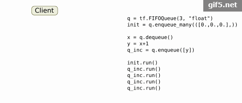

tf API 研读3：Building Graphs
---

tensorflow是通过计算图的方式建立网络。

比喻说明：

结构：计算图建立的只是一个网络框架。编程时框架中不会出现任何的实际值，所有权重（weight）和偏移是框架中的一部分，初始时要给定初始值才能形成框架，因此需要初始化。

比喻：计算图就是一个管道，编写网络就是搭建一个管道结构。在使用前，不会有任何的液体进入管道。我们可以将神将网络的权重和偏移当成管道中的阀门，可以控制液体的流动强弱和方向，在神经网络的训练中，阀门会根据数据进行自我调节、更新，但是使用之前至少给所有的阀门一个初始的状态才能形成结构，并且计算图允许我们可以从任意一个节点处取出液体。


下面是Graph的详细介绍：

tf计算都是通过数据流图（Graph）来展现的，一个数据流图包含一系列节点（op）操作以及在节点之间流动的数据，这些节点和数据流分别称之为计算单元和Tensor对象。当进入tf时（例如import tensorflow as tf），tf内部会注册一个默认的Graph，可通过 tf.get_default_graph()  来获得这个默认的Default_Graph，只要简单地调用某个函数，就可以向这个默认的图里面添加操作（节点）。

（1）tf.Graph()

```python

g = tf.Graph()
with g.as_default():
    # Define operations and tensors in `g`.
    c = tf.constant(30.0)
    assert c.graph is g
```

重要提示:Graph类在构建图时非线程安全。所有的节点（操作）必须在单线程内创建或者必须提供或外部同步。除非另有规定,不然所有的方法都不是线程安全的。

（2）tf.Graph.as_default()

该方法返回一个上下文管理器，并将Graph当做默认图。若想在同一进程中创建多个图，可调用此方法。为了方便,tf-开始就提供了一个全局缺省图,所有节点将被添加到这个缺省图（开始时候提到了），如果没有显式地创建一个新的图的话。

默认图是当前线程的属性。如果您想创建一个新的线程，并希望在新线程使用默认的图，就必须明确使用g.as_default（）搭配with关键字来创建一个新作用域，并在该新作用域内执行一系列节点。


```python

# 1. Using Graph.as_default():
g = tf.Graph()
with g.as_default():
    c = tf.constant(5.0)
    assert c.graph is g

# 2. Constructing and making default:
with tf.Graph().as_default() as g:
    c = tf.constant(5.0)
    assert c.graph is g

```

（3）tf.Graph.as_graph_def(from_version=None, add_shapes=False)

该方法返回一个序列化的GraphDef。可在另一个图中调用该序列化的GraphDef（通过 import_graph_def())或者C++ Session API.）

该方法是线程安全的。

（4）tf.Graph.finalize()

使用该方法后，后续节点（操作）不能再添加到改图（图结构被锁定了）。该方法可以确保此图在不同线程之间计算时，不会再被添加额外的节点。使用场景有QueueRunner（多线程读取队列文件）

（5）tf.Graph.finalized

若图锁定，就返回True

。。。。。直接看图吧，更直接。

tf.Graph


|操作 | 	描述 |
| -------| ------: |:-----:|
| class tf.Graph 	|tensorflow中的计算以图数据流的方式表示一个图包含一系列表示计算单元的操作对象以及在图中流动的数据单元以tensor对象表现|
| tf.Graph.__init__()  |	建立一个空图|
| tf.Graph.as_default() 	|一个将某图设置为默认图，并返回一个上下文管理器如果不显式添加一个默认图，系统会自动设置一个全局的默认图。所设置的默认图，在模块范围内所定义的节点都将默认加入默认图中|
| tf.Graph.as_graph_def (from_version=None, add_shapes=False) |返回一个图的序列化的GraphDef表示序列化的GraphDef可以导入至另一个图中(使用 import_graph_def())或者使用C++ Session API|
| tf.Graph.finalize() |	完成图的构建，即将其设置为只读模式|
| tf.Graph.finalized |	返回True，如果图被完成|
| tf.Graph.control_dependencies(control_inputs) |定义一个控制依赖，并返回一个上下文管理器with g.control_dependencies([a, b, c]):# `d` 和 `e` 将在 `a`, `b`, 和`c`执行完之后运行. d = … e = … |
| tf.Graph.device(device_name_or_function) | 定义运行图所使用的设备，并返回一个上下文管理器 with g.device('/gpu:0'): ...with g.device('/cpu:0'): ...|
| tf.Graph.name_scope(name) |	为节点创建层次化的名称，并返回一个上下文管理器|
| tf.Graph.add_to_collection(name, value) |	将value以name的名称存储在收集器(collection)中|
| tf.Graph.get_collection(name, scope=None) |	根据name返回一个收集器中所收集的值的列表|
| tf.Graph.as_graph_element (obj, allow_tensor=True, allow_operation=True) |	返回一个图中与obj相关联的对象，为一个操作节点或者tensor数据|
| tf.Graph.get_operation_by_name(name) | 	根据名称返回操作节点|
| tf.Graph.get_tensor_by_name(name) |	根据名称返回tensor数据|
| tf.Graph.get_operations() |	返回图中的操作节点列表|
| tf.Graph.gradient_override_map(op_type_map) |	用于覆盖梯度函数的上下文管理器|


tf.Operation（节点op：开始时候提到过，节点就是计算单元）

|操作 |	描述|
| -------| ------: |:-----:|
| class tf.Operation |	代表图中的一个节点，用于计算tensors数据该类型将由python节点构造器产生(比如tf.matmul()) 或者Graph.create_op() 例如c = tf.matmul(a, b)创建一个Operation类为类型为”MatMul”,输入为’a’,’b’，输出为’c’的操作类|
| tf.Operation.name |	操作节点(op)的名称|
| tf.Operation.type |	操作节点(op)的类型，比如”MatMul”|
| tf.Operation.inputs tf.Operation.outputs| 	操作节点的输入与输出 |
| tf.Operation.control_inputs |	操作节点的依赖 |
| tf.Operation.run(feed_dict=None, session=None) |	在会话(Session)中运行该操作 |
| tf.Operation.get_attr(name) |	获取op的属性值|


tf.Tensor（节点间流动的数据，上面也有所提到）


| 操作 |	描述 |
| -------| ------: |:-----:|
|class tf.Tensor |	表示一个由操作节点op产生的值，TensorFlow程序使用tensor数据结构来代表所有的数据, 计算图中, 操作间传递的数据都是 tensor，一个tensor是一个符号handle,里面并没有表示实际数据，而相当于数据流的载体|
|tf.Tensor.dtype |	tensor中数据类型|
|tf.Tensor.name |	该tensor名称|
|tf.Tensor.value_index |	该tensor输出外op的index|
|tf.Tensor.graph |	该tensor所处在的图|
|tf.Tensor.op |	产生该tensor的op|
|tf.Tensor.consumers() |	返回使用该tensor的op列表|
|tf.Tensor.eval(feed_dict=None, session=None) |	在会话中求tensor的值需要使用with sess.as_default()或者 eval(session=sess)|
|tf.Tensor.get_shape() |	返回用于表示tensor的shape的类TensorShape|
|tf.Tensor.set_shape(shape) |	更新tensor的shape|
|tf.Tensor.device |	设置计算该tensor的设备|


tf.DType

|操作 |	描述|
| -------| ------: |:-----:|
|class tf.DType 	| 数据类型主要包含 tf.float16，tf.float16,tf.float32,tf.float64, tf.bfloat16,tf.complex64,tf.complex128, tf.int8,tf.uint8,tf.uint16,tf.int16,tf.int32, tf.int64,tf.bool,tf.string|
|tf.DType.is_compatible_with(other) |	判断other的数据类型是否将转变为该DType|
|tf.DType.name |	数据类型名称|
|tf.DType.base_dtype |	返回该DType的基础DType，而非参考的数据类型(non-reference)|
|tf.DType.as_ref |	返回一个基于DType的参考数据类型|
|tf.DType.is_floating |	判断是否为浮点类型|
|tf.DType.is_complex |	判断是否为复数|
|tf.DType.is_integer |	判断是否为整数|
|tf.DType.is_unsigned |	判断是否为无符号型数据|
|tf.DType.as_numpy_dtype |	返回一个基于DType的numpy.dtype类型|
|tf.DType.max tf.DType.min |	返回这种数据类型能表示的最大值及其最小值|
|tf.as_dtype(type_value) |	返回由type_value转变得的相应tf数据类型|


通用函数（Utility functions）

|操作 |	描述|
| -------| ------: |:-----:|
|tf.device(device_name_or_function) |	基于默认的图，其功能便为Graph.device()|
|tf.container(container_name) |	基于默认的图，其功能便为Graph.container()|
|tf.name_scope(name)| 	基于默认的图，其功能便为 Graph.name_scope()|
|tf.control_dependencies(control_inputs) | 	基于默认的图，其功为Graph.control_dependencies()|
|tf.convert_to_tensor(value, dtype=None, name=None, as_ref=False) |	将value转变为tensor数据类型|
|tf.get_default_graph() |	返回返回当前线程的默认图|
|tf.reset_default_graph() |	清除默认图的堆栈，并设置全局图为默认图|
|tf.import_graph_def(graph_def, input_map=None, return_elements=None, name=None, op_dict=None,producer_op_list=None) | 将graph_def的图导入到python中 |


图收集（Graph collections）

|操作 |	描述|
| -------| ------: |:-----:|
|tf.add_to_collection(name, value) |	基于默认的图，其功能便为Graph.add_to_collection()|
|tf.get_collection(key, scope=None) |	基于默认的图，其功能便为Graph.get_collection()|


tf.RegisterGradient

|操作 |	描述|
| -------| ------: |:-----:|
|class tf.RegisterGradient |	返回一个用于寄存op类型的梯度函数的装饰器|
|tf.NoGradient(op_type) |	设置操作节点类型op_type的节点没有指定的梯度|
|class tf.RegisterShape |	返回一个用于寄存op类型的shape函数的装饰器|
|class tf.TensorShape |	表示tensor的shape|
|tf.TensorShape.merge_with(other) |	与other合并shape信息，返回一个TensorShape类|
|tf.TensorShape.concatenate(other) |	与other的维度相连结|
|tf.TensorShape.ndims |	返回tensor的rank|
|tf.TensorShape.dims |	返回tensor的维度|
|tf.TensorShape.as_list() |	以list的形式返回tensor的shape|
|tf.TensorShape.is_compatible_with(other) |	判断shape是否为兼容TensorShape(None)与其他任何shape值兼容|
|class tf.Dimension 	 ||
|tf.Dimension.is_compatible_with(other) |	判断dims是否为兼容|
|tf.Dimension.merge_with(other) |	与other合并dims信息|
|tf.op_scope(values, name, default_name=None) |	在python定义op时，返回一个上下文管理器 |


API 研读4：Inputs and Readers
===


tensorflow中数据的读入相关类或函数：

占位符（Placeholders）

tf提供一种占位符操作，在执行时需要为其提供数据data。

|操作 |	描述|
| -------| ------: |:-----:|
| tf.placeholder(dtype, shape=None, name=None) |	为一个tensor插入一个占位符eg:x = tf.placeholder(tf.float32, shape=(1024, 1024))|
|tf.placeholder_with_default(input, shape, name=None) |	当输出没有fed时，input通过一个占位符op|
| tf.sparse_placeholder(dtype, shape=None, name=None) |	为一个稀疏tensor插入一个占位符|


读取器（Readers）

tf提供一系列读取各种数据格式的类。对于多文件输入，可以使用函数tf.train.string_input_producer，该函数将创建一个保持文件的FIFO队列，以供reader使用。或者如果输入的这些文件名有相雷同的字符串，也可以使用函数tf.train.match_filenames_once。

|操作 |	描述|
| -------| ------: |:-----:|
|class tf.ReaderBase |	不同的读取器类型的基本类|
|tf.ReaderBase.read(queue, name=None) |	返回下一个记录对(key, value),queue为tf文件队列FIFOQueue|
|tf.ReaderBase.read_up_to(queue, num_records, name=None) |	返回reader产生的num_records对(key, value)|
|tf.ReaderBase.reader_ref |	返回应用在该reader上的Op|
|tf.ReaderBase.reset(name=None) |	恢复reader为初始状态|
|tf.ReaderBase.restore_state(state, name=None) |	恢复reader为之前的保存状态state|
|tf.ReaderBase.serialize_state(name=None) |	返回一个reader解码后产生的字符串tansor|
|class tf.TextLineReader 	 ||
|tf.TextLineReader.num_records_produced(name=None) |	返回reader已经产生的记录(records )数目|
|tf.TextLineReader.num_work_units_completed(name=None) |	返回该reader已经完成的处理的work数目|
|tf.TextLineReader.read(queue, name=None) |	返回reader所产生的下一个记录对 (key, value)，该reader可以限定新产生输出的行数|
|tf.TextLineReader.reader_ref |	返回应用在该reader上的Op|
|tf.TextLineReader.reset(name=None) |	恢复reader为初始状态|
|tf.TextLineReader.restore_state(state, name=None) | 	恢复reader为之前的保存状态state|
|tf.TextLineReader.serialize_state(name=None) |	返回一个reader解码后产生的字符串tansor|
|class tf.WholeFileReader |	一个阅读器，读取整个文件，返回文件名称key,以及文件中所有的内容value,该类的方法同上，不赘述|
|class tf.IdentityReader |	一个reader，以key和value的形式，输出一个work队列。该类其他方法基本同上|
|class tf.TFRecordReader |	读取TFRecord格式文件的reader。该类其他方法基本同上|
|class tf.FixedLengthRecordReader |	输出|


数据转换（Converting）

tf提供一系列方法将各种格式数据转换为tensor表示。


|操作 |	描述|
|------| ------: |:-----:|
|tf.decode_csv(records, record_defaults, field_delim=None, name=None) |	将csv转换为tensor，与tf.TextLineReader搭配使用|
|tf.decode_raw(bytes, out_type, little_endian=None, name=None) |	将bytes转换为一个数字向量表示，bytes为一个字符串类型的tensor与函数 tf.FixedLengthRecordReader搭配使用，详见tf的CIFAR-10例子|


选取与要输入的文件格式相匹配的reader，并将文件队列提供给reader的读方法( read method)。读方法将返回文件唯一标识的key，以及一个记录(record)（有助于对出现一些另类的records时debug），以及一个标量的字符串值。再使用一个（或多个）解码器(decoder) 或转换操作(conversion ops)将字符串转换为tensor类型。

```python

#读取文件队列，使用reader中read的方法，返回key与value
filename_queue = tf.train.string_input_producer(["file0.csv", "file1.csv"])
reader = tf.TextLineReader()
key, value = reader.read(filename_queue)

record_defaults = [[1], [1], [1], [1], [1]]
col1, col2, col3, col4, col5 = tf.decode_csv(
    value, record_defaults=record_defaults)
features = tf.pack([col1, col2, col3, col4])

with tf.Session() as sess:
  # Start populating the filename queue.
  coord = tf.train.Coordinator()
  threads = tf.train.start_queue_runners(coord=coord)

  for i in range(1200):
    # Retrieve a single instance:
    example, label = sess.run([features, col5])

  coord.request_stop()
  coord.join(threads)


```

Example protocol buffer

提供了一些Example protocol buffers，tf所推荐的用于训练样本的数据格式，它们包含特征信息，详情可见。


这是一种与前述将手上现有的各种数据类型转换为支持的格式的方法，这种方法更容易将网络结构与数据集融合或匹配。这种tensorflow所推荐的数据格式是一个包含tf.train.Example protocol buffers (包含特征Features域)的TFRecords文件。


1、获取这种格式的文件方式为，首先将一般的数据格式填入Example protocol buffer中，再将 protocol buffer序列化为一个字符串，然后使用tf.python_io.TFRecordWriter类的相关方法将字符串写入一个TFRecords文件中，参见MNIST例子，将MNIST 数据转换为该类型数据。


2、读取TFRecords格式文件的方法为，使用tf.TFRecordReader读取器和tf.parse_single_example解码器。parse_single_example操作将 example protocol buffers解码为tensor形式。参见MNIST例子


|操作 |	描述|
|------| ------: |:-----:|
|class tf.VarLenFeature |	解析变长的输入特征feature相关配置|
|class tf.FixedLenFeature |	解析定长的输入特征feature相关配置|
|class tf.FixedLenSequenceFeature |	序列项目中的稠密(dense )输入特征的相关配置|
|tf.parse_example(serialized, features, name=None, example_names=None) |	将一组Example| protos解析为tensor的字典形式解析serialized所给予的序列化的一些Example protos返回一个由特征keys映射Tensor和SparseTensor值的字典|
|tf.parse_single_example(serialized, features, name=None, example_names=None) |	解析一个单独的Example proto，与tf.parse_example方法雷同|
|tf.decode_json_example(json_examples, name=None) |	将JSON编码的样本记录转换为二进制protocol buffer字符串|


```python
#tf.parse_example的使用举例
#输入序列化数据如下：
serialized = [
  features
    { feature { key: "ft" value { float_list { value: [1.0, 2.0] } } } },
  features
    { feature []},
  features
    { feature { key: "ft" value { float_list { value: [3.0] } } }
]
#那么输出为一个字典(dict),如下：
{"ft": SparseTensor(indices=[[0, 0], [0, 1], [2, 0]],
                    values=[1.0, 2.0, 3.0],
                    shape=(3, 2)) }
#########
#再来看一个例子，给定两个序列化的原始输入样本：
[
  features {
    feature { key: "kw" value { bytes_list { value: [ "knit", "big" ] } } }
    feature { key: "gps" value { float_list { value: [] } } }
  },
  features {
    feature { key: "kw" value { bytes_list { value: [ "emmy" ] } } }
    feature { key: "dank" value { int64_list { value: [ 42 ] } } }
    feature { key: "gps" value { } }
  }
]
#相关参数如下：
example_names: ["input0", "input1"],
features: {
    "kw": VarLenFeature(tf.string),
    "dank": VarLenFeature(tf.int64),
    "gps": VarLenFeature(tf.float32),
}
#那么有如下输出：
{
  "kw": SparseTensor(
      indices=[[0, 0], [0, 1], [1, 0]],
      values=["knit", "big", "emmy"]
      shape=[2, 2]),
  "dank": SparseTensor(
      indices=[[1, 0]],
      values=[42],
      shape=[2, 1]),
  "gps": SparseTensor(
      indices=[],
      values=[],
      shape=[2, 0]),
}
#########
#对于两个样本的输出稠密结果情况
[
  features {
    feature { key: "age" value { int64_list { value: [ 0 ] } } }
    feature { key: "gender" value { bytes_list { value: [ "f" ] } } }
   },
   features {
    feature { key: "age" value { int64_list { value: [] } } }
    feature { key: "gender" value { bytes_list { value: [ "f" ] } } }
  }
]
#我们可以使用以下参数
example_names: ["input0", "input1"],
features: {
    "age": FixedLenFeature([], dtype=tf.int64, default_value=-1),
    "gender": FixedLenFeature([], dtype=tf.string),
}
#期望的结果如下
{
  "age": [[0], [-1]],
  "gender": [["f"], ["f"]],
}

```

```python


#tf.parse_example的使用举例
#输入序列化数据如下：
serialized = [
  features
    { feature { key: "ft" value { float_list { value: [1.0, 2.0] } } } },
  features
    { feature []},
  features
    { feature { key: "ft" value { float_list { value: [3.0] } } }
]
#那么输出为一个字典(dict),如下：
{"ft": SparseTensor(indices=[[0, 0], [0, 1], [2, 0]],
                    values=[1.0, 2.0, 3.0],
                    shape=(3, 2)) }
#########
#再来看一个例子，给定两个序列化的原始输入样本：
[
  features {
    feature { key: "kw" value { bytes_list { value: [ "knit", "big" ] } } }
    feature { key: "gps" value { float_list { value: [] } } }
  },
  features {
    feature { key: "kw" value { bytes_list { value: [ "emmy" ] } } }
    feature { key: "dank" value { int64_list { value: [ 42 ] } } }
    feature { key: "gps" value { } }
  }
]
#相关参数如下：
example_names: ["input0", "input1"],
features: {
    "kw": VarLenFeature(tf.string),
    "dank": VarLenFeature(tf.int64),
    "gps": VarLenFeature(tf.float32),
}
#那么有如下输出：
{
  "kw": SparseTensor(
      indices=[[0, 0], [0, 1], [1, 0]],
      values=["knit", "big", "emmy"]
      shape=[2, 2]),
  "dank": SparseTensor(
      indices=[[1, 0]],
      values=[42],
      shape=[2, 1]),
  "gps": SparseTensor(
      indices=[],
      values=[],
      shape=[2, 0]),
}
#########
#对于两个样本的输出稠密结果情况
[
  features {
    feature { key: "age" value { int64_list { value: [ 0 ] } } }
    feature { key: "gender" value { bytes_list { value: [ "f" ] } } }
   },
   features {
    feature { key: "age" value { int64_list { value: [] } } }
    feature { key: "gender" value { bytes_list { value: [ "f" ] } } }
  }
]
#我们可以使用以下参数
example_names: ["input0", "input1"],
features: {
    "age": FixedLenFeature([], dtype=tf.int64, default_value=-1),
    "gender": FixedLenFeature([], dtype=tf.string),
}
#期望的结果如下
{
  "age": [[0], [-1]],
  "gender": [["f"], ["f"]],
}


```


队列(Queues)

tensorflow提供了几个队列应用，用来将tf计算图与tensors的阶段流水组织到一起。队列是使用tensorflow计算的一个强大的机制，正如其他Tensorflow的元素一样，一个队列也是tf图中的一个节点(node),它是一个有状态的node，就像一个变量：其他节点可以改变其内容。
我们来看一个简单的例子，如下gif图，我们将创建一个先入先出队列(FIFOQueue)并且将值全设为0，然后我们构建一个图以获取队列出来的元素，对该元素加1操作，并将结果再放入队列末尾。渐渐地，队列中的数字便增加。





|操作 |	描述|
| -------| ------: |:-----:|
|class tf.QueueBase |	基本的队列应用类.队列(queue)是一种数据结构，该结构通过多个步骤存储tensors,并且对tensors进行入列(enqueue)与出列(dequeue)操作|
|tf.QueueBase.enqueue(vals, name=None) |	将一个元素编入该队列中。如果在执行该操作时队列已满，那么将会阻塞直到元素编入队列之中|
|tf.QueueBase.enqueue_many(vals, name=None) |	将零个或多个元素编入该队列中|
|tf.QueueBase.dequeue(name=None) |	将元素从队列中移出。如果在执行该操作时队列已空，那么将会阻塞直到元素出列，返回出列的tensors的tuple|
|tf.QueueBase.dequeue_many(n, name=None) |	将一个或多个元素从队列中移出|
|tf.QueueBase.size(name=None) |	计算队列中的元素个数|
|tf.QueueBase.close(cancel_pending_enqueues=False, name=None) |	关闭该队列|
|tf.QueueBase.dequeue_up_to(n, name=None) |	从该队列中移出n个元素并将之连接|
|tf.QueueBase.dtypes |	列出组成元素的数据类型|
|tf.QueueBase.from_list(index, queues) |	根据queues[index]的参考队列创建一个队列|
|tf.QueueBase.name |	返回最队列下面元素的名称|
|tf.QueueBase.names |	返回队列每一个组成部分的名称|
|class tf.FIFOQueue |	在出列时依照先入先出顺序，其他方法与tf.QueueBase雷同|
|class tf.PaddingFIFOQueue |	一个FIFOQueue ，同时根据padding支持batching变长的tensor|
|class tf.RandomShuffleQueue |	该队列将随机元素出列，其他方法与tf.QueueBase雷同|


文件系统的处理(Dealing with the filesystem)

|操作 |	描述|
| -------| ------: |:-----:|
|tf.matching_files(pattern, name=None) |	返回与pattern匹配模式的文件名称|
|tf.read_file(filename, name=None) |	读取并输出输入文件的整个内容|


输入管道(Input pipeline)

用于设置输入预取数的管道TF函数，函数 “producer”添加一个队列至图中，同时一个相应用于运行队列中子图(subgraph)的QueueRunner


|操作 |	描述|
| -------| ------: |:-----:|
|tf.train.match_filenames_once(pattern, name=None) |	保存与pattern的文件列表|
|tf.train.limit_epochs(tensor, num_epochs=None, name=None) |	返回一个num_epochs次数，然后报告OutOfRange错误|
|tf.train.input_producer(input_tensor, element_shape=None, num_epochs=None, shuffle=True, seed=None, capacity=32, shared_name=None, summary_name=None, name=None) |	为一个输入管道输出input_tensor中的多行至一个队列中|
|tf.train.range_input_producer(limit, num_epochs=None, shuffle=True, seed=None, capacity=32, shared_name=None, name=None) |	产生一个从1至limit-1的整数至队列中|
|tf.train.slice_input_producer(tensor_list, num_epochs=None, shuffle=True, seed=None, capacity=32, shared_name=None, name=None) |	对tensor_list中的每一个tensor切片|
|tf.train.string_input_producer(string_tensor, num_epochs=None,shuffle=True, seed=None, capacity=32, shared_name=None, name=None) |	为一个输入管道输出一组字符串(比如文件名)至队列|

在输入管道末端批量打包(Batching at the end of an input pipeline)

该相关函数增添一个队列至图中以将数据一样本打包为batch。它们也会添加 一个QueueRunner，以便执行的已经被填满队列的子图


|操作 |	描述|
| -------| ------: |:-----:|
|tf.train.batch(tensors, batch_size, num_threads=1,capacity=32, enqueue_many=False, shapes=None, dynamic_pad=False, allow_smaller_final_batch=False, shared_name=None, name=None) |	在输入的tensors中创建一些tensor数据格式的batch，若输入为shape[*, x, y, z]，那么输出则为[batch_size, x, y, z]返回一个列表或者一个具有与输入tensors相同类型tensors的字典|
|tf.train.batch_join(tensors_list, batch_size, capacity=32, enqueue_many=False, shapes=None, dynamic_pad=False, allow_smaller_final_batch=False, shared_name=None, name=None) |	将一个tensors的列表添加至一个队列中以创建样本的batcheslen(tensors_list)个线程将启动，线程i将tensors_list[i]的tensors入列tensors_list[i1][j]与tensors_list[i2][j]有相同的类型和shape|
|tf.train.shuffle_batch(tensors, batch_size, capacity, min_after_dequeue, num_threads=1, seed=None, enqueue_many=False, shapes=None, allow_smaller_final_batch=False,shared_name=None, name=None) |	使用随机乱序的方法创建batchestensors:用于入列的一个list或者dictcapacity:一个整数，表示队列中元素最大数目|
|tf.train.shuffle_batch_join(tensors_list, batch_size, capacity, min_after_dequeue, seed=None, enqueue_many=False, shapes=None, allow_smaller_final_batch=False, shared_name=None, name=None) |	随机乱序的tensors创建batches，其中tensors_list参数为tensors元组或tensors字典的列表len(tensors_list)个线程将启动，线程i将tensors_list[i]的tensors入列tensors_list[i1][j]与tensors_list[i2][j]有相同的类型和shape|


```python

# 一个简单例子，使用tf.train.shuffle_batch创建一个具有32张图像和32个标签的batches.
image_batch, label_batch = tf.train.shuffle_batch(
      [single_image, single_label],
      batch_size=32,
      num_threads=4,
      capacity=50000,
      min_after_dequeue=10000)

```

```python

#Batching函数相关例子，以函数tf.train.shuffle_batch为例
#为training, evaluation等操作将样本batching，以下代码使用随机顺序打包样本
def read_my_file_format(filename_queue):
  reader = tf.SomeReader()
  key, record_string = reader.read(filename_queue)
  example, label = tf.some_decoder(record_string)
  processed_example = some_processing(example)
  return processed_example, label

def input_pipeline(filenames, batch_size, num_epochs=None):
  filename_queue = tf.train.string_input_producer(
      filenames, num_epochs=num_epochs, shuffle=True)
  example, label = read_my_file_format(filename_queue)
  # min_after_dequeue defines how big a buffer we will randomly sample
  #   from -- bigger means better shuffling but slower start up and more
  #   memory used.
  # capacity must be larger than min_after_dequeue and the amount larger
  #   determines the maximum we will prefetch.  Recommendation:
  #   min_after_dequeue + (num_threads + a small safety margin) * batch_size
  min_after_dequeue = 10000
  capacity = min_after_dequeue + 3 * batch_size
  example_batch, label_batch = tf.train.shuffle_batch(
      [example, label], batch_size=batch_size, capacity=capacity,
      min_after_dequeue=min_after_dequeue)
  return example_batch, label_batch

```

```python

#如果需要跟多的并行或文件之间的样本乱序操作，可以使用函数tf.train.shuffle_batch_join多实例化reader
def read_my_file_format(filename_queue):
  # 与上例子相同

def input_pipeline(filenames, batch_size, read_threads, num_epochs=None):
  filename_queue = tf.train.string_input_producer(
      filenames, num_epochs=num_epochs, shuffle=True)
  example_list = [read_my_file_format(filename_queue)
                  for _ in range(read_threads)]
  min_after_dequeue = 10000
  capacity = min_after_dequeue + 3 * batch_size
  example_batch, label_batch = tf.train.shuffle_batch_join(
      example_list, batch_size=batch_size, capacity=capacity,
      min_after_dequeue=min_after_dequeue)
  return example_batch, label_batch

```


tf API 研读5：Data IO
===

数据IO {Data IO (Python functions)}

一个TFRecords 文件为一个字符串序列。这种格式并非随机获取，它比较适合大规模的数据流，而不太适合需要快速分区或其他非序列获取方式。
数据IO {Data IO (Python functions)}


|操作 |	描述|
| -------| ------: |:-----:|
|class tf.python_io.TFRecordWriter |	一个用于将记录(records)写入TFRecords文件的类|
|tf.python_io.TFRecordWriter.__init__(path, options=None) |	打开文件路径，并创建一个TFRecordWriter以供写入|
|tf.python_io.TFRecordWriter.write(record) |	将一个字符串records写入文件中|
|tf.python_io.TFRecordWriter.close() 	|关闭文件|
|tf.python_io.tf_record_iterator(path, options=None)||


tf API 研读6：Running Graphs
====

会话管理 (Session management)

|操作 |	描述|
| -------| ------: |:-----:|
|class tf.Session |	运行TF操作的类,一个Session对象将操作节点op封装在一定的环境内运行，同时tensor对象将被计算求值|
|tf.Session.__init__(target=”, graph=None, config=None) |	创建一个新的会话|
|tf.Session.run(fetches, feed_dict=None, options=None, run_metadata=None) |	运行fetches中的操作节点并求其值|
|tf.Session.close() |	关闭会话|
|tf.Session.graph |	返回加载值该会话的图(graph)|
|tf.Session.as_default() |	设置该对象为默认会话，并返回一个上下文管理器|
|tf.Session.reset(target, containers=None, config=None) |	重设target的资源容器，并关闭所有连接的会话在0.10版本该功能仅应用在分布会话中target:为执行引擎所连接的目标，其包含有资源容器，该资源容器分布在同一个集群的所有works上|
|class tf.InteractiveSession |	使用在交互式上下文环境的tf会话，比如shell，ipython|
|tf.InteractiveSession.close() |	关闭一个InteractiveSession|
|tf.get_default_session() |	返回当前线程的默认会话|


tf.Session
---

```python
#一个简单的tf.Session例子
# 建立一个graph.
a = tf.constant(5.0)
b = tf.constant(6.0)
c = a * b

# 将graph载入到一个会话session中
sess = tf.Session()

# 计算tensor `c`.
print(sess.run(c))

```


```python

#一个会话可能会占用一些资源，比如变量、队列和读取器(reader)。释放这些不再使用的资源非常重要。
#使用close()方法关闭会话，或者使用上下文管理器，释放资源。
# 使用`close()`方法.
sess = tf.Session()
sess.run(...)
sess.close()

# 使用上下文管理器
with tf.Session() as sess:
  sess.run(...)

```


tf.Session()的变量设置， ConfigProto protocol buffer为会话提供了不同的配置选项。比如，创建一个会话，对设备布局使用软约束条件，以及对分布


```python
# Launch the graph in a session that allows soft device placement and
# logs the placement decisions.
sess = tf.Session(config=tf.ConfigProto(allow_soft_placement=True,
                                        log_device_placement=True))

```

tf.Session.run
---

```python

a = tf.constant([10, 20])
  b = tf.constant([1.0, 2.0])
  # 'fetches' 可以为单个数
  v = session.run(a)
  # v is the numpy array [10, 20]
  # 'fetches' 可以为一个list.
  v = session.run([a, b])
  # v a Python list with 2 numpy arrays: the numpy array [10, 20] and the
  # 1-D array [1.0, 2.0]
  # 'fetches' 可以是 lists, tuples, namedtuple, dicts中的任意:
  MyData = collections.namedtuple('MyData', ['a', 'b'])
  v = session.run({'k1': MyData(a, b), 'k2': [b, a]})
  # v 为一个dict，并有
  # v['k1'] is a MyData namedtuple with 'a' the numpy array [10, 20] and
  # 'b' the numpy array [1.0, 2.0]
  # v['k2'] is a list with the numpy array [1.0, 2.0] and the numpy array
  # [10, 20].

```


tf.Session.as_default()
使用关键字with指定会话， 可以在会话中执行Operation.run()或Tensor.eval()，以得到运行的tensor结果


```python

c = tf.constant(..)
sess = tf.Session()

with sess.as_default():
  assert tf.get_default_session() is sess
  print(c.eval())

```

使用函数tf.get_default_session()来得到当前默认的会话
需要注意的是，退出该as_default上下文管理器时，并没有关闭该会话(session )，必须明确的关闭会话

```python

c = tf.constant(...)
sess = tf.Session()
with sess.as_default():
  print(c.eval())
# ...
with sess.as_default():
  print(c.eval())
#关闭会话
sess.close()
#使用 with tf.Session()方式可以创建并自动关闭会话

```

tf.InteractiveSession

```python
sess = tf.InteractiveSession()
a = tf.constant(5.0)
b = tf.constant(6.0)
c = a * b
# 我们直接使用'c.eval()' 而没有通过'sess'
print(c.eval())
sess.close()


```

以上的例子，在非交互会话的版本中为，

```python
a = tf.constant(5.0)
b = tf.constant(6.0)
c = a * b
with tf.Session():
  # We can also use 'c.eval()' here.
  print(c.eval())
```
