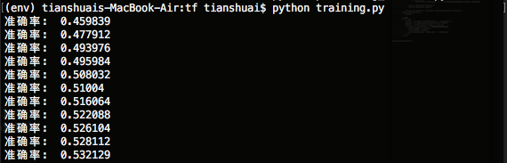
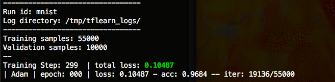
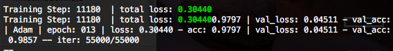
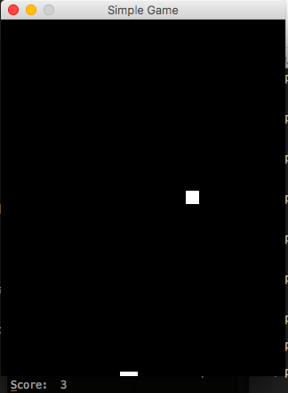
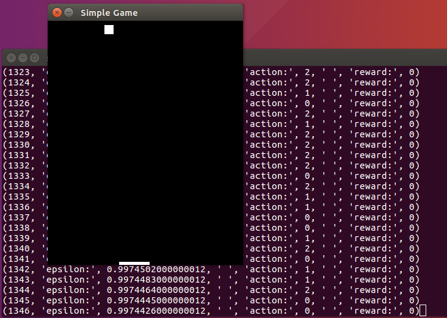
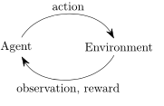

tf2: nn和cnn实现评论分类
===

使用大数据，了解怎么处理数据不能一次全部加载到内存的情况。如果你内存充足，当我没说

训练好的模型的保存和使用

使用的模型没变，还是简单的feedforward神经网络（update：添加CNN模型）

如果你要运行本帖代码，推荐使用GPU版本或强大的VPS，我使用小笔记本差点等吐血

使用的数据集
---

使用的数据集：http://help.sentiment140.com/for-students/ (情绪分析)

数据集包含1百60万条推特，包含消极、中性和积极tweet。不知道有没有现成的微博数据集。

数据格式：移除表情符号的CSV文件，字段如下：

* 0 – the polarity of the tweet (0 = negative, 2 = neutral, 4 = positive)

* 1 – the id of the tweet (2087)

* 2 – the date of the tweet (Sat May 16 23:58:44 UTC 2009)

* 3 – the query (lyx). If there is no query, then this value is NO_QUERY.

* 4 – the user that tweeted (robotickilldozr)

* 5 – the text of the tweet (Lyx is cool)

training.1600000.processed.noemoticon.csv（238M）
testdata.manual.2009.06.14.csv（74K）

数据预处理
---

```python
import nltk
from nltk.tokenize import word_tokenize
from nltk.stem import WordNetLemmatizer

import pickle
import numpy as np
import pandas as pd
from collections import OrderedDict

org_train_file = 'training.1600000.processed.noemoticon.csv'
org_test_file = 'testdata.manual.2009.06.14.csv'

# 提取文件中有用的字段
def usefull_filed(org_file, output_file):
	output = open(output_file, 'w')
	with open(org_file, buffering=10000, encoding='latin-1') as f:
		try:
			for line in f:                # "4","2193601966","Tue Jun 16 08:40:49 PDT 2009","NO_QUERY","AmandaMarie1028","Just woke up. Having no school is the best feeling ever "
				line = line.replace('"', '')
				clf = line.split(',')[0]   # 4
				if clf == '0':
					clf = [0, 0, 1]  # 消极评论
				elif clf == '2':
					clf = [0, 1, 0]  # 中性评论
				elif clf == '4':
					clf = [1, 0, 0]  # 积极评论

				tweet = line.split(',')[-1]
				outputline = str(clf) + ':%:%:%:' + tweet
				output.write(outputline)  # [0, 0, 1]:%:%:%: that's a bummer.  You shoulda got David Carr of Third Day to do it. ;D
		except Exception as e:
			print(e)
	output.close()  # 处理完成，处理后文件大小127.5M

usefull_filed(org_train_file, 'training.csv')
usefull_filed(org_test_file, 'tesing.csv')

# 创建词汇表
def create_lexicon(train_file):
	lex = []
	lemmatizer = WordNetLemmatizer()
	with open(train_file, buffering=10000, encoding='latin-1') as f:
		try:
			count_word = {}  # 统计单词出现次数
			for line in f:
				tweet = line.split(':%:%:%:')[1]
				words = word_tokenize(line.lower())
				for word in words:
					word = lemmatizer.lemmatize(word)
					if word not in count_word:
						count_word[word] = 1
					else:
						count_word[word] += 1

			count_word = OrderedDict(sorted(count_word.items(), key=lambda t: t[1]))
			for word in count_word:
				if count_word[word] < 100000 and count_word[word] > 100:  # 过滤掉一些词
					lex.append(word)
		except Exception as e:
			print(e)
	return lex

lex = create_lexicon('training.csv')

with open('lexcion.pickle', 'wb') as f:
	pickle.dump(lex, f)


"""
# 把字符串转为向量
def string_to_vector(input_file, output_file, lex):
	output_f = open(output_file, 'w')
	lemmatizer = WordNetLemmatizer()
	with open(input_file, buffering=10000, encoding='latin-1') as f:
		for line in f:
			label = line.split(':%:%:%:')[0]
			tweet = line.split(':%:%:%:')[1]
			words = word_tokenize(tweet.lower())
			words = [lemmatizer.lemmatize(word) for word in words]

			features = np.zeros(len(lex))
			for word in words:
				if word in lex:
					features[lex.index(word)] = 1  # 一个句子中某个词可能出现两次,可以用+=1，其实区别不大

			features = list(features)
			output_f.write(str(label) + ":" + str(features) + '\n')
	output_f.close()


f = open('lexcion.pickle', 'rb')
lex = pickle.load(f)
f.close()

# lexcion词汇表大小112k,training.vec大约112k*1600000  170G  太大，只能边转边训练了
# string_to_vector('training.csv', 'training.vec', lex)
# string_to_vector('tesing.csv', 'tesing.vec', lex)
"""
```

上面代码把原始数据转为training.csv、和tesing.csv，里面只包含label和tweet。lexcion.pickle文件保存了词汇表。


如果数据文件太大，不能一次加载到内存，可以把数据导入数据库Dask可处理大csv文件

开始漫长的训练
---


```python
import os
import random
import tensorflow as tf
import pickle
import numpy as np
from nltk.tokenize import word_tokenize
from nltk.stem import WordNetLemmatizer

f = open('lexcion.pickle', 'rb')
lex = pickle.load(f)
f.close()


def get_random_line(file, point):
	file.seek(point)
	file.readline()
	return file.readline()
# 从文件中随机选择n条记录
def get_n_random_line(file_name, n=150):
	lines = []
	file = open(file_name, encoding='latin-1')
	total_bytes = os.stat(file_name).st_size
	for i in range(n):
		random_point = random.randint(0, total_bytes)
		lines.append(get_random_line(file, random_point))
	file.close()
	return lines


def get_test_dataset(test_file):
	with open(test_file, encoding='latin-1') as f:
		test_x = []
		test_y = []
		lemmatizer = WordNetLemmatizer()
		for line in f:
			label = line.split(':%:%:%:')[0]
			tweet = line.split(':%:%:%:')[1]
			words = word_tokenize(tweet.lower())
			words = [lemmatizer.lemmatize(word) for word in words]
			features = np.zeros(len(lex))
			for word in words:
				if word in lex:
					features[lex.index(word)] = 1

			test_x.append(list(features))
			test_y.append(eval(label))
	return test_x, test_y

test_x, test_y = get_test_dataset('tesing.csv')


#######################################################################

n_input_layer = len(lex)  # 输入层

n_layer_1 = 2000     # hide layer
n_layer_2 = 2000    # hide layer(隐藏层)听着很神秘，其实就是除输入输出层外的中间层

n_output_layer = 3       # 输出层


def neural_network(data):
	# 定义第一层"神经元"的权重和biases
	layer_1_w_b = {'w_':tf.Variable(tf.random_normal([n_input_layer, n_layer_1])), 'b_':tf.Variable(tf.random_normal([n_layer_1]))}
	# 定义第二层"神经元"的权重和biases
	layer_2_w_b = {'w_':tf.Variable(tf.random_normal([n_layer_1, n_layer_2])), 'b_':tf.Variable(tf.random_normal([n_layer_2]))}
	# 定义输出层"神经元"的权重和biases
	layer_output_w_b = {'w_':tf.Variable(tf.random_normal([n_layer_2, n_output_layer])), 'b_':tf.Variable(tf.random_normal([n_output_layer]))}

	# w·x+b
	layer_1 = tf.add(tf.matmul(data, layer_1_w_b['w_']), layer_1_w_b['b_'])
	layer_1 = tf.nn.relu(layer_1)  # 激活函数
	layer_2 = tf.add(tf.matmul(layer_1, layer_2_w_b['w_']), layer_2_w_b['b_'])
	layer_2 = tf.nn.relu(layer_2 ) # 激活函数
	layer_output = tf.add(tf.matmul(layer_2, layer_output_w_b['w_']), layer_output_w_b['b_'])

	return layer_output


X = tf.placeholder('float')
Y = tf.placeholder('float')
batch_size = 90

def train_neural_network(X, Y):
	predict = neural_network(X)
	cost_func = tf.reduce_mean(tf.nn.softmax_cross_entropy_with_logits(predict, Y))
	optimizer = tf.train.AdamOptimizer().minimize(cost_func)

	with tf.Session() as session:
		session.run(tf.initialize_all_variables())

		lemmatizer = WordNetLemmatizer()
		saver = tf.train.Saver()
		i = 0
		pre_accuracy = 0
		while True:   # 一直训练
			batch_x = []
			batch_y = []

			#if model.ckpt文件已存在:
			#	saver.restore(session, 'model.ckpt')  恢复保存的session

			try:
				lines = get_n_random_line('training.csv', batch_size)
				for line in lines:
					label = line.split(':%:%:%:')[0]
					tweet = line.split(':%:%:%:')[1]
					words = word_tokenize(tweet.lower())
					words = [lemmatizer.lemmatize(word) for word in words]

					features = np.zeros(len(lex))
					for word in words:
						if word in lex:
							features[lex.index(word)] = 1  # 一个句子中某个词可能出现两次,可以用+=1，其实区别不大

					batch_x.append(list(features))
					batch_y.append(eval(label))

				session.run([optimizer, cost_func], feed_dict={X:batch_x,Y:batch_y})
			except Exception as e:
				print(e)

			# 准确率
			if i > 100:
				correct = tf.equal(tf.argmax(predict,1), tf.argmax(Y,1))
				accuracy = tf.reduce_mean(tf.cast(correct,'float'))
				accuracy = accuracy.eval({X:test_x, Y:test_y})
				if accuracy > pre_accuracy:  # 保存准确率最高的训练模型
					print('准确率: ', accuracy)
					pre_accuracy = accuracy
					saver.save(session, 'model.ckpt')  # 保存session
				i = 0
			i += 1


train_neural_network(X,Y)

```

上面程序占用内存600M，峰值1G。

运行：


 


 训练模型保存为model.ckpt。

 使用训练好的模型
---

```python
import tensorflow as tf
import pickle
from nltk.tokenize import word_tokenize
from nltk.stem import WordNetLemmatizer
import numpy as np

f = open('lexcion.pickle', 'rb')
lex = pickle.load(f)
f.close()

n_input_layer = len(lex)  # 输入层

n_layer_1 = 2000     # hide layer
n_layer_2 = 2000    # hide layer(隐藏层)听着很神秘，其实就是除输入输出层外的中间层

n_output_layer = 3       # 输出层
def neural_network(data):
	# 定义第一层"神经元"的权重和biases
	layer_1_w_b = {'w_':tf.Variable(tf.random_normal([n_input_layer, n_layer_1])), 'b_':tf.Variable(tf.random_normal([n_layer_1]))}
	# 定义第二层"神经元"的权重和biases
	layer_2_w_b = {'w_':tf.Variable(tf.random_normal([n_layer_1, n_layer_2])), 'b_':tf.Variable(tf.random_normal([n_layer_2]))}
	# 定义输出层"神经元"的权重和biases
	layer_output_w_b = {'w_':tf.Variable(tf.random_normal([n_layer_2, n_output_layer])), 'b_':tf.Variable(tf.random_normal([n_output_layer]))}

	# w·x+b
	layer_1 = tf.add(tf.matmul(data, layer_1_w_b['w_']), layer_1_w_b['b_'])
	layer_1 = tf.nn.relu(layer_1)  # 激活函数
	layer_2 = tf.add(tf.matmul(layer_1, layer_2_w_b['w_']), layer_2_w_b['b_'])
	layer_2 = tf.nn.relu(layer_2 ) # 激活函数
	layer_output = tf.add(tf.matmul(layer_2, layer_output_w_b['w_']), layer_output_w_b['b_'])

	return layer_output

X = tf.placeholder('float')
def prediction(tweet_text):
	predict = neural_network(X)

	with tf.Session() as session:
		session.run(tf.initialize_all_variables())
		saver = tf.train.Saver()
		saver.restore(session, 'model.ckpt')

		lemmatizer = WordNetLemmatizer()
		words = word_tokenize(tweet_text.lower())
		words = [lemmatizer.lemmatize(word) for word in words]

		features = np.zeros(len(lex))
		for word in words:
			if word in lex:
				features[lex.index(word)] = 1

		#print(predict.eval(feed_dict={X:[features]})) [[val1,val2,val3]]
		res = session.run(tf.argmax(predict.eval(feed_dict={X:[features]}),1 ))
		return res


prediction("I am very happe")
```

上面使用简单的feedfroward模型，下面使用CNN模型
---

```python
# https://github.com/Lab41/sunny-side-up  
import os  
import random  
import tensorflow as tf  
import pickle  
import numpy as np  
from nltk.tokenize import word_tokenize  
from nltk.stem import WordNetLemmatizer  

f = open('lexcion.pickle', 'rb')  
lex = pickle.load(f)  
f.close()  

def get_random_line(file, point):  
    file.seek(point)  
    file.readline()  
    return file.readline()  
# 从文件中随机选择n条记录  
def get_n_random_line(file_name, n=150):  
    lines = []  
    file = open(file_name, encoding='latin-1')  
    total_bytes = os.stat(file_name).st_size   
    for i in range(n):  
        random_point = random.randint(0, total_bytes)  
        lines.append(get_random_line(file, random_point))  
    file.close()  
    return lines  

def get_test_dataset(test_file):  
    with open(test_file, encoding='latin-1') as f:  
        test_x = []  
        test_y = []  
        lemmatizer = WordNetLemmatizer()  
        for line in f:  
            label = line.split(':%:%:%:')[0]  
            tweet = line.split(':%:%:%:')[1]  
            words = word_tokenize(tweet.lower())  
            words = [lemmatizer.lemmatize(word) for word in words]  
            features = np.zeros(len(lex))  
            for word in words:  
                if word in lex:  
                    features[lex.index(word)] = 1  

            test_x.append(list(features))  
            test_y.append(eval(label))  
    return test_x, test_y  

test_x, test_y = get_test_dataset('tesing.csv')  
##############################################################################  
input_size = len(lex)  
num_classes = 3  

X = tf.placeholder(tf.int32, [None, input_size])  
Y = tf.placeholder(tf.float32, [None, num_classes])  

dropout_keep_prob = tf.placeholder(tf.float32)  

batch_size = 90  

def neural_network():  
    # embedding layer  
    with tf.device('/cpu:0'), tf.name_scope("embedding"):  
        embedding_size = 128  
        W = tf.Variable(tf.random_uniform([input_size, embedding_size], -1.0, 1.0))  
        embedded_chars = tf.nn.embedding_lookup(W, X)  
        embedded_chars_expanded = tf.expand_dims(embedded_chars, -1)  
    # convolution + maxpool layer  
    num_filters = 128  
    filter_sizes = [3,4,5]  
    pooled_outputs = []  
    for i, filter_size in enumerate(filter_sizes):  
        with tf.name_scope("conv-maxpool-%s" % filter_size):  
            filter_shape = [filter_size, embedding_size, 1, num_filters]  
            W = tf.Variable(tf.truncated_normal(filter_shape, stddev=0.1))  
            b = tf.Variable(tf.constant(0.1, shape=[num_filters]))  
            conv = tf.nn.conv2d(embedded_chars_expanded, W, strides=[1, 1, 1, 1], padding="VALID")  
            h = tf.nn.relu(tf.nn.bias_add(conv, b))  
            pooled = tf.nn.max_pool(h, ksize=[1, input_size - filter_size + 1, 1, 1], strides=[1, 1, 1, 1], padding='VALID')  
            pooled_outputs.append(pooled)  

    num_filters_total = num_filters * len(filter_sizes)  
    h_pool = tf.concat(3, pooled_outputs)  
    h_pool_flat = tf.reshape(h_pool, [-1, num_filters_total])  
    # dropout  
    with tf.name_scope("dropout"):  
        h_drop = tf.nn.dropout(h_pool_flat, dropout_keep_prob)  
    # output  
    with tf.name_scope("output"):  
        W = tf.get_variable("W", shape=[num_filters_total, num_classes], initializer=tf.contrib.layers.xavier_initializer())  
        b = tf.Variable(tf.constant(0.1, shape=[num_classes]))  
        output = tf.nn.xw_plus_b(h_drop, W, b)  

    return output  

def train_neural_network():  
    output = neural_network()  

    optimizer = tf.train.AdamOptimizer(1e-3)  
    loss = tf.reduce_mean(tf.nn.softmax_cross_entropy_with_logits(output, Y))  
    grads_and_vars = optimizer.compute_gradients(loss)  
    train_op = optimizer.apply_gradients(grads_and_vars)  

    saver = tf.train.Saver(tf.global_variables())  
    with tf.Session() as sess:  
        sess.run(tf.global_variables_initializer())  

        lemmatizer = WordNetLemmatizer()  
        i = 0  
        while True:  
            batch_x = []  
            batch_y = []  

            #if model.ckpt文件已存在:  
            #   saver.restore(session, 'model.ckpt')  恢复保存的session  
            try:  
                lines = get_n_random_line('training.csv', batch_size)  
                for line in lines:  
                    label = line.split(':%:%:%:')[0]  
                    tweet = line.split(':%:%:%:')[1]  
                    words = word_tokenize(tweet.lower())  
                    words = [lemmatizer.lemmatize(word) for word in words]  

                    features = np.zeros(len(lex))  
                    for word in words:  
                        if word in lex:  
                            features[lex.index(word)] = 1  # 一个句子中某个词可能出现两次,可以用+=1，其实区别不大  

                    batch_x.append(list(features))  
                    batch_y.append(eval(label))  

                _, loss_ = sess.run([train_op, loss], feed_dict={X:batch_x, Y:batch_y, dropout_keep_prob:0.5})  
                print(loss_)  
            except Exception as e:  
                print(e)  

            if i % 10 == 0:  
                predictions = tf.argmax(output, 1)  
                correct_predictions = tf.equal(predictions, tf.argmax(Y, 1))  
                accuracy = tf.reduce_mean(tf.cast(correct_predictions, "float"))  
                accur = sess.run(accuracy, feed_dict={X:test_x[0:50], Y:test_y[0:50], dropout_keep_prob:1.0})  
                print('准确率:', accur)  

            i += 1  

train_neural_network()

```


使用了CNN模型之后，准确率有了显著提升。

tf3: RNN—mnist识别
---

RNN介绍：

* Wiki：Recurrent neural network

* Understanding-LSTMs

* 循环神经网络(RNN, Recurrent Neural Networks)介绍

* 唇语识别论文：https://arxiv.org/pdf/1611.05358v1.pdf

* 自己动手做聊天机器人教程（入门级）


RNN的目的使用来处理序列数据。在传统的神经网络模型中，是从输入层到隐含层再到输出层，层与层之间是全连接的，每层之间的节点是无连接的。但是这种普通的神经网络对于很多问题却无能无力。例如，你要预测句子的下一个单词是什么，一般需要用到前面的单词，因为一个句子中前后单词并不是独立的。RNNs之所以称为循环神经网路，即一个序列当前的输出与前面的输出也有关。具体的表现形式为网络会对前面的信息进行记忆并应用于当前输出的计算中，即隐藏层之间的节点不再无连接而是有连接的，并且隐藏层的输入不仅包括输入层的输出还包括上一时刻隐藏层的输出。

本帖在MNIST数据集上应用RNN，看看准确率和FNN相比有没有提高。


```python
import tensorflow as tf
import numpy as np

from tensorflow.examples.tutorials.mnist import input_data
mnist = input_data.read_data_sets('MNIST_data/', one_hot=True)

chunk_size = 28
chunk_n = 28
rnn_size = 256

n_output_layer = 10

X = tf.placeholder('float', [None, chunk_n, chunk_size])
Y = tf.placeholder('float')

def recurrent_neural_network(data):
  layer = {'w_':tf.Variable(tf.random_normal([rnn_size, n_output_layer])), 'b_':tf.Variable(tf.random_normal([n_output_layer]))}

  lstm_cell = tf.contrib.rnn.BasicLSTMCell(rnn_size)
  data = tf.transpose(data, [1,0,2])
  data = tf.reshape(data, [-1, chunk_size])
  data = tf.split(data, chunk_n)
  outputs, status = tf.contrib.rnn.static_rnn(lstm_cell, data, dtype=tf.float32)
  ouput = tf.add(tf.matmul(outputs[-1], layer['w_']), layer['b_'])

  return ouput

batch_size = 100
def train_neural_network(X, Y):
  predict = recurrent_neural_network(X)
  cost_func = tf.reduce_mean(tf.nn.softmax_cross_entropy_with_logits(labels=Y, logits=predict))
  optimizer = tf.train.AdamOptimizer().minimize(cost_func)
  epochs = 10
  with tf.Session() as session:
    session.run(tf.initialize_all_variables())
    for epoch in range(epochs):
      epoch_loss = 0
      for i in range( int(mnist.train.num_examples/batch_size) ):
        x, y = mnist.train.next_batch(batch_size)
        x = x.reshape([batch_size, chunk_n, chunk_size])
        _, c = session.run([optimizer, cost_func], feed_dict={X:x,Y:y})
        epoch_loss += c
      print(epoch, ' : ', epoch_loss)
    correct = tf.equal(tf.argmax(predict,1), tf.argmax(Y,1))
    accuracy = tf.reduce_mean(tf.cast(correct,'float'))
    print('accuracy: ', accuracy.eval({X:mnist.test.images.reshape(-1,chunk_n, chunk_size), Y:mnist.test.labels}))

train_neural_network(X,Y)

```


比FNN提高了3个百分点。


tf4: CNN—mnist识别
===


Convolutional Neural Networks翻译为卷积神经网络，常用在图像识别和语音分析等领域。CNN详细介绍参看：

* https://en.wikipedia.org/wiki/Convolutional_neural_network

* http://blog.csdn.net/zouxy09/article/details/8781543

* http://deeplearning.net/tutorial/lenet.html

使用TensorFlow创建CNN
---


```python

import tensorflow as tf
import numpy as np

# 下载mnist数据集
from tensorflow.examples.tutorials.mnist import input_data
mnist = input_data.read_data_sets('/tmp/', one_hot=True)


n_output_layer = 10

# 定义待训练的神经网络
def convolutional_neural_network(data):
	weights = {'w_conv1':tf.Variable(tf.random_normal([5,5,1,32])),
              'w_conv2':tf.Variable(tf.random_normal([5,5,32,64])),
              'w_fc':tf.Variable(tf.random_normal([7*7*64,1024])),
              'out':tf.Variable(tf.random_normal([1024,n_output_layer]))}

	biases = {'b_conv1':tf.Variable(tf.random_normal([32])),
              'b_conv2':tf.Variable(tf.random_normal([64])),
              'b_fc':tf.Variable(tf.random_normal([1024])),
              'out':tf.Variable(tf.random_normal([n_output_layer]))}

	data = tf.reshape(data, [-1,28,28,1])

	conv1 = tf.nn.relu(tf.add(tf.nn.conv2d(data, weights['w_conv1'], strides=[1,1,1,1], padding='SAME'), biases['b_conv1']))
	conv1 = tf.nn.max_pool(conv1, ksize=[1,2,2,1], strides=[1,2,2,1], padding='SAME')

	conv2 = tf.nn.relu(tf.add(tf.nn.conv2d(conv1, weights['w_conv2'], strides=[1,1,1,1], padding='SAME'), biases['b_conv2']))
	conv2 = tf.nn.max_pool(conv2, ksize=[1,2,2,1], strides=[1,2,2,1], padding='SAME')

	fc = tf.reshape(conv2, [-1,7*7*64])
	fc = tf.nn.relu(tf.add(tf.matmul(fc, weights['w_fc']), biases['b_fc']))

	# dropout剔除一些"神经元"
	#fc = tf.nn.dropout(fc, 0.8)

	output = tf.add(tf.matmul(fc, weights['out']), biases['out'])
	return output


# 每次使用100条数据进行训练
batch_size = 100

X = tf.placeholder('float', [None, 28*28])
Y = tf.placeholder('float')
# 使用数据训练神经网络
def train_neural_network(X, Y):
	predict = convolutional_neural_network(X)
	cost_func = tf.reduce_mean(tf.nn.softmax_cross_entropy_with_logits(predict, Y))
	optimizer = tf.train.AdamOptimizer().minimize(cost_func)  # learning rate 默认 0.001

	epochs = 1
	with tf.Session() as session:
		session.run(tf.initialize_all_variables())
		epoch_loss = 0
		for epoch in range(epochs):
			for i in range( int(mnist.train.num_examples/batch_size) ):
				x, y = mnist.train.next_batch(batch_size)
				_, c = session.run([optimizer, cost_func], feed_dict={X:x,Y:y})
				epoch_loss += c
			print(epoch, ' : ', epoch_loss)

		correct = tf.equal(tf.argmax(predict,1), tf.argmax(Y,1))
		accuracy = tf.reduce_mean(tf.cast(correct,'float'))
		print('准确率: ', accuracy.eval({X:mnist.test.images, Y:mnist.test.labels}))

train_neural_network(X,Y)
```

执行结果：

```
准确率:  0.9789
```

下面使用tflearn重写上面代码，tflearn是TensorFlow的高级封装，类似Keras。

tflearn提供了更简单、直观的接口。和scikit-learn差不多，代码如下：

```python
import tflearn
from tflearn.layers.conv import conv_2d, max_pool_2d
from tflearn.layers.core import input_data, dropout, fully_connected
from tflearn.layers.estimator import regression

train_x, train_y, test_x, test_y = tflearn.datasets.mnist.load_data(one_hot=True)

train_x = train_x.reshape(-1,28,28,1)
test_x = test_x.reshape(-1,28,28,1)

# 定义神经网络模型
conv_net = input_data(shape=[None,28,28,1], name='input')
conv_net = conv_2d(conv_net, 32, 2, activation='relu')
conv_net = max_pool_2d(conv_net ,2)
conv_net = conv_2d(conv_net, 64, 2, activation='relu')
conv_net = max_pool_2d(conv_net ,2)
conv_net = fully_connected(conv_net, 1024, activation='relu')
conv_net = dropout(conv_net, 0.8)
conv_net = fully_connected(conv_net, 10, activation='softmax')
conv_net = regression(conv_net, optimizer='adam', loss='categorical_crossentropy', name='output')

model = tflearn.DNN(conv_net)

# 训练
model.fit({'input':train_x}, {'output':train_y}, n_epoch=13,
          validation_set=({'input':test_x}, {'output':test_y}),
          snapshot_step=300, show_metric=True, run_id='mnist')

model.save('mnist.model')   # 保存模型

"""
model.load('mnist.model')   # 加载模型
model.predict([test_x[1]])  # 预测
"""
```






Deep Q Network—AI游戏
===

Deep Q Network是DeepMind最早(2013年)提出来的，是深度强化学习方法。

最开始AI什么也不会，通过给它提供游戏界面像素和分数，慢慢把它训练成游戏高手。

Github上有不少DQN实现，在本帖中，我使用TensorFlow训练一个简单的游戏AI。

* 使用pygame写一个简单的小游戏

* 使用强化学习训练游戏AI


```python
import pygame
from pygame.locals import *
import sys

BLACK     = (0  ,0  ,0  )
WHITE     = (255,255,255)

SCREEN_SIZE = [320,400]
BAR_SIZE = [20, 5]
BALL_SIZE = [15, 15]

class Game(object):
	def __init__(self):
		pygame.init()
		self.clock = pygame.time.Clock()
		self.screen = pygame.display.set_mode(SCREEN_SIZE)
		pygame.display.set_caption('Simple Game')

		self.ball_pos_x = SCREEN_SIZE[0]//2 - BALL_SIZE[0]/2
		self.ball_pos_y = SCREEN_SIZE[1]//2 - BALL_SIZE[1]/2
		# ball移动方向
		self.ball_dir_x = -1 # -1 = left 1 = right  
		self.ball_dir_y = -1 # -1 = up   1 = down
		self.ball_pos = pygame.Rect(self.ball_pos_x, self.ball_pos_y, BALL_SIZE[0], BALL_SIZE[1])

		self.score = 0
		self.bar_pos_x = SCREEN_SIZE[0]//2-BAR_SIZE[0]//2
		self.bar_pos = pygame.Rect(self.bar_pos_x, SCREEN_SIZE[1]-BAR_SIZE[1], BAR_SIZE[0], BAR_SIZE[1])

	def bar_move_left(self):
		self.bar_pos_x = self.bar_pos_x - 2
	def bar_move_right(self):
		self.bar_pos_x = self.bar_pos_x + 2

	def run(self):
		pygame.mouse.set_visible(0) # make cursor invisible

		bar_move_left = False
		bar_move_right = False
		while True:
			for event in pygame.event.get():
				if event.type == QUIT:
					pygame.quit()
					sys.exit()
				elif event.type == pygame.MOUSEBUTTONDOWN and event.button == 1:  # 鼠标左键按下(左移)
					bar_move_left = True
				elif event.type == pygame.MOUSEBUTTONUP and event.button == 1: # 鼠标左键释放
					bar_move_left = False
				elif event.type == pygame.MOUSEBUTTONDOWN and event.button == 3: #右键
					bar_move_right = True
				elif event.type == pygame.MOUSEBUTTONUP and event.button == 3:
					bar_move_right = False

			if bar_move_left == True and bar_move_right == False:
				self.bar_move_left()
			if bar_move_left == False and bar_move_right == True:
				self.bar_move_right()

			self.screen.fill(BLACK)
			self.bar_pos.left = self.bar_pos_x
			pygame.draw.rect(self.screen, WHITE, self.bar_pos)

			self.ball_pos.left += self.ball_dir_x * 2
			self.ball_pos.bottom += self.ball_dir_y * 3
			pygame.draw.rect(self.screen, WHITE, self.ball_pos)

			if self.ball_pos.top <= 0 or self.ball_pos.bottom >= (SCREEN_SIZE[1] - BAR_SIZE[1]+1):
				self.ball_dir_y = self.ball_dir_y * -1
			if self.ball_pos.left <= 0 or self.ball_pos.right >= (SCREEN_SIZE[0]):
				self.ball_dir_x = self.ball_dir_x * -1


			if self.bar_pos.top <= self.ball_pos.bottom and (self.bar_pos.left < self.ball_pos.right and self.bar_pos.right > self.ball_pos.left):
				self.score += 1
				print("Score: ", self.score, end='\r')
			elif self.bar_pos.top <= self.ball_pos.bottom and (self.bar_pos.left > self.ball_pos.right or self.bar_pos.right < self.ball_pos.left):
				print("Game Over: ", self.score)
				return self.score

			pygame.display.update()
			self.clock.tick(60)

game = Game()
game.run()


```

自制的垃圾游戏。

操作：按住鼠标左键左移棒子，按住鼠标右键右移棒子。每次接住小方块得一分。




把棒子调短，提高游戏难度，看看训练出来的游戏AI有多强

ps. 其实我想做一个俄罗斯方块，呵呵呵呵，留着以后再做。


基于强化学习的AI（TensorFlow）
----

```python
import pygame
import random
from pygame.locals import *
import numpy as np
from collections import deque
import tensorflow as tf  # http://blog.topspeedsnail.com/archives/10116
import cv2               # http://blog.topspeedsnail.com/archives/4755

BLACK     = (0  ,0  ,0  )
WHITE     = (255,255,255)

SCREEN_SIZE = [320,400]
BAR_SIZE = [50, 5]
BALL_SIZE = [15, 15]

# 神经网络的输出
MOVE_STAY = [1, 0, 0]
MOVE_LEFT = [0, 1, 0]
MOVE_RIGHT = [0, 0, 1]

class Game(object):
	def __init__(self):
		pygame.init()
		self.clock = pygame.time.Clock()
		self.screen = pygame.display.set_mode(SCREEN_SIZE)
		pygame.display.set_caption('Simple Game')

		self.ball_pos_x = SCREEN_SIZE[0]//2 - BALL_SIZE[0]/2
		self.ball_pos_y = SCREEN_SIZE[1]//2 - BALL_SIZE[1]/2

		self.ball_dir_x = -1 # -1 = left 1 = right  
		self.ball_dir_y = -1 # -1 = up   1 = down
		self.ball_pos = pygame.Rect(self.ball_pos_x, self.ball_pos_y, BALL_SIZE[0], BALL_SIZE[1])

		self.bar_pos_x = SCREEN_SIZE[0]//2-BAR_SIZE[0]//2
		self.bar_pos = pygame.Rect(self.bar_pos_x, SCREEN_SIZE[1]-BAR_SIZE[1], BAR_SIZE[0], BAR_SIZE[1])

	# action是MOVE_STAY、MOVE_LEFT、MOVE_RIGHT
	# ai控制棒子左右移动；返回游戏界面像素数和对应的奖励。(像素->奖励->强化棒子往奖励高的方向移动)
	def step(self, action):

		if action == MOVE_LEFT:
			self.bar_pos_x = self.bar_pos_x - 2
		elif action == MOVE_RIGHT:
			self.bar_pos_x = self.bar_pos_x + 2
		else:
			pass
		if self.bar_pos_x < 0:
			self.bar_pos_x = 0
		if self.bar_pos_x > SCREEN_SIZE[0] - BAR_SIZE[0]:
			self.bar_pos_x = SCREEN_SIZE[0] - BAR_SIZE[0]

		self.screen.fill(BLACK)
		self.bar_pos.left = self.bar_pos_x
		pygame.draw.rect(self.screen, WHITE, self.bar_pos)

		self.ball_pos.left += self.ball_dir_x * 2
		self.ball_pos.bottom += self.ball_dir_y * 3
		pygame.draw.rect(self.screen, WHITE, self.ball_pos)

		if self.ball_pos.top <= 0 or self.ball_pos.bottom >= (SCREEN_SIZE[1] - BAR_SIZE[1]+1):
			self.ball_dir_y = self.ball_dir_y * -1
		if self.ball_pos.left <= 0 or self.ball_pos.right >= (SCREEN_SIZE[0]):
			self.ball_dir_x = self.ball_dir_x * -1

		reward = 0
		if self.bar_pos.top <= self.ball_pos.bottom and (self.bar_pos.left < self.ball_pos.right and self.bar_pos.right > self.ball_pos.left):
			reward = 1    # 击中奖励
		elif self.bar_pos.top <= self.ball_pos.bottom and (self.bar_pos.left > self.ball_pos.right or self.bar_pos.right < self.ball_pos.left):
			reward = -1   # 没击中惩罚

		# 获得游戏界面像素
		screen_image = pygame.surfarray.array3d(pygame.display.get_surface())
		pygame.display.update()
		# 返回游戏界面像素和对应的奖励
		return reward, screen_image

# learning_rate
LEARNING_RATE = 0.99
# 更新梯度
INITIAL_EPSILON = 1.0
FINAL_EPSILON = 0.05
# 测试观测次数
EXPLORE = 500000
OBSERVE = 50000
# 存储过往经验大小
REPLAY_MEMORY = 500000

BATCH = 100

output = 3  # 输出层神经元数。代表3种操作-MOVE_STAY:[1, 0, 0]  MOVE_LEFT:[0, 1, 0]  MOVE_RIGHT:[0, 0, 1]
input_image = tf.placeholder("float", [None, 80, 100, 4])  # 游戏像素
action = tf.placeholder("float", [None, output])     # 操作

# 定义CNN-卷积神经网络 参考:http://blog.topspeedsnail.com/archives/10451
def convolutional_neural_network(input_image):
	weights = {'w_conv1':tf.Variable(tf.zeros([8, 8, 4, 32])),
               'w_conv2':tf.Variable(tf.zeros([4, 4, 32, 64])),
               'w_conv3':tf.Variable(tf.zeros([3, 3, 64, 64])),
               'w_fc4':tf.Variable(tf.zeros([3456, 784])),
               'w_out':tf.Variable(tf.zeros([784, output]))}

	biases = {'b_conv1':tf.Variable(tf.zeros([32])),
              'b_conv2':tf.Variable(tf.zeros([64])),
              'b_conv3':tf.Variable(tf.zeros([64])),
              'b_fc4':tf.Variable(tf.zeros([784])),
              'b_out':tf.Variable(tf.zeros([output]))}

	conv1 = tf.nn.relu(tf.nn.conv2d(input_image, weights['w_conv1'], strides = [1, 4, 4, 1], padding = "VALID") + biases['b_conv1'])
	conv2 = tf.nn.relu(tf.nn.conv2d(conv1, weights['w_conv2'], strides = [1, 2, 2, 1], padding = "VALID") + biases['b_conv2'])
	conv3 = tf.nn.relu(tf.nn.conv2d(conv2, weights['w_conv3'], strides = [1, 1, 1, 1], padding = "VALID") + biases['b_conv3'])
	conv3_flat = tf.reshape(conv3, [-1, 3456])
	fc4 = tf.nn.relu(tf.matmul(conv3_flat, weights['w_fc4']) + biases['b_fc4'])

	output_layer = tf.matmul(fc4, weights['w_out']) + biases['b_out']
	return output_layer

# 深度强化学习入门: https://www.nervanasys.com/demystifying-deep-reinforcement-learning/
# 训练神经网络
def train_neural_network(input_image):
	predict_action = convolutional_neural_network(input_image)

	argmax = tf.placeholder("float", [None, output])
	gt = tf.placeholder("float", [None])

	action = tf.reduce_sum(tf.mul(predict_action, argmax), reduction_indices = 1)
	cost = tf.reduce_mean(tf.square(action - gt))
	optimizer = tf.train.AdamOptimizer(1e-6).minimize(cost)

	game = Game()
	D = deque()

	_, image = game.step(MOVE_STAY)
	# 转换为灰度值
	image = cv2.cvtColor(cv2.resize(image, (100, 80)), cv2.COLOR_BGR2GRAY)
	# 转换为二值
	ret, image = cv2.threshold(image, 1, 255, cv2.THRESH_BINARY)
	input_image_data = np.stack((image, image, image, image), axis = 2)

	with tf.Session() as sess:
		sess.run(tf.initialize_all_variables())

		saver = tf.train.Saver()

		n = 0
		epsilon = INITIAL_EPSILON
		while True:
			action_t = predict_action.eval(feed_dict = {input_image : [input_image_data]})[0]

			argmax_t = np.zeros([output], dtype=np.int)
			if(random.random() <= INITIAL_EPSILON):
				maxIndex = random.randrange(output)
			else:
				maxIndex = np.argmax(action_t)
			argmax_t[maxIndex] = 1
			if epsilon > FINAL_EPSILON:
				epsilon -= (INITIAL_EPSILON - FINAL_EPSILON) / EXPLORE

			#for event in pygame.event.get():  macOS需要事件循环，否则白屏
			#	if event.type == QUIT:
			#		pygame.quit()
			#		sys.exit()
			reward, image = game.step(list(argmax_t))

			image = cv2.cvtColor(cv2.resize(image, (100, 80)), cv2.COLOR_BGR2GRAY)
			ret, image = cv2.threshold(image, 1, 255, cv2.THRESH_BINARY)
			image = np.reshape(image, (80, 100, 1))
			input_image_data1 = np.append(image, input_image_data[:, :, 0:3], axis = 2)

			D.append((input_image_data, argmax_t, reward, input_image_data1))

			if len(D) > REPLAY_MEMORY:
				D.popleft()

			if n > OBSERVE:
				minibatch = random.sample(D, BATCH)
				input_image_data_batch = [d[0] for d in minibatch]
				argmax_batch = [d[1] for d in minibatch]
				reward_batch = [d[2] for d in minibatch]
				input_image_data1_batch = [d[3] for d in minibatch]

				gt_batch = []

				out_batch = predict_action.eval(feed_dict = {input_image : input_image_data1_batch})

				for i in range(0, len(minibatch)):
					gt_batch.append(reward_batch[i] + LEARNING_RATE * np.max(out_batch[i]))

				optimizer.run(feed_dict = {gt : gt_batch, argmax : argmax_batch, input_image : input_image_data_batch})

			input_image_data = input_image_data1
			n = n+1

			if n % 10000 == 0:
				saver.save(sess, 'game.cpk', global_step = n)  # 保存模型

			print(n, "epsilon:", epsilon, " " ,"action:", maxIndex, " " ,"reward:", reward)


train_neural_network(input_image)


```

训练中：




如果你使用Linux，你可以使用htop监控内存使用情况。

刚开始，AI傻傻的，只会控制棒子来回瞎晃，通过try-error，它会慢慢掌握这个游戏。等我一觉醒来，这货已经玩的不亦乐乎了。

ps.准备换一个顶级显卡，CPU玩tensorflow太费劲，看来非游戏玩家也有必要买好显卡。
使用训练出来AI玩游戏

这步要做的就是加载使用前面保存的模型。

上面是自己手动实现的强化学习算法，其实有一个特别好的专门为开发测试AI而设计的库openai gym。OpenAI Gym是一个为比较、构建强化学习Ai的一个Python库，它包含很多测试游戏。

参考：https://www.nervanasys.com/openai/

* OpenAI文档：https://gym.openai.com/docs

* OpenAI源代码：https://github.com/openai/gym




```
$ git clone https://github.com/openai/gym
$ cd gym
# 安装依赖
#$ brew install cmake boost boost-python sdl2 swig wget  # macOS python2
# brew install boost-python --with-python3 # python3
#$ sudo apt-get install -y python-numpy python-dev cmake zlib1g-dev libjpeg-dev xvfb libav-tools xorg-dev python-opengl libboost-all-dev libsdl2-dev swig  # Ubuntu
$ pip install gym[all]
```


案例：https://github.com/yenchenlin/DeepLearningFlappyBird


autoencoder—WiFi指纹的室内定位
===


本帖基于论文：Low-effort place recognition with WiFi fingerprints using Deep Learning

室内定位有很多种方式，利用WiFi指纹就是是其中的一种。在室内，可以通过WiFi信号强度来确定移动设备的大致位置，参看：https://www.zhihu.com/question/20593603。

使用WiFi指纹定位的简要流程
---

首先采集WiFi信号，这并不需要什么专业的设备，几台手机即可。Android手机上有很多检测WiFi的App，如Sensor Log。

把室内划分成网格块(对应位置)，站在每个块内分别使用Sensor Log检测WiFi信号，数据越多越好。如下：


```
location1:WiFi{"BSSID":"11:11:11:11:11:11",...."level":-33,"....} # 所在位置对应的AP,RSSI信号强度等信息
location2 : WiFi{"BSSID":"11:11:11:11:11:11",...."level":-27,"....}
location2:WiFi{"BSSID":"22:22:22:22:22:22",...."level":-80,"....}
location3 : WiFi{"BSSID":"22:22:22:22:22:22",...."level":-54,"....}
...

```

无线信号强度是负值，范围一般在0<->-90dbm。值越大信号越强，-50dbm强于-70dbm，

数据采集完成之后，对数据进行预处理，制作成WiFi指纹数据库，参考下面的UJIIndoorLoc数据集。

开发分类模型(本帖关注点)。

最后，用户上传所在位置的wifi信息，分类模型返回预测的位置。

使用的数据集：https://archive.ics.uci.edu/ml/datasets/UJIIndoorLoc

下载数据集：

```
$ wget https://archive.ics.uci.edu/ml/machine-learning-databases/00310/UJIndoorLoc.zip
$ unzip UJIndoorLoc.zip

```


```python
import tensorflow as tf   # http://blog.topspeedsnail.com/archives/10399
from sklearn.preprocessing import scale  # 使用scikit-learn进行数据预处理
import pandas as pd
import numpy as np

training_data = pd.read_csv("trainingData.csv",header = 0)
# print(training_data.head())
train_x = scale(np.asarray(training_data.ix[:,0:520]))
train_y = np.asarray(training_data["BUILDINGID"].map(str) + training_data["FLOOR"].map(str))
train_y = np.asarray(pd.get_dummies(train_y))

test_dataset = pd.read_csv("validationData.csv",header = 0)
test_x = scale(np.asarray(test_dataset.ix[:,0:520]))
test_y = np.asarray(test_dataset["BUILDINGID"].map(str) + test_dataset["FLOOR"].map(str))
test_y = np.asarray(pd.get_dummies(test_y))

output = train_y.shape[1]
X = tf.placeholder(tf.float32, shape=[None, 520])  # 网络输入
Y = tf.placeholder(tf.float32,[None, output]) # 网络输出
# 定义神经网络
def neural_networks():
	# --------------------- Encoder -------------------- #
	e_w_1 = tf.Variable(tf.truncated_normal([520, 256], stddev = 0.1))
	e_b_1 = tf.Variable(tf.constant(0.0, shape=[256]))
	e_w_2 = tf.Variable(tf.truncated_normal([256, 128], stddev = 0.1))
	e_b_2 = tf.Variable(tf.constant(0.0, shape=[128]))
	e_w_3 = tf.Variable(tf.truncated_normal([128, 64], stddev = 0.1))
	e_b_3 = tf.Variable(tf.constant(0.0, shape=[64]))
	# --------------------- Decoder  ------------------- #
	d_w_1 = tf.Variable(tf.truncated_normal([64, 128], stddev = 0.1))
	d_b_1 = tf.Variable(tf.constant(0.0, shape=[128]))
	d_w_2 = tf.Variable(tf.truncated_normal([128, 256], stddev = 0.1))
	d_b_2 = tf.Variable(tf.constant(0.0, shape=[256]))
	d_w_3 = tf.Variable(tf.truncated_normal([256, 520], stddev = 0.1))
	d_b_3 = tf.Variable(tf.constant(0.0, shape=[520]))
	# --------------------- DNN  ------------------- #
	w_1 = tf.Variable(tf.truncated_normal([64, 128], stddev = 0.1))
	b_1 = tf.Variable(tf.constant(0.0, shape=[128]))
	w_2 = tf.Variable(tf.truncated_normal([128, 128], stddev = 0.1))
	b_2 = tf.Variable(tf.constant(0.0, shape=[128]))
	w_3 = tf.Variable(tf.truncated_normal([128, output], stddev = 0.1))
	b_3 = tf.Variable(tf.constant(0.0, shape=[output]))
	#########################################################
	layer_1 = tf.nn.tanh(tf.add(tf.matmul(X,       e_w_1), e_b_1))
	layer_2 = tf.nn.tanh(tf.add(tf.matmul(layer_1, e_w_2), e_b_2))
	encoded = tf.nn.tanh(tf.add(tf.matmul(layer_2, e_w_3), e_b_3))
	layer_4 = tf.nn.tanh(tf.add(tf.matmul(encoded, d_w_1), d_b_1))
	layer_5 = tf.nn.tanh(tf.add(tf.matmul(layer_4, d_w_2), d_b_2))
	decoded = tf.nn.tanh(tf.add(tf.matmul(layer_5, d_w_3), d_b_3))
	layer_7 = tf.nn.tanh(tf.add(tf.matmul(encoded, w_1),   b_1))
	layer_8 = tf.nn.tanh(tf.add(tf.matmul(layer_7, w_2),   b_2))
	out = tf.nn.softmax(tf.add(tf.matmul( layer_8, w_3),   b_3))
	return (decoded, out)

# 训练神经网络
def train_neural_networks():
	decoded, predict_output = neural_networks()

	us_cost_function = tf.reduce_mean(tf.pow(X - decoded, 2))
	s_cost_function = -tf.reduce_sum(Y * tf.log(predict_output))
	us_optimizer = tf.train.GradientDescentOptimizer(learning_rate=0.01).minimize(us_cost_function)
	s_optimizer = tf.train.GradientDescentOptimizer(learning_rate=0.01).minimize(s_cost_function)

	correct_prediction = tf.equal(tf.argmax(predict_output, 1), tf.argmax(Y,1))
	accuracy = tf.reduce_mean(tf.cast(correct_prediction, tf.float32))

	training_epochs = 20
	batch_size = 10
	total_batches = training_data.shape[0]
	with tf.Session() as sess:
		sess.run(tf.initialize_all_variables())

		# ------------ Training Autoencoders - Unsupervised Learning ----------- #
		# autoencoder是一种非监督学习算法，他利用反向传播算法，让目标值等于输入值
		for epoch in range(training_epochs):
			epoch_costs = np.empty(0)
			for b in range(total_batches):
				offset = (b * batch_size) % (train_x.shape[0] - batch_size)
				batch_x = train_x[offset:(offset + batch_size), :]
				_, c = sess.run([us_optimizer, us_cost_function],feed_dict={X: batch_x})
				epoch_costs = np.append(epoch_costs, c)
			print("Epoch: ",epoch," Loss: ",np.mean(epoch_costs))
		print("------------------------------------------------------------------")

		# ---------------- Training NN - Supervised Learning ------------------ #
		for epoch in range(training_epochs):
			epoch_costs = np.empty(0)
			for b in range(total_batches):
				offset = (b * batch_size) % (train_x.shape[0] - batch_size)
				batch_x = train_x[offset:(offset + batch_size), :]
				batch_y = train_y[offset:(offset + batch_size), :]
				_, c = sess.run([s_optimizer, s_cost_function],feed_dict={X: batch_x, Y : batch_y})
				epoch_costs = np.append(epoch_costs,c)

			accuracy_in_train_set = sess.run(accuracy, feed_dict={X: train_x, Y: train_y})
			accuracy_in_test_set = sess.run(accuracy, feed_dict={X: test_x, Y: test_y})
			print("Epoch: ",epoch," Loss: ",np.mean(epoch_costs)," Accuracy: ", accuracy_in_train_set, ' ', accuracy_in_test_set)


train_neural_networks()

```

RNN—古诗词
===

代码：https://download.csdn.net/download/u014365862/9781457

RNN不像传统的神经网络-它们的输出输出是固定的，而RNN允许我们输入输出向量序列。RNN是为了对序列数据进行建模而产生的。

样本序列性：样本间存在顺序关系，每个样本和它之前的样本存在关联。比如说，在文本中，一个词和它前面的词是有关联的；在气象数据中，一天的气温和前几天的气温是有关联的。

例如本帖要使用RNN生成古诗，你给它输入一堆古诗词，它会学着生成和前面相关联的字词。如果你给它输入一堆姓名，它会学着生成姓名；给它输入一堆古典乐/歌词，它会学着生成古典乐/歌词，甚至可以给它输入源代码。

关于RNN：

* http://karpathy.github.io/2015/05/21/rnn-effectiveness/

本帖代码移植自char-rnn，它是基于Torch的洋文模型，稍加修改即可应用于中文。char-rnn使用文本文件做为输入、训练RNN模型，然后使用它生成和训练数据类似的文本。

使用的数据集：全唐诗(43030首)：https://pan.baidu.com/s/1o7QlUhO

训练：

```python
import collections
import numpy as np
import tensorflow as tf

#-------------------------------数据预处理---------------------------#

poetry_file ='poetry.txt'

# 诗集
poetrys = []
with open(poetry_file, "r", encoding='utf-8',) as f:
	for line in f:
		try:
			title, content = line.strip().split(':')
			content = content.replace(' ','')
			if '_' in content or '(' in content or '（' in content or '《' in content or '[' in content:
				continue
			if len(content) < 5 or len(content) > 79:
				continue
			content = '[' + content + ']'
			poetrys.append(content)
		except Exception as e:
			pass

# 按诗的字数排序
poetrys = sorted(poetrys,key=lambda line: len(line))
print('唐诗总数: ', len(poetrys))

# 统计每个字出现次数
all_words = []
for poetry in poetrys:
	all_words += [word for word in poetry]
counter = collections.Counter(all_words)
count_pairs = sorted(counter.items(), key=lambda x: -x[1])
words, _ = zip(*count_pairs)

# 取前多少个常用字
words = words[:len(words)] + (' ',)
# 每个字映射为一个数字ID
word_num_map = dict(zip(words, range(len(words))))
# 把诗转换为向量形式，参考TensorFlow练习1
to_num = lambda word: word_num_map.get(word, len(words))
poetrys_vector = [ list(map(to_num, poetry)) for poetry in poetrys]
#[[314, 3199, 367, 1556, 26, 179, 680, 0, 3199, 41, 506, 40, 151, 4, 98, 1],
#[339, 3, 133, 31, 302, 653, 512, 0, 37, 148, 294, 25, 54, 833, 3, 1, 965, 1315, 377, 1700, 562, 21, 37, 0, 2, 1253, 21, 36, 264, 877, 809, 1]
#....]

# 每次取64首诗进行训练
batch_size = 64
n_chunk = len(poetrys_vector) // batch_size
x_batches = []
y_batches = []
for i in range(n_chunk):
	start_index = i * batch_size
	end_index = start_index + batch_size

	batches = poetrys_vector[start_index:end_index]
	length = max(map(len,batches))
	xdata = np.full((batch_size,length), word_num_map[' '], np.int32)
	for row in range(batch_size):
		xdata[row,:len(batches[row])] = batches[row]
	ydata = np.copy(xdata)
	ydata[:,:-1] = xdata[:,1:]
	"""
	xdata             ydata
	[6,2,4,6,9]       [2,4,6,9,9]
	[1,4,2,8,5]       [4,2,8,5,5]
	"""
	x_batches.append(xdata)
	y_batches.append(ydata)


#---------------------------------------RNN--------------------------------------#

input_data = tf.placeholder(tf.int32, [batch_size, None])
output_targets = tf.placeholder(tf.int32, [batch_size, None])
# 定义RNN
def neural_network(model='lstm', rnn_size=128, num_layers=2):
	if model == 'rnn':
		cell_fun = tf.nn.rnn_cell.BasicRNNCell
	elif model == 'gru':
		cell_fun = tf.nn.rnn_cell.GRUCell
	elif model == 'lstm':
		cell_fun = tf.nn.rnn_cell.BasicLSTMCell

	cell = cell_fun(rnn_size, state_is_tuple=True)
	cell = tf.nn.rnn_cell.MultiRNNCell([cell] * num_layers, state_is_tuple=True)

	initial_state = cell.zero_state(batch_size, tf.float32)

	with tf.variable_scope('rnnlm'):
		softmax_w = tf.get_variable("softmax_w", [rnn_size, len(words)+1])
		softmax_b = tf.get_variable("softmax_b", [len(words)+1])
		with tf.device("/cpu:0"):
			embedding = tf.get_variable("embedding", [len(words)+1, rnn_size])
			inputs = tf.nn.embedding_lookup(embedding, input_data)

	outputs, last_state = tf.nn.dynamic_rnn(cell, inputs, initial_state=initial_state, scope='rnnlm')
	output = tf.reshape(outputs,[-1, rnn_size])

	logits = tf.matmul(output, softmax_w) + softmax_b
	probs = tf.nn.softmax(logits)
	return logits, last_state, probs, cell, initial_state
#训练
def train_neural_network():
	logits, last_state, _, _, _ = neural_network()
	targets = tf.reshape(output_targets, [-1])
	loss = tf.nn.seq2seq.sequence_loss_by_example([logits], [targets], [tf.ones_like(targets, dtype=tf.float32)], len(words))
	cost = tf.reduce_mean(loss)
	learning_rate = tf.Variable(0.0, trainable=False)
	tvars = tf.trainable_variables()
	grads, _ = tf.clip_by_global_norm(tf.gradients(cost, tvars), 5)
	optimizer = tf.train.AdamOptimizer(learning_rate)
	train_op = optimizer.apply_gradients(zip(grads, tvars))

	with tf.Session() as sess:
		sess.run(tf.initialize_all_variables())

		saver = tf.train.Saver(tf.all_variables())

		for epoch in range(50):
			sess.run(tf.assign(learning_rate, 0.002 * (0.97 ** epoch)))
			n = 0
			for batche in range(n_chunk):
				train_loss, _ , _ = sess.run([cost, last_state, train_op], feed_dict={input_data: x_batches[n], output_targets: y_batches[n]})
				n += 1
				print(epoch, batche, train_loss)
			if epoch % 7 == 0:
				saver.save(sess, 'poetry.module', global_step=epoch)

train_neural_network()

```

使用训练好的模型生成古诗：

```python
import collections
import numpy as np
import tensorflow as tf

#-------------------------------数据预处理---------------------------#

poetry_file ='poetry.txt'

# 诗集
poetrys = []
with open(poetry_file, "r", encoding='utf-8',) as f:
	for line in f:
		try:
			title, content = line.strip().split(':')
			content = content.replace(' ','')
			if '_' in content or '(' in content or '（' in content or '《' in content or '[' in content:
				continue
			if len(content) < 5 or len(content) > 79:
				continue
			content = '[' + content + ']'
			poetrys.append(content)
		except Exception as e:
			pass

# 按诗的字数排序
poetrys = sorted(poetrys,key=lambda line: len(line))
print('唐诗总数: ', len(poetrys))

# 统计每个字出现次数
all_words = []
for poetry in poetrys:
	all_words += [word for word in poetry]
counter = collections.Counter(all_words)
count_pairs = sorted(counter.items(), key=lambda x: -x[1])
words, _ = zip(*count_pairs)

# 取前多少个常用字
words = words[:len(words)] + (' ',)
# 每个字映射为一个数字ID
word_num_map = dict(zip(words, range(len(words))))
# 把诗转换为向量形式，参考TensorFlow练习1
to_num = lambda word: word_num_map.get(word, len(words))
poetrys_vector = [ list(map(to_num, poetry)) for poetry in poetrys]
#[[314, 3199, 367, 1556, 26, 179, 680, 0, 3199, 41, 506, 40, 151, 4, 98, 1],
#[339, 3, 133, 31, 302, 653, 512, 0, 37, 148, 294, 25, 54, 833, 3, 1, 965, 1315, 377, 1700, 562, 21, 37, 0, 2, 1253, 21, 36, 264, 877, 809, 1]
#....]

batch_size = 1
n_chunk = len(poetrys_vector) // batch_size
x_batches = []
y_batches = []
for i in range(n_chunk):
	start_index = i * batch_size
	end_index = start_index + batch_size

	batches = poetrys_vector[start_index:end_index]
	length = max(map(len,batches))
	xdata = np.full((batch_size,length), word_num_map[' '], np.int32)
	for row in range(batch_size):
		xdata[row,:len(batches[row])] = batches[row]
	ydata = np.copy(xdata)
	ydata[:,:-1] = xdata[:,1:]
	"""
	xdata             ydata
	[6,2,4,6,9]       [2,4,6,9,9]
	[1,4,2,8,5]       [4,2,8,5,5]
	"""
	x_batches.append(xdata)
	y_batches.append(ydata)


#---------------------------------------RNN--------------------------------------#

input_data = tf.placeholder(tf.int32, [batch_size, None])
output_targets = tf.placeholder(tf.int32, [batch_size, None])
# 定义RNN
def neural_network(model='lstm', rnn_size=128, num_layers=2):
	if model == 'rnn':
		cell_fun = tf.nn.rnn_cell.BasicRNNCell
	elif model == 'gru':
		cell_fun = tf.nn.rnn_cell.GRUCell
	elif model == 'lstm':
		cell_fun = tf.nn.rnn_cell.BasicLSTMCell

	cell = cell_fun(rnn_size, state_is_tuple=True)
	cell = tf.nn.rnn_cell.MultiRNNCell([cell] * num_layers, state_is_tuple=True)

	initial_state = cell.zero_state(batch_size, tf.float32)

	with tf.variable_scope('rnnlm'):
		softmax_w = tf.get_variable("softmax_w", [rnn_size, len(words)+1])
		softmax_b = tf.get_variable("softmax_b", [len(words)+1])
		with tf.device("/cpu:0"):
			embedding = tf.get_variable("embedding", [len(words)+1, rnn_size])
			inputs = tf.nn.embedding_lookup(embedding, input_data)

	outputs, last_state = tf.nn.dynamic_rnn(cell, inputs, initial_state=initial_state, scope='rnnlm')
	output = tf.reshape(outputs,[-1, rnn_size])

	logits = tf.matmul(output, softmax_w) + softmax_b
	probs = tf.nn.softmax(logits)
	return logits, last_state, probs, cell, initial_state

#-------------------------------生成古诗---------------------------------#
# 使用训练完成的模型

def gen_poetry():
	def to_word(weights):
		t = np.cumsum(weights)
		s = np.sum(weights)
		sample = int(np.searchsorted(t, np.random.rand(1)*s))
		return words[sample]

	_, last_state, probs, cell, initial_state = neural_network()

	with tf.Session() as sess:
		sess.run(tf.initialize_all_variables())

		saver = tf.train.Saver(tf.all_variables())
		saver.restore(sess, 'poetry.module-49')

		state_ = sess.run(cell.zero_state(1, tf.float32))

		x = np.array([list(map(word_num_map.get, '['))])
		[probs_, state_] = sess.run([probs, last_state], feed_dict={input_data: x, initial_state: state_})
		word = to_word(probs_)
		#word = words[np.argmax(probs_)]
		poem = ''
		while word != ']':
			poem += word
			x = np.zeros((1,1))
			x[0,0] = word_num_map[word]
			[probs_, state_] = sess.run([probs, last_state], feed_dict={input_data: x, initial_state: state_})
			word = to_word(probs_)
			#word = words[np.argmax(probs_)]
		return poem

print(gen_poetry())

```

生成新的诗词：

```
新犬随风起，一璃迹阵悲。
浅昏罢庄哉，清插去园空。
双叶坐成鉴，王妓水正苑。
鸟声不成影，胙滩朱瓮声。
无斑红芜踏，那期日正闲。
吾燕登无士，无处得赵名。

并灭图微蒿，淮头水十荔。
晴花尚乘望，官宽留可求。
最忆青州守，英仍临阳峰。
生人隔天道，在国思山田。
登临闭石土，阵下一欢娱。
林暝今又少，孙频唯在愁。
```


生成藏头诗：


```python
def gen_poetry_with_head(head):
	def to_word(weights):
		t = np.cumsum(weights)
		s = np.sum(weights)
		sample = int(np.searchsorted(t, np.random.rand(1)*s))
		return words[sample]

	_, last_state, probs, cell, initial_state = neural_network()

	with tf.Session() as sess:
		sess.run(tf.initialize_all_variables())

		saver = tf.train.Saver(tf.all_variables())
		saver.restore(sess, 'poetry.module-49')

		state_ = sess.run(cell.zero_state(1, tf.float32))
		poem = ''
		i = 0
		for word in head:
			while word != '，' and word != '。':
				poem += word
				x = np.array([list(map(word_num_map.get, word))])
				[probs_, state_] = sess.run([probs, last_state], feed_dict={input_data: x, initial_state: state_})
				word = to_word(probs_)
				time.sleep(1)
			if i % 2 == 0:
				poem += '，'
			else:
				poem += '。'
			i += 1
		return poem

print(gen_poetry_with_head('一二三四'))

```

上面使用的TensroFlow版本为0.11，0.12版本貌似不能直接运行，简单修改如下代码：

读取模型的方法：

```python
module_file = tf.train.latest_checkpoint('.')
	#print(module_file)
	saver.restore(sess, module_file)

```


tf.initialize_all_variables()  deprecated，使用tf.global_variables_initializer()替代。
