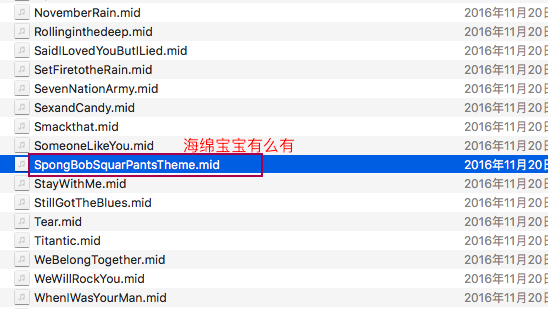
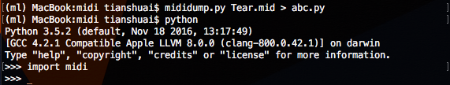
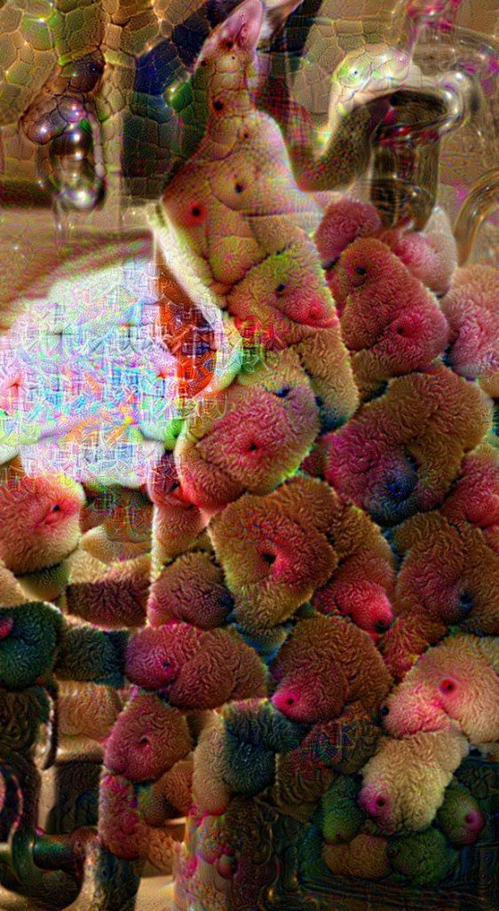
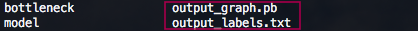
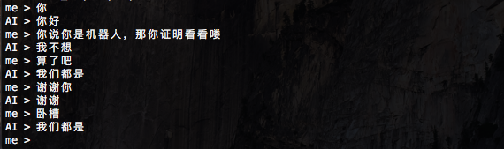
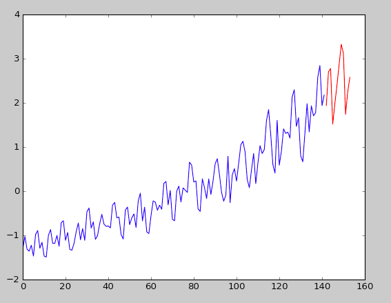
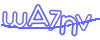

RNN—生成音乐
===

我在GitHub看到了一个使用RNN生成经典音乐的项目：biaxial-rnn-music-composition，它是基于Theano的。本帖改为使用TensorFlow生成音乐，代码逻辑在很大程度上基于前者。

相关博文：

* https://deeplearning4j.org/restrictedboltzmannmachine.html

* https://magenta.tensorflow.org/2016/06/10/recurrent-neural-network-generation-tutorial/

* https://deepmind.com/blog/wavenet-generative-model-raw-audio   

Google的项目Magenta：生成音乐、绘画或视频

* http://www.hexahedria.com/2015/08/03/composing-music-with-recurrent-neural-networks/

TensorFlow练习7: 基于RNN生成古诗词

数据集：首先准备一些MIDI音乐，可以去freemidi.org下载。

另一个关于音乐的数据集 MusicNet http://homes.cs.washington.edu/~thickstn/start.html

我下载了50多个MIDI文件（貌似有点少）。


 

 我的手机铃声有么有

 有了MIDI音乐，我们还需要一个可以操作MIDI的Python库：python-midi。

 安装python-midi：

 ```
 $ git clone https://github.com/vishnubob/python-midi
 $ cd python-midi
 # $ git checkout feature/python3   # 如果使用Python3，checkout对应分支
 $ python setup.py install
 ```

  

MacOS没有内置midi支持，可以使用timidity播放midi：

```
$ brew install timidity
$ timidity SpongBobSquarPantsTheme.mid

```

你也许不知道，你每次执行brew命令，它都会给Google发送匿名统计数据。Analytics.md

tensorflow while_loop用法：

```python
# 代码取自Stack OverFlow
import tensorflow as tf
import numpy as np

def body(x):
    a = tf.random_uniform(shape=[2, 2], dtype=tf.int32, maxval=100)
    b = tf.constant(np.array([[1, 2], [3, 4]]), dtype=tf.int32)
    c = a + b
    return tf.nn.relu(x + c)

def condition(x):
    return tf.reduce_sum(x) < 100

x = tf.Variable(tf.constant(0, shape=[2, 2]))

with tf.Session():
    tf.initialize_all_variables().run()
    result = tf.while_loop(condition, body, [x])
    print(result.eval())

```
TensorFlow生成mid音乐完整代码：

```python
import tensorflow as tf
import midi
import numpy as np
import os

lower_bound = 24
upper_bound = 102
span = upper_bound - lower_bound

# midi文件转Note(音符)
def midiToNoteStateMatrix(midi_file_path, squash=True, span=span):
	pattern = midi.read_midifile(midi_file_path)

	time_left = []
	for track in pattern:
		time_left.append(track[0].tick)

	posns = [0 for track in pattern]

	statematrix = []
	time = 0

	state = [[0,0] for x in range(span)]
	statematrix.append(state)
	condition = True
	while condition:
		if time % (pattern.resolution / 4) == (pattern.resolution / 8):
			oldstate = state
			state = [[oldstate[x][0],0] for x in range(span)]
			statematrix.append(state)
		for i in range(len(time_left)):
			if not condition:
				break
			while time_left[i] == 0:
				track = pattern[i]
				pos = posns[i]

				evt = track[pos]
				if isinstance(evt, midi.NoteEvent):
					if (evt.pitch < lower_bound) or (evt.pitch >= upper_bound):
						pass
					else:
						if isinstance(evt, midi.NoteOffEvent) or evt.velocity == 0:
							state[evt.pitch-lower_bound] = [0, 0]
						else:
							state[evt.pitch-lower_bound] = [1, 1]
				elif isinstance(evt, midi.TimeSignatureEvent):
					if evt.numerator not in (2, 4):
						out =  statematrix
						condition = False
						break
				try:
					time_left[i] = track[pos + 1].tick
					posns[i] += 1
				except IndexError:
					time_left[i] = None

			if time_left[i] is not None:
				time_left[i] -= 1

		if all(t is None for t in time_left):
			break

		time += 1

	S = np.array(statematrix)
	statematrix = np.hstack((S[:, :, 0], S[:, :, 1]))
	statematrix = np.asarray(statematrix).tolist()
	return statematrix

# Note转midi文件
def noteStateMatrixToMidi(statematrix, filename="output_file", span=span):
    statematrix = np.array(statematrix)
    if not len(statematrix.shape) == 3:
        statematrix = np.dstack((statematrix[:, :span], statematrix[:, span:]))
    statematrix = np.asarray(statematrix)
    pattern = midi.Pattern()
    track = midi.Track()
    pattern.append(track)

    span = upper_bound-lower_bound
    tickscale = 55

    lastcmdtime = 0
    prevstate = [[0,0] for x in range(span)]
    for time, state in enumerate(statematrix + [prevstate[:]]):  
        offNotes = []
        onNotes = []
        for i in range(span):
            n = state[i]
            p = prevstate[i]
            if p[0] == 1:
                if n[0] == 0:
                    offNotes.append(i)
                elif n[1] == 1:
                    offNotes.append(i)
                    onNotes.append(i)
            elif n[0] == 1:
                onNotes.append(i)
        for note in offNotes:
            track.append(midi.NoteOffEvent(tick=(time-lastcmdtime)*tickscale, pitch=note+lower_bound))
            lastcmdtime = time
        for note in onNotes:
            track.append(midi.NoteOnEvent(tick=(time-lastcmdtime)*tickscale, velocity=40, pitch=note+lower_bound))
            lastcmdtime = time

        prevstate = state

    eot = midi.EndOfTrackEvent(tick=1)
    track.append(eot)

    midi.write_midifile("{}.mid".format(filename), pattern)

# 读取midi数据
def get_songs(midi_path):
	files = os.listdir(midi_path)
	songs = []
	for f in files:
		f = midi_path+'/'+f
		print('加载:', f)
		try:
			song = np.array(midiToNoteStateMatrix(f))
			if np.array(song).shape[0] > 64:
				songs.append(song)
		except Exception as e:
			print('数据无效: ', e)
	print("读取的有效midi文件个数: ", len(songs))
	return songs

# midi目录中包含了下载的midi文件
songs = get_songs('midi')

note_range = upper_bound - lower_bound
# 音乐长度
n_timesteps = 128
n_input = 2 * note_range * n_timesteps
n_hidden = 64

X = tf.placeholder(tf.float32, [None, n_input])
W = None
bh = None
bv = None

def sample(probs):
	return tf.floor(probs + tf.random_uniform(tf.shape(probs), 0, 1))

def gibbs_sample(k):
	def body(count, k, xk):
		hk = sample(tf.sigmoid(tf.matmul(xk, W) + bh))
		xk = sample(tf.sigmoid(tf.matmul(hk, tf.transpose(W)) + bv))
		return count+1, k, xk

	count = tf.constant(0)
	def condition(count,  k, xk):
		return count < k
	[_, _, x_sample] = tf.while_loop(condition, body, [count, tf.constant(k), X])

	x_sample = tf.stop_gradient(x_sample)
	return x_sample

#定义神经网络
def neural_network():
	global W
	W  = tf.Variable(tf.random_normal([n_input, n_hidden], 0.01))
	global bh
	bh = tf.Variable(tf.zeros([1, n_hidden],  tf.float32))
	global bv
	bv = tf.Variable(tf.zeros([1, n_input],  tf.float32))

	x_sample = gibbs_sample(1)
	h = sample(tf.sigmoid(tf.matmul(X, W) + bh))
	h_sample = sample(tf.sigmoid(tf.matmul(x_sample, W) + bh))

	learning_rate = tf.constant(0.005, tf.float32)
	size_bt = tf.cast(tf.shape(X)[0], tf.float32)
	W_adder  = tf.mul(learning_rate/size_bt, tf.sub(tf.matmul(tf.transpose(X), h), tf.matmul(tf.transpose(x_sample), h_sample)))
	bv_adder = tf.mul(learning_rate/size_bt, tf.reduce_sum(tf.sub(X, x_sample), 0, True))
	bh_adder = tf.mul(learning_rate/size_bt, tf.reduce_sum(tf.sub(h, h_sample), 0, True))
	update = [W.assign_add(W_adder), bv.assign_add(bv_adder), bh.assign_add(bh_adder)]
	return update

# 训练神经网络
def train_neural_network():
	update = neural_network()

	with tf.Session() as sess:
		sess.run(tf.initialize_all_variables())

		saver = tf.train.Saver(tf.all_variables())

		epochs = 256
		batch_size = 64
		for epoch in range(epochs):
			for song in songs:
				song = np.array(song)
				song = song[:int(np.floor(song.shape[0]/n_timesteps) * n_timesteps)]
				song = np.reshape(song, [song.shape[0]//n_timesteps, song.shape[1] * n_timesteps])

			for i in range(1, len(song), batch_size):
				train_x = song[i:i+batch_size]
				sess.run(update, feed_dict={X: train_x})
			print(epoch)
			# 保存模型
			if epoch == epochs - 1:
				saver.save(sess, 'midi.module')

		# 生成midi
		sample = gibbs_sample(1).eval(session=sess, feed_dict={X: np.zeros((1, n_input))})
		S = np.reshape(sample[0,:], (n_timesteps, 2 * note_range))
		noteStateMatrixToMidi(S, "auto_gen_music")
		print('生成auto_gen_music.mid文件')

train_neural_network()

```

生成的mid音乐：auto_gen_music http://blog.topspeedsnail.com/wp-content/uploads/2016/11/auto_gen_music.mid


* 音乐分类：https://github.com/despoisj/DeepAudioClassification


PixelCNN
===

使用的图片数据
---

我本想使用ImageNet做为图片来源，就像论文中使用的。ImageNet图像有现成的分类，抓取也容易，但是由于很多源都被防火墙屏蔽，下载速度堪忧。《OpenCV之使用Haar Cascade进行对象识别》

我看到网上有很多爬妹纸图的Python脚本，额，我爬了几天几夜的妹纸图（特别暴露那种），额，我就想看看PixelCNN最后能生成什么鬼。

如果你懒的爬图片，可以使用我抓取的图片（分成两部分）：

* https://pan.baidu.com/s/1kVSA8z9 (密码: atqm)

* https://pan.baidu.com/s/1ctbd9O (密码: kubu)

数据预处理
---

下载的图片分布在多个目录，把图片汇总到一个新目录：

```python
import os

old_dir = 'images'
new_dir = 'girls'
if not os.path.exists(new_dir):
    os.makedirs(new_dir)

count = 0
for (dirpath, dirnames, filenames) in os.walk(old_dir):
    for filename in filenames:
        if filename.endswith('.jpg'):
            new_filename = str(count) + '.jpg'
            os.rename(os.sep.join([dirpath, filename]), os.sep.join([new_dir, new_filename]))
            print(os.sep.join([dirpath, filename]))
            count += 1
print("Total Picture: ", count)

```

使用《open_nsfw: 基于Caffe的成人图片识别模型》http://blog.topspeedsnail.com/archives/9440 剔除掉和妹子图不相关的图片，给open_nsfw输入要检测的图片，它会返回图片评级（0-1），等级越高，图片越黄越暴力。使用OpenCV应该也不难。


为了减小计算量，我把图像缩放为64×64像素：

```python
import os
import cv2
import numpy as np

image_dir = 'girls'
new_girl_dir = 'little_girls'
if not os.path.exists(new_girl_dir):
    os.makedirs(new_girl_dir)

for img_file in os.listdir(image_dir):
    img_file_path = os.path.join(image_dir, img_file)
    img = cv2.imread(img_file_path)
    if img is None:
        print("image read fail")
        continue
    height, weight, channel = img.shape
    if height < 200 or weight < 200 or channel != 3:
        continue
    # 你也可以转为灰度图片(channel=1)，加快训练速度
    # 把图片缩放为64x64
    img = cv2.resize(img, (64, 64))
    new_file = os.path.join(new_girl_dir, img_file)
    cv2.imwrite(new_file, img)
    print(new_file)

```

去除重复图片：

```python
import os
import cv2
import numpy as np

# 判断两张图片是否完全一样（使用哈希应该要快很多）
def is_same_image(img_file1, img_file2):
    img1 = cv2.imread(img_file1)
    img2 = cv2.imread(img_file2)
    if img1 is None or img2 is None:
        return False
    if img1.shape == img2.shape and not (np.bitwise_xor(img1, img2).any()):
        return True
    else:
        return False

# 去除重复图片
file_list = os.listdir('little_girls')
try:
	for img1 in file_list:
		print(len(file_list))
		for img2 in file_list:
			if img1 != img2:
				if is_same_image('little_girls/'+img1, 'little_girls/'+img2) is True:
					print(img1, img2)
					os.remove('little_girls/'+img1)
		file_list.remove(img1)
except Exception as e:
	print(e)

```

PixelCNN生成妹纸图完整代码
---

下面代码只实现了unconditional模型（无条件），没有实现conditional和autoencoder模型。详细信息，请参看论文。


```python
# -*- coding: utf-8 -*-

import tensorflow as tf
import numpy as np
import os
import cv2

# 如果使用mnist数据集，把MNIST设置为True
MNIST = False

if MNIST == True:
	from tensorflow.examples.tutorials.mnist import input_data
	data = input_data.read_data_sets('/tmp/')
	image_height = 28
	image_width = 28
	image_channel = 1

	batch_size = 128
	n_batches = data.train.num_examples // batch_size
else:
	picture_dir = 'little_girls'
	picture_list = []
	# 建议不要把图片一次加载到内存，为了节省内存，最好边加载边使用
	for (dirpath, dirnames, filenames) in os.walk(picture_dir):
		for filename in filenames:
			if filename.endswith('.jpg'):
				picture_list.append(os.sep.join([dirpath, filename]))

	print("图像总数: ", len(picture_list))

	# 图像大小和Channel
	image_height = 64
	image_width = 64
	image_channel = 3

	# 每次使用多少样本训练
	batch_size = 128
	n_batches = len(picture_list) // batch_size

	#图片格式对应输入X
	img_data = []
	for img_file in picture_list:
		img_data.append(cv2.imread(img_file))
	img_data = np.array(img_data)
	img_data = img_data / 255.0
	#print(img_data.shape)   # (44112, 64, 64, 3)


X = tf.placeholder(tf.float32, shape=[None, image_height, image_width, image_channel])

def gated_cnn(W_shape_, fan_in, gated=True, payload=None, mask=None, activation=True):
	W_shape = [W_shape_[0], W_shape_[1], fan_in.get_shape()[-1], W_shape_[2]]
	b_shape = W_shape_[2]

	def get_weights(shape, name, mask=None):
		weights_initializer = tf.contrib.layers.xavier_initializer()
		W = tf.get_variable(name, shape, tf.float32, weights_initializer)

		if mask:
			filter_mid_x = shape[0]//2
			filter_mid_y = shape[1]//2
			mask_filter = np.ones(shape, dtype=np.float32)
			mask_filter[filter_mid_x, filter_mid_y+1:, :, :] = 0.
			mask_filter[filter_mid_x+1:, :, :, :] = 0.

			if mask == 'a':
				mask_filter[filter_mid_x, filter_mid_y, :, :] = 0.

			W *= mask_filter
		return W

	if gated:
		W_f = get_weights(W_shape, "v_W", mask=mask)
		W_g = get_weights(W_shape, "h_W", mask=mask)

		b_f = tf.get_variable("v_b", b_shape, tf.float32, tf.zeros_initializer)
		b_g = tf.get_variable("h_b", b_shape, tf.float32, tf.zeros_initializer)

		conv_f = tf.nn.conv2d(fan_in, W_f, strides=[1,1,1,1], padding='SAME')
		conv_g = tf.nn.conv2d(fan_in, W_g, strides=[1,1,1,1], padding='SAME')
		if payload is not None:
			conv_f += payload
			conv_g += payload

		fan_out = tf.mul(tf.tanh(conv_f + b_f), tf.sigmoid(conv_g + b_g))
	else:
		W = get_weights(W_shape, "W", mask=mask)
		b = tf.get_variable("b", b_shape, tf.float32, tf.zeros_initializer)
		conv = tf.nn.conv2d(fan_in, W, strides=[1,1,1,1], padding='SAME')
		if activation:
			fan_out = tf.nn.relu(tf.add(conv, b))
		else:
			fan_out = tf.add(conv, b)

	return fan_out

def pixel_cnn(layers=12, f_map=32):
	v_stack_in, h_stack_in = X, X

	for i in range(layers):
		filter_size = 3 if i > 0 else 7
		mask = 'b' if i > 0 else 'a'
		residual = True if i > 0 else False
		i = str(i)

		with tf.variable_scope("v_stack"+i):
			v_stack = gated_cnn([filter_size, filter_size, f_map], v_stack_in, mask=mask)
			v_stack_in = v_stack

		with tf.variable_scope("v_stack_1"+i):
			v_stack_1 = gated_cnn([1, 1, f_map], v_stack_in, gated=False, mask=mask)

		with tf.variable_scope("h_stack"+i):
			h_stack = gated_cnn([1, filter_size, f_map], h_stack_in, payload=v_stack_1, mask=mask)

		with tf.variable_scope("h_stack_1"+i):
			h_stack_1 = gated_cnn([1, 1, f_map], h_stack, gated=False, mask=mask)
			if residual:
				h_stack_1 += h_stack_in
			h_stack_in = h_stack_1

	with tf.variable_scope("fc_1"):
		fc1 = gated_cnn([1, 1, f_map], h_stack_in, gated=False, mask='b')

	color = 256
	with tf.variable_scope("fc_2"):
		fc2 = gated_cnn([1, 1, image_channel * color], fc1, gated=False, mask='b', activation=False)
		fc2 = tf.reshape(fc2, (-1, color))

		return fc2

def train_pixel_cnn():
	output = pixel_cnn()

	loss = tf.reduce_mean(tf.nn.sparse_softmax_cross_entropy_with_logits(output, tf.cast(tf.reshape(X, [-1]), dtype=tf.int32)))
	trainer = tf.train.RMSPropOptimizer(1e-3)
	gradients = trainer.compute_gradients(loss)
	clipped_gradients = [(tf.clip_by_value(_[0], -1, 1), _[1]) for _ in gradients]
	optimizer = trainer.apply_gradients(clipped_gradients)

	with tf.Session() as sess:
		sess.run(tf.initialize_all_variables())

		saver = tf.train.Saver(tf.trainable_variables())

		for epoch in range(50):
			for batch in range(n_batches):

				if MNIST == True:
					batch_X, _ = data.train.next_batch(batch_size)
					batch_X = batch_X.reshape([batch_size, image_height, image_width, image_channel])
				else:
					batch_X = img_data[batch_size * batch : batch_size * (batch + 1)]

				_, cost = sess.run([optimizer, loss], feed_dict={X:batch_X})
				print("epoch:", epoch, '  batch:', batch,'  cost:', cost)
			if epoch % 7 == 0:
				saver.save(sess, "girl.ckpt", global_step=epoch)

# 训练
train_pixel_cnn()

def generate_girl():
	output = pixel_cnn()

	predict = tf.reshape(tf.multinomial(tf.nn.softmax(output), num_samples=1, seed=100), tf.shape(X))
	#predict_argmax = tf.reshape(tf.argmax(tf.nn.softmax(output), dimension=tf.rank(output) - 1), tf.shape(X))

	with tf.Session() as sess:
		sess.run(tf.initialize_all_variables())

		saver = tf.train.Saver(tf.trainable_variables())
		saver.restore(sess, 'girl.ckpt-49')

		pics = np.zeros((1*1, image_height, image_width, image_channel), dtype=np.float32)

		for i in range(image_height):
			for j in range(image_width):
				for k in range(image_channel):
					next_pic = sess.run(predict, feed_dict={X:pics})
					pics[:, i, j, k] = next_pic[:, i, j, k]

		cv2.imwrite('girl.jpg', pics[0])
		print('生成妹子图: girl.jpg')

# 生成图像
generate_girl()


```


额，妹子图正在训练中…

补充练习：使用OpenCV提取图像中的脸 http://blog.topspeedsnail.com/archives/10511 ，然后使用上面模型进行训练，看看能生成什么。

* Deep Generative Image Models using a Laplacian Pyramid of Adversarial Networks https://arxiv.org/pdf/1506.05751v1.pdf

Share the post "TensorFlow练习9: 生成妹子图（PixelCNN）"


谷歌Deep Dream
===

本帖使用谷歌的预训练的Inception模型生成带有艺术感的图片。

    Inception模型是Google用两个星期，使用上百万张带分类的图片训练出的模型，在做图像识别时，为了节省时间，通常使用预训练的Inception模型做为训练基础。

Deep Dream是取预训练模型的某一层（神经网络有59层，前几层学会底层特性，像线、角，经过层层抽象，最后几层可以表示更高层次的特性），然后最大化我们提供的图像和某个层相似的特性，最后生成非常有意思的图像。

关于Deep Dream：

* https://github.com/google/deepdream

* http://www.alanzucconi.com/2016/05/25/generating-deep-dreams/

* http://ryankennedy.io/running-the-deep-dream/

下图是lena经过《open_nsfw: 基于Caffe的成人图片识别模型》处理后生成的图像：


 


 * https://open_nsfw.gitlab.io（未满18岁，请绕行；自备钛合金）

 * 下载预训练的Inception模型：

```
$ wget https://storage.googleapis.com/download.tensorflow.org/models/inception5h.zip # 解压
$ unzip inception5h.zip
```

代码：

```python
# -*- coding: utf-8 -*-

import tensorflow as tf
import numpy as np
import cv2

inception_model = 'tensorflow_inception_graph.pb'

# 加载inception模型
graph = tf.Graph()
sess = tf.InteractiveSession(graph=graph)

X = tf.placeholder(np.float32, name='input')
with tf.gfile.FastGFile(inception_model, 'rb') as f:
	graph_def = tf.GraphDef()
	graph_def.ParseFromString(f.read())
imagenet_mean = 117.0
preprocessed = tf.expand_dims(X-imagenet_mean, 0)
tf.import_graph_def(graph_def, {'input':preprocessed})

layers = [op.name for op in graph.get_operations() if op.type=='Conv2D' and 'import/' in op.name]
feature_nums = [int(graph.get_tensor_by_name(name+':0').get_shape()[-1]) for name in layers]

print('layers:', len(layers))   # 59
print('feature:', sum(feature_nums))  # 7548

# deep dream
def deep_dream(obj, img_noise=np.random.uniform(size=(224,224,3)) + 100.0, iter_n=10, step=1.5, octave_n=4, octave_scale=1.4):
	score = tf.reduce_mean(obj)
	gradi = tf.gradients(score, X)[0]

	img = img_noise
	octaves = []

	def tffunc(*argtypes):
		placeholders = list(map(tf.placeholder, argtypes))
		def wrap(f):
			out = f(*placeholders)
			def wrapper(*args, **kw):
				return out.eval(dict(zip(placeholders, args)), session=kw.get('session'))
			return wrapper
		return wrap
	def resize(img, size):
		img = tf.expand_dims(img, 0)
		return tf.image.resize_bilinear(img, size)[0,:,:,:]

	resize = tffunc(np.float32, np.int32)(resize)
	for _ in range(octave_n-1):
		hw = img.shape[:2]
		lo = resize(img, np.int32(np.float32(hw)/octave_scale))
		hi = img-resize(lo, hw)
		img = lo
		octaves.append(hi)

	def calc_grad_tiled(img, t_grad, tile_size=512):
		sz = tile_size
		h, w = img.shape[:2]
		sx, sy = np.random.randint(sz, size=2)
		img_shift = np.roll(np.roll(img, sx, 1), sy, 0)
		grad = np.zeros_like(img)
		for y in range(0, max(h-sz//2, sz),sz):
			for x in range(0, max(w-sz//2, sz),sz):
				sub = img_shift[y:y+sz,x:x+sz]
				g = sess.run(t_grad, {X:sub})
				grad[y:y+sz,x:x+sz] = g
		return np.roll(np.roll(grad, -sx, 1), -sy, 0)   

	for octave in range(octave_n):
		if octave>0:
			hi = octaves[-octave]
			img = resize(img, hi.shape[:2])+hi
		for _ in range(iter_n):
			g = calc_grad_tiled(img, gradi)
			img += g*(step / (np.abs(g).mean()+1e-7))

		# 保存图像
		output_file = 'output' + str(octave+1) + '.jpg'
		cv2.imwrite(output_file, img)
		print(output_file)

# 加载输入图像
input_img = cv2.imread('input.jpg')
input_img = np.float32(input_img)

# 选择层
layer = 'mixed4c'

deep_dream(tf.square(graph.get_tensor_by_name("import/%s:0"%layer)), input_img)


```


retrain谷歌Inception模型
===

前一帖使用到了谷歌训练的Inception模型，本帖就基于Inception模型retrain一个图像分类器。

图像分类器应用广泛，连农业都在使用，如判断黄瓜种类。

本帖使用的训练数据是PixelCNN一文中使用的妹子图，最后训练出的分类器可以判断图片是不是妹子图。

首先下载tensorflow源代码：

```
$ git clone https://github.com/tensorflow/tensorflow
$ git checkout r0.11


```

使用examples中的image_retraining。

训练：

```
$ python tensorflow/tensorflow/examples/image_retraining/retrain.py --bottleneck_dir bottleneck --how_many_training_steps 4000 --model_dir model --output_graph output_graph.pb --output_labels output_labels.txt --image_dir girl_types/
```

参数解释参考retrain.py源文件。

大概训练了半个小时：




使用训练好的模型：

```python

import tensorflow as tf
import sys

# 命令行参数，传入要判断的图片路径
image_file = sys.argv[1]
#print(image_file)

# 读取图像
image = tf.gfile.FastGFile(image_file, 'rb').read()

# 加载图像分类标签
labels = []
for label in tf.gfile.GFile("output_labels.txt"):
	labels.append(label.rstrip())

# 加载Graph
with tf.gfile.FastGFile("output_graph.pb", 'rb') as f:
	graph_def = tf.GraphDef()
	graph_def.ParseFromString(f.read())
	tf.import_graph_def(graph_def, name='')

with tf.Session() as sess:
	softmax_tensor = sess.graph.get_tensor_by_name('final_result:0')
	predict = sess.run(softmax_tensor, {'DecodeJpeg/contents:0': image})

	# 根据分类概率进行排序
	top = predict[0].argsort()[-len(predict[0]):][::-1]
	for index in top:
		human_string = labels[index]
		score = predict[0][index]
		print(human_string, score)

```

执行结果：

```
big as 0.000341
```

* https://www.tensorflow.org/versions/r0.11/how_tos/image_retraining/index.html

* How Convolutional Neural Networks work https://www.youtube.com/watch?v=FmpDIaiMIeA

判断男声女声
===

本帖训练一个简单的神经网络模型，用来判断声音是男是女。

本帖数据集取自voice-gender项目，这个项目使用了n种分类模型，并比较了准确率，但是它没有使用神经网络模型，本帖算是一个补充。

数据集
---

这个数据集是经过R语言处理过的，它提取出了.WAV文件的一些声音属性。如果你想自己从wav文件中提取声音属性，参看voice-gender项目中一个叫sound.R源码文件。

数据集字段：”meanfreq”,”sd”,”median”,”Q25″,”Q75″,”IQR”,”skew”,”kurt”,”sp.ent”,”sfm”,”mode”,”centroid”,”meanfun”,”minfun”,”maxfun”,”meandom”,”mindom”,”maxdom”,”dfrange”,”modindx”,”label”。最后一个字段标记了是男声还是女声，前面字段是声音属性。

代码
---

```python
import os
import requests
import pandas as pd
import numpy as np
import random
import tensorflow as tf  # 0.12
from sklearn.model_selection import train_test_split

# 下载数据集
if not os.path.exists('voice.csv'):
	url = 'http://blog.topspeedsnail.com/wp-content/uploads/2016/12/voice.csv'
	data = requests.get(url).content
	with open('voice.csv', 'wb') as f:
		f.write(data)

voice_data = pd.read_csv('voice.csv')
#print(voice_data.head())
#print(voice_data.tail())

voice_data = voice_data.values
# 分离声音特性和分类
voices = voice_data[:, :-1]
labels = voice_data[:, -1:]  #  ['male']  ['female']

# 把分类转为one-hot
labels_tmp = []
for label in labels:
	tmp = []
	if label[0] == 'male':
		tmp = [1.0, 0.0]
	else:  # 'female'
		tmp = [0.0, 1.0]
	labels_tmp.append(tmp)
labels = np.array(labels_tmp)

# shuffle
voices_tmp = []
lables_tmp = []
index_shuf = [i for i in range(len(voices))]
random.shuffle(index_shuf)
for i in index_shuf:
    voices_tmp.append(voices[i])
    lables_tmp.append(labels[i])
voices = np.array(voices_tmp)
labels = np.array(lables_tmp)

train_x, test_x, train_y, test_y = train_test_split(voices, labels, test_size=0.1)

banch_size = 64
n_banch = len(train_x) // banch_size

X = tf.placeholder(dtype=tf.float32, shape=[None, voices.shape[-1]])  # 20
Y = tf.placeholder(dtype=tf.float32, shape=[None, 2])

# 3层（feed-forward）
def neural_network():
	w1 = tf.Variable(tf.random_normal([voices.shape[-1], 512], stddev=0.5))
	b1 = tf.Variable(tf.random_normal([512]))
	output = tf.matmul(X, w1) + b1

	w2 = tf.Variable(tf.random_normal([512, 1024],stddev=.5))
	b2 = tf.Variable(tf.random_normal([1024]))
	output = tf.nn.softmax(tf.matmul(output, w2) + b2)

	w3 = tf.Variable(tf.random_normal([1024, 2],stddev=.5))
	b3 = tf.Variable(tf.random_normal([2]))
	output = tf.nn.softmax(tf.matmul(output, w3) + b3)
	return output

# 训练神经网络
def train_neural_network():
	output = neural_network()

	cost = tf.reduce_mean(tf.reduce_sum(tf.nn.softmax_cross_entropy_with_logits(output, Y)))
	lr = tf.Variable(0.001, dtype=tf.float32, trainable=False)
	opt = tf.train.AdamOptimizer(learning_rate=lr)
	var_list = [t for t in tf.trainable_variables()]
	train_step = opt.minimize(cost, var_list=var_list)

	#saver = tf.train.Saver(tf.global_variables())
	#saver.restore(sess, tf.train.latest_checkpoint('.'))
	with tf.Session() as sess:
		sess.run(tf.global_variables_initializer())
		#summary_writer = tf.train.SummaryWriter('voices')
		for epoch in range(200):
			sess.run(tf.assign(lr, 0.001 * (0.97 ** epoch)))

			for banch in range(n_banch):
				voice_banch = train_x[banch*banch_size:(banch+1)*(banch_size)]
				label_banch = train_y[banch*banch_size:(banch+1)*(banch_size)]
				_, loss = sess.run([train_step, cost], feed_dict={X: voice_banch, Y: label_banch})
				print(epoch, banch, loss)

		# 准确率
		prediction = tf.equal(tf.argmax(output, 1), tf.argmax(Y, 1))
		accuracy = tf.reduce_mean(tf.cast(prediction, dtype=tf.float32))
		accuracy = sess.run(accuracy, feed_dict={X: test_x, Y: test_y})
		print("准确率", accuracy)

		#prediction = sess.run(output, feed_dict={X: test_x})

train_neural_network()

```

简单聊天机器人
===

现在很多卖货公司都使用聊天机器人充当客服人员，许多科技巨头也纷纷推出各自的聊天助手，如苹果Siri、Google Now、Amazon Alexa、微软小冰等等。前不久有一个视频比较了Google Now和Siri哪个更智能，貌似Google Now更智能。

本帖使用TensorFlow制作一个简单的聊天机器人。这个聊天机器人使用中文对话数据集进行训练（使用什么数据集训练决定了对话类型）。使用的模型为RNN(seq2seq)

相关博文：

* 使用深度学习打造智能聊天机器人 http://blog.csdn.net/malefactor/article/details/51901115

* 脑洞大开：基于美剧字幕的聊天语料库建设方案 http://www.shareditor.com/blogshow/?blogId=105

* 中文对白语料 https://github.com/rustch3n/dgk_lost_conv

* https://www.tensorflow.org/versions/r0.12/tutorials/seq2seq/index.html

* https://github.com/tflearn/tflearn/blob/master/examples/nlp/lstm_generator_shakespeare.py

code：http://download.csdn.net/detail/u014365862/9764355。

数据集

我使用现成的影视对白数据集 https://github.com/rustch3n/dgk_lost_conv，跪谢作者分享数据。

下载数据集：

```python
$ wget https://raw.githubusercontent.com/rustch3n/dgk_lost_conv/master/dgk_shooter_min.conv.zip
# 解压
$ unzip dgk_shooter_min.conv.zip


```

数据预处理：


```python
import os
import random

conv_path = 'dgk_shooter_min.conv'

if not os.path.exists(conv_path):
	print('数据集不存在')
	exit()

# 数据集格式
"""
E
M 畹/华/吾/侄/
M 你/接/到/这/封/信/的/时/候/
M 不/知/道/大/伯/还/在/不/在/人/世/了/
E
M 咱/们/梅/家/从/你/爷/爷/起/
M 就/一/直/小/心/翼/翼/地/唱/戏/
M 侍/奉/宫/廷/侍/奉/百/姓/
M 从/来/不/曾/遭/此/大/祸/
M 太/后/的/万/寿/节/谁/敢/不/穿/红/
M 就/你/胆/儿/大/
M 唉/这/我/舅/母/出/殡/
M 我/不/敢/穿/红/啊/
M 唉/呦/唉/呦/爷/
M 您/打/得/好/我/该/打/
M 就/因/为/没/穿/红/让/人/赏/咱/一/纸/枷/锁/
M 爷/您/别/给/我/戴/这/纸/枷/锁/呀/
E
M 您/多/打/我/几/下/不/就/得/了/吗/
M 走/
M 这/是/哪/一/出/啊/…/ / /这/是/
M 撕/破/一/点/就/弄/死/你/
M 唉/
M 记/着/唱/戏/的/再/红/
M 还/是/让/人/瞧/不/起/
M 大/伯/不/想/让/你/挨/了/打/
M 还/得/跟/人/家/说/打/得/好/
M 大/伯/不/想/让/你/再/戴/上/那/纸/枷/锁/
M 畹/华/开/开/门/哪/
E
...
"""

# 我首先使用文本编辑器sublime把dgk_shooter_min.conv文件编码转为UTF-8，一下子省了不少麻烦
convs = []  # 对话集合
with open(conv_path, encoding = "utf8") as f:
	one_conv = []        # 一次完整对话
	for line in f:
		line = line.strip('\n').replace('/', '')
		if line == '':
			continue
		if line[0] == 'E':
			if one_conv:
				convs.append(one_conv)
			one_conv = []
		elif line[0] == 'M':
			one_conv.append(line.split(' ')[1])
"""
print(convs[:3])  # 个人感觉对白数据集有点不给力啊
[ ['畹华吾侄', '你接到这封信的时候', '不知道大伯还在不在人世了'],
  ['咱们梅家从你爷爷起', '就一直小心翼翼地唱戏', '侍奉宫廷侍奉百姓', '从来不曾遭此大祸', '太后的万寿节谁敢不穿红', '就你胆儿大', '唉这我舅母出殡', '我不敢穿红啊', '唉呦唉呦爷', '您打得好我该打', '就因为没穿红让人赏咱一纸枷锁', '爷您别给我戴这纸枷锁呀'],
  ['您多打我几下不就得了吗', '走', '这是哪一出啊 ', '撕破一点就弄死你', '唉', '记着唱戏的再红', '还是让人瞧不起', '大伯不想让你挨了打', '还得跟人家说打得好', '大伯不想让你再戴上那纸枷锁', '畹华开开门哪'], ....]
"""

# 把对话分成问与答
ask = []        # 问
response = []   # 答
for conv in convs:
	if len(conv) == 1:
		continue
	if len(conv) % 2 != 0:  # 奇数对话数, 转为偶数对话
		conv = conv[:-1]
	for i in range(len(conv)):
		if i % 2 == 0:
			ask.append(conv[i])
		else:
			response.append(conv[i])

"""
print(len(ask), len(response))
print(ask[:3])
print(response[:3])
['畹华吾侄', '咱们梅家从你爷爷起', '侍奉宫廷侍奉百姓']
['你接到这封信的时候', '就一直小心翼翼地唱戏', '从来不曾遭此大祸']
"""

def convert_seq2seq_files(questions, answers, TESTSET_SIZE = 8000):
    # 创建文件
    train_enc = open('train.enc','w')  # 问
    train_dec = open('train.dec','w')  # 答
    test_enc  = open('test.enc', 'w')  # 问
    test_dec  = open('test.dec', 'w')  # 答

    # 选择20000数据作为测试数据
    test_index = random.sample([i for i in range(len(questions))],TESTSET_SIZE)

    for i in range(len(questions)):
        if i in test_index:
            test_enc.write(questions[i]+'\n')
            test_dec.write(answers[i]+ '\n' )
        else:
            train_enc.write(questions[i]+'\n')
            train_dec.write(answers[i]+ '\n' )
        if i % 1000 == 0:
            print(len(range(len(questions))), '处理进度:', i)

    train_enc.close()
    train_dec.close()
    test_enc.close()
    test_dec.close()

convert_seq2seq_files(ask, response)
# 生成的*.enc文件保存了问题
# 生成的*.dec文件保存了回答

```

创建词汇表，然后把对话转为向量形式，参看练习1和7：

```python

# 前一步生成的问答文件路径
train_encode_file = 'train.enc'
train_decode_file = 'train.dec'
test_encode_file = 'test.enc'
test_decode_file = 'test.dec'

print('开始创建词汇表...')
# 特殊标记，用来填充标记对话
PAD = "__PAD__"
GO = "__GO__"
EOS = "__EOS__"  # 对话结束
UNK = "__UNK__"  # 标记未出现在词汇表中的字符
START_VOCABULART = [PAD, GO, EOS, UNK]
PAD_ID = 0
GO_ID = 1
EOS_ID = 2
UNK_ID = 3
# 参看tensorflow.models.rnn.translate.data_utils

vocabulary_size = 5000
# 生成词汇表文件
def gen_vocabulary_file(input_file, output_file):
	vocabulary = {}
	with open(input_file) as f:
		counter = 0
		for line in f:
			counter += 1
			tokens = [word for word in line.strip()]
			for word in tokens:
				if word in vocabulary:
					vocabulary[word] += 1
				else:
					vocabulary[word] = 1
		vocabulary_list = START_VOCABULART + sorted(vocabulary, key=vocabulary.get, reverse=True)
		# 取前5000个常用汉字, 应该差不多够用了(额, 好多无用字符, 最好整理一下. 我就不整理了)
		if len(vocabulary_list) > 5000:
			vocabulary_list = vocabulary_list[:5000]
		print(input_file + " 词汇表大小:", len(vocabulary_list))
		with open(output_file, "w") as ff:
			for word in vocabulary_list:
				ff.write(word + "\n")

gen_vocabulary_file(train_encode_file, "train_encode_vocabulary")
gen_vocabulary_file(train_decode_file, "train_decode_vocabulary")

train_encode_vocabulary_file = 'train_encode_vocabulary'
train_decode_vocabulary_file = 'train_decode_vocabulary'

print("对话转向量...")
# 把对话字符串转为向量形式
def convert_to_vector(input_file, vocabulary_file, output_file):
	tmp_vocab = []
	with open(vocabulary_file, "r") as f:
		tmp_vocab.extend(f.readlines())
	tmp_vocab = [line.strip() for line in tmp_vocab]
	vocab = dict([(x, y) for (y, x) in enumerate(tmp_vocab)])
	#{'硕': 3142, 'v': 577, 'Ｉ': 4789, '\ue796': 4515, '拖': 1333, '疤': 2201 ...}
	output_f = open(output_file, 'w')
	with open(input_file, 'r') as f:
		for line in f:
			line_vec = []
			for words in line.strip():
				line_vec.append(vocab.get(words, UNK_ID))
			output_f.write(" ".join([str(num) for num in line_vec]) + "\n")
	output_f.close()

convert_to_vector(train_encode_file, train_encode_vocabulary_file, 'train_encode.vec')
convert_to_vector(train_decode_file, train_decode_vocabulary_file, 'train_decode.vec')

convert_to_vector(test_encode_file, train_encode_vocabulary_file, 'test_encode.vec')
convert_to_vector(test_decode_file, train_decode_vocabulary_file, 'test_decode.vec')

```

生成的train_encode.vec和train_decode.vec用于训练，对应的词汇表是train_encode_vocabulary和train_decode_vocabulary。

训练
---

需要很长时间训练，这还是小数据集，如果用百GB级的数据，没10天半个月也训练不完。

使用的模型：seq2seq_model.py https://github.com/tensorflow/tensorflow/blob/master/tensorflow/models/rnn/translate/seq2seq_model.py

代码：

```python

import tensorflow as tf  # 0.12
from tensorflow.models.rnn.translate import seq2seq_model
import os
import numpy as np
import math

PAD_ID = 0
GO_ID = 1
EOS_ID = 2
UNK_ID = 3

train_encode_vec = 'train_encode.vec'
train_decode_vec = 'train_decode.vec'
test_encode_vec = 'test_encode.vec'
test_decode_vec = 'test_decode.vec'

# 词汇表大小5000
vocabulary_encode_size = 5000
vocabulary_decode_size = 5000

buckets = [(5, 10), (10, 15), (20, 25), (40, 50)]
layer_size = 256  # 每层大小
num_layers = 3   # 层数
batch_size =  64

# 读取*dencode.vec和*decode.vec数据（数据还不算太多, 一次读人到内存）
def read_data(source_path, target_path, max_size=None):
	data_set = [[] for _ in buckets]
	with tf.gfile.GFile(source_path, mode="r") as source_file:
		with tf.gfile.GFile(target_path, mode="r") as target_file:
			source, target = source_file.readline(), target_file.readline()
			counter = 0
			while source and target and (not max_size or counter < max_size):
				counter += 1
				source_ids = [int(x) for x in source.split()]
				target_ids = [int(x) for x in target.split()]
				target_ids.append(EOS_ID)
				for bucket_id, (source_size, target_size) in enumerate(buckets):
					if len(source_ids) < source_size and len(target_ids) < target_size:
						data_set[bucket_id].append([source_ids, target_ids])
						break
				source, target = source_file.readline(), target_file.readline()
	return data_set

model = seq2seq_model.Seq2SeqModel(source_vocab_size=vocabulary_encode_size, target_vocab_size=vocabulary_decode_size,
                                   buckets=buckets, size=layer_size, num_layers=num_layers, max_gradient_norm= 5.0,
                                   batch_size=batch_size, learning_rate=0.5, learning_rate_decay_factor=0.97, forward_only=False)

config = tf.ConfigProto()
config.gpu_options.allocator_type = 'BFC'  # 防止 out of memory

with tf.Session(config=config) as sess:
	# 恢复前一次训练
	ckpt = tf.train.get_checkpoint_state('.')
	if ckpt != None:
		print(ckpt.model_checkpoint_path)
		model.saver.restore(sess, ckpt.model_checkpoint_path)
	else:
		sess.run(tf.global_variables_initializer())

	train_set = read_data(train_encode_vec, train_decode_vec)
	test_set = read_data(test_encode_vec, test_decode_vec)

	train_bucket_sizes = [len(train_set[b]) for b in range(len(buckets))]
	train_total_size = float(sum(train_bucket_sizes))
	train_buckets_scale = [sum(train_bucket_sizes[:i + 1]) / train_total_size for i in range(len(train_bucket_sizes))]

	loss = 0.0
	total_step = 0
	previous_losses = []
	# 一直训练，每过一段时间保存一次模型
	while True:
		random_number_01 = np.random.random_sample()
		bucket_id = min([i for i in range(len(train_buckets_scale)) if train_buckets_scale[i] > random_number_01])

		encoder_inputs, decoder_inputs, target_weights = model.get_batch(train_set, bucket_id)
		_, step_loss, _ = model.step(sess, encoder_inputs, decoder_inputs, target_weights, bucket_id, False)

		loss += step_loss / 500
		total_step += 1

		print(total_step)
		if total_step % 500 == 0:
			print(model.global_step.eval(), model.learning_rate.eval(), loss)

			# 如果模型没有得到提升，减小learning rate
			if len(previous_losses) > 2 and loss > max(previous_losses[-3:]):
				sess.run(model.learning_rate_decay_op)
			previous_losses.append(loss)
			# 保存模型
			checkpoint_path = "chatbot_seq2seq.ckpt"
			model.saver.save(sess, checkpoint_path, global_step=model.global_step)
			loss = 0.0
			# 使用测试数据评估模型
			for bucket_id in range(len(buckets)):
				if len(test_set[bucket_id]) == 0:
					continue
				encoder_inputs, decoder_inputs, target_weights = model.get_batch(test_set, bucket_id)
				_, eval_loss, _ = model.step(sess, encoder_inputs, decoder_inputs, target_weights, bucket_id, True)
				eval_ppx = math.exp(eval_loss) if eval_loss < 300 else float('inf')
				print(bucket_id, eval_ppx)

```

聊天机器人

使用训练好的模型：

```python

import tensorflow as tf  # 0.12
from tensorflow.models.rnn.translate import seq2seq_model
import os
import numpy as np

PAD_ID = 0
GO_ID = 1
EOS_ID = 2
UNK_ID = 3

train_encode_vocabulary = 'train_encode_vocabulary'
train_decode_vocabulary = 'train_decode_vocabulary'

def read_vocabulary(input_file):
	tmp_vocab = []
	with open(input_file, "r") as f:
		tmp_vocab.extend(f.readlines())
	tmp_vocab = [line.strip() for line in tmp_vocab]
	vocab = dict([(x, y) for (y, x) in enumerate(tmp_vocab)])
	return vocab, tmp_vocab

vocab_en, _, = read_vocabulary(train_encode_vocabulary)
_, vocab_de, = read_vocabulary(train_decode_vocabulary)

# 词汇表大小5000
vocabulary_encode_size = 5000
vocabulary_decode_size = 5000

buckets = [(5, 10), (10, 15), (20, 25), (40, 50)]
layer_size = 256  # 每层大小
num_layers = 3   # 层数
batch_size =  1

model = seq2seq_model.Seq2SeqModel(source_vocab_size=vocabulary_encode_size, target_vocab_size=vocabulary_decode_size,
                                   buckets=buckets, size=layer_size, num_layers=num_layers, max_gradient_norm= 5.0,
                                   batch_size=batch_size, learning_rate=0.5, learning_rate_decay_factor=0.99, forward_only=True)
model.batch_size = 1

with tf.Session() as sess:
	# 恢复前一次训练
	ckpt = tf.train.get_checkpoint_state('.')
	if ckpt != None:
		print(ckpt.model_checkpoint_path)
		model.saver.restore(sess, ckpt.model_checkpoint_path)
	else:
		print("没找到模型")

	while True:
		input_string = input('me > ')
		# 退出
		if input_string == 'quit':
			exit()

		input_string_vec = []
		for words in input_string.strip():
			input_string_vec.append(vocab_en.get(words, UNK_ID))
		bucket_id = min([b for b in range(len(buckets)) if buckets[b][0] > len(input_string_vec)])
		encoder_inputs, decoder_inputs, target_weights = model.get_batch({bucket_id: [(input_string_vec, [])]}, bucket_id)
		_, _, output_logits = model.step(sess, encoder_inputs, decoder_inputs, target_weights, bucket_id, True)
		outputs = [int(np.argmax(logit, axis=1)) for logit in output_logits]
		if EOS_ID in outputs:
			outputs = outputs[:outputs.index(EOS_ID)]

		response = "".join([tf.compat.as_str(vocab_de[output]) for output in outputs])
		print('AI > ' + response)

```

 


 额，好差劲。

上面的实现并没有用到任何自然语言的特性（分词、语法等等），只是单纯的使用数据强行提高它的“智商”。

后续练习：中文语音识别、文本转语音


黑白图像上色
===

网上有很多使用PS给黑白老照片上色的教程，下图是P上颜色的爱因斯坦：

于是，有大牛使用深度学习制作了一个自动给黑白图像上色的模型，非常非常的牛叉。

* colornet https://github.com/pavelgonchar/colornet

* Automatic Colorization http://tinyclouds.org/colorize/

* Hypercolumns for Object Segmentation and Fine-grained Localization http://arxiv.org/pdf/1411.5752v2.pdf

* The major advancements in Deep Learning in 2016 https://tryolabs.com/blog/2016/12/06/major-advancements-deep-learning-2016/

本帖就使用前文的妹子图训练这个模型，看看效果。

由于原作者使用的TensorFlow版本太旧，不能直接运行，我做了一点修改。

训练模型：

```python

import tensorflow as tf  # 0.12
import numpy as np
import os
import glob
import sys
from matplotlib import pyplot as plt

# 训练文件列表
filenames = glob.glob("./girl/*.jpg")

# VGG-16是图像分类模型: https://github.com/ry/tensorflow-vgg16
# 网盘下载: https://pan.baidu.com/s/1slJBoMp
with open("vgg16-20160129.tfmodel", mode='rb') as f:
    fileContent = f.read()
graph_def = tf.GraphDef()
graph_def.ParseFromString(fileContent)

if not os.path.exists('summary'):
	os.mkdir('summary')

def rgb2yuv(rgb):
	"""
	Convert RGB image into YUV https://en.wikipedia.org/wiki/YUV
	"""
	rgb2yuv_filter = tf.constant([[[[0.299, -0.169, 0.499],
                                    [0.587, -0.331, -0.418],
                                    [0.114, 0.499, -0.0813]]]])
	rgb2yuv_bias = tf.constant([0., 0.5, 0.5])
	temp = tf.nn.conv2d(rgb, rgb2yuv_filter, [1, 1, 1, 1], 'SAME')
	temp = tf.nn.bias_add(temp, rgb2yuv_bias)
	return temp

def yuv2rgb(yuv):
	"""
	Convert YUV image into RGB https://en.wikipedia.org/wiki/YUV
	"""
	yuv = tf.mul(yuv, 255)
	yuv2rgb_filter = tf.constant([[[[1., 1., 1.],
                                    [0., -0.34413999, 1.77199996],
                                    [1.40199995, -0.71414, 0.]]]])
	yuv2rgb_bias = tf.constant([-179.45599365, 135.45983887, -226.81599426])
	temp = tf.nn.conv2d(yuv, yuv2rgb_filter, [1, 1, 1, 1], 'SAME')
	temp = tf.nn.bias_add(temp, yuv2rgb_bias)
	temp = tf.maximum(temp, tf.zeros(temp.get_shape(), dtype=tf.float32))
	temp = tf.minimum(temp, tf.mul(tf.ones(temp.get_shape(), dtype=tf.float32), 255))
	temp = tf.div(temp, 255)
	return temp

def concat_images(imga, imgb):
	"""
	Combines two color image ndarrays side-by-side.
	"""
	ha, wa = imga.shape[:2]
	hb, wb = imgb.shape[:2]
	max_height = np.max([ha, hb])
	total_width = wa + wb
	new_img = np.zeros(shape=(max_height, total_width, 3), dtype=np.float32)
	new_img[:ha, :wa] = imga
	new_img[:hb, wa:wa + wb] = imgb
	return new_img

class ConvolutionalBatchNormalizer(object):
	"""
	Helper class that groups the normalization logic and variables.        .                              
	"""
	def __init__(self, depth, epsilon, ewma_trainer, scale_after_norm):
		self.mean = tf.Variable(tf.constant(0.0, shape=[depth]), trainable=False)
		self.variance = tf.Variable(tf.constant(1.0, shape=[depth]), trainable=False)
		self.beta = tf.Variable(tf.constant(0.0, shape=[depth]))
		self.gamma = tf.Variable(tf.constant(1.0, shape=[depth]))
		self.ewma_trainer = ewma_trainer
		self.epsilon = epsilon
		self.scale_after_norm = scale_after_norm

	def get_assigner(self):
		"""Returns an EWMA apply op that must be invoked after optimization."""
		return self.ewma_trainer.apply([self.mean, self.variance])

	def normalize(self, x, train=True):
		"""Returns a batch-normalized version of x."""
		if train is not None:
			mean, variance = tf.nn.moments(x, [0, 1, 2])
			assign_mean = self.mean.assign(mean)
			assign_variance = self.variance.assign(variance)
			with tf.control_dependencies([assign_mean, assign_variance]):
				return tf.nn.batch_norm_with_global_normalization(x, mean, variance, self.beta, self.gamma, self.epsilon, self.scale_after_norm)
		else:
			mean = self.ewma_trainer.average(self.mean)
			variance = self.ewma_trainer.average(self.variance)
			local_beta = tf.identity(self.beta)
			local_gamma = tf.identity(self.gamma)
			return tf.nn.batch_norm_with_global_normalization(x, mean, variance, local_beta, local_gamma, self.epsilon, self.scale_after_norm)

def read_my_file_format(filename_queue, randomize=False):
	reader = tf.WholeFileReader()
	key, file = reader.read(filename_queue)
	uint8image = tf.image.decode_jpeg(file, channels=3)
	uint8image = tf.random_crop(uint8image, (224, 224, 3))
	if randomize:
		uint8image = tf.image.random_flip_left_right(uint8image)
		uint8image = tf.image.random_flip_up_down(uint8image, seed=None)
	float_image = tf.div(tf.cast(uint8image, tf.float32), 255)
	return float_image

def input_pipeline(filenames, batch_size, num_epochs=None):
	filename_queue = tf.train.string_input_producer(filenames, num_epochs=num_epochs, shuffle=False)
	example = read_my_file_format(filename_queue, randomize=False)
	min_after_dequeue = 100
	capacity = min_after_dequeue + 3 * batch_size
	example_batch = tf.train.shuffle_batch([example], batch_size=batch_size, capacity=capacity, min_after_dequeue=min_after_dequeue)
	return example_batch


batch_size = 1
num_epochs = 1e+9
colorimage = input_pipeline(filenames, batch_size, num_epochs=num_epochs)

grayscale = tf.image.rgb_to_grayscale(colorimage)
grayscale_rgb = tf.image.grayscale_to_rgb(grayscale)
grayscale_yuv = rgb2yuv(grayscale_rgb)
grayscale = tf.concat(3, [grayscale, grayscale, grayscale])

tf.import_graph_def(graph_def, input_map={"images": grayscale})
graph = tf.get_default_graph()


phase_train = tf.placeholder(tf.bool, name='phase_train')
# 定义神经网络
def color_net():
	"""
	Network architecture http://tinyclouds.org/colorize/residual_encoder.png
	"""
	with tf.variable_scope('vgg'):
		conv1_2 = graph.get_tensor_by_name("import/conv1_2/Relu:0")
		conv2_2 = graph.get_tensor_by_name("import/conv2_2/Relu:0")
		conv3_3 = graph.get_tensor_by_name("import/conv3_3/Relu:0")
		conv4_3 = graph.get_tensor_by_name("import/conv4_3/Relu:0")

	# Store layers weight
	weights = {
		# 1x1 conv, 512 inputs, 256 outputs
		'wc1': tf.Variable(tf.truncated_normal([1, 1, 512, 256], stddev=0.01)),
		# 3x3 conv, 512 inputs, 128 outputs
		'wc2': tf.Variable(tf.truncated_normal([3, 3, 256, 128], stddev=0.01)),
		# 3x3 conv, 256 inputs, 64 outputs
		'wc3': tf.Variable(tf.truncated_normal([3, 3, 128, 64], stddev=0.01)),
		# 3x3 conv, 128 inputs, 3 outputs
		'wc4': tf.Variable(tf.truncated_normal([3, 3, 64, 3], stddev=0.01)),
		# 3x3 conv, 6 inputs, 3 outputs
		'wc5': tf.Variable(tf.truncated_normal([3, 3, 3, 3], stddev=0.01)),
		# 3x3 conv, 3 inputs, 2 outputs
		'wc6': tf.Variable(tf.truncated_normal([3, 3, 3, 2], stddev=0.01)),
	}

	def batch_norm(x, depth, phase_train):
		with tf.variable_scope('batchnorm'):
			ewma = tf.train.ExponentialMovingAverage(decay=0.9999)
			bn = ConvolutionalBatchNormalizer(depth, 0.001, ewma, True)
			update_assignments = bn.get_assigner()
			x = bn.normalize(x, train=phase_train)
		return x

	def conv2d(_X, w, sigmoid=False, bn=False):
		with tf.variable_scope('conv2d'):
			_X = tf.nn.conv2d(_X, w, [1, 1, 1, 1], 'SAME')
			if bn:
				_X = batch_norm(_X, w.get_shape()[3], phase_train)
			if sigmoid:
				return tf.sigmoid(_X)
			else:
				_X = tf.nn.relu(_X)
				return tf.maximum(0.01 * _X, _X)

	with tf.variable_scope('color_net'):
		# Bx28x28x512 -> batch norm -> 1x1 conv = Bx28x28x256
		conv1 = tf.nn.relu(tf.nn.conv2d(batch_norm(conv4_3, 512, phase_train), weights['wc1'], [1, 1, 1, 1], 'SAME'))
		# upscale to 56x56x256
		conv1 = tf.image.resize_bilinear(conv1, (56, 56))
		conv1 = tf.add(conv1, batch_norm(conv3_3, 256, phase_train))

		# Bx56x56x256-> 3x3 conv = Bx56x56x128
		conv2 = conv2d(conv1, weights['wc2'], sigmoid=False, bn=True)
		# upscale to 112x112x128
		conv2 = tf.image.resize_bilinear(conv2, (112, 112))
		conv2 = tf.add(conv2, batch_norm(conv2_2, 128, phase_train))

		# Bx112x112x128 -> 3x3 conv = Bx112x112x64
		conv3 = conv2d(conv2, weights['wc3'], sigmoid=False, bn=True)
		# upscale to Bx224x224x64
		conv3 = tf.image.resize_bilinear(conv3, (224, 224))
		conv3 = tf.add(conv3, batch_norm(conv1_2, 64, phase_train))

		# Bx224x224x64 -> 3x3 conv = Bx224x224x3
		conv4 = conv2d(conv3, weights['wc4'], sigmoid=False, bn=True)
		conv4 = tf.add(conv4, batch_norm(grayscale, 3, phase_train))

		# Bx224x224x3 -> 3x3 conv = Bx224x224x3
		conv5 = conv2d(conv4, weights['wc5'], sigmoid=False, bn=True)
		# Bx224x224x3 -> 3x3 conv = Bx224x224x2
		conv6 = conv2d(conv5, weights['wc6'], sigmoid=True, bn=True)

	return conv6

uv = tf.placeholder(tf.uint8, name='uv')
# 训练
def train_color_net():
	pred = color_net()
	pred_yuv = tf.concat(3, [tf.split(3, 3, grayscale_yuv)[0], pred])
	pred_rgb = yuv2rgb(pred_yuv)

	colorimage_yuv = rgb2yuv(colorimage)
	loss = tf.square(tf.sub(pred, tf.concat(3, [tf.split(3, 3, colorimage_yuv)[1], tf.split(3, 3, colorimage_yuv)[2]])))

	if uv == 1:
		loss = tf.split(3, 2, loss)[0]
	elif uv == 2:
		loss = tf.split(3, 2, loss)[1]
	else:
		loss = (tf.split(3, 2, loss)[0] + tf.split(3, 2, loss)[1]) / 2

	global_step = tf.Variable(0, name='global_step', trainable=False)
	if phase_train is not None:
		optimizer = tf.train.GradientDescentOptimizer(0.0001)
		opt = optimizer.minimize(loss, global_step=global_step, gate_gradients=optimizer.GATE_NONE)

	# Saver.
	saver = tf.train.Saver()
	sess = tf.Session()
	# Initialize the variables.
	sess.run(tf.group(tf.global_variables_initializer(), tf.local_variables_initializer()))

	# Start input enqueue threads.
	coord = tf.train.Coordinator()
	threads = tf.train.start_queue_runners(sess=sess, coord=coord)

	try:
		while not coord.should_stop():
			# Run training steps
			training_opt = sess.run(opt, feed_dict={phase_train: True, uv: 1})
			training_opt = sess.run(opt, feed_dict={phase_train: True, uv: 2})

			step = sess.run(global_step)

			if step % 1 == 0:
				pred_, pred_rgb_, colorimage_, grayscale_rgb_, cost = sess.run([pred, pred_rgb, colorimage, grayscale_rgb, loss], feed_dict={phase_train: False, uv: 3})
				print({"step": step, "cost": np.mean(cost)})
				if step % 1000 == 0:
					summary_image = concat_images(grayscale_rgb_[0], pred_rgb_[0])
					summary_image = concat_images(summary_image, colorimage_[0])
					plt.imsave("summary/" + str(step) + "_0", summary_image)

			if step % 100000 == 99998:
				save_path = saver.save(sess, "color_net_model.ckpt")
				print("Model saved in file: %s" % save_path)

	except tf.errors.OutOfRangeError:
		print('Done training -- epoch limit reached')
	finally:
		# When done, ask the threads to stop.
		coord.request_stop()

	# Wait for threads to finish.
	coord.join(threads)
	sess.close()

train_color_net()

```

左: 黑白图像;   中: 上色之后;   右: 原图

中文语音识别
===

使用的数据集

THCHS30 http://www.openslr.org/18/ 是Dong Wang, Xuewei Zhang, Zhiyong Zhang这几位大神发布的开放语音数据集，可用于开发中文语音识别系统。

为了感谢这几位大神，我是跪在电脑前写的本帖代码。

下载中文语音数据集（5G+）：


```python
#coding: utf-8  
import tensorflow as tf  
import numpy as np  
import os  
from collections import Counter  
import librosa  

from joblib import Parallel, delayed  

wav_path = 'data/wav/train'  
label_file = 'data/doc/trans/train.word.txt'

def get_wav_files(wav_path = wav_path):  
    wav_files = []  
    for (dirpath, dirnames, filenames) in os.walk(wav_path):  
        for filename in filenames:  
            if filename.endswith(".wav") or filename.endswith(".WAV"):  
                filename_path = os.sep.join([dirpath, filename])  
                if os.stat(filename_path).st_size < 240000:  
                    continue  
                wav_files.append(filename_path)  

    return wav_files  

wav_files = get_wav_files()  

def get_wav_label(wav_files = wav_files, label_file = label_file):  
    labels_dict = {}  
    with open(label_file, "r", encoding='utf-8') as f:  
        for label in f:  
            label = label.strip("\n")  
            label_id, label_text = label.split(' ', 1)  
            labels_dict[label_id] = label_text  

    labels = []  
    new_wav_files = []  
    for wav_file in wav_files:  
        wav_id = os.path.basename(wav_file).split(".")[0]  
        if wav_id in labels_dict:  
            labels.append(labels_dict[wav_id])  
            new_wav_files.append(wav_file)  

    return new_wav_files, labels  

def get_wav_length(wav):  
    import numpy as np  
    import librosa  

    print(wav)  

    wav, sr = librosa.load(wav)  
    mfcc = np.transpose(librosa.feature.mfcc(wav, sr), [1, 0])  
    return len(mfcc)  

pointer = 0  
def get_next_batches(batch_size, wav_max_len):  
    global pointer  
    batches_wavs = []  
    batches_labels = []  
    for i in range(batch_size):  
        wav, sr = librosa.load(wav_files[pointer])  
        mfcc = np.transpose(librosa.feature.mfcc(wav, sr), [1,0])  
        batches_wavs.append(mfcc.tolist())  
        batches_labels.append(labels_vector[pointer])  
        pointer += 1  

    # 取零补齐  
    # label append 0 , 0 对应的字符  
    # mfcc 默认的计算长度为20(n_mfcc of mfcc) 作为channel length  
    for mfcc in batches_wavs:  
        while len(mfcc) < wav_max_len:  
            mfcc.append([0]*20)  
    for label in batches_labels:  
        while len(label) < label_max_len:  
            label.append(0)  

    return batches_wavs, batches_labels  

conv1d_index = 0  
def conv1d_layer(input_tensor, size, dim, activation, scale, bias):  
    global conv1d_index  
    with tf.variable_scope("conv1d_" + str(conv1d_index)):  
        W = tf.get_variable('W', (size, input_tensor.get_shape().as_list()[-1], dim), dtype=tf.float32, initializer=tf.random_uniform_initializer(minval=-scale, maxval=scale))  
        if bias:  
            b = tf.get_variable('b', [dim], dtype = tf.float32, initializer=tf.constant_initializer(0))  
        out = tf.nn.conv1d(input_tensor, W, stride=1, padding='SAME') + (b if bias else 0)  

        if not bias:  
            beta = tf.get_variable('beta', dim, dtype=tf.float32, initializer=tf.constant_initializer(0))  
            gamma = tf.get_variable('gamma', dim, dtype=tf.float32, initializer=tf.constant_initializer(1))  
            mean_running = tf.get_variable('mean', dim, dtype=tf.float32, initializer=tf.constant_initializer(0))  
            variance_running = tf.get_variable('variance', dim, dtype=tf.float32, initializer=tf.constant_initializer(1))  
            mean, variance = tf.nn.moments(out, axes=list(range(len(out.get_shape()) - 1)))  

            def update_running_stat():  
                decay = 0.99  

                # 定义了均值方差指数衰减 见 http://blog.csdn.net/liyuan123zhouhui/article/details/70698264  
                update_op = [mean_running.assign(mean_running * decay + mean * (1 - decay)), variance_running.assign(variance_running * decay + variance * (1 - decay))]  

                # 指定先执行均值方差的更新运算 见 http://blog.csdn.net/u012436149/article/details/72084744  
                with tf.control_dependencies(update_op):  
                    return tf.identity(mean), tf.identity(variance)  

            # 条件运算(https://applenob.github.io/tf_9.html) 按照作者这里的指定 是不进行指数衰减的  
            m, v = tf.cond(tf.Variable(False, trainable=False), update_running_stat,lambda: (mean_running, variance_running))  
            out = tf.nn.batch_normalization(out, m, v, beta, gamma, 1e-8)  

        if activation == 'tanh':  
            out = tf.nn.tanh(out)  
        elif activation == 'sigmoid':  
            out = tf.nn.sigmoid(out)  

        conv1d_index += 1  
        return out  

# 极黑卷积层 https://www.zhihu.com/question/57414498  
# 其输入参数中要包含一个大于 1 的rate 输出 channels与输入相同  
aconv1d_index = 0  
def aconv1d_layer(input_tensor, size, rate, activation, scale, bias):  
    global aconv1d_index  
    with tf.variable_scope('aconv1d_' + str(aconv1d_index)):  
        shape = input_tensor.get_shape().as_list()  

        # 利用 2 维极黑卷积函数计算相应 1 维卷积，expand_dims squeeze做了相应维度处理  
        # 实际 上一个 tf.nn.conv1d 在之前的tensorflow版本中是没有的，其的一个实现也是经过维度调整后调用 tf.nn.conv2d  
        W = tf.get_variable('W', (1, size, shape[-1], shape[-1]), dtype=tf.float32, initializer=tf.random_uniform_initializer(minval=-scale, maxval=scale))  
        if bias:  
            b = tf.get_variable('b', [shape[-1]], dtype=tf.float32, initializer=tf.constant_initializer(0))  
        out = tf.nn.atrous_conv2d(tf.expand_dims(input_tensor, dim=1), W, rate = rate, padding='SAME')  
        out = tf.squeeze(out, [1])  

        if not bias:  
            beta = tf.get_variable('beta', shape[-1], dtype=tf.float32, initializer=tf.constant_initializer(0))  
            gamma = tf.get_variable('gamma', shape[-1], dtype=tf.float32, initializer=tf.constant_initializer(1))  
            mean_running = tf.get_variable('mean', shape[-1], dtype=tf.float32, initializer=tf.constant_initializer(0))  
            variance_running = tf.get_variable('variance', shape[-1], dtype=tf.float32, initializer=tf.constant_initializer(1))  
            mean, variance = tf.nn.moments(out, axes=list(range(len(out.get_shape()) - 1)))  

            def update_running_stat():  
                decay = 0.99  
                update_op = [mean_running.assign(mean_running * decay + mean * (1 - decay)), variance_running.assign(variance_running * decay + variance * (1 - decay))]  
                with tf.control_dependencies(update_op):  
                    return tf.identity(mean), tf.identity(variance)  

            m, v = tf.cond(tf.Variable(False, trainable=False), update_running_stat,lambda: (mean_running, variance_running))  
            out = tf.nn.batch_normalization(out, m, v, beta, gamma, 1e-8)  

        if activation == 'tanh':  
            out = tf.nn.tanh(out)  
        elif activation == 'sigmoid':  
            out = tf.nn.sigmoid(out)  

        aconv1d_index += 1  
        return out  

def speech_to_text_network(n_dim = 128, n_blocks = 3):  
    out = conv1d_layer(input_tensor=X, size=1, dim = n_dim, activation='tanh', scale=0.14, bias=False)  

    def residual_block(input_sensor, size, rate):  
        conv_filter = aconv1d_layer(input_tensor=input_sensor, size=size, rate=rate, activation='tanh', scale=0.03, bias=False)  
        conv_gate = aconv1d_layer(input_tensor=input_sensor, size=size, rate=rate, activation='sigmoid', scale=0.03, bias=False)  
        out = conv_filter * conv_gate  
        out = conv1d_layer(out, size = 1, dim=n_dim, activation='tanh', scale=0.08, bias=False)  
        return out + input_sensor, out  

    skip = 0  
    for _ in range(n_blocks):  
        for r in [1, 2, 4, 8, 16]:  
            out, s = residual_block(out, size = 7, rate = r)  
            skip += s  

    logit = conv1d_layer(skip, size = 1, dim = skip.get_shape().as_list()[-1], activation='tanh', scale = 0.08, bias=False)  

    # 最后卷积层输出是词汇表大小  
    logit = conv1d_layer(logit, size = 1, dim = words_size, activation = None, scale = 0.04, bias = True)  

    return logit  

# 作者自己定义了优化器  
class MaxPropOptimizer(tf.train.Optimizer):  
    def __init__(self, learning_rate=0.001, beta2=0.999, use_locking=False, name="MaxProp"):  
        super(MaxPropOptimizer, self).__init__(use_locking, name)  
        self._lr = learning_rate  
        self._beta2 = beta2  
        self._lr_t = None  
        self._beta2_t = None  
    def _prepare(self):  
        self._lr_t = tf.convert_to_tensor(self._lr, name="learning_rate")  
        self._beta2_t = tf.convert_to_tensor(self._beta2, name="beta2")  
    def _create_slots(self, var_list):  
        for v in var_list:  
            self._zeros_slot(v, "m", self._name)  
    def _apply_dense(self, grad, var):  
        lr_t = tf.cast(self._lr_t, var.dtype.base_dtype)  
        beta2_t = tf.cast(self._beta2_t, var.dtype.base_dtype)  
        if var.dtype.base_dtype == tf.float16:  
            eps = 1e-7  
        else:  
            eps = 1e-8  
        m = self.get_slot(var, "m")  
        m_t = m.assign(tf.maximum(beta2_t * m + eps, tf.abs(grad)))  
        g_t = grad / m_t  
        var_update = tf.assign_sub(var, lr_t * g_t)  
        return tf.group(*[var_update, m_t])  
    def _apply_sparse(self, grad, var):  
        return self._apply_dense(grad, var)  

def train_speech_to_text_network(wav_max_len):  
    logit = speech_to_text_network()  

    # CTC loss  
    indices = tf.where(tf.not_equal(tf.cast(Y, tf.float32), 0.))  
    target = tf.SparseTensor(indices=indices, values=tf.gather_nd(Y, indices) - 1, dense_shape=tf.cast(tf.shape(Y), tf.int64))  
    loss = tf.nn.ctc_loss(target, logit, sequence_len, time_major=False)  
    # optimizer  
    lr = tf.Variable(0.001, dtype=tf.float32, trainable=False)  
    optimizer = MaxPropOptimizer(learning_rate=lr, beta2=0.99)  
    var_list = [t for t in tf.trainable_variables()]  
    gradient = optimizer.compute_gradients(loss, var_list=var_list)  
    optimizer_op = optimizer.apply_gradients(gradient)  

    with tf.Session() as sess:  
        sess.run(tf.global_variables_initializer())  

        saver = tf.train.Saver(tf.global_variables())  

        for epoch in range(16):  
            sess.run(tf.assign(lr, 0.001 * (0.97 ** epoch)))  

            global pointer  
            pointer = 0  
            for batch in range(n_batch):  
                batches_wavs, batches_labels = get_next_batches(batch_size, wav_max_len)  
                train_loss, _ = sess.run([loss, optimizer_op], feed_dict={X: batches_wavs, Y: batches_labels})  
                print(epoch, batch, train_loss)  
            if epoch % 1 == 0:   #之前是5
                saver.save(sess, r'D:\\tensorflow\\Speech_Recognition\\speech.module', global_step=epoch)  

# 训练  
#train_speech_to_text_network()  

# 语音识别  
# 把 batch_size 改为1  
def speech_to_text(wav_file):  
    wav, sr = librosa.load(wav_file, mono=True)  
    mfcc = np.transpose(np.expand_dims(librosa.feature.mfcc(wav, sr), axis=0), [0,2,1])  

    logit = speech_to_text_network()  

    saver = tf.train.Saver()  
    with tf.Session() as sess:  
        saver.restore(sess, tf.train.latest_checkpoint('.'))  

    decoded = tf.transpose(logit, perm=[1, 0, 2])
    decoded, _ = tf.nn.ctc_beam_search_decoder(decoded, sequence_len, merge_repeated=False)
    decoded = sess.run(decoded, feed_dict={X: mfcc})
    # predict = tf.sparse_to_dense(decoded[0].indices, decoded[0].shape, decoded[0].values) + 1
    print (decoded)
    predict = tf.sparse_to_dense(decoded[0].indices,decoded[0].dense_shape,decoded[0].values) + 1
    # predict = decode_sparse_tensor(decoded[0])
    predict = sess.run(predict)
    print(predict)


if __name__ == "__main__":  
    wav_files = get_wav_files()  
    wav_files, labels = get_wav_label()  
    print(u"样本数 ：", len(wav_files))  

    all_words = []  
    for label in labels:  
        # 字符分解  
        all_words += [word for word in label]  

    counter = Counter(all_words)  
    count_pairs = sorted(counter.items(), key=lambda x: -x[1])  

    words, _ = zip(*count_pairs)  
    words_size = len(words)  
    print(u"词汇表大小：", words_size)  

    word_num_map = dict(zip(words, range(len(words))))  

    # 当字符不在已经收集的words中时，赋予其应当的num，这是一个动态的结果  
    to_num = lambda word: word_num_map.get(word, len(words))  

    # 将单个file的标签映射为num 返回对应list,最终all file组成嵌套list  
    labels_vector = [list(map(to_num, label)) for label in labels]  

    label_max_len = np.max([len(label) for label in labels_vector])  
    print(u"最长句子的字数:" + str(label_max_len))  

    # 下面仅仅计算了语音特征相应的最长的长度。  
    # 如果仅仅是计算长度是否需要施加变换后计算长度？  
    parallel_read = False  
    if parallel_read:  
        wav_max_len = np.max(Parallel(n_jobs=7)(delayed(get_wav_length)(wav) for wav in wav_files))  
    else:  
        wav_max_len = 673  
    print("最长的语音", wav_max_len)  

    batch_size = 8  
    n_batch = len(wav_files) // batch_size  

    X = tf.placeholder(dtype=tf.float32, shape=[batch_size, None, 20])  

    # 实际mfcc中的元素并非同号，不严格的情况下如此得到序列长度也是可行的  
    sequence_len = tf.reduce_sum(tf.cast(tf.not_equal(tf.reduce_sum(X, reduction_indices=2), 0.), tf.int32), reduction_indices=1)  

    Y = tf.placeholder(dtype=tf.int32, shape=[batch_size, None])  

    train_speech_to_text_network(wav_max_len)  


```

后续：从麦克风获得语音输入，使用上面的模型进行识别。

然后预测可以用下边这个：

```python
if __name__ == "__main__":

    wav_files = get_wav_files()  
    wav_files, labels = get_wav_label()  
    print(u"样本数 ：", len(wav_files))  

    all_words = []  
    for label in labels:  
        # 字符分解  
        all_words += [word for word in label]  

    counter = Counter(all_words)  
    count_pairs = sorted(counter.items(), key=lambda x: -x[1])  

    words, _ = zip(*count_pairs)  
    words_size = len(words)  
    print(u"词汇表大小：", words_size)  

    word_num_map = dict(zip(words, range(len(words))))  

    # 当字符不在已经收集的words中时，赋予其应当的num，这是一个动态的结果  
    to_num = lambda word: word_num_map.get(word, len(words))  

    # 将单个file的标签映射为num 返回对应list,最终all file组成嵌套list  
    labels_vector = [list(map(to_num, label)) for label in labels]  

    label_max_len = np.max([len(label) for label in labels_vector])  
    print(u"最长句子的字数:" + str(label_max_len))  

    # 下面仅仅计算了语音特征相应的最长的长度。  
    # 如果仅仅是计算长度是否需要施加变换后计算长度？  
    parallel_read = False  
    if parallel_read:  
        wav_max_len = np.max(Parallel(n_jobs=7)(delayed(get_wav_length)(wav) for wav in wav_files))  
    else:  
        wav_max_len = 673  
    print("最长的语音", wav_max_len)  

    batch_size = 1
    n_batch = len(wav_files) // batch_size

    X = tf.placeholder(dtype=tf.float32, shape=[batch_size, None, 20])

    # 实际mfcc中的元素并非同号，不严格的情况下如此得到序列长度也是可行的  
    sequence_len = tf.reduce_sum(tf.cast(tf.not_equal(tf.reduce_sum(X, reduction_indices=2), 0.), tf.int32), reduction_indices=1)  

    Y = tf.placeholder(dtype=tf.int32, shape=[batch_size, None])

    #train_speech_to_text_network(wav_max_len)  #训练

    wav_file = "./D4_750.wav"
    print (wav_file)
    speech_to_text(wav_file)


```

相关资源：

* 深度学习大牛Andrew Ng：Speech Recognition and Beyond https://www.youtube.com/watch?v=LFDU2GX4AqM

* https://github.com/kaldi-asr/kaldi

* http://cmusphinx.sourceforge.net

* https://pypi.python.org/pypi/SpeechRecognition

Share the post "TensorFlow练习15: 中文语音识别"


脸部特征识别性别和年龄
===

本帖使用TensorFlow做一个根据脸部推断照片人物年龄和性别的练习，网上有很多类似app。
训练数据 – Adience数据集

Adience数据集来源为Flickr相册，由用户使用iPhone或者其它智能手机设备拍摄，该数据集主要用于进行年龄和性别的未经过滤的面孔估计。同时，里面还进行了相应的landmark的标注，其中包含2284个类别和26580张图片。

Adience数据集下载地址：http://www.openu.ac.il/home/hassner/Adience/data.html#agegender

由于数据源ftp站点被墙，我只能使用梯子，下载过程非常漫长和痛苦。为了让你免受折磨，我传了一份到网盘。

https://pan.baidu.com/s/1bpadgQV

代码


```python

import os
import glob
import tensorflow as tf # 0.12
from tensorflow.contrib.layers import *
from tensorflow.contrib.slim.python.slim.nets.inception_v3 import inception_v3_base
import numpy as np
from random import shuffle

age_table=['(0, 2)','(4, 6)','(8, 12)','(15, 20)','(25, 32)','(38, 43)','(48, 53)','(60, 100)']
sex_table=['f','m']  # f:女; m:男

# AGE==True 训练年龄模型，False,训练性别模型
AGE = False

if AGE == True:
	lables_size = len(age_table) # 年龄
else:
	lables_size = len(sex_table) # 性别

face_set_fold = 'AdienceBenchmarkOfUnfilteredFacesForGenderAndAgeClassification'

fold_0_data = os.path.join(face_set_fold, 'fold_0_data.txt')
fold_1_data = os.path.join(face_set_fold, 'fold_1_data.txt')
fold_2_data = os.path.join(face_set_fold, 'fold_2_data.txt')
fold_3_data = os.path.join(face_set_fold, 'fold_3_data.txt')
fold_4_data = os.path.join(face_set_fold, 'fold_4_data.txt')

face_image_set = os.path.join(face_set_fold, 'aligned')

def parse_data(fold_x_data):
	data_set = []

	with open(fold_x_data, 'r') as f:
		line_one = True
		for line in f:
			tmp = []
			if line_one == True:
				line_one = False
				continue

			tmp.append(line.split('\t')[0])
			tmp.append(line.split('\t')[1])
			tmp.append(line.split('\t')[3])
			tmp.append(line.split('\t')[4])

			file_path = os.path.join(face_image_set, tmp[0])
			if os.path.exists(file_path):
				filenames = glob.glob(file_path + "/*.jpg")
				for filename in filenames:
					if tmp[1] in filename:
						break
				if AGE == True:
					if tmp[2] in age_table:
						data_set.append([filename, age_table.index(tmp[2])])
				else:
					if tmp[3] in sex_table:
						data_set.append([filename, sex_table.index(tmp[3])])

	return data_set

data_set_0 = parse_data(fold_0_data)
data_set_1 = parse_data(fold_1_data)
data_set_2 = parse_data(fold_2_data)
data_set_3 = parse_data(fold_3_data)
data_set_4 = parse_data(fold_4_data)

data_set = data_set_0 + data_set_1 + data_set_2 + data_set_3 + data_set_4
shuffle(data_set)

# 缩放图像的大小
IMAGE_HEIGHT = 227
IMAGE_WIDTH = 227
# 读取缩放图像
jpg_data = tf.placeholder(dtype=tf.string)
decode_jpg = tf.image.decode_jpeg(jpg_data, channels=3)
resize = tf.image.resize_images(decode_jpg, [IMAGE_HEIGHT, IMAGE_WIDTH])
resize = tf.cast(resize, tf.uint8) / 255
def resize_image(file_name):
	with tf.gfile.FastGFile(file_name, 'r') as f:
		image_data = f.read()
	with tf.Session() as sess:
		image = sess.run(resize, feed_dict={jpg_data: image_data})
	return image

pointer = 0
# 有点慢(先睡了)，应该先处理好图片或使用string_input_producer
def get_next_batch(data_set, batch_size=128):
	global pointer
	batch_x = []
	batch_y = []
	for i in range(batch_size):
		batch_x.append(resize_image(data_set[pointer][0]))
		batch_y.append(data_set[pointer][1])
		pointer += 1
	return batch_x, batch_y

batch_size = 128
num_batch = len(data_set) // batch_size

X = tf.placeholder(dtype=tf.float32, shape=[batch_size, IMAGE_HEIGHT, IMAGE_WIDTH, 3])
Y = tf.placeholder(dtype=tf.int32, shape=[batch_size])

def conv_net(nlabels, images, pkeep=1.0):
	weights_regularizer = tf.contrib.layers.l2_regularizer(0.0005)
	with tf.variable_scope("conv_net", "conv_net", [images]) as scope:
		with tf.contrib.slim.arg_scope([convolution2d, fully_connected], weights_regularizer=weights_regularizer, biases_initializer=tf.constant_initializer(1.), weights_initializer=tf.random_normal_initializer(stddev=0.005), trainable=True):
			with tf.contrib.slim.arg_scope([convolution2d], weights_initializer=tf.random_normal_initializer(stddev=0.01)):
				conv1 = convolution2d(images, 96, [7,7], [4, 4], padding='VALID', biases_initializer=tf.constant_initializer(0.), scope='conv1')
				pool1 = max_pool2d(conv1, 3, 2, padding='VALID', scope='pool1')
				norm1 = tf.nn.local_response_normalization(pool1, 5, alpha=0.0001, beta=0.75, name='norm1')
				conv2 = convolution2d(norm1, 256, [5, 5], [1, 1], padding='SAME', scope='conv2')
				pool2 = max_pool2d(conv2, 3, 2, padding='VALID', scope='pool2')
				norm2 = tf.nn.local_response_normalization(pool2, 5, alpha=0.0001, beta=0.75, name='norm2')
				conv3 = convolution2d(norm2, 384, [3, 3], [1, 1], biases_initializer=tf.constant_initializer(0.), padding='SAME', scope='conv3')
				pool3 = max_pool2d(conv3, 3, 2, padding='VALID', scope='pool3')
				flat = tf.reshape(pool3, [-1, 384*6*6], name='reshape')
				full1 = fully_connected(flat, 512, scope='full1')
				drop1 = tf.nn.dropout(full1, pkeep, name='drop1')
				full2 = fully_connected(drop1, 512, scope='full2')
				drop2 = tf.nn.dropout(full2, pkeep, name='drop2')
	with tf.variable_scope('output') as scope:
		weights = tf.Variable(tf.random_normal([512, nlabels], mean=0.0, stddev=0.01), name='weights')
		biases = tf.Variable(tf.constant(0.0, shape=[nlabels], dtype=tf.float32), name='biases')
		output = tf.add(tf.matmul(drop2, weights), biases, name=scope.name)
	return output

def training():
	logits = conv_net(lables_size, X)

	def optimizer(eta, loss_fn):
		global_step = tf.Variable(0, trainable=False)
		optz = lambda lr: tf.train.MomentumOptimizer(lr, 0.9)
		lr_decay_fn = lambda lr,global_step : tf.train.exponential_decay(lr, global_step, 100, 0.97, staircase=True)
		return tf.contrib.layers.optimize_loss(loss_fn, global_step, eta, optz, clip_gradients=4., learning_rate_decay_fn=lr_decay_fn)

	def loss(logits, labels):
		cross_entropy = tf.nn.sparse_softmax_cross_entropy_with_logits(logits, labels)
		cross_entropy_mean = tf.reduce_mean(cross_entropy)
		regularization_losses = tf.get_collection(tf.GraphKeys.REGULARIZATION_LOSSES)
		total_loss = cross_entropy_mean + 0.01 * sum(regularization_losses)
		loss_averages = tf.train.ExponentialMovingAverage(0.9)
		loss_averages_op = loss_averages.apply([cross_entropy_mean] + [total_loss])
		with tf.control_dependencies([loss_averages_op]):
		    total_loss = tf.identity(total_loss)
		return total_loss
	# loss
	total_loss = loss(logits, Y)
	# optimizer
	train_op = optimizer(0.001, total_loss)

	saver = tf.train.Saver(tf.global_variables())
	with tf.Session() as sess:
		sess.run(tf.global_variables_initializer())

		global pointer
		epoch = 0
		while True:
			pointer = 0
			for batch in range(num_batch):
				batch_x, batch_y = get_next_batch(data_set, batch_size)
				_, loss_value = sess.run([train_op, total_loss], feed_dict={X:batch_x, Y:batch_y})
				print(epoch, batch, loss_value)
			saver.save(sess, 'age.module' if AGE == True else 'sex.module')
			epoch += 1

training()

"""
# 检测性别和年龄
# 把batch_size改为1
def detect_age_or_sex(image_path):
	logits = conv_net(lables_size, X)
	saver = tf.train.Saver()

	with tf.Session() as sess:
		saver.restore(sess, './age.module' if AGE == True else './sex.module')

		softmax_output = tf.nn.softmax(logits)
		res = sess.run(softmax_output, feed_dict={X:[resize_image(image_path)]})
		res = np.argmax(res)

		if AGE == True:
			return age_table[res]
		else:
			return sex_table[res]
"""


```

后续：使用Opencv检测提取人脸，然后使用训练好的模型判断性别和年龄。

相关资源：

* http://www.openu.ac.il/home/hassner/projects/cnn_agegender/
* https://github.com/GilLevi/AgeGenderDeepLearning
* https://cmusatyalab.github.io/openface/
* https://github.com/RiweiChen/DeepFace
* https://data.vision.ee.ethz.ch/cvl/rrothe/imdb-wiki/
* http://blog.csdn.net/qq_14845119/article/details/51913171


“声音大挪移”
===

看见本帖标题，你可能会问：“声音大挪移”是什么鬼玩意，和张无忌有什么关系。

如果你没看过鬼畜，先温习两个：【元首】粉红的回忆 http://www.bilibili.com/video/av1810937/、【圣地亚哥金曲】客官不可以 http://www.bilibili.com/video/av6948843/。（本帖内容和鬼畜关系不大）

前文《实现谷歌Deep Dream》http://blog.topspeedsnail.com/archives/10667 可生成带有艺术感的图片。其实，还有另一种合成图片的方式，洋文叫Style Transfer，这种方法需要用到两张图片，如下图：


 


 皮特 + Style = 皮特 Style

 Style Transfer的原始论文：https://arxiv.org/abs/1508.06576；基于Torch的代码实现：neural-style https://github.com/jcjohnson/neural-style

 本帖只是在音频上应用Style Transfer，应该能生成非常搞笑的玩意。

 代码：

```python

import tensorflow as tf
import librosa  # 用来提取音频文件, 参看<中文语音识别>
import numpy as np
import os
#import shlex  # python2 pipes

# 音频文件路径
content_audio = "./Traveling_Light.mp3"
style_audio = "./东风破.mp3"
# 为洋文歌曲<Traveling Light>添加周杰伦风味

# 剪辑一段音频, 默认取开头的10s, 太大内存吃不消
def cut_audio(filename, start_pos='00:00:00', lens=10):
	newfile = os.path.splitext(os.path.basename(filename))[0] + '_' + str(lens) + 's.mp3'
	# 确保系统中已安装ffmpeg
	cmd = "ffmpeg -i {} -ss {} -t {} {}".format(filename, start_pos, lens, newfile)
	os.system(cmd)
	return newfile

content_audio_10s = cut_audio(content_audio, start_pos='00:00:33')
style_audio_10s = cut_audio(style_audio, start_pos='00:00:38')

# Short Time Fourier Transform音频转spectrogram（把1维信号转为2维, 可以被视作图像）
# https://en.wikipedia.org/wiki/Short-time_Fourier_transform
N_FFT = 2048
def read_audio(filename):
	x, fs = librosa.load(filename)
	S = librosa.stft(x, N_FFT)
	p = np.angle(S)

	S = np.log1p(np.abs(S[:,:430]))
	return S, fs

content_data, _ = read_audio(content_audio_10s)
style_data, fs = read_audio(style_audio_10s)

samples_n = content_data.shape[1]  # 430
channels_n = style_data.shape[0]   # 1025

style_data = style_data[:channels_n, :samples_n]

content_data_tf = np.ascontiguousarray(content_data.T[None,None,:,:])
style_data_tf = np.ascontiguousarray(style_data.T[None,None,:,:])

# filter shape "[filter_height, filter_width, in_channels, out_channels]"
N_FILTERS = 4096
std = np.sqrt(2) * np.sqrt(2.0 / ((channels_n + N_FILTERS) * 11))
kernel = np.random.randn(1, 11, channels_n, N_FILTERS)*std

# content and style features
g = tf.Graph()
with g.as_default(), g.device('/cpu:0'), tf.Session() as sess:
	# data shape "[batch, in_height, in_width, in_channels]",
	x = tf.placeholder('float32', [1, 1, samples_n, channels_n], name="x")

	kernel_tf = tf.constant(kernel, name="kernel", dtype='float32')
	conv = tf.nn.conv2d(x, kernel_tf, strides=[1, 1, 1, 1], padding="VALID", name="conv")

	net = tf.nn.relu(conv)

	content_features = net.eval(feed_dict={x: content_data_tf})
	style_features = net.eval(feed_dict={x: style_data_tf})

	features = np.reshape(style_features, (-1, N_FILTERS))
	style_gram = np.matmul(features.T, features) / samples_n

# Optimize
ALPHA= 0.01   # ALPHA越大,content越占主导; 如果ALPHA为0,表示没有content
result = None
with tf.Graph().as_default():
	learning_rate= 0.001
	x = tf.Variable(np.random.randn(1, 1, samples_n, channels_n).astype(np.float32)*learning_rate, name="x")
	kernel_tf = tf.constant(kernel, name="kernel", dtype='float32')
	conv = tf.nn.conv2d(x, kernel_tf, strides=[1, 1, 1, 1], padding="VALID", name="conv")

	net = tf.nn.relu(conv)

	content_loss = ALPHA * 2 * tf.nn.l2_loss(net - content_features)
	style_loss = 0

	_, height, width, number = map(lambda i: i.value, net.get_shape())

	size = height * width * number
	feats = tf.reshape(net, (-1, number))
	gram = tf.matmul(tf.transpose(feats), feats)  / samples_n
	style_loss = 2 * tf.nn.l2_loss(gram - style_gram)

	# loss
	loss = content_loss + style_loss
	opt = tf.contrib.opt.ScipyOptimizerInterface(loss, method='L-BFGS-B', options={'maxiter': 300})

	# Optimization
	with tf.Session() as sess:
		sess.run(tf.global_variables_initializer())
		opt.minimize(sess)
		result = x.eval()

# 把spectrogram转回wav音频
audio = np.zeros_like(content_data)
audio[:channels_n,:] = np.exp(result[0,0].T) - 1

p = 2 * np.pi * np.random.random_sample(audio.shape) - np.pi
for i in range(500):
	S = audio * np.exp(1j*p)
	x = librosa.istft(S)
	p = np.angle(librosa.stft(x, N_FFT))

librosa.output.write_wav("output.mp3", x, fs)

```


生成的文件：output.mp3

相关资源

* https://github.com/DmitryUlyanov/neural-style-audio-torch

* https://github.com/anishathalye/neural-style

* https://gitxiv.com/posts/jG46ukGod8R7Rdtud/a-neural-algorithm-of-artistic-style

* https://gist.github.com/genekogan/d61c8010d470e1dbe15d


根据姓名判断性别
===

本帖训练一个可以根据姓名判断性别的CNN模型；我使用自己爬取的35万中文姓名进行训练。

使用同样的数据集还可以训练起名字模型，参看：

准备姓名数据集

我上网找了一下，并没有找到现成的中文姓名数据集，额，看来只能自己动手了。

我写了一个简单的Python脚本，爬取了上万中文姓名，格式整理如下：

```
姓名,性别
安镶怡,女
饶黎明,男
段焙曦,男
苗芯萌,男
覃慧藐,女
芦玥微,女
苏佳琬,女
王旎溪,女
彭琛朗,男
李昊,男
利欣怡,女
# 貌似有很多名字男女通用
```


数据集:https://pan.baidu.com/s/1hsHTEU4。


训练模型
---

```python
import tensorflow as tf
import numpy as np

name_dataset = 'name.csv'

train_x = []
train_y = []
with open(name_dataset, 'r') as f:
	first_line = True
	for line in f:
		if first_line is True:
			first_line = False
			continue
		sample = line.strip().split(',')
		if len(sample) == 2:
			train_x.append(sample[0])
			if sample[1] == '男':
				train_y.append([0, 1])  # 男
			else:
				train_y.append([1, 0])  # 女

max_name_length = max([len(name) for name in train_x])
print("最长名字的字符数: ", max_name_length)
max_name_length = 8

# 数据已shuffle
#shuffle_indices = np.random.permutation(np.arange(len(train_y)))
#train_x = train_x[shuffle_indices]
#train_y = train_y[shuffle_indices]

# 词汇表（参看聊天机器人练习）
counter = 0
vocabulary = {}
for name in train_x:
	counter += 1
	tokens = [word for word in name]
	for word in tokens:
		if word in vocabulary:
			vocabulary[word] += 1
		else:
			vocabulary[word] = 1

vocabulary_list = [' '] + sorted(vocabulary, key=vocabulary.get, reverse=True)
print(len(vocabulary_list))

# 字符串转为向量形式
vocab = dict([(x, y) for (y, x) in enumerate(vocabulary_list)])
train_x_vec = []
for name in train_x:
	name_vec = []
	for word in name:
		name_vec.append(vocab.get(word))
	while len(name_vec) < max_name_length:
		name_vec.append(0)
	train_x_vec.append(name_vec)

#######################################################

input_size = max_name_length
num_classes = 2

batch_size = 64
num_batch = len(train_x_vec) // batch_size

X = tf.placeholder(tf.int32, [None, input_size])
Y = tf.placeholder(tf.float32, [None, num_classes])

dropout_keep_prob = tf.placeholder(tf.float32)

def neural_network(vocabulary_size, embedding_size=128, num_filters=128):
	# embedding layer
	with tf.device('/cpu:0'), tf.name_scope("embedding"):
		W = tf.Variable(tf.random_uniform([vocabulary_size, embedding_size], -1.0, 1.0))
		embedded_chars = tf.nn.embedding_lookup(W, X)
		embedded_chars_expanded = tf.expand_dims(embedded_chars, -1)
	# convolution + maxpool layer
	filter_sizes = [3,4,5]
	pooled_outputs = []
	for i, filter_size in enumerate(filter_sizes):
		with tf.name_scope("conv-maxpool-%s" % filter_size):
			filter_shape = [filter_size, embedding_size, 1, num_filters]
			W = tf.Variable(tf.truncated_normal(filter_shape, stddev=0.1))
			b = tf.Variable(tf.constant(0.1, shape=[num_filters]))
			conv = tf.nn.conv2d(embedded_chars_expanded, W, strides=[1, 1, 1, 1], padding="VALID")
			h = tf.nn.relu(tf.nn.bias_add(conv, b))
			pooled = tf.nn.max_pool(h, ksize=[1, input_size - filter_size + 1, 1, 1], strides=[1, 1, 1, 1], padding='VALID')
			pooled_outputs.append(pooled)

	num_filters_total = num_filters * len(filter_sizes)
	h_pool = tf.concat(pooled_outputs, 3)
	h_pool_flat = tf.reshape(h_pool, [-1, num_filters_total])
	# dropout
	with tf.name_scope("dropout"):
		h_drop = tf.nn.dropout(h_pool_flat, dropout_keep_prob)
	# output
	with tf.name_scope("output"):
		W = tf.get_variable("W", shape=[num_filters_total, num_classes], initializer=tf.contrib.layers.xavier_initializer())
		b = tf.Variable(tf.constant(0.1, shape=[num_classes]))
		output = tf.nn.xw_plus_b(h_drop, W, b)

	return output
# 训练
def train_neural_network():
	output = neural_network(len(vocabulary_list))

	optimizer = tf.train.AdamOptimizer(1e-3)
	loss = tf.reduce_mean(tf.nn.softmax_cross_entropy_with_logits(logits=output, lables=Y))
	grads_and_vars = optimizer.compute_gradients(loss)
	train_op = optimizer.apply_gradients(grads_and_vars)

	saver = tf.train.Saver(tf.global_variables())
	with tf.Session() as sess:
		sess.run(tf.global_variables_initializer())

		for e in range(201):
			for i in range(num_batch):
				batch_x = train_x_vec[i*batch_size : (i+1)*batch_size]
				batch_y = train_y[i*batch_size : (i+1)*batch_size]
				_, loss_ = sess.run([train_op, loss], feed_dict={X:batch_x, Y:batch_y, dropout_keep_prob:0.5})
				print(e, i, loss_)
			# 保存模型
			if e % 50 == 0:
				saver.save(sess, "name2sex.model", global_step=e)

train_neural_network()

# 使用训练的模型
def detect_sex(name_list):
	x = []
	for name in name_list:
		name_vec = []
		for word in name:
			name_vec.append(vocab.get(word))
		while len(name_vec) < max_name_length:
			name_vec.append(0)
		x.append(name_vec)

	output = neural_network(len(vocabulary_list))

	saver = tf.train.Saver(tf.global_variables())
	with tf.Session() as sess:
		# 恢复前一次训练
		ckpt = tf.train.get_checkpoint_state('.')
		if ckpt != None:
			print(ckpt.model_checkpoint_path)
			saver.restore(sess, ckpt.model_checkpoint_path)
		else:
			print("没找到模型")

		predictions = tf.argmax(output, 1)
		res = sess.run(predictions, {X:x, dropout_keep_prob:1.0})

		i = 0
		for name in name_list:
			print(name, '女' if res[i] == 0 else '男')
			i += 1

detect_sex(["白富美", "高帅富", "王婷婷", "田野"])
```

 预测铁路客运量
 ===

 以前做的练习还没有涉及过时间序列数据（洋文Time Series Data），一个最明显的例子是股票价格。

时间序列数据是指在不同时间点上收集到的数据，这类数据反映了某一事物、现象等随时间的变化状态或程度。

一年一度的春节又要来了，火车票已经开售。本帖就简单预测一下未来几个月天朝铁路客运量。

铁路客运量历史数据

铁路客运量.csv（2005-2016月度数据）http://blog.topspeedsnail.com/wp-content/uploads/2016/12/%E9%93%81%E8%B7%AF%E5%AE%A2%E8%BF%90%E9%87%8F.csv，数据来源于国家捅计菊。

使用matplotlib画出数据走势：


```python

import matplotlib.pyplot as plt
import pandas as pd
import requests
import io
import numpy as np

url = 'http://blog.topspeedsnail.com/wp-content/uploads/2016/12/铁路客运量.csv'
ass_data = requests.get(url).content

df = pd.read_csv(io.StringIO(ass_data.decode('utf-8')))  # python2使用StringIO.StringIO

data = np.array(df['铁路客运量_当期值(万人)'])
# normalize
normalized_data = (data - np.mean(data)) / np.std(data)

plt.figure()
plt.plot(data)
plt.show()


```

 

```python
import numpy as np
import tensorflow as tf
import matplotlib.pyplot as plt
import pandas as pd
import requests
import io

# 加载数据
url = 'http://blog.topspeedsnail.com/wp-content/uploads/2016/12/铁路客运量.csv'
ass_data = requests.get(url).content

df = pd.read_csv(io.StringIO(ass_data.decode('utf-8')))  # python2使用StringIO.StringIO

data = np.array(df['铁路客运量_当期值(万人)'])
# normalize
normalized_data = (data - np.mean(data)) / np.std(data)

seq_size = 3
train_x, train_y = [], []
for i in range(len(normalized_data) - seq_size - 1):
	train_x.append(np.expand_dims(normalized_data[i : i + seq_size], axis=1).tolist())
	train_y.append(normalized_data[i + 1 : i + seq_size + 1].tolist())

input_dim = 1
X = tf.placeholder(tf.float32, [None, seq_size, input_dim])
Y = tf.placeholder(tf.float32, [None, seq_size])

# regression
def ass_rnn(hidden_layer_size=6):
	W = tf.Variable(tf.random_normal([hidden_layer_size, 1]), name='W')
	b = tf.Variable(tf.random_normal([1]), name='b')
	cell = tf.nn.rnn_cell.BasicLSTMCell(hidden_layer_size)
	outputs, states = tf.nn.dynamic_rnn(cell, X, dtype=tf.float32)
	W_repeated = tf.tile(tf.expand_dims(W, 0), [tf.shape(X)[0], 1, 1])
	out = tf.matmul(outputs, W_repeated) + b
	out = tf.squeeze(out)
	return out

def train_rnn():
	out = ass_rnn()

	loss = tf.reduce_mean(tf.square(out - Y))
	train_op = tf.train.AdamOptimizer(learning_rate=0.003).minimize(loss)

	saver = tf.train.Saver(tf.global_variables())
	with tf.Session() as sess:
		#tf.get_variable_scope().reuse_variables()
		sess.run(tf.global_variables_initializer())

		for step in range(10000):
			_, loss_ = sess.run([train_op, loss], feed_dict={X: train_x, Y: train_y})
			if step % 10 == 0:
				# 用测试数据评估loss
				print(step, loss_)
		print("保存模型: ", saver.save(sess, 'ass.model'))

#train_rnn()

def prediction():
	out = ass_rnn()

	saver = tf.train.Saver(tf.global_variables())
	with tf.Session() as sess:
		#tf.get_variable_scope().reuse_variables()
		saver.restore(sess, './ass.model')

		prev_seq = train_x[-1]
		predict = []
		for i in range(12):
			next_seq = sess.run(out, feed_dict={X: [prev_seq]})
			predict.append(next_seq[-1])
			prev_seq = np.vstack((prev_seq[1:], next_seq[-1]))

		plt.figure()
		plt.plot(list(range(len(normalized_data))), normalized_data, color='b')
		plt.plot(list(range(len(normalized_data), len(normalized_data) + len(predict))), predict, color='r')
		plt.show()

#prediction()
```

 

 红色曲线是预测值


CNN—识别字符验证码
===


code：http://download.csdn.net/detail/u014365862/9762290。

验证码是根据随机字符生成一幅图片，然后在图片中加入干扰象素，用户必须手动填入，防止有人利用机器人自动批量注册、灌水、发垃圾广告等等 。

验证码的作用是验证用户是真人还是机器人；设计理念是对人友好，对机器难。

 

上图是常见的字符验证码，还有一些验证码使用提问的方式。

我们先来看看破解验证码的几种方式：

* 人力打码（基本上，打码任务都是大型网站的验证码，用于自动化注册等等）

* 找到能过验证码的漏洞

* 最后一种是字符识别，这是本帖的关注点

我上网查了查，用Tesseract OCR、OpenCV等等其它方法都需把验证码分割为单个字符，然后识别单个字符。分割验证码可是人的强项，如果字符之间相互重叠，那机器就不容易分割了。

本帖实现的方法不需要分割验证码，而是把验证码做为一个整体进行识别。

相关论文：

* Multi-digit Number Recognition from Street View Imagery using Deep CNN

* CAPTCHA Recognition with Active Deep Learning

* http://matthewearl.github.io/2016/05/06/cnn-anpr/

使用深度学习+训练数据+大量计算力，我们可以在几天内训练一个可以破解验证码的模型，当然前提是获得大量训练数据。

获得训练数据方法：

* 手动（累死人系列）

* 破解验证码生成机制，自动生成无限多的训练数据

* 打入敌人内部（卧底+不要脸+不要命+多大仇系列）

我自己做一个验证码生成器，然后训练CNN模型破解自己做的验证码生成器。

我觉的验证码机制可以废了，单纯的增加验证码难度只会让人更难识别，使用CNN+RNN，机器的识别准确率不比人差。Google已经意识到了这一点，他们现在使用机器学习技术检测异常流量。


验证码生成器
---

```python
from captcha.image import ImageCaptcha  # pip install captcha
import numpy as np
import matplotlib.pyplot as plt
from PIL import Image
import random

# 验证码中的字符, 就不用汉字了
number = ['0','1','2','3','4','5','6','7','8','9']
alphabet = ['a','b','c','d','e','f','g','h','i','j','k','l','m','n','o','p','q','r','s','t','u','v','w','x','y','z']
ALPHABET = ['A','B','C','D','E','F','G','H','I','J','K','L','M','N','O','P','Q','R','S','T','U','V','W','X','Y','Z']
# 验证码一般都无视大小写；验证码长度4个字符
def random_captcha_text(char_set=number+alphabet+ALPHABET, captcha_size=4):
	captcha_text = []
	for i in range(captcha_size):
		c = random.choice(char_set)
		captcha_text.append(c)
	return captcha_text

# 生成字符对应的验证码
def gen_captcha_text_and_image():
	image = ImageCaptcha()

	captcha_text = random_captcha_text()
	captcha_text = ''.join(captcha_text)

	captcha = image.generate(captcha_text)
	#image.write(captcha_text, captcha_text + '.jpg')  # 写到文件

	captcha_image = Image.open(captcha)
	captcha_image = np.array(captcha_image)
	return captcha_text, captcha_image

if __name__ == '__main__':
	# 测试
	text, image = gen_captcha_text_and_image()

	f = plt.figure()
	ax = f.add_subplot(111)
	ax.text(0.1, 0.9,text, ha='center', va='center', transform=ax.transAxes)
	plt.imshow(image)

	plt.show()

```


左上角文本对应验证码图像


训练
===

```python
from gen_captcha import gen_captcha_text_and_image
from gen_captcha import number
from gen_captcha import alphabet
from gen_captcha import ALPHABET

import numpy as np
import tensorflow as tf

text, image = gen_captcha_text_and_image()
print("验证码图像channel:", image.shape)  # (60, 160, 3)
# 图像大小
IMAGE_HEIGHT = 60
IMAGE_WIDTH = 160
MAX_CAPTCHA = len(text)
print("验证码文本最长字符数", MAX_CAPTCHA)   # 验证码最长4字符; 我全部固定为4,可以不固定. 如果验证码长度小于4，用'_'补齐

# 把彩色图像转为灰度图像（色彩对识别验证码没有什么用）
def convert2gray(img):
	if len(img.shape) > 2:
		gray = np.mean(img, -1)
		# 上面的转法较快，正规转法如下
		# r, g, b = img[:,:,0], img[:,:,1], img[:,:,2]
		# gray = 0.2989 * r + 0.5870 * g + 0.1140 * b
		return gray
	else:
		return img

"""
cnn在图像大小是2的倍数时性能最高, 如果你用的图像大小不是2的倍数，可以在图像边缘补无用像素。
np.pad(image,((2,3),(2,2)), 'constant', constant_values=(255,))  # 在图像上补2行，下补3行，左补2行，右补2行
"""

# 文本转向量
char_set = number + alphabet + ALPHABET + ['_']  # 如果验证码长度小于4, '_'用来补齐
CHAR_SET_LEN = len(char_set)
def text2vec(text):
	text_len = len(text)
	if text_len > MAX_CAPTCHA:
		raise ValueError('验证码最长4个字符')

	vector = np.zeros(MAX_CAPTCHA*CHAR_SET_LEN)
	def char2pos(c):
		if c =='_':
			k = 62
			return k
		k = ord(c)-48
		if k > 9:
			k = ord(c) - 55
			if k > 35:
				k = ord(c) - 61
				if k > 61:
					raise ValueError('No Map')
		return k
	for i, c in enumerate(text):
		idx = i * CHAR_SET_LEN + char2pos(c)
		vector[idx] = 1
	return vector
# 向量转回文本
def vec2text(vec):
	char_pos = vec.nonzero()[0]
	text=[]
	for i, c in enumerate(char_pos):
		char_at_pos = i #c/63
		char_idx = c % CHAR_SET_LEN
		if char_idx < 10:
			char_code = char_idx + ord('0')
		elif char_idx <36:
			char_code = char_idx - 10 + ord('A')
		elif char_idx < 62:
			char_code = char_idx-  36 + ord('a')
		elif char_idx == 62:
			char_code = ord('_')
		else:
			raise ValueError('error')
		text.append(chr(char_code))
	return "".join(text)

"""
#向量（大小MAX_CAPTCHA*CHAR_SET_LEN）用0,1编码 每63个编码一个字符，这样顺利有，字符也有
vec = text2vec("F5Sd")
text = vec2text(vec)
print(text)  # F5Sd
vec = text2vec("SFd5")
text = vec2text(vec)
print(text)  # SFd5
"""

# 生成一个训练batch
def get_next_batch(batch_size=128):
	batch_x = np.zeros([batch_size, IMAGE_HEIGHT*IMAGE_WIDTH])
	batch_y = np.zeros([batch_size, MAX_CAPTCHA*CHAR_SET_LEN])

	# 有时生成图像大小不是(60, 160, 3)
	def wrap_gen_captcha_text_and_image():
		while True:
			text, image = gen_captcha_text_and_image()
			if image.shape == (60, 160, 3):
				return text, image

	for i in range(batch_size):
		text, image = wrap_gen_captcha_text_and_image()
		image = convert2gray(image)

		batch_x[i,:] = image.flatten() / 255 # (image.flatten()-128)/128  mean为0
		batch_y[i,:] = text2vec(text)

	return batch_x, batch_y

####################################################################

X = tf.placeholder(tf.float32, [None, IMAGE_HEIGHT*IMAGE_WIDTH])
Y = tf.placeholder(tf.float32, [None, MAX_CAPTCHA*CHAR_SET_LEN])
keep_prob = tf.placeholder(tf.float32) # dropout

# 定义CNN
def crack_captcha_cnn(w_alpha=0.01, b_alpha=0.1):
	x = tf.reshape(X, shape=[-1, IMAGE_HEIGHT, IMAGE_WIDTH, 1])

	#w_c1_alpha = np.sqrt(2.0/(IMAGE_HEIGHT*IMAGE_WIDTH)) #
	#w_c2_alpha = np.sqrt(2.0/(3*3*32))
	#w_c3_alpha = np.sqrt(2.0/(3*3*64))
	#w_d1_alpha = np.sqrt(2.0/(8*32*64))
	#out_alpha = np.sqrt(2.0/1024)

	# 3 conv layer
	w_c1 = tf.Variable(w_alpha*tf.random_normal([3, 3, 1, 32]))
	b_c1 = tf.Variable(b_alpha*tf.random_normal([32]))
	conv1 = tf.nn.relu(tf.nn.bias_add(tf.nn.conv2d(x, w_c1, strides=[1, 1, 1, 1], padding='SAME'), b_c1))
	conv1 = tf.nn.max_pool(conv1, ksize=[1, 2, 2, 1], strides=[1, 2, 2, 1], padding='SAME')
	conv1 = tf.nn.dropout(conv1, keep_prob)

	w_c2 = tf.Variable(w_alpha*tf.random_normal([3, 3, 32, 64]))
	b_c2 = tf.Variable(b_alpha*tf.random_normal([64]))
	conv2 = tf.nn.relu(tf.nn.bias_add(tf.nn.conv2d(conv1, w_c2, strides=[1, 1, 1, 1], padding='SAME'), b_c2))
	conv2 = tf.nn.max_pool(conv2, ksize=[1, 2, 2, 1], strides=[1, 2, 2, 1], padding='SAME')
	conv2 = tf.nn.dropout(conv2, keep_prob)

	w_c3 = tf.Variable(w_alpha*tf.random_normal([3, 3, 64, 64]))
	b_c3 = tf.Variable(b_alpha*tf.random_normal([64]))
	conv3 = tf.nn.relu(tf.nn.bias_add(tf.nn.conv2d(conv2, w_c3, strides=[1, 1, 1, 1], padding='SAME'), b_c3))
	conv3 = tf.nn.max_pool(conv3, ksize=[1, 2, 2, 1], strides=[1, 2, 2, 1], padding='SAME')
	conv3 = tf.nn.dropout(conv3, keep_prob)

	# Fully connected layer
	w_d = tf.Variable(w_alpha*tf.random_normal([8*32*40, 1024]))
	b_d = tf.Variable(b_alpha*tf.random_normal([1024]))
	dense = tf.reshape(conv3, [-1, w_d.get_shape().as_list()[0]])
	dense = tf.nn.relu(tf.add(tf.matmul(dense, w_d), b_d))
	dense = tf.nn.dropout(dense, keep_prob)

	w_out = tf.Variable(w_alpha*tf.random_normal([1024, MAX_CAPTCHA*CHAR_SET_LEN]))
	b_out = tf.Variable(b_alpha*tf.random_normal([MAX_CAPTCHA*CHAR_SET_LEN]))
	out = tf.add(tf.matmul(dense, w_out), b_out)
	#out = tf.nn.softmax(out)
	return out

# 训练
def train_crack_captcha_cnn():
	output = crack_captcha_cnn()
	# loss
	#loss = tf.reduce_mean(tf.nn.softmax_cross_entropy_with_logits(output, Y))
	loss = tf.reduce_mean(tf.nn.sigmoid_cross_entropy_with_logits(output, Y))
        # 最后一层用来分类的softmax和sigmoid有什么不同？
	# optimizer 为了加快训练 learning_rate应该开始大，然后慢慢衰
	optimizer = tf.train.AdamOptimizer(learning_rate=0.001).minimize(loss)

	predict = tf.reshape(output, [-1, MAX_CAPTCHA, CHAR_SET_LEN])
	max_idx_p = tf.argmax(predict, 2)
	max_idx_l = tf.argmax(tf.reshape(Y, [-1, MAX_CAPTCHA, CHAR_SET_LEN]), 2)
	correct_pred = tf.equal(max_idx_p, max_idx_l)
	accuracy = tf.reduce_mean(tf.cast(correct_pred, tf.float32))

	saver = tf.train.Saver()
	with tf.Session() as sess:
		sess.run(tf.global_variables_initializer())

		step = 0
		while True:
			batch_x, batch_y = get_next_batch(64)
			_, loss_ = sess.run([optimizer, loss], feed_dict={X: batch_x, Y: batch_y, keep_prob: 0.75})
			print(step, loss_)

			# 每100 step计算一次准确率
			if step % 100 == 0:
				batch_x_test, batch_y_test = get_next_batch(100)
				acc = sess.run(accuracy, feed_dict={X: batch_x_test, Y: batch_y_test, keep_prob: 1.})
				print(step, acc)
				# 如果准确率大于50%,保存模型,完成训练
				if acc > 0.5:
					saver.save(sess, "crack_capcha.model", global_step=step)
					break

			step += 1

train_crack_captcha_cnn()
```


CNN需要大量的样本进行训练，由于时间和资源有限，测试时我只使用数字做为验证码字符集。如果使用数字+大小写字母CNN网络有4*62个输出，只使用数字CNN网络有4*10个输出。


TensorBoard是个好东西，既能用来调试也能帮助理解Graph。

训练完成时的准确率（超过50%我就不训练了）：


```
2000 0.6325
```

使用训练的模型识别验证码：

```python

def crack_captcha(captcha_image):
	output = crack_captcha_cnn()

	saver = tf.train.Saver()
	with tf.Session() as sess:
		saver.restore(sess, tf.train.latest_checkpoint('.'))

		predict = tf.argmax(tf.reshape(output, [-1, MAX_CAPTCHA, CHAR_SET_LEN]), 2)
		text_list = sess.run(predict, feed_dict={X: [captcha_image], keep_prob: 1})
		text = text_list[0].tolist()
		return text

text, image = gen_captcha_text_and_image()
image = convert2gray(image)
image = image.flatten() / 255
predict_text = crack_captcha(image)
print("正确: {}  预测: {}".format(text, predict_text))

```


身份证识别——识别身份证号
===

MachineLP的Github（欢迎follow）：https://github.com/MachineLP


代码直接参考，验证码识别（tf20: CNN—识别字符验证码 http://blog.csdn.net/u014365862/article/details/53869816）

```python2

#!/usr/bin/env python2
# -*- coding: utf-8 -*-
"""
tf 训练识别身份证数字(18个字符)图片
@author: 刘鹏
"""
from genIDCard  import *

import numpy as np
import tensorflow as tf

#obj = gen_id_card()
#image,text,vec = obj.gen_image()

#图像大小
IMAGE_HEIGHT = 32
IMAGE_WIDTH = 256
MAX_CAPTCHA = obj.max_size
CHAR_SET_LEN = obj.len

# 生成一个训练batch
def get_next_batch(batch_size=128):
    obj = gen_id_card()
    batch_x = np.zeros([batch_size, IMAGE_HEIGHT*IMAGE_WIDTH])
    batch_y = np.zeros([batch_size, MAX_CAPTCHA*CHAR_SET_LEN])


    for i in range(batch_size):
		image, text, vec = obj.gen_image()
		batch_x[i,:] = image.reshape((IMAGE_HEIGHT*IMAGE_WIDTH))
		batch_y[i,:] = vec
    return batch_x, batch_y

####################################################################
X = tf.placeholder(tf.float32, [None, IMAGE_HEIGHT*IMAGE_WIDTH])
Y = tf.placeholder(tf.float32, [None, MAX_CAPTCHA*CHAR_SET_LEN])
keep_prob = tf.placeholder(tf.float32) # dropout
# 是否在训练阶段
train_phase = tf.placeholder(tf.bool)


#Batch Normalization? 有空再理解,tflearn or slim都有封装
## http://stackoverflow.com/a/34634291/2267819
def batch_norm(x, beta, gamma, phase_train, scope='bn', decay=0.9, eps=1e-5):
	with tf.variable_scope(scope):
		#beta = tf.get_variable(name='beta', shape=[n_out], initializer=tf.constant_initializer(0.0), trainable=True)
		#gamma = tf.get_variable(name='gamma', shape=[n_out], initializer=tf.random_normal_initializer(1.0, stddev), trainable=True)
		batch_mean, batch_var = tf.nn.moments(x, [0, 1, 2], name='moments')
		ema = tf.train.ExponentialMovingAverage(decay=decay)

		def mean_var_with_update():
			ema_apply_op = ema.apply([batch_mean, batch_var])
			with tf.control_dependencies([ema_apply_op]):
				return tf.identity(batch_mean), tf.identity(batch_var)

		mean, var = tf.cond(phase_train, mean_var_with_update, lambda: (ema.average(batch_mean), ema.average(batch_var)))
		normed = tf.nn.batch_normalization(x, mean, var, beta, gamma, eps)
	return normed


# 定义CNN
def crack_captcha_cnn(w_alpha=0.01, b_alpha=0.1):
	x = tf.reshape(X, shape=[-1, IMAGE_HEIGHT, IMAGE_WIDTH, 1])

	# 4 conv layer
	w_c1 = tf.Variable(w_alpha*tf.random_normal([5, 5, 1, 32]))
	b_c1 = tf.Variable(b_alpha*tf.random_normal([32]))
	conv1 = tf.nn.bias_add(tf.nn.conv2d(x, w_c1, strides=[1, 1, 1, 1], padding='SAME'), b_c1)
	conv1 = batch_norm(conv1, tf.constant(0.0, shape=[32]), tf.random_normal(shape=[32], mean=1.0, stddev=0.02), train_phase, scope='bn_1')
	conv1 = tf.nn.relu(conv1)
	conv1 = tf.nn.max_pool(conv1, ksize=[1, 2, 2, 1], strides=[1, 2, 2, 1], padding='SAME')
	conv1 = tf.nn.dropout(conv1, keep_prob)

	w_c2 = tf.Variable(w_alpha*tf.random_normal([5, 5, 32, 64]))
	b_c2 = tf.Variable(b_alpha*tf.random_normal([64]))
	conv2 = tf.nn.bias_add(tf.nn.conv2d(conv1, w_c2, strides=[1, 1, 1, 1], padding='SAME'), b_c2)
	conv2 = batch_norm(conv2, tf.constant(0.0, shape=[64]), tf.random_normal(shape=[64], mean=1.0, stddev=0.02), train_phase, scope='bn_2')
	conv2 = tf.nn.relu(conv2)
	conv2 = tf.nn.max_pool(conv2, ksize=[1, 2, 2, 1], strides=[1, 2, 2, 1], padding='SAME')
	conv2 = tf.nn.dropout(conv2, keep_prob)

	w_c3 = tf.Variable(w_alpha*tf.random_normal([3, 3, 64, 64]))
	b_c3 = tf.Variable(b_alpha*tf.random_normal([64]))
	conv3 = tf.nn.bias_add(tf.nn.conv2d(conv2, w_c3, strides=[1, 1, 1, 1], padding='SAME'), b_c3)
	conv3 = batch_norm(conv3, tf.constant(0.0, shape=[64]), tf.random_normal(shape=[64], mean=1.0, stddev=0.02), train_phase, scope='bn_3')
	conv3 = tf.nn.relu(conv3)
	conv3 = tf.nn.max_pool(conv3, ksize=[1, 2, 2, 1], strides=[1, 2, 2, 1], padding='SAME')
	conv3 = tf.nn.dropout(conv3, keep_prob)

	w_c4 = tf.Variable(w_alpha*tf.random_normal([3, 3, 64, 64]))
	b_c4 = tf.Variable(b_alpha*tf.random_normal([64]))
	conv4 = tf.nn.bias_add(tf.nn.conv2d(conv3, w_c4, strides=[1, 1, 1, 1], padding='SAME'), b_c4)
	conv4 = batch_norm(conv4, tf.constant(0.0, shape=[64]), tf.random_normal(shape=[64], mean=1.0, stddev=0.02), train_phase, scope='bn_4')
	conv4 = tf.nn.relu(conv4)
	conv4 = tf.nn.max_pool(conv4, ksize=[1, 2, 2, 1], strides=[1, 2, 2, 1], padding='SAME')
	conv4 = tf.nn.dropout(conv4, keep_prob)

	# Fully connected layer
	w_d = tf.Variable(w_alpha*tf.random_normal([2*16*64, 1024]))
	b_d = tf.Variable(b_alpha*tf.random_normal([1024]))
	dense = tf.reshape(conv4, [-1, w_d.get_shape().as_list()[0]])
	dense = tf.nn.relu(tf.add(tf.matmul(dense, w_d), b_d))
	dense = tf.nn.dropout(dense, keep_prob)

	w_out = tf.Variable(w_alpha*tf.random_normal([1024, MAX_CAPTCHA*CHAR_SET_LEN]))
	b_out = tf.Variable(b_alpha*tf.random_normal([MAX_CAPTCHA*CHAR_SET_LEN]))
	out = tf.add(tf.matmul(dense, w_out), b_out)
	#out = tf.nn.softmax(out)
	return out

# 训练
def train_crack_captcha_cnn():
	output = crack_captcha_cnn()
	# loss
	#loss = tf.reduce_mean(tf.nn.softmax_cross_entropy_with_logits(logits=output, labels=Y))
	loss = tf.reduce_mean(tf.nn.sigmoid_cross_entropy_with_logits(logits=output, labels=Y))
      # 最后一层用来分类的softmax和sigmoid有什么不同？
	# optimizer 为了加快训练 learning_rate应该开始大，然后慢慢衰
	optimizer = tf.train.AdamOptimizer(learning_rate=0.002).minimize(loss)

	predict = tf.reshape(output, [-1, MAX_CAPTCHA, CHAR_SET_LEN])
	max_idx_p = tf.argmax(predict, 2)
	max_idx_l = tf.argmax(tf.reshape(Y, [-1, MAX_CAPTCHA, CHAR_SET_LEN]), 2)
	correct_pred = tf.equal(max_idx_p, max_idx_l)
	accuracy = tf.reduce_mean(tf.cast(correct_pred, tf.float32))

	saver = tf.train.Saver()
	with tf.Session() as sess:
		sess.run(tf.global_variables_initializer())

		step = 0
		while True:
			batch_x, batch_y = get_next_batch(64)
			_, loss_ = sess.run([optimizer, loss], feed_dict={X: batch_x, Y: batch_y, keep_prob: 0.75, train_phase:True})
			print(step, loss_)

			# 每100 step计算一次准确率
			if step % 100 == 0 and step != 0:
				batch_x_test, batch_y_test = get_next_batch(100)
				acc = sess.run(accuracy, feed_dict={X: batch_x_test, Y: batch_y_test, keep_prob: 1., train_phase:False})
				print  "第%s步，训练准确率为：%s" % (step, acc)
				# 如果准确率大80%,保存模型,完成训练
				if acc > 0.98:
					saver.save(sess, "crack_capcha.model", global_step=step)
					break
			step += 1

train_crack_captcha_cnn()


```
