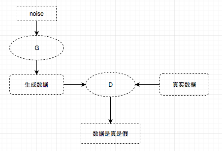
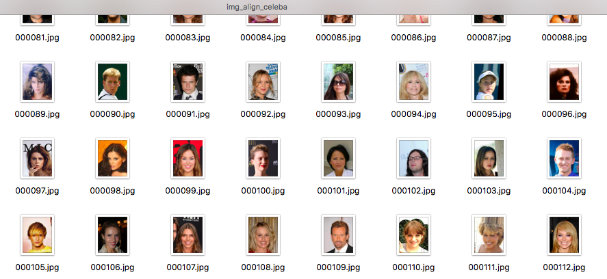
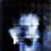

ocr识别——不定长数字串识别
===

MachineLP的Github（欢迎follow）：https://github.com/MachineLP

代码如下：

```python
#!/usr/bin/env python2
# -*- coding: utf-8 -*-
"""
tf CNN+LSTM+CTC 训练识别不定长数字字符图片
@author: liupeng
"""
from genIDCard  import *

import numpy as np
import time
import os
os.environ['TF_CPP_MIN_LOG_LEVEL']='2'
import tensorflow as tf


#定义一些常量
#图片大小，32 x 256
OUTPUT_SHAPE = (32,256)

#训练最大轮次
num_epochs = 10000

num_hidden = 64
num_layers = 1

obj = gen_id_card()

num_classes = obj.len + 1 + 1  # 10位数字 + blank + ctc blank

#初始化学习速率
INITIAL_LEARNING_RATE = 1e-3
DECAY_STEPS = 5000
REPORT_STEPS = 100
LEARNING_RATE_DECAY_FACTOR = 0.9  # The learning rate decay factor
MOMENTUM = 0.9

DIGITS='0123456789'
BATCHES = 10
BATCH_SIZE = 64
TRAIN_SIZE = BATCHES * BATCH_SIZE

def decode_sparse_tensor(sparse_tensor):
    #print("sparse_tensor = ", sparse_tensor)
    decoded_indexes = list()
    current_i = 0
    current_seq = []
    for offset, i_and_index in enumerate(sparse_tensor[0]):
        i = i_and_index[0]
        if i != current_i:
            decoded_indexes.append(current_seq)
            current_i = i
            current_seq = list()
        current_seq.append(offset)
    decoded_indexes.append(current_seq)
    #print("decoded_indexes = ", decoded_indexes)
    result = []
    for index in decoded_indexes:
        #print("index = ", index)
        result.append(decode_a_seq(index, sparse_tensor))
        #print(result)
    return result

def decode_a_seq(indexes, spars_tensor):
    decoded = []
    for m in indexes:
        str = DIGITS[spars_tensor[1][m]]
        decoded.append(str)
    # Replacing blank label to none
    #str_decoded = str_decoded.replace(chr(ord('9') + 1), '')
    # Replacing space label to space
    #str_decoded = str_decoded.replace(chr(ord('0') - 1), ' ')
    # print("ffffffff", str_decoded)
    return decoded

def report_accuracy(decoded_list, test_targets):
    original_list = decode_sparse_tensor(test_targets)
    detected_list = decode_sparse_tensor(decoded_list)
    true_numer = 0

    if len(original_list) != len(detected_list):
        print("len(original_list)", len(original_list), "len(detected_list)", len(detected_list),
              " test and detect length desn't match")
        return
    print("T/F: original(length) <-------> detectcted(length)")
    for idx, number in enumerate(original_list):
        detect_number = detected_list[idx]
        hit = (number == detect_number)
        print(hit, number, "(", len(number), ") <-------> ", detect_number, "(", len(detect_number), ")")
        if hit:
            true_numer = true_numer + 1
    print("Test Accuracy:", true_numer * 1.0 / len(original_list))

#转化一个序列列表为稀疏矩阵    
def sparse_tuple_from(sequences, dtype=np.int32):
    """
    Create a sparse representention of x.
    Args:
        sequences: a list of lists of type dtype where each element is a sequence
    Returns:
        A tuple with (indices, values, shape)
    """
    indices = []
    values = []

    for n, seq in enumerate(sequences):
        indices.extend(zip([n] * len(seq), xrange(len(seq))))
        values.extend(seq)

    indices = np.asarray(indices, dtype=np.int64)
    values = np.asarray(values, dtype=dtype)
    shape = np.asarray([len(sequences), np.asarray(indices).max(0)[1] + 1], dtype=np.int64)


    return indices, values, shape


def weight_variable(shape):
    initial = tf.truncated_normal(shape, stddev=0.5)
    return tf.Variable(initial)

def bias_variable(shape):
    initial = tf.constant(0.1, shape=shape)
    return tf.Variable(initial)

def conv2d(x, W, stride=(1, 1), padding='SAME'):
    return tf.nn.conv2d(x, W, strides=[1, stride[0], stride[1], 1],padding=padding)

def max_pool(x, ksize=(2, 2), stride=(2, 2)):
    return tf.nn.max_pool(x, ksize=[1, ksize[0], ksize[1], 1],strides=[1, stride[0], stride[1], 1], padding='SAME')

def avg_pool(x, ksize=(2, 2), stride=(2, 2)):
    return tf.nn.avg_pool(x, ksize=[1, ksize[0], ksize[1], 1],strides=[1, stride[0], stride[1], 1], padding='SAME')


# 生成一个训练batch
def get_next_batch(batch_size=128):
    obj = gen_id_card()
    #(batch_size,256,32)
    inputs = np.zeros([batch_size, OUTPUT_SHAPE[1],OUTPUT_SHAPE[0]])
    codes = []

    for i in range(batch_size):
        #生成不定长度的字串
        image, text, vec = obj.gen_image()
        #np.transpose 矩阵转置 (32*256,) => (32,256) => (256,32)
        inputs[i,:] = np.transpose(image.reshape((OUTPUT_SHAPE[0],OUTPUT_SHAPE[1])))
        codes.append(list(text))
    targets = [np.asarray(i) for i in codes]
    print targets
    sparse_targets = sparse_tuple_from(targets)
    #(batch_size,) 值都是256
    seq_len = np.ones(inputs.shape[0]) * OUTPUT_SHAPE[1]

    return inputs, sparse_targets, seq_len

#定义CNN网络，处理图片，
def convolutional_layers():
    #输入数据，shape [batch_size, max_stepsize, num_features]
    inputs = tf.placeholder(tf.float32, [None, None, OUTPUT_SHAPE[0]])

    #第一层卷积层, 32*256*1 => 16*128*48
    W_conv1 = weight_variable([5, 5, 1, 48])
    b_conv1 = bias_variable([48])
    x_expanded = tf.expand_dims(inputs, 3)
    h_conv1 = tf.nn.relu(conv2d(x_expanded, W_conv1) + b_conv1)
    h_pool1 = max_pool(h_conv1, ksize=(2, 2), stride=(2, 2))

    #第二层, 16*128*48 => 16*64*64
    W_conv2 = weight_variable([5, 5, 48, 64])
    b_conv2 = bias_variable([64])
    h_conv2 = tf.nn.relu(conv2d(h_pool1, W_conv2) + b_conv2)
    h_pool2 = max_pool(h_conv2, ksize=(2, 1), stride=(2, 1))

    #第三层, 16*64*64 => 8*32*128
    W_conv3 = weight_variable([5, 5, 64, 128])
    b_conv3 = bias_variable([128])
    h_conv3 = tf.nn.relu(conv2d(h_pool2, W_conv3) + b_conv3)
    h_pool3 = max_pool(h_conv3, ksize=(2, 2), stride=(2, 2))

    #全连接
    W_fc1 = weight_variable([16 * 8 * OUTPUT_SHAPE[1], OUTPUT_SHAPE[1]])
    b_fc1 = bias_variable([OUTPUT_SHAPE[1]])

    conv_layer_flat = tf.reshape(h_pool3, [-1, 16 * 8 * OUTPUT_SHAPE[1]])

    features = tf.nn.relu(tf.matmul(conv_layer_flat, W_fc1) + b_fc1)
    #（batchsize,256）
    shape = tf.shape(features)
    features = tf.reshape(features, [shape[0], OUTPUT_SHAPE[1], 1])  # batchsize * outputshape * 1
    return inputs,features

def get_train_model():
    #features = convolutional_layers()
    #print features.get_shape()

    inputs = tf.placeholder(tf.float32, [None, None, OUTPUT_SHAPE[0]])

    #定义ctc_loss需要的稀疏矩阵
    targets = tf.sparse_placeholder(tf.int32)

    #1维向量 序列长度 [batch_size,]
    seq_len = tf.placeholder(tf.int32, [None])

    #定义LSTM网络
    cell = tf.contrib.rnn.LSTMCell(num_hidden, state_is_tuple=True)
    stack = tf.contrib.rnn.MultiRNNCell([cell] * num_layers, state_is_tuple=True)
    outputs, _ = tf.nn.dynamic_rnn(cell, inputs, seq_len, dtype=tf.float32)

    shape = tf.shape(inputs)
    batch_s, max_timesteps = shape[0], shape[1]

    outputs = tf.reshape(outputs, [-1, num_hidden])
    W = tf.Variable(tf.truncated_normal([num_hidden,
                                          num_classes],
                                         stddev=0.1), name="W")
    b = tf.Variable(tf.constant(0., shape=[num_classes]), name="b")

    logits = tf.matmul(outputs, W) + b

    logits = tf.reshape(logits, [batch_s, -1, num_classes])

    logits = tf.transpose(logits, (1, 0, 2))

    return logits, inputs, targets, seq_len, W, b

def train():
    global_step = tf.Variable(0, trainable=False)
    learning_rate = tf.train.exponential_decay(INITIAL_LEARNING_RATE,
                                                global_step,
                                                DECAY_STEPS,
                                                LEARNING_RATE_DECAY_FACTOR,
                                                staircase=True)
    logits, inputs, targets, seq_len, W, b = get_train_model()

    loss = tf.nn.ctc_loss(labels=targets,inputs=logits, sequence_length=seq_len)
    cost = tf.reduce_mean(loss)

    #optimizer = tf.train.MomentumOptimizer(learning_rate=learning_rate,momentum=MOMENTUM).minimize(cost, global_step=global_step)
    optimizer = tf.train.AdamOptimizer(learning_rate=learning_rate).minimize(loss,global_step=global_step)
    decoded, log_prob = tf.nn.ctc_beam_search_decoder(logits, seq_len, merge_repeated=False)

    acc = tf.reduce_mean(tf.edit_distance(tf.cast(decoded[0], tf.int32), targets))

    init = tf.global_variables_initializer()

    def do_report():
        test_inputs,test_targets,test_seq_len = get_next_batch(BATCH_SIZE)
        test_feed = {inputs: test_inputs,
                     targets: test_targets,
                     seq_len: test_seq_len}
        dd, log_probs, accuracy = session.run([decoded[0], log_prob, acc], test_feed)
        report_accuracy(dd, test_targets)
        # decoded_list = decode_sparse_tensor(dd)

    def do_batch():
        train_inputs, train_targets, train_seq_len = get_next_batch(BATCH_SIZE)

        feed = {inputs: train_inputs, targets: train_targets, seq_len: train_seq_len}

        b_loss,b_targets, b_logits, b_seq_len,b_cost, steps, _ = session.run([loss, targets, logits, seq_len, cost, global_step, optimizer], feed)

        #print b_loss
        #print b_targets, b_logits, b_seq_len
        print b_cost, steps
        if steps > 0 and steps % REPORT_STEPS == 0:
            do_report()
            #save_path = saver.save(session, "ocr.model", global_step=steps)
            # print(save_path)
        return b_cost, steps

    with tf.Session() as session:
        session.run(init)
        saver = tf.train.Saver(tf.global_variables(), max_to_keep=100)
        for curr_epoch in xrange(num_epochs):
            print("Epoch.......", curr_epoch)
            train_cost = train_ler = 0
            for batch in xrange(BATCHES):
                start = time.time()
                c, steps = do_batch()
                train_cost += c * BATCH_SIZE
                seconds = time.time() - start
                print("Step:", steps, ", batch seconds:", seconds)

            train_cost /= TRAIN_SIZE

            train_inputs, train_targets, train_seq_len = get_next_batch(BATCH_SIZE)
            val_feed = {inputs: train_inputs,
                        targets: train_targets,
                        seq_len: train_seq_len}

            val_cost, val_ler, lr, steps = session.run([cost, acc, learning_rate, global_step], feed_dict=val_feed)

            log = "Epoch {}/{}, steps = {}, train_cost = {:.3f}, train_ler = {:.3f}, val_cost = {:.3f}, val_ler = {:.3f}, time = {:.3f}s, learning_rate = {}"
            print(log.format(curr_epoch + 1, num_epochs, steps, train_cost, train_ler, val_cost, val_ler, time.time() - start, lr))

if __name__ == '__main__':
    # inputs, sparse_targets,seq_len = get_next_batch(2)
    # decode_sparse_tensor(sparse_targets);
    train()

```

迭代700次，准确率已经为100%，以后都是100%。


下面代码时输入时不定宽度图片的代码：

```python

#!/usr/bin/env python2
# -*- coding: utf-8 -*-
"""
tf CNN+LSTM+CTC 训练识别不定长数字字符图片
@author: pengyuanjie
"""
from genIDCard  import *

import numpy as np
import time
import os
os.environ['TF_CPP_MIN_LOG_LEVEL']='2'
import tensorflow as tf
import cv2


#定义一些常量
#图片大小，32 x 256
OUTPUT_SHAPE = (32,256)

#训练最大轮次
num_epochs = 10000

num_hidden = 64
num_layers = 1

obj = gen_id_card()

num_classes = obj.len + 1 + 1  # 10位数字 + blank + ctc blank

#初始化学习速率
INITIAL_LEARNING_RATE = 1e-3
DECAY_STEPS = 5000
REPORT_STEPS = 100
LEARNING_RATE_DECAY_FACTOR = 0.9  # The learning rate decay factor
MOMENTUM = 0.9

DIGITS='0123456789'
BATCHES = 10
BATCH_SIZE = 64
TRAIN_SIZE = BATCHES * BATCH_SIZE

def decode_sparse_tensor(sparse_tensor):
    #print("sparse_tensor = ", sparse_tensor)
    decoded_indexes = list()
    current_i = 0
    current_seq = []
    for offset, i_and_index in enumerate(sparse_tensor[0]):
        i = i_and_index[0]
        if i != current_i:
            decoded_indexes.append(current_seq)
            current_i = i
            current_seq = list()
        current_seq.append(offset)
    decoded_indexes.append(current_seq)
    #print("decoded_indexes = ", decoded_indexes)
    result = []
    for index in decoded_indexes:
        #print("index = ", index)
        result.append(decode_a_seq(index, sparse_tensor))
        #print(result)
    return result

def decode_a_seq(indexes, spars_tensor):
    decoded = []
    for m in indexes:
        str = DIGITS[spars_tensor[1][m]]
        decoded.append(str)
    # Replacing blank label to none
    #str_decoded = str_decoded.replace(chr(ord('9') + 1), '')
    # Replacing space label to space
    #str_decoded = str_decoded.replace(chr(ord('0') - 1), ' ')
    # print("ffffffff", str_decoded)
    return decoded

def report_accuracy(decoded_list, test_targets):
    original_list = decode_sparse_tensor(test_targets)
    detected_list = decode_sparse_tensor(decoded_list)
    true_numer = 0

    if len(original_list) != len(detected_list):
        print("len(original_list)", len(original_list), "len(detected_list)", len(detected_list),
              " test and detect length desn't match")
        return
    print("T/F: original(length) <-------> detectcted(length)")
    for idx, number in enumerate(original_list):
        detect_number = detected_list[idx]
        hit = (number == detect_number)
        print(hit, number, "(", len(number), ") <-------> ", detect_number, "(", len(detect_number), ")")
        if hit:
            true_numer = true_numer + 1
    print("Test Accuracy:", true_numer * 1.0 / len(original_list))

#转化一个序列列表为稀疏矩阵    
def sparse_tuple_from(sequences, dtype=np.int32):
    """
    Create a sparse representention of x.
    Args:
        sequences: a list of lists of type dtype where each element is a sequence
    Returns:
        A tuple with (indices, values, shape)
    """
    indices = []
    values = []

    for n, seq in enumerate(sequences):
        indices.extend(zip([n] * len(seq), xrange(len(seq))))
        values.extend(seq)

    indices = np.asarray(indices, dtype=np.int64)
    values = np.asarray(values, dtype=dtype)
    shape = np.asarray([len(sequences), np.asarray(indices).max(0)[1] + 1], dtype=np.int64)


    return indices, values, shape


def weight_variable(shape):
    initial = tf.truncated_normal(shape, stddev=0.5)
    return tf.Variable(initial)

def bias_variable(shape):
    initial = tf.constant(0.1, shape=shape)
    return tf.Variable(initial)

def conv2d(x, W, stride=(1, 1), padding='SAME'):
    return tf.nn.conv2d(x, W, strides=[1, stride[0], stride[1], 1],padding=padding)

def max_pool(x, ksize=(2, 2), stride=(2, 2)):
    return tf.nn.max_pool(x, ksize=[1, ksize[0], ksize[1], 1],strides=[1, stride[0], stride[1], 1], padding='SAME')

def avg_pool(x, ksize=(2, 2), stride=(2, 2)):
    return tf.nn.avg_pool(x, ksize=[1, ksize[0], ksize[1], 1],strides=[1, stride[0], stride[1], 1], padding='SAME')


# 生成一个训练batch
def get_next_batch(batch_size=128, kk=0):
    obj = gen_id_card()
    #(batch_size,256,32)
    inputs = np.zeros([batch_size, OUTPUT_SHAPE[1]+kk,OUTPUT_SHAPE[0]])
    codes = []

    for i in range(batch_size):
        #生成不定长度的字串
        image, text, vec = obj.gen_image()
        image = cv2.resize(image,(OUTPUT_SHAPE[1]+kk, OUTPUT_SHAPE[0]))
        #np.transpose 矩阵转置 (32*256,) => (32,256) => (256,32)
        inputs[i,:] = np.transpose(image.reshape((OUTPUT_SHAPE[0],OUTPUT_SHAPE[1]+kk)))
        codes.append(list(text))
    targets = [np.asarray(i) for i in codes]
    #print targets
    sparse_targets = sparse_tuple_from(targets)
    print (sparse_targets)
    #(batch_size,) 值都是256
    seq_len = np.ones(inputs.shape[0]) * (OUTPUT_SHAPE[1]+kk)
    print ('seq_len:', seq_len)
    return inputs, sparse_targets, seq_len

#定义CNN网络，处理图片，
def convolutional_layers():
    #输入数据，shape [batch_size, max_stepsize, num_features]
    inputs = tf.placeholder(tf.float32, [None, None, OUTPUT_SHAPE[0]])

    #第一层卷积层, 32*256*1 => 16*128*48
    W_conv1 = weight_variable([5, 5, 1, 48])
    b_conv1 = bias_variable([48])
    x_expanded = tf.expand_dims(inputs, 3)
    h_conv1 = tf.nn.relu(conv2d(x_expanded, W_conv1) + b_conv1)
    h_pool1 = max_pool(h_conv1, ksize=(2, 2), stride=(2, 2))

    #第二层, 16*128*48 => 16*64*64
    W_conv2 = weight_variable([5, 5, 48, 64])
    b_conv2 = bias_variable([64])
    h_conv2 = tf.nn.relu(conv2d(h_pool1, W_conv2) + b_conv2)
    h_pool2 = max_pool(h_conv2, ksize=(2, 1), stride=(2, 1))

    #第三层, 16*64*64 => 8*32*128
    W_conv3 = weight_variable([5, 5, 64, 128])
    b_conv3 = bias_variable([128])
    h_conv3 = tf.nn.relu(conv2d(h_pool2, W_conv3) + b_conv3)
    h_pool3 = max_pool(h_conv3, ksize=(2, 2), stride=(2, 2))

    #全连接
    W_fc1 = weight_variable([16 * 8 * OUTPUT_SHAPE[1], OUTPUT_SHAPE[1]])
    b_fc1 = bias_variable([OUTPUT_SHAPE[1]])

    conv_layer_flat = tf.reshape(h_pool3, [-1, 16 * 8 * OUTPUT_SHAPE[1]])

    features = tf.nn.relu(tf.matmul(conv_layer_flat, W_fc1) + b_fc1)
    #（batchsize,256）
    shape = tf.shape(features)
    features = tf.reshape(features, [shape[0], OUTPUT_SHAPE[1], 1])  # batchsize * outputshape * 1
    return inputs,features

def get_train_model():
    #features = convolutional_layers()
    #print features.get_shape()

    inputs = tf.placeholder(tf.float32, [None, None, OUTPUT_SHAPE[0]])

    #定义ctc_loss需要的稀疏矩阵
    targets = tf.sparse_placeholder(tf.int32)

    #1维向量 序列长度 [batch_size,]
    seq_len = tf.placeholder(tf.int32, [None])

    #定义LSTM网络
    cell = tf.contrib.rnn.LSTMCell(num_hidden, state_is_tuple=True)
    stack = tf.contrib.rnn.MultiRNNCell([cell] * num_layers, state_is_tuple=True)
    outputs, _ = tf.nn.dynamic_rnn(cell, inputs, seq_len, dtype=tf.float32)

    shape = tf.shape(inputs)
    batch_s, max_timesteps = shape[0], shape[1]

    outputs = tf.reshape(outputs, [-1, num_hidden])
    W = tf.Variable(tf.truncated_normal([num_hidden,
                                          num_classes],
                                         stddev=0.1), name="W")
    b = tf.Variable(tf.constant(0., shape=[num_classes]), name="b")

    logits = tf.matmul(outputs, W) + b

    logits = tf.reshape(logits, [batch_s, -1, num_classes])

    logits = tf.transpose(logits, (1, 0, 2))

    return logits, inputs, targets, seq_len, W, b

def train():
    global_step = tf.Variable(0, trainable=False)
    learning_rate = tf.train.exponential_decay(INITIAL_LEARNING_RATE,
                                                global_step,
                                                DECAY_STEPS,
                                                LEARNING_RATE_DECAY_FACTOR,
                                                staircase=True)
    logits, inputs, targets, seq_len, W, b = get_train_model()

    loss = tf.nn.ctc_loss(labels=targets,inputs=logits, sequence_length=seq_len)
    cost = tf.reduce_mean(loss)

    #optimizer = tf.train.MomentumOptimizer(learning_rate=learning_rate,momentum=MOMENTUM).minimize(cost, global_step=global_step)
    optimizer = tf.train.AdamOptimizer(learning_rate=learning_rate).minimize(loss,global_step=global_step)
    decoded, log_prob = tf.nn.ctc_beam_search_decoder(logits, seq_len, merge_repeated=False)

    acc = tf.reduce_mean(tf.edit_distance(tf.cast(decoded[0], tf.int32), targets))

    init = tf.global_variables_initializer()

    def do_report(kk):
        test_inputs,test_targets,test_seq_len = get_next_batch(BATCH_SIZE, kk)
        test_feed = {inputs: test_inputs,
                     targets: test_targets,
                     seq_len: test_seq_len}
        dd, log_probs, accuracy = session.run([decoded[0], log_prob, acc], test_feed)
        report_accuracy(dd, test_targets)
        # decoded_list = decode_sparse_tensor(dd)

    def do_batch(kk):
        train_inputs, train_targets, train_seq_len = get_next_batch(BATCH_SIZE, kk)

        feed = {inputs: train_inputs, targets: train_targets, seq_len: train_seq_len}

        b_loss,b_targets, b_logits, b_seq_len,b_cost, steps, _ = session.run([loss, targets, logits, seq_len, cost, global_step, optimizer], feed)

        #print b_loss
        #print b_targets, b_logits, b_seq_len
        print b_cost, steps
        if steps > 0 and steps % REPORT_STEPS == 0:
            do_report(kk)
            #save_path = saver.save(session, "ocr.model", global_step=steps)
            # print(save_path)
        return b_cost, steps

    with tf.Session() as session:
        session.run(init)
        saver = tf.train.Saver(tf.global_variables(), max_to_keep=100)
        for curr_epoch in xrange(num_epochs):
            print("Epoch.......", curr_epoch)
            train_cost = train_ler = 0
            for batch in xrange(BATCHES):
                start = time.time()
                c, steps = do_batch(batch*20)
                train_cost += c * BATCH_SIZE
                seconds = time.time() - start
                print("Step:", steps, ", batch seconds:", seconds)

            train_cost /= TRAIN_SIZE

            train_inputs, train_targets, train_seq_len = get_next_batch(BATCH_SIZE, curr_epoch*50)
            val_feed = {inputs: train_inputs,
                        targets: train_targets,
                        seq_len: train_seq_len}

            val_cost, val_ler, lr, steps = session.run([cost, acc, learning_rate, global_step], feed_dict=val_feed)

            log = "Epoch {}/{}, steps = {}, train_cost = {:.3f}, train_ler = {:.3f}, val_cost = {:.3f}, val_ler = {:.3f}, time = {:.3f}s, learning_rate = {}"
            print(log.format(curr_epoch + 1, num_epochs, steps, train_cost, train_ler, val_cost, val_ler, time.time() - start, lr))

if __name__ == '__main__':
    #inputs, sparse_targets,seq_len = get_next_batch(2)
    #decode_sparse_tensor(sparse_targets);
    train()

```

“恶作剧” --人脸检测
===


前面有一个帖《OpenCV检测场景内是否有移动物体 http://blog.topspeedsnail.com/archives/10797》我用树莓派做了一个简单的Motion Detection，放在卫生间的，它会在我上大号时自动播放音乐。

我一个人租房，几个盆友周末时常会找我玩，他们觉得我做的Motion Detection很垃圾。于是我就想恶搞一下，用TensorFlow做一个“人脸识别”，在我上大号时播放音乐，如果是别人就播放《张震讲鬼故事》（@xingCI说放屁声更搞）。

我的任务的训练一个模型可以区分“我”和“其它人”的脸。注意，上面“人脸识别”我是加引号的，其实并不是真正的人脸识别，充其量就是个图像分类。如果你要使用真正的人脸识别，可以试试现成的库OpenFace+dlib《使用OpenFace进行人脸识别 http://blog.topspeedsnail.com/archives/10933》。

有人已经把TensorFlow移植到了树莓派，项目地址tensorflow-on-raspberry-pi https://github.com/samjabrahams/tensorflow-on-raspberry-pi。

准备数据
---

本帖需要使用到两组数据：一组是包含我脸的图像，另一组包含其它人人脸的图像。

其它人人脸的收集
---

找一堆图片，只要不包含自己就行，然后使用OpenCV提取图像中的大脸。

提取图像中的人脸，我使用OpenCV，据说使用dlib效果更好。

other_peoples_faces.py：


```python

import cv2
import os
import sys

IMAGE_DIR = '图片目录路径'

OUTPUT_DIR = './other_people'
if not os.path.exists(OUTPUT_DIR):
	os.makedirs(OUTPUT_DIR)

# http://blog.topspeedsnail.com/archives/10511
# wget https://raw.githubusercontent.com/opencv/opencv/master/data/haarcascades/haarcascade_frontalface_default.xml
face_haar = cv2.CascadeClassifier("haarcascade_frontalface_default.xml")

for (dirpath, dirnames, filenames) in os.walk(IMAGE_DIR):
	for filename in filenames:
		if filename.endswith('.jpg'):
			image_path = os.path.join(dirpath, filename)
			print('process: ', image_path)
			img = cv2.imread(image_path)

			gray_image = cv2.cvtColor(img, cv2.COLOR_BGR2GRAY)
			faces = face_haar.detectMultiScale(gray_image, 1.3, 5)
			for face_x,face_y,face_w,face_h in faces:
				face = img[face_y:face_y+face_h, face_x:face_x+face_w]

				face = cv2.resize(face, (64, 64))

				cv2.imshow("img", face)
				cv2.imwrite(os.path.join(OUTPUT_DIR, filename), face)

			key = cv2.waitKey(30) & 0xff
			if key == 27:
				sys.exit(0)
```

4万多图片，我只提取了1万张脸，应该够使了。图像大小 64×64

上面是OpenCV做的人脸检测，有了这个数据集又可以反过来训练TensorFlow版本的人脸检测。

给自己拍照1万张，这是我一次拍照最多的一回。

```python

import cv2
import os
import sys

OUTPUT_DIR = './my_faces'
if not os.path.exists(OUTPUT_DIR):
	os.makedirs(OUTPUT_DIR)

face_haar = cv2.CascadeClassifier("haarcascade_frontalface_default.xml")

cam = cv2.VideoCapture(0)

count = 0
while True:
	print(count)
	if count < 10000:
		_, img = cam.read()

		gray_image = cv2.cvtColor(img, cv2.COLOR_BGR2GRAY)
		faces = face_haar.detectMultiScale(gray_image, 1.3, 5)
		for face_x,face_y,face_w,face_h in faces:
			face = img[face_y:face_y+face_h, face_x:face_x+face_w]

			face = cv2.resize(face, (64, 64))
			cv2.imshow('img', face)
			cv2.imwrite(os.path.join(OUTPUT_DIR, str(count)+'.jpg'), face)
			count += 1
		key = cv2.waitKey(30) & 0xff
		if key == 27:
			break
	else:
		break

```

在镜头前摇头晃脑、摆pose，戴眼镜、耳机，仰天45，写代码，呲牙咧嘴，玩手机。。。一定要多样化，直到拍1万张大脸。

训练模型

训练数据有了，下面开始训练。

```python
import tensorflow as tf
import cv2
import numpy as np
import os
from sklearn.model_selection import train_test_split
import random
import sys

my_image_path = 'my_faces'
others_image_path = 'other_people'

image_data = []
label_data = []

def get_padding_size(image):
	h, w, _ = image.shape
	longest_edge = max(h, w)
	top, bottom, left, right = (0, 0, 0, 0)
	if h < longest_edge:
		dh = longest_edge - h
		top = dh // 2
		bottom = dh - top
	elif w < longest_edge:
		dw = longest_edge - w
		left = dw // 2
		right = dw - left
	else:
		pass
	return top, bottom, left, right

def read_data(img_path, image_h=64, image_w=64):
	for filename in os.listdir(img_path):
		if filename.endswith('.jpg'):
			filepath = os.path.join(img_path, filename)
			image = cv2.imread(filepath)

			top, bottom, left, right = get_padding_size(image)
			image_pad = cv2.copyMakeBorder(image, top , bottom, left, right, cv2.BORDER_CONSTANT, value=[0, 0, 0])
			image = cv2.resize(image_pad, (image_h, image_w))

			image_data.append(image)
			label_data.append(img_path)

read_data(others_image_path)
read_data(my_image_path)

image_data = np.array(image_data)
label_data = np.array([[0,1] if label == 'my_faces' else [1,0] for label in label_data])

train_x, test_x, train_y, test_y = train_test_split(image_data, label_data, test_size=0.05, random_state=random.randint(0, 100))

# image (height=64 width=64 channel=3)
train_x = train_x.reshape(train_x.shape[0], 64, 64, 3)
test_x = test_x.reshape(test_x.shape[0], 64, 64, 3)

# nomalize
train_x = train_x.astype('float32') / 255.0
test_x = test_x.astype('float32') / 255.0

print(len(train_x), len(train_y))
print(len(test_x), len(test_y))

#############################################################
batch_size = 128
num_batch = len(train_x) // batch_size

X = tf.placeholder(tf.float32, [None, 64, 64, 3])  # 图片大小64x64 channel=3
Y = tf.placeholder(tf.float32, [None, 2])

keep_prob_5 = tf.placeholder(tf.float32)
keep_prob_75 = tf.placeholder(tf.float32)

def panda_joke_cnn():

	W_c1 = tf.Variable(tf.random_normal([3, 3, 3, 32], stddev=0.01))
	b_c1 = tf.Variable(tf.random_normal([32]))
	conv1 = tf.nn.relu(tf.nn.bias_add(tf.nn.conv2d(X, W_c1, strides=[1, 1, 1, 1], padding='SAME'), b_c1))
	conv1 = tf.nn.max_pool(conv1, ksize=[1, 2, 2, 1], strides=[1, 2, 2, 1], padding='SAME')
	conv1 = tf.nn.dropout(conv1, keep_prob_5)

	W_c2 = tf.Variable(tf.random_normal([3, 3, 32, 64], stddev=0.01))
	b_c2 = tf.Variable(tf.random_normal([64]))
	conv2 = tf.nn.relu(tf.nn.bias_add(tf.nn.conv2d(conv1, W_c2, strides=[1, 1, 1, 1], padding='SAME'), b_c2))
	conv2 = tf.nn.max_pool(conv2, ksize=[1, 2, 2, 1], strides=[1, 2, 2, 1], padding='SAME')
	conv2 = tf.nn.dropout(conv2, keep_prob_5)

	W_c3 = tf.Variable(tf.random_normal([3, 3, 64, 64], stddev=0.01))
	b_c3 = tf.Variable(tf.random_normal([64]))
	conv3 = tf.nn.relu(tf.nn.bias_add(tf.nn.conv2d(conv2, W_c3, strides=[1, 1, 1, 1], padding='SAME'), b_c3))
	conv3 = tf.nn.max_pool(conv3, ksize=[1, 2, 2, 1], strides=[1, 2, 2, 1], padding='SAME')
	conv3 = tf.nn.dropout(conv3, keep_prob_5)

	# Fully connected layer
	W_d = tf.Variable(tf.random_normal([8*16*32, 512], stddev=0.01))
	b_d = tf.Variable(tf.random_normal([512]))
	dense = tf.reshape(conv3, [-1, W_d.get_shape().as_list()[0]])
	dense = tf.nn.relu(tf.add(tf.matmul(dense, W_d), b_d))
	dense = tf.nn.dropout(dense, keep_prob_75)

	W_out = tf.Variable(tf.random_normal([512, 2], stddev=0.01))
	b_out = tf.Variable(tf.random_normal([2]))
	out = tf.add(tf.matmul(dense, W_out), b_out)
	return out

def train_cnn():
	output = panda_joke_cnn()

	loss = tf.reduce_mean(tf.nn.softmax_cross_entropy_with_logits(output, Y))
	optimizer = tf.train.AdamOptimizer(learning_rate=0.001).minimize(loss)

	accuracy = tf.reduce_mean(tf.cast(tf.equal(tf.argmax(output, 1), tf.argmax(Y, 1)), tf.float32))

	tf.summary.scalar("loss", loss)
	tf.summary.scalar("accuracy", accuracy)
	merged_summary_op = tf.summary.merge_all()

	saver = tf.train.Saver()
	with tf.Session() as sess:
		sess.run(tf.global_variables_initializer())

		summary_writer = tf.summary.FileWriter('./log', graph=tf.get_default_graph())

		for e in range(50):
			for i in range(num_batch):
				batch_x = train_x[i*batch_size : (i+1)*batch_size]
				batch_y = train_y[i*batch_size : (i+1)*batch_size]
				_, loss_, summary = sess.run([optimizer, loss, merged_summary_op], feed_dict={X: batch_x, Y: batch_y, keep_prob_5:0.5, keep_prob_75: 0.75})

				summary_writer.add_summary(summary, e*num_batch+i)
				print(e*num_batch+i, loss_)

				if (e*num_batch+i) % 100 == 0:
					acc = accuracy.eval({X: test_x, Y: test_y, keep_prob_5:1.0, keep_prob_75: 1.0})
					print(e*num_batch+i, acc)
					# save model
					if acc > 0.98:
						saver.save(sess, "i_am_a_joke.model", global_step=e*num_batch+i)
						sys.exit(0)

train_cnn()

```


面要做的就是在树莓派上使用模型，代码示例：


```python

output = panda_joke_cnn()
predict = tf.argmax(output, 1)

saver = tf.train.Saver()
sess = tf.Session()
saver.restore(sess, tf.train.latest_checkpoint('.'))

def is_my_face(image):
	res = sess.run(predict, feed_dict={X: [image/255.0], keep_prob_5:1.0, keep_prob_75: 1.0})
	if res[0] == 1:
		return True
	else:
		return False

face_haar = cv2.CascadeClassifier("haarcascade_frontalface_default.xml")
cam = cv2.VideoCapture(0)

while True:
	_, img = cam.read()
	gray_image = cv2.cvtColor(img, cv2.COLOR_BGR2GRAY)
	faces = face_haar.detectMultiScale(gray_image, 1.3, 5)
	for face_x,face_y,face_w,face_h in faces:
		face = img[face_y:face_y+face_h, face_x:face_x+face_w]

		face = cv2.resize(face, (64, 64))

		print(is_my_face(face))

		cv2.imshow('img', face)
		key = cv2.waitKey(30) & 0xff
		if key == 27:
			sys.exit(0)

sess.close()


```

总结：占用内存100多M，准确率还凑合，先用着。


GANs—生成明星脸
===

GANs是Generative Adversarial Networks的简写，中文翻译为生成对抗网络，它最早出现在2014年Goodfellow发表的论文中：Generative Adversarial Networks https://arxiv.org/abs/1406.2661。GANs是目前深度学习领域最火的网络模型，苹果最近发布的第一篇论文就是关于GANs的：SimGAN。

简单来说，GANs会学着生成和训练数据相似的数据，一个最典型的应用是生成图像。假设你有一堆猫的图片，你使用这些图片训练GANs，之后它会生成和训练数据相类似的猫的图片（它习的了猫的特征）。

GANs用到机器学习的两种模型：Generative生成模型和Discriminative判别模型。

GANs类比：假设G是大伪艺术家，以制作古董赝品为生，G的终极目标是以假乱真。但是呢，又有一些人以鉴宝为生（D）。开始你给D展示了一些古董真品，告诉D这是正品。然后G开始制作赝品，想骗过D，让他分辨不出真假。随着D看到越来越多的真品，G要骗过D就越来越难，当然，G也不是吃闲饭的，它会加倍努力的试图骗过D。随着这种对抗的持续，不仅D鉴宝的本领提高了，G也会越来越擅长制作赝品。这就是名字中生成-对抗的意思。

判别模型可以判断数据属于哪一类，例如<TensorFlow练习23: 恶作剧>训练的CNN模型可以判断一张脸是不是我的脸。相反，生成模型不用预先知道分类，它可生成最符合训练样本分布的新样本。例如高斯混合模型，经过训练，它生成的随机数据符合训练样本的分布。

GANs简单图示：
---



GAN相关代码实现：
---

* DCGAN TensorFlow实现 https://github.com/carpedm20/DCGAN-tensorflow

* 根据文本描述生成图像 https://github.com/paarthneekhara/text-to-image（反过来的: 看图说话Show and Tell https://github.com/tensorflow/models/tree/master/im2txt）

* 图像补全，叫你在打码 https://github.com/bamos/dcgan-completion.tensorflow

* TF-VAE-GAN-DRAW https://github.com/ikostrikov/TensorFlow-VAE-GAN-DRAW

* Auxiliary Classifier GAN https://github.com/buriburisuri/ac-gan

* InfoGAN时间序列数据分类 https://github.com/buriburisuri/timeseries_gan

* 生成视频 https://github.com/cvondrick/videogan

* Generative Models (OpenAI) https://openai.com/blog/generative-models/

一个TensorFlow代码示例（生成明星脸-EBGAN）

使用的数据集：Large-scale CelebFaces Attributes (CelebA) Dataset http://mmlab.ie.cuhk.edu.hk/projects/CelebA.html，这个数据集包含20万明星脸，可用来做人脸检测、人脸特征识别等等任务。

下载地址：Google Drive https://drive.google.com/open?id=0B7EVK8r0v71pWEZsZE9oNnFzTm8 或Baidu云 http://pan.baidu.com/s/1eSNpdRG。




* Energy Based Generative Adversarial Networks (EBGAN) https://arxiv.org/pdf/1609.03126v2.pdf

代码：

```python
# -*- coding: utf-8 -*-
"""
Energy Based Generative Adversarial Networks (EBGAN): https://arxiv.org/pdf/1609.03126v2.pdf
<blog.topspeedsnail.com>
由于我把Python升级到了3.6破坏了开发环境, 暂时先使用Python 2.7
"""
import os
import random
import numpy as np
import tensorflow as tf
import cv2
import scipy.misc as misc

CELEBA_DATE_DIR= 'img_align_celeba'

train_images = []
for image_filename in os.listdir(CELEBA_DATE_DIR):
	if image_filename.endswith('.jpg'):
		train_images.append(os.path.join(CELEBA_DATE_DIR, image_filename))

random.shuffle(train_images)

batch_size = 64
num_batch = len(train_images) // batch_size

# 图像大小和channel
IMAGE_SIZE = 64
IMAGE_CHANNEL = 3

def get_next_batch(pointer):
	image_batch = []
	images = train_images[pointer*batch_size:(pointer+1)*batch_size]
	for img in images:
		image = cv2.imread(img)
		image = cv2.resize(image, (IMAGE_SIZE, IMAGE_SIZE))
		image = image.astype('float32') / 127.5 - 1
		image_batch.append(image)
	return image_batch

# noise
z_dim = 100
noise = tf.placeholder(tf.float32, [None, z_dim], name='noise')

X = tf.placeholder(tf.float32, [batch_size, IMAGE_SIZE, IMAGE_SIZE, IMAGE_CHANNEL], name='X')
# 是否在训练阶段
train_phase = tf.placeholder(tf.bool)

# http://stackoverflow.com/a/34634291/2267819
def batch_norm(x, beta, gamma, phase_train, scope='bn', decay=0.9, eps=1e-5):
	with tf.variable_scope(scope):
		#beta = tf.get_variable(name='beta', shape=[n_out], initializer=tf.constant_initializer(0.0), trainable=True)
		#gamma = tf.get_variable(name='gamma', shape=[n_out], initializer=tf.random_normal_initializer(1.0, stddev), trainable=True)
		batch_mean, batch_var = tf.nn.moments(x, [0, 1, 2], name='moments')
		ema = tf.train.ExponentialMovingAverage(decay=decay)

		def mean_var_with_update():
			ema_apply_op = ema.apply([batch_mean, batch_var])
			with tf.control_dependencies([ema_apply_op]):
				return tf.identity(batch_mean), tf.identity(batch_var)

		mean, var = tf.cond(phase_train, mean_var_with_update, lambda: (ema.average(batch_mean), ema.average(batch_var)))
		normed = tf.nn.batch_normalization(x, mean, var, beta, gamma, eps)
	return normed

# 重用变量出了点问题, 先用dict
generator_variables_dict = {
	"W_1": tf.Variable(tf.truncated_normal([z_dim, 2 * IMAGE_SIZE * IMAGE_SIZE], stddev=0.02), name='Generator/W_1'),
	"b_1": tf.Variable(tf.constant(0.0, shape=[2 * IMAGE_SIZE * IMAGE_SIZE]), name='Generator/b_1'),
	'beta_1': tf.Variable(tf.constant(0.0, shape=[512]), name='Generator/beta_1'),
	'gamma_1': tf.Variable(tf.random_normal(shape=[512], mean=1.0, stddev=0.02), name='Generator/gamma_1'),

	"W_2": tf.Variable(tf.truncated_normal([5, 5, 256, 512], stddev=0.02), name='Generator/W_2'),
	"b_2": tf.Variable(tf.constant(0.0, shape=[256]), name='Generator/b_2'),
	'beta_2': tf.Variable(tf.constant(0.0, shape=[256]), name='Generator/beta_2'),
	'gamma_2': tf.Variable(tf.random_normal(shape=[256], mean=1.0, stddev=0.02), name='Generator/gamma_2'),

	"W_3": tf.Variable(tf.truncated_normal([5, 5, 128, 256], stddev=0.02), name='Generator/W_3'),
	"b_3": tf.Variable(tf.constant(0.0, shape=[128]), name='Generator/b_3'),
	'beta_3': tf.Variable(tf.constant(0.0, shape=[128]), name='Generator/beta_3'),
	'gamma_3': tf.Variable(tf.random_normal(shape=[128], mean=1.0, stddev=0.02), name='Generator/gamma_3'),

	"W_4": tf.Variable(tf.truncated_normal([5, 5, 64, 128], stddev=0.02), name='Generator/W_4'),
	"b_4": tf.Variable(tf.constant(0.0, shape=[64]), name='Generator/b_4'),
	'beta_4': tf.Variable(tf.constant(0.0, shape=[64]), name='Generator/beta_4'),
	'gamma_4': tf.Variable(tf.random_normal(shape=[64], mean=1.0, stddev=0.02), name='Generator/gamma_4'),

	"W_5": tf.Variable(tf.truncated_normal([5, 5, IMAGE_CHANNEL, 64], stddev=0.02), name='Generator/W_5'),
	"b_5": tf.Variable(tf.constant(0.0, shape=[IMAGE_CHANNEL]), name='Generator/b_5')
}
# Generator
def generator(noise):
	with tf.variable_scope("Generator"):
		out_1 = tf.matmul(noise, generator_variables_dict["W_1"]) + generator_variables_dict['b_1']
		out_1 = tf.reshape(out_1, [-1, IMAGE_SIZE//16, IMAGE_SIZE//16, 512])
		out_1 = batch_norm(out_1, generator_variables_dict["beta_1"], generator_variables_dict["gamma_1"], train_phase, scope='bn_1')
		out_1 = tf.nn.relu(out_1, name='relu_1')

		out_2 = tf.nn.conv2d_transpose(out_1, generator_variables_dict['W_2'],  output_shape=tf.pack([tf.shape(out_1)[0], IMAGE_SIZE//8, IMAGE_SIZE//8, 256]), strides=[1, 2, 2, 1], padding='SAME')
		out_2 = tf.nn.bias_add(out_2, generator_variables_dict['b_2'])
		out_2 = batch_norm(out_2, generator_variables_dict["beta_2"], generator_variables_dict["gamma_2"], train_phase, scope='bn_2')
		out_2 = tf.nn.relu(out_2, name='relu_2')

		out_3 = tf.nn.conv2d_transpose(out_2, generator_variables_dict['W_3'],  output_shape=tf.pack([tf.shape(out_2)[0], IMAGE_SIZE//4, IMAGE_SIZE//4, 128]), strides=[1, 2, 2, 1], padding='SAME')
		out_3 = tf.nn.bias_add(out_3, generator_variables_dict['b_3'])
		out_3 = batch_norm(out_3, generator_variables_dict["beta_3"], generator_variables_dict["gamma_3"], train_phase, scope='bn_3')
		out_3 = tf.nn.relu(out_3, name='relu_3')

		out_4 = tf.nn.conv2d_transpose(out_3, generator_variables_dict['W_4'],  output_shape=tf.pack([tf.shape(out_3)[0], IMAGE_SIZE//2, IMAGE_SIZE//2, 64]), strides=[1, 2, 2, 1], padding='SAME')
		out_4 = tf.nn.bias_add(out_4, generator_variables_dict['b_4'])
		out_4 = batch_norm(out_4, generator_variables_dict["beta_4"], generator_variables_dict["gamma_4"], train_phase, scope='bn_4')
		out_4 = tf.nn.relu(out_4, name='relu_4')

		out_5 = tf.nn.conv2d_transpose(out_4, generator_variables_dict['W_5'],  output_shape=tf.pack([tf.shape(out_4)[0], IMAGE_SIZE, IMAGE_SIZE, IMAGE_CHANNEL]), strides=[1, 2, 2, 1], padding='SAME')
		out_5 = tf.nn.bias_add(out_5, generator_variables_dict['b_5'])
		out_5 = tf.nn.tanh(out_5, name='tanh_5')

		return out_5

discriminator_variables_dict = {
	"W_1": tf.Variable(tf.truncated_normal([4, 4, IMAGE_CHANNEL, 32], stddev=0.002), name='Discriminator/W_1'),
	"b_1": tf.Variable(tf.constant(0.0, shape=[32]), name='Discriminator/b_1'),
	'beta_1': tf.Variable(tf.constant(0.0, shape=[32]), name='Discriminator/beta_1'),
	'gamma_1': tf.Variable(tf.random_normal(shape=[32], mean=1.0, stddev=0.02), name='Discriminator/gamma_1'),

	"W_2": tf.Variable(tf.truncated_normal([4, 4, 32, 64], stddev=0.002), name='Discriminator/W_2'),
	"b_2": tf.Variable(tf.constant(0.0, shape=[64]), name='Discriminator/b_2'),
	'beta_2': tf.Variable(tf.constant(0.0, shape=[64]), name='Discriminator/beta_2'),
	'gamma_2': tf.Variable(tf.random_normal(shape=[64], mean=1.0, stddev=0.02), name='Discriminator/gamma_2'),

	"W_3": tf.Variable(tf.truncated_normal([4, 4, 64, 128], stddev=0.002), name='Discriminator/W_3'),
	"b_3": tf.Variable(tf.constant(0.0, shape=[128]), name='Discriminator/b_3'),
	'beta_3': tf.Variable(tf.constant(0.0, shape=[128]), name='Discriminator/beta_3'),
	'gamma_3': tf.Variable(tf.random_normal(shape=[128], mean=1.0, stddev=0.02), name='Discriminator/gamma_3'),

	"W_4": tf.Variable(tf.truncated_normal([4, 4, 64, 128], stddev=0.002), name='Discriminator/W_4'),
	"b_4": tf.Variable(tf.constant(0.0, shape=[64]), name='Discriminator/b_4'),
	'beta_4': tf.Variable(tf.constant(0.0, shape=[64]), name='Discriminator/beta_4'),
	'gamma_4': tf.Variable(tf.random_normal(shape=[64], mean=1.0, stddev=0.02), name='Discriminator/gamma_4'),

	"W_5": tf.Variable(tf.truncated_normal([4, 4, 32, 64], stddev=0.002), name='Discriminator/W_5'),
	"b_5": tf.Variable(tf.constant(0.0, shape=[32]), name='Discriminator/b_5'),
	'beta_5': tf.Variable(tf.constant(0.0, shape=[32]), name='Discriminator/beta_5'),
	'gamma_5': tf.Variable(tf.random_normal(shape=[32], mean=1.0, stddev=0.02), name='Discriminator/gamma_5'),

	"W_6": tf.Variable(tf.truncated_normal([4, 4, 3, 32], stddev=0.002), name='Discriminator/W_6'),
	"b_6": tf.Variable(tf.constant(0.0, shape=[3]), name='Discriminator/b_6')
}
# Discriminator
def discriminator(input_images):
	with tf.variable_scope("Discriminator"):
		# Encoder
		out_1 = tf.nn.conv2d(input_images, discriminator_variables_dict['W_1'], strides=[1, 2, 2, 1], padding='SAME')
		out_1 = tf.nn.bias_add(out_1, discriminator_variables_dict['b_1'])
		out_1 = batch_norm(out_1, discriminator_variables_dict['beta_1'], discriminator_variables_dict['gamma_1'], train_phase, scope='bn_1')
		out_1 = tf.maximum(0.2 * out_1, out_1, 'leaky_relu_1')

		out_2 = tf.nn.conv2d(out_1, discriminator_variables_dict['W_2'], strides=[1, 2, 2, 1], padding='SAME')
		out_2 = tf.nn.bias_add(out_2, discriminator_variables_dict['b_2'])
		out_2 = batch_norm(out_2, discriminator_variables_dict['beta_2'], discriminator_variables_dict['gamma_2'], train_phase, scope='bn_2')
		out_2 = tf.maximum(0.2 * out_2, out_2, 'leaky_relu_2')

		out_3 = tf.nn.conv2d(out_2, discriminator_variables_dict['W_3'], strides=[1, 2, 2, 1], padding='SAME')
		out_3 = tf.nn.bias_add(out_3, discriminator_variables_dict['b_3'])
		out_3 = batch_norm(out_3, discriminator_variables_dict['beta_3'], discriminator_variables_dict['gamma_3'], train_phase, scope='bn_3')
		out_3 = tf.maximum(0.2 * out_3, out_3, 'leaky_relu_3')
		encode = tf.reshape(out_3, [-1, 2*IMAGE_SIZE*IMAGE_SIZE])

		# Decoder
		out_3 = tf.reshape(encode, [-1, IMAGE_SIZE//8, IMAGE_SIZE//8, 128])

		out_4 = tf.nn.conv2d_transpose(out_3, discriminator_variables_dict['W_4'],  output_shape=tf.pack([tf.shape(out_3)[0], IMAGE_SIZE//4, IMAGE_SIZE//4, 64]), strides=[1, 2, 2, 1], padding='SAME')
		out_4 = tf.nn.bias_add(out_4, discriminator_variables_dict['b_4'])
		out_4 = batch_norm(out_4, discriminator_variables_dict['beta_4'], discriminator_variables_dict['gamma_4'], train_phase, scope='bn_4')
		out_4 = tf.maximum(0.2 * out_4, out_4, 'leaky_relu_4')

		out_5 = tf.nn.conv2d_transpose(out_4, discriminator_variables_dict['W_5'],  output_shape=tf.pack([tf.shape(out_4)[0], IMAGE_SIZE//2, IMAGE_SIZE//2, 32]), strides=[1, 2, 2, 1], padding='SAME')
		out_5 = tf.nn.bias_add(out_5, discriminator_variables_dict['b_5'])
		out_5 = batch_norm(out_5, discriminator_variables_dict['beta_5'], discriminator_variables_dict['gamma_5'], train_phase, scope='bn_5')
		out_5 = tf.maximum(0.2 * out_5, out_5, 'leaky_relu_5')

		out_6 = tf.nn.conv2d_transpose(out_5, discriminator_variables_dict['W_6'],  output_shape=tf.pack([tf.shape(out_5)[0], IMAGE_SIZE, IMAGE_SIZE, 3]), strides=[1, 2, 2, 1], padding='SAME')
		out_6 = tf.nn.bias_add(out_6, discriminator_variables_dict['b_6'])
		decoded = tf.nn.tanh(out_6, name="tanh_6")

		return encode, decoded

# mean squared errors
_, real_decoded = discriminator(X)
real_loss = tf.sqrt(2 * tf.nn.l2_loss(real_decoded - X)) / batch_size

fake_image = generator(noise)
_, fake_decoded = discriminator(fake_image)
fake_loss = tf.sqrt(2 * tf.nn.l2_loss(fake_decoded - fake_image)) / batch_size

# loss
# D_loss = real_loss + tf.maximum(1 - fake_loss, 0)
margin = 20
D_loss = margin - fake_loss + real_loss
G_loss = fake_loss # no pt

def optimizer(loss, d_or_g):
	optim = tf.train.AdamOptimizer(learning_rate=0.001, beta1=0.5)
	#print([v.name for v in tf.trainable_variables() if v.name.startswith(d_or_g)])
	var_list = [v for v in tf.trainable_variables() if v.name.startswith(d_or_g)]
	gradient = optim.compute_gradients(loss, var_list=var_list)
	return optim.apply_gradients(gradient)

train_op_G = optimizer(G_loss, 'Generator')
train_op_D = optimizer(D_loss, 'Discriminator')

with tf.Session() as sess:
	sess.run(tf.global_variables_initializer(), feed_dict={train_phase: True})
	saver = tf.train.Saver()

	# 恢复前一次训练
	ckpt = tf.train.get_checkpoint_state('.')
	if ckpt != None:
		print(ckpt.model_checkpoint_path)
		saver.restore(sess, ckpt.model_checkpoint_path)
	else:
		print("没找到模型")

	step = 0
	for i in range(40):
		for j in range(num_batch):
			batch_noise = np.random.uniform(-1.0, 1.0, size=[batch_size, z_dim]).astype(np.float32)

			d_loss, _ = sess.run([D_loss, train_op_D], feed_dict={noise: batch_noise, X: get_next_batch(j), train_phase: True})
			g_loss, _ = sess.run([G_loss, train_op_G], feed_dict={noise: batch_noise, X: get_next_batch(j), train_phase: True})
			g_loss, _ = sess.run([G_loss, train_op_G], feed_dict={noise: batch_noise, X: get_next_batch(j), train_phase: True})

			print(step, d_loss, g_loss)

			# 保存模型并生成图像
			if step % 100 == 0:
				saver.save(sess, "celeba.model", global_step=step)

				test_noise = np.random.uniform(-1.0, 1.0, size=(5, z_dim)).astype(np.float32)
				images = sess.run(fake_image, feed_dict={noise: test_noise, train_phase: False})

				for k in range(5):
					image = images[k, :, :, :]
					image += 1
					image *= 127.5
					image = np.clip(image, 0, 255).astype(np.uint8)
					image = np.reshape(image, (IMAGE_SIZE, IMAGE_SIZE, -1))
					misc.imsave('fake_image' + str(step) + str(k) + '.jpg', image)

			step += 1


```




2000step就出现了人脸的雏型，接着练吧，再改改参数。

使用深度学习做阅读理解+完形填空
====


记的在学生时代，英语考试有这么一种类型的题，叫：阅读理解。首先让你读一段洋文材料，然后回答一些基于这个洋文材料提的问题。

我先给你出一道阅读理解
---

Big Panda learned to code when he was 21. He live in China and have no life, feel like a big loser. But here is one thing Panda want you to remember…it´s never too late! You can do anything if you put your heart on it!

____ is the loser.（下划线处该填什么呢？）

我出的这道填空题，对人来说轻而易举，但是要让机器回答就很难了。机器阅读和理解人类语言是非常有挑战性的。

本帖就使用TensorFlow练习一个阅读理解，看看准确率能到什么程度。

使用的数据集

* https://research.fb.com/projects/babi/

* http://cs.nyu.edu/~kcho/DMQA/

本帖只使用”非死不可”提供的《Children’s Book Test》 http://www.thespermwhale.com/jaseweston/babi/CBTest.tgz 数据集。

数据预处理
---


```python

import re
import random
import ast
import itertools
import pickle
import numpy as np

train_data_file = './CBTest/data/cbtest_NE_train.txt'
valid_data_file = './CBTest/data/cbtest_NE_valid_2000ex.txt'

def preprocess_data(data_file, out_file):
	# stories[x][0]  tories[x][1]  tories[x][2]
	stories = []
	with open(data_file) as f:
		story = []
		for line in f:
			line = line.strip()
			if not line:
				story = []
			else:
				_, line = line.split(' ', 1)
				if line:
					if '\t' in line:
						q, a, _, answers = line.split('\t')
						# tokenize
						q = [s.strip() for s in re.split('(\W+)+', q) if s.strip()]
						stories.append((story, q, a))
					else:
						line = [s.strip() for s in re.split('(\W+)+', line) if s.strip()]
						story.append(line)

	samples = []
	for story in stories:
		story_tmp = []
		content = []
		for c in story[0]:
			content += c
		story_tmp.append(content)
		story_tmp.append(story[1])
		story_tmp.append(story[2])

		samples.append(story_tmp)

	random.shuffle(samples)
	print(len(samples))

	with open(out_file, "w") as f:
		for sample in samples:
			f.write(str(sample))
			f.write('\n')

preprocess_data(train_data_file, 'train.data')
preprocess_data(valid_data_file, 'valid.data')

# 创建词汇表
def read_data(data_file):
	stories = []
	with open(data_file) as f:
		for line in f:
			line = ast.literal_eval(line.strip())
			stories.append(line)
	return stories


stories = read_data('train.data') + read_data('valid.data')

content_length = max([len(s) for s, _, _ in stories])
question_length = max([len(q) for _, q, _ in stories])
print(content_length, question_length)

vocab = sorted(set(itertools.chain(*(story + q + [answer] for story, q, answer in stories))))
vocab_size = len(vocab) + 1
print(vocab_size)
word2idx = dict((w, i + 1) for i,w in enumerate(vocab))
pickle.dump((word2idx, content_length, question_length, vocab_size), open('vocab.data', "wb"))

# From keras 补齐
def pad_sequences(sequences, maxlen=None, dtype='int32',
                  padding='post', truncating='post', value=0.):
    lengths = [len(s) for s in sequences]

    nb_samples = len(sequences)
    if maxlen is None:
        maxlen = np.max(lengths)

    # take the sample shape from the first non empty sequence
    # checking for consistency in the main loop below.
    sample_shape = tuple()
    for s in sequences:
        if len(s) > 0:
            sample_shape = np.asarray(s).shape[1:]
            break

    x = (np.ones((nb_samples, maxlen) + sample_shape) * value).astype(dtype)
    for idx, s in enumerate(sequences):
        if len(s) == 0:
            continue  # empty list was found
        if truncating == 'pre':
            trunc = s[-maxlen:]
        elif truncating == 'post':
            trunc = s[:maxlen]
        else:
            raise ValueError('Truncating type "%s" not understood' % truncating)

        # check `trunc` has expected shape
        trunc = np.asarray(trunc, dtype=dtype)
        if trunc.shape[1:] != sample_shape:
            raise ValueError('Shape of sample %s of sequence at position %s is different from expected shape %s' %
                             (trunc.shape[1:], idx, sample_shape))

        if padding == 'post':
            x[idx, :len(trunc)] = trunc
        elif padding == 'pre':
            x[idx, -len(trunc):] = trunc
        else:
            raise ValueError('Padding type "%s" not understood' % padding)
    return x

# 转为向量
def to_vector(data_file, output_file):
	word2idx, content_length, question_length, _ = pickle.load(open('vocab.data', "rb"))

	X = []
	Q = []
	A = []
	with open(data_file) as f_i:
		for line in f_i:
			line = ast.literal_eval(line.strip())
			x = [word2idx[w] for w in line[0]]
			q = [word2idx[w] for w in line[1]]
			a = [word2idx[line[2]]]

			X.append(x)
			Q.append(q)
			A.append(a)

	X = pad_sequences(X, content_length)
	Q = pad_sequences(Q, question_length)

	with open(output_file, "w") as f_o:
		for i in range(len(X)):
			f_o.write(str([X[i].tolist(), Q[i].tolist(), A[i]]))
			f_o.write('\n')

to_vector('train.data', 'train.vec')
to_vector('valid.data', 'valid.vec')


"""
# to_word
word2idx, content_length, question_length, _ = pickle.load(open('vocab.data', "rb"))

def get_value(dic,value):
    for name in dic:
        if dic[name] == value:
            return name

with open('train.vec') as f:
	for line in f:
		line = ast.literal_eval(line.strip())
		for word in line[0]:
			print(get_value(word2idx, word))
"""

```

生成的文件：vocab.data词汇表、train.vec、valid.vec数据的向量表示。

训练


https://arxiv.org/pdf/1606.02245v4.pdf

```python

import tensorflow as tf
import pickle
import numpy as np
import ast
from collections import defaultdict

train_data = 'train.vec'
valid_data = 'valid.vec'

word2idx, content_length, question_length, vocab_size = pickle.load(open('vocab.data', "rb"))
print(content_length, question_length, vocab_size)

batch_size = 64

train_file = open(train_data)
def get_next_batch():
	X = []
	Q = []
	A = []
	for i in range(batch_size):
		for line in train_file:
			line = ast.literal_eval(line.strip())
			X.append(line[0])
			Q.append(line[1])
			A.append(line[2][0])
			break

	if len(X) == batch_size:
		return X, Q, A
	else:
		train_file.seek(0)
		return get_next_batch()

def get_test_batch():
	with open(valid_data) as f:
		X = []
		Q = []
		A = []
		for line in f:
			line = ast.literal_eval(line.strip())
			X.append(line[0])
			Q.append(line[1])
			A.append(line[2][0])
		return X, Q, A


X = tf.placeholder(tf.int32, [batch_size, content_length])   # 洋文材料
Q = tf.placeholder(tf.int32, [batch_size, question_length])  # 问题
A = tf.placeholder(tf.int32, [batch_size])                   # 答案

# drop out
keep_prob = tf.placeholder(tf.float32)

def glimpse(weights, bias, encodings, inputs):
	weights = tf.nn.dropout(weights, keep_prob)
	inputs = tf.nn.dropout(inputs, keep_prob)
	attention = tf.transpose(tf.matmul(weights, tf.transpose(inputs)) + bias)
	attention = tf.batch_matmul(encodings, tf.expand_dims(attention, -1))
	attention = tf.nn.softmax(tf.squeeze(attention, -1))
	return attention, tf.reduce_sum(tf.expand_dims(attention, -1) * encodings, 1)

def neural_attention(embedding_dim=384, encoding_dim=128):
	embeddings = tf.Variable(tf.random_normal([vocab_size, embedding_dim], stddev=0.22), dtype=tf.float32)
	tf.contrib.layers.apply_regularization(tf.contrib.layers.l2_regularizer(1e-4), [embeddings])

	with tf.variable_scope('encode'):
		with tf.variable_scope('X'):
			X_lens = tf.reduce_sum(tf.sign(tf.abs(X)), 1)
			embedded_X = tf.nn.embedding_lookup(embeddings, X)
			encoded_X = tf.nn.dropout(embedded_X, keep_prob)
			gru_cell = tf.nn.rnn_cell.GRUCell(encoding_dim)
			outputs, output_states = tf.nn.bidirectional_dynamic_rnn(gru_cell, gru_cell, encoded_X, sequence_length=X_lens, dtype=tf.float32, swap_memory=True)
			encoded_X = tf.concat(2, outputs)
		with tf.variable_scope('Q'):
			Q_lens = tf.reduce_sum(tf.sign(tf.abs(Q)), 1)
			embedded_Q = tf.nn.embedding_lookup(embeddings, Q)
			encoded_Q = tf.nn.dropout(embedded_Q, keep_prob)
			gru_cell = tf.nn.rnn_cell.GRUCell(encoding_dim)
			outputs, output_states = tf.nn.bidirectional_dynamic_rnn(gru_cell, gru_cell, encoded_Q, sequence_length=Q_lens, dtype=tf.float32, swap_memory=True)
			encoded_Q = tf.concat(2, outputs)

	W_q = tf.Variable(tf.random_normal([2*encoding_dim, 4*encoding_dim], stddev=0.22), dtype=tf.float32)
	b_q = tf.Variable(tf.random_normal([2*encoding_dim, 1], stddev=0.22), dtype=tf.float32)
	W_d = tf.Variable(tf.random_normal([2*encoding_dim, 6*encoding_dim], stddev=0.22), dtype=tf.float32)
	b_d = tf.Variable(tf.random_normal([2*encoding_dim, 1], stddev=0.22), dtype=tf.float32)
	g_q = tf.Variable(tf.random_normal([10*encoding_dim, 2*encoding_dim], stddev=0.22), dtype=tf.float32)
	g_d = tf.Variable(tf.random_normal([10*encoding_dim, 2*encoding_dim], stddev=0.22), dtype=tf.float32)

	with tf.variable_scope('attend') as scope:
		infer_gru = tf.nn.rnn_cell.GRUCell(4*encoding_dim)
		infer_state = infer_gru.zero_state(batch_size, tf.float32)
		for iter_step in range(8):
			if iter_step > 0:
				scope.reuse_variables()

			_, q_glimpse = glimpse(W_q, b_q, encoded_Q, infer_state)
			d_attention, d_glimpse = glimpse(W_d, b_d, encoded_X, tf.concat_v2([infer_state, q_glimpse], 1))

			gate_concat = tf.concat_v2([infer_state, q_glimpse, d_glimpse, q_glimpse * d_glimpse], 1)

			r_d = tf.sigmoid(tf.matmul(gate_concat, g_d))
			r_d = tf.nn.dropout(r_d, keep_prob)
			r_q = tf.sigmoid(tf.matmul(gate_concat, g_q))
			r_q = tf.nn.dropout(r_q, keep_prob)

			combined_gated_glimpse = tf.concat_v2([r_q * q_glimpse, r_d * d_glimpse], 1)
			_, infer_state = infer_gru(combined_gated_glimpse, infer_state)

	return tf.to_float(tf.sign(tf.abs(X))) * d_attention

def train_neural_attention():
	X_attentions = neural_attention()
	loss = -tf.reduce_mean(tf.log(tf.reduce_sum(tf.to_float(tf.equal(tf.expand_dims(A, -1), X)) * X_attentions, 1) + tf.constant(0.00001)))

	optimizer = tf.train.AdamOptimizer(learning_rate=0.001)
	grads_and_vars = optimizer.compute_gradients(loss)
	capped_grads_and_vars = [(tf.clip_by_norm(g, 5), v) for g,v in grads_and_vars]
	train_op = optimizer.apply_gradients(capped_grads_and_vars)

	saver = tf.train.Saver()
	with tf.Session() as sess:
		sess.run(tf.global_variables_initializer())

		# writer = tf.summary.FileWriter()
		# 恢复前一次训练
		ckpt = tf.train.get_checkpoint_state('.')
		if ckpt != None:
			print(ckpt.model_checkpoint_path)
			saver.restore(sess, ckpt.model_checkpoint_path)
		else:
			print("没找到模型")

		for step in range(20000):
			train_x, train_q, train_a = get_next_batch()
			loss_, _ = sess.run([loss, train_op], feed_dict={X:train_x, Q:train_q, A:train_a, keep_prob:0.7})
			print(loss_)

			# 保存模型并计算准确率
			if step % 1000 == 0:
				path = saver.save(sess, 'machine_reading.model', global_step=step)
				print(path)

				test_x, test_q, test_a = get_test_batch()
				test_x, test_q, test_a = np.array(test_x[:batch_size]), np.array(test_q[:batch_size]), np.array(test_a[:batch_size])
				attentions = sess.run(X_attentions, feed_dict={X:test_x, Q:test_q, keep_prob:1.})
				correct_count = 0
				for x in range(test_x.shape[0]):
					probs = defaultdict(int)
					for idx, word in enumerate(test_x[x,:]):
						probs[word] += attentions[x, idx]
					guess = max(probs, key=probs.get)
					if guess == test_a[x]:
						correct_count += 1
				print(correct_count / test_x.shape[0])

train_neural_attention()

```


我只想说，这个东西比我水平高！

* Attention-over-Attention Neural Networks for Reading Comprehension https://arxiv.org/pdf/1607.04423v3.pdf


* Iterative Alternating Neural Attention for Machine Reading  https://arxiv.org/pdf/1606.02245v4.pdf
