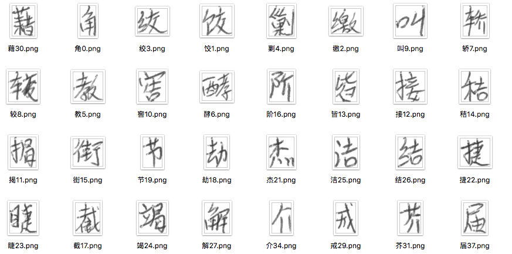
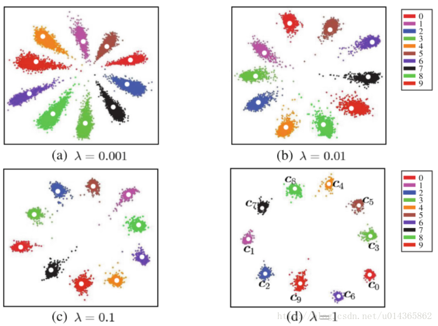
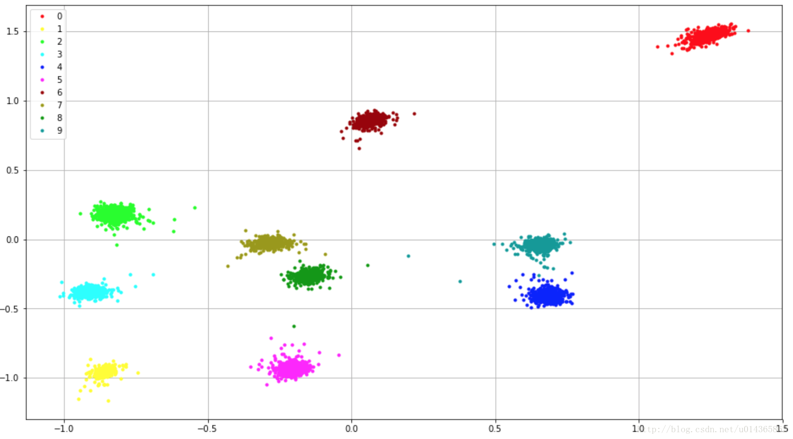
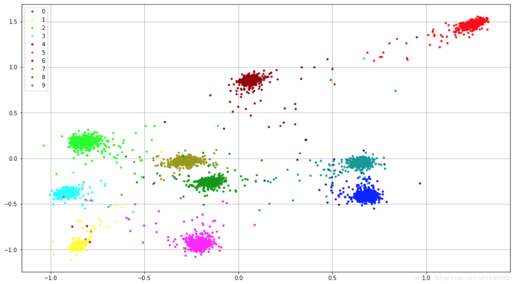
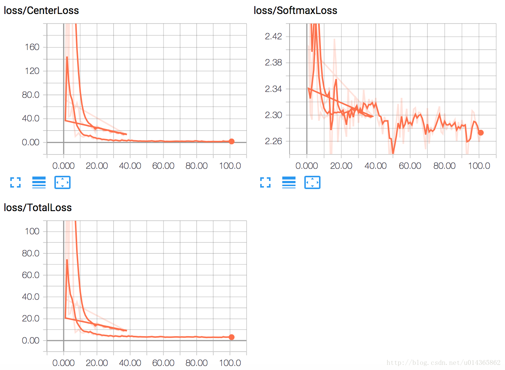
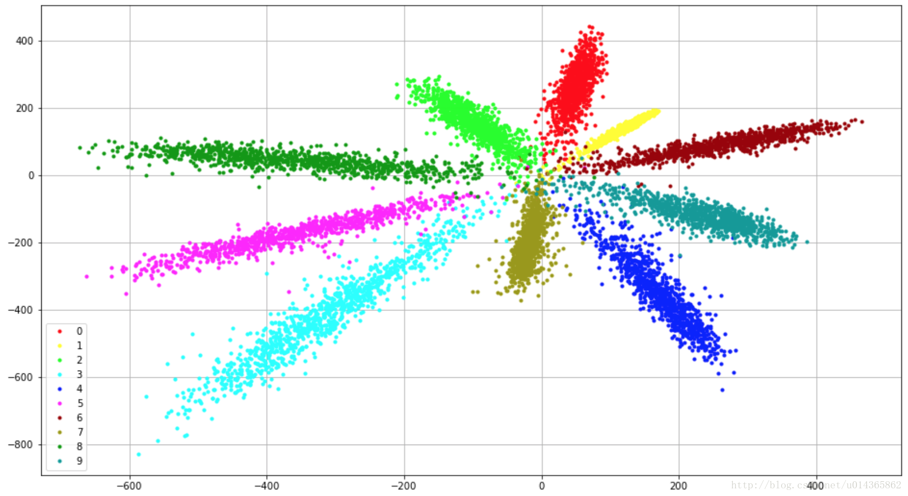
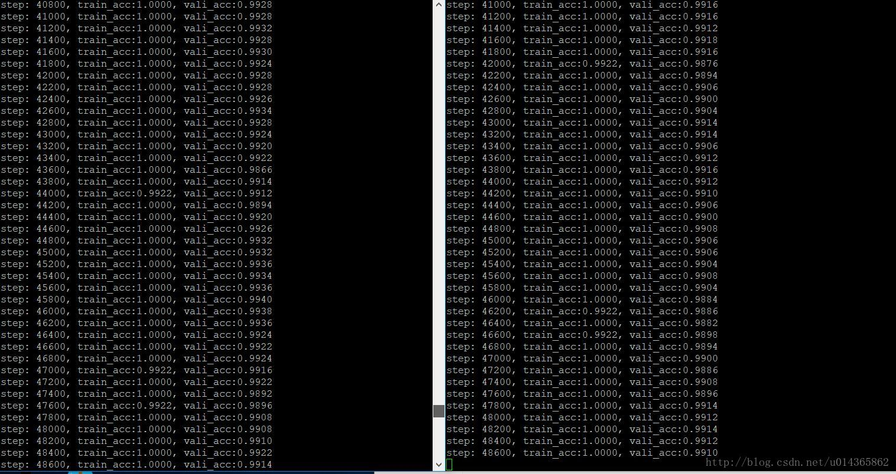
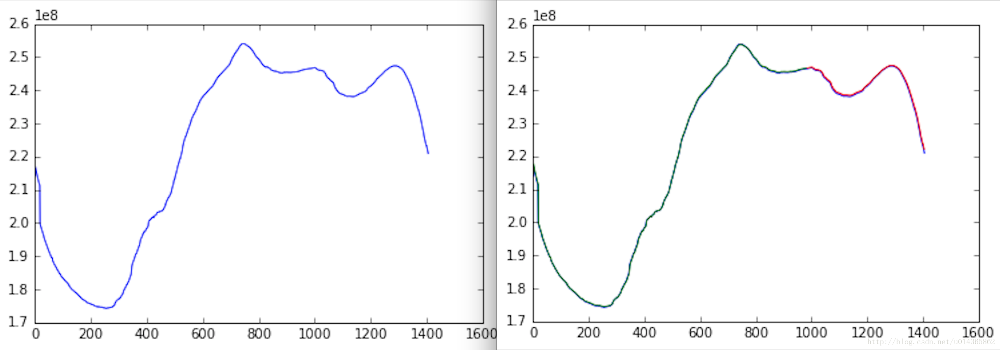

Deep Dream—应用到视频
===

本帖就基于前一贴的代码在视频上应用Deep Dream，应该能生成比较抽的视频。

代码逻辑：

1. 使用ffmpeg从视频中提取帧
2. 为每一帧图像应用Deep Dream
3. 使用ffmpeg把帧图像重新组合成视频，最后和音频合并

生成的视频效果（https://youtu.be/Sy9PXSXfEOA）
原始视频：http://www.bilibili.com/video/av7336429

撇脚的代码：

```python
# -*- coding: utf-8 -*-
# 斗大的熊猫 <blog.topspeedsnail.com>

import tensorflow as tf
import numpy as np
import cv2
import sys
import os
import argparse
import shutil

inception_model = 'tensorflow_inception_graph.pb'

# 加载模型
graph = tf.Graph()
sess = tf.InteractiveSession(graph=graph)

X = tf.placeholder(np.float32, name='input')
with tf.gfile.FastGFile(inception_model, 'rb') as f:
	graph_def = tf.GraphDef()
	graph_def.ParseFromString(f.read())
imagenet_mean = 117.0
preprocessed = tf.expand_dims(X-imagenet_mean, 0)
tf.import_graph_def(graph_def, {'input':preprocessed})

layers = [op.name for op in graph.get_operations() if op.type=='Conv2D' and 'import/' in op.name]
feature_nums = [int(graph.get_tensor_by_name(name+':0').get_shape()[-1]) for name in layers]

print('layers:', len(layers))   # 59
print('feature:', sum(feature_nums))  # 7548

def tffunc(*argtypes):
	placeholders = list(map(tf.placeholder, argtypes))
	def wrap(f):
		out = f(*placeholders)
		def wrapper(*args, **kw):
			return out.eval(dict(zip(placeholders, args)), session=kw.get('session'))
		return wrapper
	return wrap
def resize(img, size):
	img = tf.expand_dims(img, 0)
	return tf.image.resize_bilinear(img, size)[0,:,:,:]

# 选择层
layer = 'mixed4c'
resize = tffunc(np.float32, np.int32)(resize)
score = tf.reduce_mean(tf.square(graph.get_tensor_by_name("import/%s:0"%layer)))
gradi = tf.gradients(score, X)[0]
# Deep Dream
def deep_dream(img_noise, iter_n=10, step=1.5, octave_n=4, octave_scale=1.4):

	img = img_noise
	octaves = []

	for _ in range(octave_n-1):
		hw = img.shape[:2]
		lo = resize(img, np.int32(np.float32(hw)/octave_scale))
		hi = img-resize(lo, hw)
		img = lo
		octaves.append(hi)
        # tile
	def calc_grad_tiled(img, t_grad, tile_size=512):
		sz = tile_size
		h, w = img.shape[:2]
		sx, sy = np.random.randint(sz, size=2)
		img_shift = np.roll(np.roll(img, sx, 1), sy, 0)
		grad = np.zeros_like(img)
		for y in range(0, max(h-sz//2, sz),sz):
			for x in range(0, max(w-sz//2, sz),sz):
				sub = img_shift[y:y+sz,x:x+sz]
				g = sess.run(t_grad, {X:sub})
				grad[y:y+sz,x:x+sz] = g
		return np.roll(np.roll(grad, -sx, 1), -sy, 0)   

	res = None
	for octave in range(octave_n):
		if octave > 0:
			hi = octaves[-octave]
			img = resize(img, hi.shape[:2])+hi
		for _ in range(iter_n):
			g = calc_grad_tiled(img, gradi)
			img += g*(step / (np.abs(g).mean()+1e-7))

		res = img
	return res
#####################################

parser = argparse.ArgumentParser(description='Deep Video Videos.')
parser.add_argument('-i','--input', help='inupt mp4 Video File Path', required=True)
parser.add_argument('-o','--output', help='output mp4 Video File Path', required=True)

args = parser.parse_args()
print(args)

if not os.path.exists(args.input):
	print("please input video")
	sys.exit(0)

# 我使用ffmpeg把视频转为帧
def video_to_frames(video_path, frames_path):
	if not os.path.exists(frames_path):
		os.makedirs(frames_path)
		output_file = frames_path + "/%08d.jpg"
		print("ffmpeg -i {} -f image2 {}".format(video_path, output_file))
		os.system("ffmpeg -i {} -f image2 {}".format(video_path, output_file))

# 临时目录
tmp_path = './tmp'

if not os.path.exists(tmp_path):
	os.makedirs(tmp_path)
	video_to_frames(args.input, tmp_path+'/frames_input')
	# deep dream每一帧
	frames =[name for name in os.listdir(tmp_path+'/frames_input') if os.path.isfile(os.path.join(tmp_path+'/frames_input', name))]
	frames.sort()
	print("要处理的帧数:", len(frames))
	for frame in frames:
		print('正在转换: ', frame)
		img_frame = cv2.imread(tmp_path+'/frames_input/' + frame)
		img = deep_dream(img_noise=img_frame)
		if not os.path.exists(tmp_path+'/frames_output'):
			os.makedirs(tmp_path+'/frames_output')
		cv2.imwrite(tmp_path+'/frames_output/' + frame, img)
else:
	print("TODO: 从前一次退出的地方继续执行")

# TODO: 使用ffmpeg把帧转回视频
"""
# 帧率
ffprobe -show_streams -select_streams v -i args.input 2>/dev/null | grep "r_frame_rate" | cut -d'=' -f2
ffmpeg -framerate [FPS] -i ./tmp/frames_output/%08d.jpg -c:v libx264 -vf "fps=[FPS],format=yuv420p" -tune fastdecode -tune zerolatency -profile:v baseline ./tmp/tmp.mp4 -y
ffmpeg -i args.input -strict -2 ./tmp/tmp.aac -y
ffmpeg -i ./tmp/tmp.aac -i ./tmp/tmp.mp4 -strict -2 -c:v copy -movflags faststart -shortest args.output
"""

#shutil.rmtree(tmp_path)

# 啊, 代码真够烂


```


自行尝试使用不同的layer和参数组合。

后续练习：把Styler Transfer应用到视频上

ps. Python 3.6已正式发布

https://github.com/google/deepdream

Google Deep Dream Zoom “Inside an artificial brain”
https://youtu.be/dbQh1I_uvjo


手写汉字数据集: CASIA-HWDB
====

下载HWDB1.1数据集：

```
$ wget http://www.nlpr.ia.ac.cn/databases/download/feature_data/HWDB1.1trn_gnt.zip
# zip解压没得说, 之后还要解压alz压缩文件
$ wget http://www.nlpr.ia.ac.cn/databases/download/feature_data/HWDB1.1tst_gnt.zip
```

这个数据集由模式识别国家重点实验室 http://www.nlpr.ia.ac.cn/CN/folder/folder8.shtml 共享，它还共享了其它几个数据库，先mark：

1. 行为分析数据库
2. 三维人脸数据库
3. 中文语言资源库
4. 步态数据库
5. 掌纹数据库
6. 虹膜库数据

手写汉字的样子：

```python
import os
import numpy as np
import struct
import PIL.Image

train_data_dir = "HWDB1.1trn_gnt"
test_data_dir = "HWDB1.1tst_gnt"

# 读取图像和对应的汉字
def read_from_gnt_dir(gnt_dir=train_data_dir):
	def one_file(f):
		header_size = 10
		while True:
			header = np.fromfile(f, dtype='uint8', count=header_size)
			if not header.size: break
			sample_size = header[0] + (header[1]<<8) + (header[2]<<16) + (header[3]<<24)
			tagcode = header[5] + (header[4]<<8)
			width = header[6] + (header[7]<<8)
			height = header[8] + (header[9]<<8)
			if header_size + width*height != sample_size:
				break
			image = np.fromfile(f, dtype='uint8', count=width*height).reshape((height, width))
			yield image, tagcode

	for file_name in os.listdir(gnt_dir):
		if file_name.endswith('.gnt'):
			file_path = os.path.join(gnt_dir, file_name)
			with open(file_path, 'rb') as f:
				for image, tagcode in one_file(f):
					yield image, tagcode

# 统计样本数
train_counter = 0
test_counter = 0
for image, tagcode in read_from_gnt_dir(gnt_dir=train_data_dir):
	tagcode_unicode = struct.pack('>H', tagcode).decode('gb2312')
	"""
	# 提取点图像, 看看什么样
	if train_counter < 1000:
		im = PIL.Image.fromarray(image)
		im.convert('RGB').save('png/' + tagcode_unicode + str(train_counter) + '.png')
	"""
	train_counter += 1
for image, tagcode in read_from_gnt_dir(gnt_dir=test_data_dir):
	tagcode_unicode = struct.pack('>H', tagcode).decode('gb2312')
	test_counter += 1

# 样本数
print(train_counter, test_counter)

```



由于时间和系统资源有限，我只使用数据集的一部分（只识别最常用的140个汉字）。

训练模型
---

模型架构参看论文：Deep Convolutional Network for Handwritten Chinese Character Recognition  http://cs231n.stanford.edu/reports/zyh_project.pdf

```python

import os
import numpy as np
import struct
import PIL.Image

train_data_dir = "HWDB1.1trn_gnt"
test_data_dir = "HWDB1.1tst_gnt"

# 读取图像和对应的汉字
def read_from_gnt_dir(gnt_dir=train_data_dir):
	def one_file(f):
		header_size = 10
		while True:
			header = np.fromfile(f, dtype='uint8', count=header_size)
			if not header.size: break
			sample_size = header[0] + (header[1]<<8) + (header[2]<<16) + (header[3]<<24)
			tagcode = header[5] + (header[4]<<8)
			width = header[6] + (header[7]<<8)
			height = header[8] + (header[9]<<8)
			if header_size + width*height != sample_size:
				break
			image = np.fromfile(f, dtype='uint8', count=width*height).reshape((height, width))
			yield image, tagcode

	for file_name in os.listdir(gnt_dir):
		if file_name.endswith('.gnt'):
			file_path = os.path.join(gnt_dir, file_name)
			with open(file_path, 'rb') as f:
				for image, tagcode in one_file(f):
					yield image, tagcode

import scipy.misc
from sklearn.utils import shuffle
import tensorflow as tf

# 我取常用的前140个汉字进行测试
char_set = "的一是了我不人在他有这个上们来到时大地为子中你说生国年着就那和要她出也得里后自以会家可下而过天去能对小多然于心学么之都好看起发当没成只如事把还用第样道想作种开美总从无情己面最女但现前些所同日手又行意动方期它头经长儿回位分爱老因很给名法间斯知世什两次使身者被高已亲其进此话常与活正感"

def resize_and_normalize_image(img):
	# 补方
	pad_size = abs(img.shape[0]-img.shape[1]) // 2
	if img.shape[0] < img.shape[1]:
		pad_dims = ((pad_size, pad_size), (0, 0))
	else:
		pad_dims = ((0, 0), (pad_size, pad_size))
	img = np.lib.pad(img, pad_dims, mode='constant', constant_values=255)
	# 缩放
	img = scipy.misc.imresize(img, (64 - 4*2, 64 - 4*2))
	img = np.lib.pad(img, ((4, 4), (4, 4)), mode='constant', constant_values=255)
	assert img.shape == (64, 64)

	img = img.flatten()
	# 像素值范围-1到1
	img = (img - 128) / 128
	return img

# one hot
def convert_to_one_hot(char):
	vector = np.zeros(len(char_set))
	vector[char_set.index(char)] = 1
	return vector

# 由于数据量不大, 可一次全部加载到RAM
train_data_x = []
train_data_y = []

for image, tagcode in read_from_gnt_dir(gnt_dir=train_data_dir):
	tagcode_unicode = struct.pack('>H', tagcode).decode('gb2312')
	if tagcode_unicode in char_set:
		train_data_x.append(resize_and_normalize_image(image))
		train_data_y.append(convert_to_one_hot(tagcode_unicode))

# shuffle样本
train_data_x, train_data_y = shuffle(train_data_x, train_data_y, random_state=0)

batch_size = 128
num_batch = len(train_data_x) // batch_size

text_data_x = []
text_data_y = []
for image, tagcode in read_from_gnt_dir(gnt_dir=test_data_dir):
	tagcode_unicode = struct.pack('>H', tagcode).decode('gb2312')
	if tagcode_unicode in char_set:
		text_data_x.append(resize_and_normalize_image(image))
		text_data_y.append(convert_to_one_hot(tagcode_unicode))
# shuffle样本
text_data_x, text_data_y = shuffle(text_data_x, text_data_y, random_state=0)


X = tf.placeholder(tf.float32, [None, 64*64])
Y = tf.placeholder(tf.float32, [None, 140])
keep_prob = tf.placeholder(tf.float32)

def chinese_hand_write_cnn():
	x = tf.reshape(X, shape=[-1, 64, 64, 1])
	# 3 conv layers
	w_c1 = tf.Variable(tf.random_normal([3, 3, 1, 32], stddev=0.01))
	b_c1 = tf.Variable(tf.zeros([32]))
	conv1 = tf.nn.relu(tf.nn.bias_add(tf.nn.conv2d(x, w_c1, strides=[1, 1, 1, 1], padding='SAME'), b_c1))
	conv1 = tf.nn.max_pool(conv1, ksize=[1, 2, 2, 1], strides=[1, 2, 2, 1], padding='SAME')

	w_c2 = tf.Variable(tf.random_normal([3, 3, 32, 64], stddev=0.01))
	b_c2 = tf.Variable(tf.zeros([64]))
	conv2 = tf.nn.relu(tf.nn.bias_add(tf.nn.conv2d(conv1, w_c2, strides=[1, 1, 1, 1], padding='SAME'), b_c2))
	conv2 = tf.nn.max_pool(conv2, ksize=[1, 2, 2, 1], strides=[1, 2, 2, 1], padding='SAME')

	"""
	# 训练开始之后我就去睡觉了, 早晨起来一看, 白跑了, 准确率不足10%; 把网络变量改少了再来一发
	w_c3 = tf.Variable(tf.random_normal([3, 3, 64, 128], stddev=0.01))
	b_c3 = tf.Variable(tf.zeros([128]))
	conv3 = tf.nn.relu(tf.nn.bias_add(tf.nn.conv2d(conv2, w_c3, strides=[1, 1, 1, 1], padding='SAME'), b_c3))
	conv3 = tf.nn.max_pool(conv3, ksize=[1, 2, 2, 1], strides=[1, 2, 2, 1], padding='SAME')
	conv3 = tf.nn.dropout(conv3, keep_prob)
	"""

	# fully connect layer
	w_d = tf.Variable(tf.random_normal([8*32*64, 1024], stddev=0.01))
	b_d = tf.Variable(tf.zeros([1024]))
	dense = tf.reshape(conv2, [-1, w_d.get_shape().as_list()[0]])
	dense = tf.nn.relu(tf.add(tf.matmul(dense, w_d), b_d))
	dense = tf.nn.dropout(dense, keep_prob)

	w_out = tf.Variable(tf.random_normal([1024, 140], stddev=0.01))
	b_out = tf.Variable(tf.zeros([140]))
	out = tf.add(tf.matmul(dense, w_out), b_out)

	return out

def train_hand_write_cnn():
	output = chinese_hand_write_cnn()

	loss = tf.reduce_mean(tf.nn.softmax_cross_entropy_with_logits(output, Y))
	optimizer = tf.train.AdamOptimizer(learning_rate=0.001).minimize(loss)

	accuracy = tf.reduce_mean(tf.cast(tf.equal(tf.argmax(output, 1), tf.argmax(Y, 1)), tf.float32))

	# TensorBoard
	tf.scalar_summary("loss", loss)
	tf.scalar_summary("accuracy", accuracy)
	merged_summary_op = tf.merge_all_summaries()

	saver = tf.train.Saver()
	with tf.Session() as sess:
		sess.run(tf.global_variables_initializer())

		# 命令行执行 tensorboard --logdir=./log  打开浏览器访问http://0.0.0.0:6006
		summary_writer = tf.train.SummaryWriter('./log', graph=tf.get_default_graph())

		for e in range(50):
			for i in range(num_batch):
				batch_x = train_data_x[i*batch_size : (i+1)*batch_size]
				batch_y = train_data_y[i*batch_size : (i+1)*batch_size]
				_, loss_, summary = sess.run([optimizer, loss, merged_summary_op], feed_dict={X: batch_x, Y: batch_y, keep_prob: 0.5})
				# 每次迭代都保存日志
				summary_writer.add_summary(summary, e*num_batch+i)
				print(e*num_batch+i, loss_)

				if e*num_batch+i % 100 == 0:
					# 计算准确率
					acc = accuracy.eval({X: text_data_x[:500], Y: text_data_y[:500], keep_prob: 1.})
					#acc = sess.run(accuracy, feed_dict={X: text_data_x[:500], Y: text_data_y[:500], keep_prob: 1.})
					print(e*num_batch+i, acc)

train_hand_write_cnn()


```

tf29: 使用tensorboard可视化inception_v4
===


直接看代码和图示吧：

生成.pb可以参考：将tf训练的权重保存为CKPT,PB ,CKPT 转换成 PB格式。并将权重固化到图里面,并使用该模型进行预测

```python

# coding=utf-8


import tensorflow as tf
import os
import tarfile
import requests

'''
inception_pretrain_model_url = 'http://download.tensorflow.org/models/image/imagenet/inception-2015-12-05.tgz'

# 下载inception pretrain模型
inception_pretrain_model_dir = "inception_pretrain"
if not os.path.exists(inception_pretrain_model_dir):
	os.makedirs(inception_pretrain_model_dir)

filename = inception_pretrain_model_url.split('/')[-1]
filepath = os.path.join(inception_pretrain_model_dir, filename)

if not os.path.exists(filepath):
	print("开始下载: ", filename)
	r = requests.get(inception_pretrain_model_url, stream=True)
	with open(filepath, 'wb') as f:
		for chunk in r.iter_content(chunk_size=1024):
			if chunk:
				f.write(chunk)

print("下载完成, 开始解压: ", filename)
tarfile.open(filepath, 'r:gz').extractall(inception_pretrain_model_dir)

# TensorBoard log目录
log_dir = 'inception_log'
if not os.path.exists(log_dir):
	os.makedirs(log_dir)'''

inception_pretrain_model_dir = "inception_pretrain"
if not os.path.exists(inception_pretrain_model_dir):
	os.makedirs(inception_pretrain_model_dir)
# TensorBoard log目录
log_dir = 'inception_log'
if not os.path.exists(log_dir):
	os.makedirs(log_dir)
# 加载inception graph
inception_graph_def_file = os.path.join(inception_pretrain_model_dir, 'my_inception_v4_freeze.pb')
with tf.Session() as sess:
	with tf.gfile.FastGFile(inception_graph_def_file, 'rb') as f:
		graph_def = tf.GraphDef()
		graph_def.ParseFromString(f.read())
		tf.import_graph_def(graph_def, name='')
	writer = tf.summary.FileWriter(log_dir, sess.graph)
	writer.close()

```

使用tensorboard查看：

```
tensorboard --logdir inception_log
```

图示：


tf30: center loss及其mnist上的应用
===

Center loss是ECCV2016中一篇论文《A Discriminative Feature Learning Approach for Deep Face Recognition》提出来的概念，主要思想就是在softmax loss基础上额外加入一个正则项，让网络中每一类样本的特征向量都能够尽量聚在一起，在mnist上的示意效果如下图所示，可以看到每一类样本都聚在类别中心的周围。直接看下图：





如果下面代码不收敛或者收敛慢，再试几次，与开始的初始化参数有关！

下面是center loss的tensorflow实现：

有ceter loss：mnist_with_center_loss.py


```python
# coding=utf-8
import os
import numpy as np
import tensorflow as tf
from tensorflow.examples.tutorials.mnist import input_data

slim = tf.contrib.slim
os.environ['CUDA_VISIBLE_DEVICES'] = '0'

LAMBDA = 0.5
CENTER_LOSS_ALPHA = 0.5
NUM_CLASSES = 10

with tf.name_scope('input'):
    input_images = tf.placeholder(tf.float32, shape=(None,28,28,1), name='input_images')
    labels = tf.placeholder(tf.int64, shape=(None), name='labels')

global_step = tf.Variable(0, trainable=False, name='global_step')

def get_center_loss(features, labels, alpha, num_classes):
    """获取center loss及center的更新op

    Arguments:
        features: Tensor,表征样本特征,一般使用某个fc层的输出,shape应该为[batch_size, feature_length].
        labels: Tensor,表征样本label,非one-hot编码,shape应为[batch_size].
        alpha: 0-1之间的数字,控制样本类别中心的学习率,细节参考原文.
        num_classes: 整数,表明总共有多少个类别,网络分类输出有多少个神经元这里就取多少.

    Return：
        loss: Tensor,可与softmax loss相加作为总的loss进行优化.
        centers: Tensor,存储样本中心值的Tensor，仅查看样本中心存储的具体数值时有用.
        centers_update_op: op,用于更新样本中心的op，在训练时需要同时运行该op，否则样本中心不会更新
    """
    # 获取特征的维数，例如256维
    len_features = features.get_shape()[1]
    # 建立一个Variable,shape为[num_classes, len_features]，用于存储整个网络的样本中心，
    # 设置trainable=False是因为样本中心不是由梯度进行更新的
    centers = tf.get_variable('centers', [num_classes, len_features], dtype=tf.float32,
        initializer=tf.constant_initializer(0), trainable=False)
    # 将label展开为一维的，输入如果已经是一维的，则该动作其实无必要
    labels = tf.reshape(labels, [-1])

    # 根据样本label,获取mini-batch中每一个样本对应的中心值
    centers_batch = tf.gather(centers, labels)
    # 计算loss
    loss = tf.nn.l2_loss(features - centers_batch)

    # 当前mini-batch的特征值与它们对应的中心值之间的差
    diff = centers_batch - features

    # 获取mini-batch中同一类别样本出现的次数,了解原理请参考原文公式(4)
    unique_label, unique_idx, unique_count = tf.unique_with_counts(labels)
    appear_times = tf.gather(unique_count, unique_idx)
    appear_times = tf.reshape(appear_times, [-1, 1])

    diff = diff / tf.cast((1 + appear_times), tf.float32)
    diff = alpha * diff

    centers_update_op = tf.scatter_sub(centers, labels, diff)

    return loss, centers, centers_update_op

def inference(input_images):
    with slim.arg_scope([slim.conv2d], weights_initializer=slim.variance_scaling_initializer(),
        activation_fn=tf.nn.relu, normalizer_fn= slim.batch_norm, kernel_size=3, padding='SAME'):
        with slim.arg_scope([slim.max_pool2d], kernel_size=2):

            x = slim.conv2d(input_images, num_outputs=32, scope='conv1_1')
            x = slim.conv2d(x, num_outputs=32, scope='conv1_2')
            x = slim.max_pool2d(x, scope='pool1')

            x = slim.conv2d(x, num_outputs=64, scope='conv2_1')
            x = slim.conv2d(x, num_outputs=64, scope='conv2_2')
            x = slim.max_pool2d(x, scope='pool2')

            x = slim.conv2d(x, num_outputs=128, scope='conv3_1')
            x = slim.conv2d(x, num_outputs=128, scope='conv3_2')
            x = slim.max_pool2d(x, scope='pool3')

            x = slim.flatten(x, scope='flatten')

            feature = slim.fully_connected(x, num_outputs=2, activation_fn=None, scope='fc1')

            x = tf.nn.relu(feature)

            x = slim.fully_connected(x, num_outputs=10, activation_fn=None, scope='fc2')

    return x, feature

def build_network(input_images, labels, ratio=0.5):
    logits, features = inference(input_images)

    with tf.name_scope('loss'):
        with tf.name_scope('center_loss'):
            center_loss, centers, centers_update_op = get_center_loss(features, labels, CENTER_LOSS_ALPHA, NUM_CLASSES)
        with tf.name_scope('softmax_loss'):
            softmax_loss = tf.reduce_mean(tf.nn.sparse_softmax_cross_entropy_with_logits(labels=labels, logits=logits))
        with tf.name_scope('total_loss'):
            total_loss = softmax_loss + ratio * center_loss

    with tf.name_scope('acc'):
        accuracy = tf.reduce_mean(tf.cast(tf.equal(tf.arg_max(logits, 1), labels), tf.float32))

    with tf.name_scope('loss/'):
        tf.summary.scalar('CenterLoss', center_loss)
        tf.summary.scalar('SoftmaxLoss', softmax_loss)
        tf.summary.scalar('TotalLoss', total_loss)

    return logits, features, total_loss, accuracy, centers_update_op

logits, features, total_loss, accuracy, centers_update_op = build_network(input_images, labels, ratio=LAMBDA)

mnist = input_data.read_data_sets('/Users/liupeng/Desktop/anaconda/center_loss/tmp/mnist', reshape=False)

optimizer = tf.train.AdamOptimizer(0.001)
update_ops = tf.get_collection(tf.GraphKeys.UPDATE_OPS)
update_ops.append(centers_update_op)
with tf.control_dependencies(update_ops):
    train_op = optimizer.minimize(total_loss, global_step=global_step)

summary_op = tf.summary.merge_all()
sess = tf.Session()
sess.run(tf.global_variables_initializer())
writer = tf.summary.FileWriter('/Users/liupeng/Desktop/anaconda/center_loss/tmp/mnist_log', sess.graph)

mean_data = np.mean(mnist.train.images, axis=0)

step = sess.run(global_step)
while step <= 80000:
    batch_images, batch_labels = mnist.train.next_batch(128)
    _, summary_str, train_acc = sess.run(
        [train_op, summary_op, accuracy],
        feed_dict={
            input_images: batch_images - mean_data,
            labels: batch_labels,
        })
    step += 1

    writer.add_summary(summary_str, global_step=step)

    if step % 200 == 0:
        vali_image = mnist.validation.images - mean_data
        vali_acc = sess.run(
            accuracy,
            feed_dict={
                input_images: vali_image,
                labels: mnist.validation.labels
            })
        print(("step: {}, train_acc:{:.4f}, vali_acc:{:.4f}".
              format(step, train_acc, vali_acc)))

# 训练集
feat = sess.run(features, feed_dict={input_images:mnist.train.images[:10000]-mean_data})

# %matplotlib inline
import matplotlib.pyplot as plt

labels = mnist.train.labels[:10000]

f = plt.figure(figsize=(16,9))
c = ['#ff0000', '#ffff00', '#00ff00', '#00ffff', '#0000ff',
     '#ff00ff', '#990000', '#999900', '#009900', '#009999']
for i in range(10):
    plt.plot(feat[labels==i,0].flatten(), feat[labels==i,1].flatten(), '.', c=c[i])
plt.legend(['0', '1', '2', '3', '4', '5', '6', '7', '8', '9'])
plt.grid()
plt.show()

# 测试集
feat = sess.run(features, feed_dict={input_images:mnist.test.images[:10000]-mean_data})

# %matplotlib inline
import matplotlib.pyplot as plt

labels = mnist.test.labels[:10000]

f = plt.figure(figsize=(16,9))
c = ['#ff0000', '#ffff00', '#00ff00', '#00ffff', '#0000ff',
     '#ff00ff', '#990000', '#999900', '#009900', '#009999']
for i in range(10):
    plt.plot(feat[labels==i,0].flatten(), feat[labels==i,1].flatten(), '.', c=c[i])
plt.legend(['0', '1', '2', '3', '4', '5', '6', '7', '8', '9'])
plt.grid()
plt.show()

sess.close()


```


分别看一下训练集和测试集的结果：







tensorboard可视化

tensorboard --logdir tmp/mnislog




对比看一下：没有ceter loss：mnist_without_center_loss.py

```python

# coding=utf-8
import os
import numpy as np
import tensorflow as tf
from tensorflow.examples.tutorials.mnist import input_data

slim = tf.contrib.slim
os.environ['CUDA_VISIBLE_DEVICES'] = '0'

LAMBDA = 0.5
CENTER_LOSS_ALPHA = 0.5
NUM_CLASSES = 10

with tf.name_scope('input'):
    input_images = tf.placeholder(tf.float32, shape=(None,28,28,1), name='input_images')
    labels = tf.placeholder(tf.int64, shape=(None), name='labels')

global_step = tf.Variable(0, trainable=False, name='global_step')

def get_center_loss(features, labels, alpha, num_classes):
    """获取center loss及center的更新op

    Arguments:
        features: Tensor,表征样本特征,一般使用某个fc层的输出,shape应该为[batch_size, feature_length].
        labels: Tensor,表征样本label,非one-hot编码,shape应为[batch_size].
        alpha: 0-1之间的数字,控制样本类别中心的学习率,细节参考原文.
        num_classes: 整数,表明总共有多少个类别,网络分类输出有多少个神经元这里就取多少.

    Return：
        loss: Tensor,可与softmax loss相加作为总的loss进行优化.
        centers: Tensor,存储样本中心值的Tensor，仅查看样本中心存储的具体数值时有用.
        centers_update_op: op,用于更新样本中心的op，在训练时需要同时运行该op，否则样本中心不会更新
    """
    # 获取特征的维数，例如256维
    len_features = features.get_shape()[1]
    # 建立一个Variable,shape为[num_classes, len_features]，用于存储整个网络的样本中心，
    # 设置trainable=False是因为样本中心不是由梯度进行更新的
    centers = tf.get_variable('centers', [num_classes, len_features], dtype=tf.float32,
        initializer=tf.constant_initializer(0), trainable=False)
    # 将label展开为一维的，输入如果已经是一维的，则该动作其实无必要
    labels = tf.reshape(labels, [-1])

    # 根据样本label,获取mini-batch中每一个样本对应的中心值
    centers_batch = tf.gather(centers, labels)
    # 计算loss
    loss = tf.nn.l2_loss(features - centers_batch)

    # 当前mini-batch的特征值与它们对应的中心值之间的差
    diff = centers_batch - features

    # 获取mini-batch中同一类别样本出现的次数,了解原理请参考原文公式(4)
    unique_label, unique_idx, unique_count = tf.unique_with_counts(labels)
    appear_times = tf.gather(unique_count, unique_idx)
    appear_times = tf.reshape(appear_times, [-1, 1])

    diff = diff / tf.cast((1 + appear_times), tf.float32)
    diff = alpha * diff

    centers_update_op = tf.scatter_sub(centers, labels, diff)

    return loss, centers, centers_update_op

def inference(input_images):
    with slim.arg_scope([slim.conv2d], weights_initializer=slim.variance_scaling_initializer(),
        activation_fn=tf.nn.relu, normalizer_fn= slim.batch_norm,kernel_size=3, padding='SAME'):
        with slim.arg_scope([slim.max_pool2d], kernel_size=2):

            x = slim.conv2d(input_images, num_outputs=32, scope='conv1_1')
            x = slim.conv2d(x, num_outputs=32, scope='conv1_2')
            x = slim.max_pool2d(x, scope='pool1')

            x = slim.conv2d(x, num_outputs=64, scope='conv2_1')
            x = slim.conv2d(x, num_outputs=64, scope='conv2_2')
            x = slim.max_pool2d(x, scope='pool2')

            x = slim.conv2d(x, num_outputs=128, scope='conv3_1')
            x = slim.conv2d(x, num_outputs=128, scope='conv3_2')
            x = slim.max_pool2d(x, scope='pool3')

            x = slim.flatten(x, scope='flatten')

            feature = slim.fully_connected(x, num_outputs=2, activation_fn=None, scope='fc1')

            x = tf.nn.relu(feature)

            x = slim.fully_connected(x, num_outputs=10, activation_fn=None, scope='fc2')

    return x, feature

def build_network(input_images, labels, ratio=0.5):
    logits, features = inference(input_images)

    with tf.name_scope('loss'):
        with tf.name_scope('center_loss'):
            center_loss, centers, centers_update_op = get_center_loss(features, labels, CENTER_LOSS_ALPHA, NUM_CLASSES)
        with tf.name_scope('softmax_loss'):
            softmax_loss = tf.reduce_mean(tf.nn.sparse_softmax_cross_entropy_with_logits(labels=labels, logits=logits))
        with tf.name_scope('total_loss'):
            total_loss = softmax_loss  # + ratio * center_loss

    with tf.name_scope('acc'):
        accuracy = tf.reduce_mean(tf.cast(tf.equal(tf.arg_max(logits, 1), labels), tf.float32))

    with tf.name_scope('loss/'):
        tf.summary.scalar('CenterLoss', center_loss)
        tf.summary.scalar('SoftmaxLoss', softmax_loss)
        tf.summary.scalar('TotalLoss', total_loss)

    return logits, features, total_loss, accuracy, centers_update_op

logits, features, total_loss, accuracy, centers_update_op = build_network(input_images, labels, ratio=LAMBDA)

mnist = input_data.read_data_sets('/Users/liupeng/Desktop/anaconda/center_loss/tmp/mnist', reshape=False)

optimizer = tf.train.AdamOptimizer(0.001)
update_ops = tf.get_collection(tf.GraphKeys.UPDATE_OPS)
# update_ops.append(centers_update_op)
with tf.control_dependencies(update_ops):
    train_op = optimizer.minimize(total_loss, global_step=global_step)

summary_op = tf.summary.merge_all()
sess = tf.Session()
sess.run(tf.global_variables_initializer())
writer = tf.summary.FileWriter('/Users/liupeng/Desktop/anaconda/center_loss/tmp/mnist_log', sess.graph)

mean_data = np.mean(mnist.train.images, axis=0)

step = sess.run(global_step)
while step <= 80000:
    batch_images, batch_labels = mnist.train.next_batch(128)
    _, summary_str, train_acc = sess.run(
        [train_op, summary_op, accuracy],
        feed_dict={
            input_images: batch_images - mean_data,
            labels: batch_labels,
        })
    step += 1

    writer.add_summary(summary_str, global_step=step)

    if step % 200 == 0:
        vali_image = mnist.validation.images - mean_data
        vali_acc = sess.run(
            accuracy,
            feed_dict={
                input_images: vali_image,
                labels: mnist.validation.labels
            })
        print(("step: {}, train_acc:{:.4f}, vali_acc:{:.4f}".
              format(step, train_acc, vali_acc)))

# 训练集
feat = sess.run(features, feed_dict={input_images:mnist.train.images[:10000]-mean_data})

# %matplotlib inline
import matplotlib.pyplot as plt

labels = mnist.train.labels[:10000]

f = plt.figure(figsize=(16,9))
c = ['#ff0000', '#ffff00', '#00ff00', '#00ffff', '#0000ff',
     '#ff00ff', '#990000', '#999900', '#009900', '#009999']
for i in range(10):
    plt.plot(feat[labels==i,0].flatten(), feat[labels==i,1].flatten(), '.', c=c[i])
plt.legend(['0', '1', '2', '3', '4', '5', '6', '7', '8', '9'])
plt.grid()
plt.show()

# 测试集
feat = sess.run(features, feed_dict={input_images:mnist.test.images[:10000]-mean_data})

#%matplotlib inline
import matplotlib.pyplot as plt

labels = mnist.test.labels[:10000]

f = plt.figure(figsize=(16,9))
c = ['#ff0000', '#ffff00', '#00ff00', '#00ffff', '#0000ff',
     '#ff00ff', '#990000', '#999900', '#009900', '#009999']
for i in range(10):
    plt.plot(feat[labels==i,0].flatten(), feat[labels==i,1].flatten(), '.', c=c[i])
plt.legend(['0', '1', '2', '3', '4', '5', '6', '7', '8', '9'])
plt.grid()
plt.show()

sess.close()

```

分别看一下训练集和测试集的结果：




另外看一下两个的训练结果比较：（左：有center loss；右：无center loss）





tf31: keras的LSTM腾讯人数在线预测
====

这是一个使用lstm预测的例子：

简单来说就是通过前几个是时刻的在线人数，预测下一个时刻的人数：（最下面有txt数据）

```python

#!/usr/bin/env python2
# -*- coding: utf-8 -*-
"""
Created on Fri Apr  7 21:27:30 2017
@author: liupeng
"""

import numpy
import matplotlib.pyplot as plt
from pandas import read_csv
import math
from keras.models import Sequential
from keras.layers import Dense
from keras.layers import LSTM
from sklearn.preprocessing import MinMaxScaler
from sklearn.metrics import mean_squared_error
# matplotlib inline
import tensorflow as tf
import matplotlib.pyplot as plt
import os
import numpy as np
import csv
import string
import requests
import io
from zipfile import ZipFile
from tensorflow.contrib import learn
from tensorflow.python.framework import ops
ops.reset_default_graph()


# load the dataset
text_data = open('2017-05-26.txt')
print text_data
text_data = [x.split(' ') for x in text_data]

save_file_name = 'temp_spam_data.csv'
with open(save_file_name, 'w') as temp_output_file:
    writer = csv.writer(temp_output_file)
    writer.writerows(text_data)

dataframe = read_csv(save_file_name , usecols=[2], engine='python', skipfooter=3)  
print dataframe

dataset = dataframe.values
# 将整型变为float
dataset = dataset.astype('float32')

plt.plot(dataset)
plt.show()

def create_dataset(dataset, look_back=1):
    dataX, dataY = [], []
    for i in range(len(dataset)-look_back-1):
        a = dataset[i:(i+look_back), 0]
        dataX.append(a)
        dataY.append(dataset[i + look_back, 0])
    return numpy.array(dataX), numpy.array(dataY)

# fix random seed for reproducibility
numpy.random.seed(7)

# normalize the dataset
scaler = MinMaxScaler(feature_range=(0, 1))
dataset = scaler.fit_transform(dataset)


# split into train and test sets
train_size = int(len(dataset) * 0.70)
test_size = len(dataset) - train_size
train, test = dataset[0:train_size,:], dataset[train_size:len(dataset),:]

# use this function to prepare the train and test datasets for modeling
look_back = 1
trainX, trainY = create_dataset(train, look_back)
testX, testY = create_dataset(test, look_back)

# reshape input to be [samples, time steps, features]
trainX = numpy.reshape(trainX, (trainX.shape[0], 1, trainX.shape[1]))
testX = numpy.reshape(testX, (testX.shape[0], 1, testX.shape[1]))


# create and fit the LSTM network
model = Sequential()
model.add(LSTM(4, input_shape=(1, look_back)))
model.add(Dense(1))
model.compile(loss='mean_squared_error', optimizer='adam')
model.fit(trainX, trainY, nb_epoch=100, batch_size=1, verbose=2)

# make predictions
trainPredict = model.predict(trainX)
testPredict = model.predict(testX)
print trainPredict
print testPredict

#trainScore = math.sqrt(mean_squared_error(trainY[0], trainPredict[:,0]))
#print('Train Score: %.2f RMSE', (trainScore))
#testScore = math.sqrt(mean_squared_error(testY[0], testPredict[:,0]))
#print('Test Score: %.2f RMSE', (testScore))

# 注意数据转化
trainPredict = scaler.inverse_transform(trainPredict)
print 'trainPredict:' ,trainPredict
testPredict = scaler.inverse_transform(testPredict)
print 'testPredict', testPredict
# shift train predictions for plotting
trainPredictPlot = numpy.empty_like(dataset)
trainPredictPlot[:, :] = numpy.nan
trainPredictPlot[look_back:len(trainPredict)+look_back, :] = trainPredict

# shift test predictions for plotting
testPredictPlot = numpy.empty_like(dataset)
testPredictPlot[:, :] = numpy.nan
testPredictPlot[len(trainPredict)+(look_back*2)+1:len(dataset)-1, :] = testPredict

# plot baseline and predictions
plt.plot(scaler.inverse_transform(dataset))
plt.plot(trainPredictPlot)
plt.plot(testPredictPlot)
plt.show()


```




```
2017-05-25 23:51:00 218208503 -453346
2017-05-25 23:52:00 217816621 -391882
2017-05-25 23:53:00 217353051 -463570
2017-05-25 23:54:00 217017809 -335242
2017-05-25 23:55:00 216491261 -526548
2017-05-25 23:56:00 216104757 -386504
2017-05-25 23:57:00 215687986 -416771
2017-05-25 23:58:00 215316097 -371889
2017-05-25 23:59:00 214886252 -429845
2017-05-26 00:00:00 214582184 -304068
2017-05-26 00:01:00 214219827 -362357
2017-05-26 00:02:00 213859162 -360665
2017-05-26 00:03:00 213495691 -363471
2017-05-26 00:04:00 213190947 -304744
2017-05-26 00:05:00 212768694 -422253
2017-05-26 00:06:00 212481487 -287207
2017-05-26 00:07:00 212038912 -442575
2017-05-26 00:08:00 211887461 -151451
2017-05-26 00:09:00 211477626 -409835
2017-05-26 00:10:00 211202782 -274844
2017-05-26 00:41:00 199702250 -236941
2017-05-26 00:42:00 199422510 -279740
2017-05-26 00:43:00 199158710 -263800
2017-05-26 00:44:00 198883174 -275536
2017-05-26 00:45:00 198565755 -317419
2017-05-26 00:46:00 198279382 -286373
2017-05-26 00:47:00 198021028 -258354
2017-05-26 00:48:00 197758720 -262308
2017-05-26 00:49:00 197454355 -304365
2017-05-26 00:50:00 197169055 -285300
2017-05-26 00:51:00 196824191 -344864
2017-05-26 00:52:00 196585830 -238361
2017-05-26 00:53:00 196296601 -289229
2017-05-26 00:54:00 196055337 -241264
2017-05-26 00:55:00 195597581 -457756
2017-05-26 00:56:00 195401253 -196328
2017-05-26 00:57:00 195119638 -281615
2017-05-26 00:58:00 194870700 -248938
2017-05-26 00:59:00 194594592 -276108
2017-05-26 01:00:00 194318565 -276027
2017-05-26 01:01:00 194140166 -178399
2017-05-26 01:02:00 193841350 -298816
2017-05-26 01:03:00 193659637 -181713
2017-05-26 01:04:00 193391111 -268526
2017-05-26 01:05:00 193150673 -240438
2017-05-26 01:06:00 192882603 -268070
2017-05-26 01:07:00 192671204 -211399
2017-05-26 01:08:00 192435706 -235498
2017-05-26 01:09:00 192250391 -185315
2017-05-26 01:10:00 192012017 -238374
2017-05-26 01:11:00 191809664 -202353
2017-05-26 01:12:00 191560890 -248774
2017-05-26 01:13:00 191417539 -143351
2017-05-26 01:14:00 191176226 -241313
2017-05-26 01:15:00 190922209 -254017
2017-05-26 01:16:00 190783203 -139006
2017-05-26 01:17:00 190511068 -272135
2017-05-26 01:18:00 190313506 -197562
2017-05-26 01:19:00 190142329 -171177
2017-05-26 01:20:00 189849058 -293271
2017-05-26 01:20:00 189849058 -293271
2017-05-26 01:21:00 189631796 -217262
2017-05-26 01:22:00 189450977 -180819
2017-05-26 01:23:00 189450977 0
2017-05-26 01:24:00 189450977 0
2017-05-26 01:25:00 188645561 -805416
2017-05-26 01:26:00 188504537 -141024
2017-05-26 01:27:00 188249168 -255369
2017-05-26 01:28:00 188144715 -104453
2017-05-26 01:29:00 187890770 -253945
2017-05-26 01:30:00 187765838 -124932
2017-05-26 01:31:00 187512719 -253119
2017-05-26 01:32:00 187372586 -140133
2017-05-26 01:33:00 187258308 -114278
2017-05-26 01:34:00 187070711 -187597
2017-05-26 01:35:00 186947598 -123113
2017-05-26 01:36:00 186763910 -183688
2017-05-26 01:37:00 186666974 -96936
2017-05-26 01:38:00 186481813 -185161
2017-05-26 01:39:00 186382770 -99043
2017-05-26 01:41:00 186105762 -93490
2017-05-26 01:42:00 185949366 -156396
2017-05-26 01:43:00 185865019 -84347
2017-05-26 01:44:00 185865019 0
2017-05-26 01:45:00 185565614 -299405
2017-05-26 01:46:00 185419200 -146414
2017-05-26 01:47:00 185228663 -190537
2017-05-26 01:48:00 185127324 -101339
2017-05-26 01:49:00 184973254 -154070
2017-05-26 01:50:00 184879187 -94067
2017-05-26 01:51:00 184739290 -139897
2017-05-26 01:52:00 184639245 -100045
2017-05-26 01:53:00 184639245 0
2017-05-26 01:54:00 184308234 -331011
2017-05-26 01:55:00 184186250 -121984
2017-05-26 01:56:00 184045900 -140350
2017-05-26 01:57:00 183919780 -126120
2017-05-26 01:58:00 183803745 -116035
2017-05-26 01:59:00 183698147 -105598
2017-05-26 02:00:00 183555044 -143103
2017-05-26 02:00:00 183555044 -143103
2017-05-26 02:01:00 183442175 -112869
2017-05-26 02:02:00 183305486 -136689
2017-05-26 02:03:00 183195001 -110485
2017-05-26 02:04:00 183073574 -121427
2017-05-26 02:05:00 182922380 -151194
2017-05-26 02:06:00 182807065 -115315
2017-05-26 02:07:00 182713807 -93258
2017-05-26 02:08:00 182662159 -51648
2017-05-26 02:09:00 182607103 -55056
2017-05-26 02:10:00 182534281 -72822
2017-05-26 02:11:00 182439526 -94755
2017-05-26 02:12:00 182390435 -49091
2017-05-26 02:13:00 182301694 -88741
2017-05-26 02:14:00 182226365 -75329
2017-05-26 02:15:00 182110508 -115857
2017-05-26 02:16:00 182018763 -91745
2017-05-26 02:17:00 181959795 -58968
2017-05-26 02:18:00 181857044 -102751
2017-05-26 02:19:00 181815200 -41844
2017-05-26 02:21:00 181600607 -71701
2017-05-26 02:22:00 181510563 -90044
2017-05-26 02:23:00 181410749 -99814
2017-05-26 02:24:00 181211135 -199614
2017-05-26 02:25:00 181211135 0
2017-05-26 02:26:00 180874223 -336912
2017-05-26 02:27:00 180738010 -136213
2017-05-26 02:28:00 180651910 -86100
2017-05-26 02:29:00 180516821 -135089
2017-05-26 02:30:00 180444097 -72724
2017-05-26 02:31:00 180299482 -144615
2017-05-26 02:32:00 180238701 -60781
2017-05-26 02:33:00 180131439 -107262
2017-05-26 02:34:00 180048107 -83332
2017-05-26 02:35:00 179951036 -97071
2017-05-26 02:36:00 179840484 -110552
2017-05-26 02:37:00 179792785 -47699
2017-05-26 02:38:00 179736270 -56515
2017-05-26 02:39:00 179693260 -43010
2017-05-26 02:40:00 179587899 -105361
2017-05-26 02:41:00 179514296 -73603
2017-05-26 02:42:00 179441455 -72841
2017-05-26 02:43:00 179379095 -62360
2017-05-26 02:44:00 179317240 -61855
2017-05-26 02:45:00 179210449 -106791
2017-05-26 02:46:00 179156162 -54287
2017-05-26 02:47:00 179060616 -95546
2017-05-26 02:48:00 179007119 -53497
2017-05-26 02:49:00 178927519 -79600
2017-05-26 02:50:00 178846841 -80678
2017-05-26 02:50:00 178846841 -80678
2017-05-26 02:51:00 178769209 -77632
2017-05-26 02:52:00 178685373 -83836
2017-05-26 02:53:00 178629878 -55495
2017-05-26 02:54:00 178515322 -114556
2017-05-26 02:55:00 178392028 -123294
2017-05-26 02:56:00 178284387 -107641
2017-05-26 02:57:00 178221944 -62443
2017-05-26 02:58:00 178145786 -76158
2017-05-26 02:59:00 178052632 -93154
2017-05-26 03:01:00 177919509 -80130
2017-05-26 03:02:00 177871509 -48000
2017-05-26 03:03:00 177815325 -56184
2017-05-26 03:04:00 177728985 -86340
2017-05-26 03:05:00 177631513 -97472
2017-05-26 03:06:00 177514150 -117363
2017-05-26 03:07:00 177442751 -71399
2017-05-26 03:08:00 177319864 -122887
2017-05-26 03:09:00 177221814 -98050
2017-05-26 03:10:00 177124004 -97810
2017-05-26 03:11:00 177071503 -52501
2017-05-26 03:12:00 177022888 -48615
2017-05-26 03:13:00 177001750 -21138
2017-05-26 03:14:00 176971908 -29842
2017-05-26 03:15:00 176890952 -80956
2017-05-26 03:16:00 176852687 -38265
2017-05-26 03:17:00 176794636 -58051
2017-05-26 03:18:00 176774841 -19795
2017-05-26 03:19:00 176706891 -67950
2017-05-26 03:20:00 176647545 -59346
2017-05-26 03:21:00 176580657 -66888
2017-05-26 03:22:00 176526148 -54509
2017-05-26 03:23:00 176487101 -39047
2017-05-26 03:24:00 176358914 -128187
2017-05-26 03:25:00 176239507 -119407
2017-05-26 03:26:00 176120415 -119092
2017-05-26 03:27:00 176083911 -36504
2017-05-26 03:28:00 176054792 -29119
2017-05-26 03:29:00 176001530 -53262
2017-05-26 03:30:00 175944957 -56573
2017-05-26 03:30:00 175944957 -56573
2017-05-26 03:31:00 175888882 -56075
2017-05-26 03:32:00 175852457 -36425
2017-05-26 03:33:00 175822509 -29948
2017-05-26 03:34:00 175780090 -42419
2017-05-26 03:35:00 175712414 -67676
2017-05-26 03:36:00 175679129 -33285
2017-05-26 03:37:00 175659279 -19850
2017-05-26 03:38:00 175680204 20925
2017-05-26 03:39:00 175667330 -12874
2017-05-26 03:41:00 175595524 -36696
2017-05-26 03:42:00 175564845 -30679
2017-05-26 03:43:00 175537818 -27027
2017-05-26 03:44:00 175495951 -41867
2017-05-26 03:45:00 175446159 -49792
2017-05-26 03:46:00 175419931 -26228
2017-05-26 03:47:00 175392420 -27511
2017-05-26 03:48:00 175378801 -13619
2017-05-26 03:49:00 175349320 -29481
2017-05-26 03:50:00 175310794 -38526
2017-05-26 03:51:00 175273834 -36960
2017-05-26 03:52:00 175273834 0
2017-05-26 03:53:00 175218330 -55504
2017-05-26 03:54:00 175129361 -88969
2017-05-26 03:55:00 175049993 -79368
2017-05-26 03:56:00 175011685 -38308
2017-05-26 03:57:00 174976432 -35253
2017-05-26 03:58:00 174952638 -23794
2017-05-26 03:59:00 174914420 -38218
2017-05-26 04:00:00 174870858 -43562
2017-05-26 04:00:00 174870858 -43562
2017-05-26 04:01:00 174837189 -33669
2017-05-26 04:02:00 174817383 -19806
2017-05-26 04:03:00 174793170 -24213
2017-05-26 04:04:00 174757316 -35854
2017-05-26 04:05:00 174711735 -45581
2017-05-26 04:06:00 174665500 -46235
2017-05-26 04:07:00 174668950 3450
2017-05-26 04:08:00 174754271 85321
2017-05-26 04:09:00 174773746 19475
2017-05-26 04:11:00 174733611 -26552
2017-05-26 04:12:00 174718584 -15027
2017-05-26 04:13:00 174698555 -20029
2017-05-26 04:14:00 174672204 -26351
2017-05-26 04:15:00 174632811 -39393
2017-05-26 04:16:00 174597803 -35008
2017-05-26 04:17:00 174586927 -10876
2017-05-26 04:18:00 174623020 36093
2017-05-26 04:19:00 174634022 11002
2017-05-26 04:20:00 174628733 -5289
2017-05-26 04:21:00 174620989 -7744
2017-05-26 04:22:00 174622118 1129
2017-05-26 04:23:00 174617723 -4395
2017-05-26 04:24:00 174555457 -62266
2017-05-26 04:25:00 174499735 -55722
2017-05-26 04:26:00 174456848 -42887
2017-05-26 04:27:00 174453345 -3503
2017-05-26 04:28:00 174455213 1868
2017-05-26 04:29:00 174432866 -22347
2017-05-26 04:30:00 174401772 -31094
2017-05-26 04:30:00 174401772 -31094
2017-05-26 04:31:00 174383863 -17909
2017-05-26 04:32:00 174364243 -19620
2017-05-26 04:33:00 174364243 0
2017-05-26 04:34:00 174296121 -68122
2017-05-26 04:35:00 174262566 -33555
2017-05-26 04:36:00 174231509 -31057
2017-05-26 04:37:00 174264999 33490
2017-05-26 04:38:00 174320592 55593
2017-05-26 04:39:00 174341269 20677
2017-05-26 04:41:00 174343834 2565
2017-05-26 04:42:00 174363305 19471
2017-05-26 04:43:00 174385636 22331
2017-05-26 04:44:00 174387352 1716
2017-05-26 04:45:00 174374099 -13253
2017-05-26 04:46:00 174378751 4652
2017-05-26 04:47:00 174411868 33117
2017-05-26 04:48:00 174439588 27720
2017-05-26 04:49:00 174475643 36055
2017-05-26 04:50:00 174492685 17042
2017-05-26 04:50:00 174492685 17042
2017-05-26 04:51:00 174517911 25226
2017-05-26 04:52:00 174561543 43632
2017-05-26 04:53:00 174592758 31215
2017-05-26 04:54:00 174578478 -14280
2017-05-26 04:55:00 174564062 -14416
2017-05-26 04:56:00 174592360 28298
2017-05-26 04:57:00 174618482 26122
2017-05-26 04:58:00 174728823 110341
2017-05-26 04:59:00 174746881 18058
2017-05-26 05:01:00 174839397 92516
2017-05-26 05:02:00 174899073 59676
2017-05-26 05:03:00 174971919 72846
2017-05-26 05:04:00 175012259 40340
2017-05-26 05:05:00 175060357 48098
2017-05-26 05:06:00 175102994 42637
2017-05-26 05:07:00 175364610 261616
2017-05-26 05:08:00 175642448 277838
2017-05-26 05:09:00 175968958 326510
2017-05-26 05:10:00 176072527 103569
2017-05-26 05:11:00 176207544 135017
2017-05-26 05:12:00 176322160 114616
2017-05-26 05:13:00 176416403 94243
2017-05-26 05:14:00 176505425 89022
2017-05-26 05:15:00 176561523 56098
2017-05-26 05:16:00 176627374 65851
2017-05-26 05:17:00 176714858 87484
2017-05-26 05:18:00 176833386 118528
2017-05-26 05:19:00 176922941 89555
2017-05-26 05:20:00 176973117 50176
2017-05-26 05:21:00 177056052 82935
2017-05-26 05:22:00 177106318 50266
2017-05-26 05:23:00 177229803 123485
2017-05-26 05:24:00 177213143 -16660
2017-05-26 05:25:00 177177497 -35646
2017-05-26 05:26:00 177290959 113462
2017-05-26 05:27:00 177378874 87915
2017-05-26 05:28:00 177616697 237823
2017-05-26 05:29:00 177678365 61668
2017-05-26 05:30:00 177811287 132922
2017-05-26 05:31:00 177890741 79454
2017-05-26 05:32:00 178041766 151025
2017-05-26 05:33:00 178201282 159516
2017-05-26 05:34:00 178330022 128740
2017-05-26 05:35:00 178468064 138042
2017-05-26 05:36:00 178573945 105881
2017-05-26 05:37:00 178857675 283730
2017-05-26 05:38:00 179186079 328404
2017-05-26 05:39:00 179516992 330913
2017-05-26 05:40:00 179636894 119902
2017-05-26 05:41:00 179824923 188029
2017-05-26 05:42:00 179964103 139180
2017-05-26 05:43:00 180154485 190382
2017-05-26 05:44:00 180154485 0
2017-05-26 05:45:00 180448090 293605
2017-05-26 05:46:00 180575308 127218
2017-05-26 05:47:00 180789519 214211
2017-05-26 05:48:00 180983923 194404
2017-05-26 05:49:00 181227193 243270
2017-05-26 05:50:00 181350370 123177
2017-05-26 05:50:00 181350370 123177
2017-05-26 05:51:00 181546957 196587
2017-05-26 05:52:00 181692676 145719
2017-05-26 05:53:00 181936796 244120
2017-05-26 05:54:00 182048593 111797
2017-05-26 05:55:00 182145330 96737
2017-05-26 05:56:00 182313345 168015
2017-05-26 05:57:00 182478802 165457
2017-05-26 05:58:00 182826535 347733
2017-05-26 05:59:00 182970682 144147
2017-05-26 06:01:00 183366851 119148
2017-05-26 06:02:00 183610914 244063
2017-05-26 06:03:00 183802781 191867
2017-05-26 06:04:00 184039687 236906
2017-05-26 06:05:00 184266889 227202
2017-05-26 06:06:00 184440441 173552
2017-05-26 06:07:00 185068175 627734
2017-05-26 06:08:00 186012996 944821
2017-05-26 06:09:00 187041934 1028938
2017-05-26 06:10:00 187414425 372491
2017-05-26 06:11:00 187668162 253737
2017-05-26 06:12:00 187949742 281580
2017-05-26 06:13:00 188222039 272297
2017-05-26 06:14:00 188448096 226057
2017-05-26 06:15:00 188628009 179913
2017-05-26 06:16:00 188853273 225264
2017-05-26 06:17:00 189114131 260858
2017-05-26 06:18:00 189431089 316958
2017-05-26 06:19:00 189775579 344490
2017-05-26 06:20:00 189927222 151643
2017-05-26 06:21:00 190186689 259467
2017-05-26 06:22:00 190348412 161723
2017-05-26 06:23:00 190675552 327140
2017-05-26 06:24:00 190738370 62818
2017-05-26 06:25:00 190769433 31063
2017-05-26 06:26:00 190889671 120238
2017-05-26 06:27:00 191192728 303057
2017-05-26 06:28:00 191543919 351191
2017-05-26 06:29:00 191806829 262910
2017-05-26 06:30:00 192071435 264606
2017-05-26 06:31:00 192180334 108899
2017-05-26 06:32:00 192492985 312651
2017-05-26 06:33:00 192713104 220119
2017-05-26 06:34:00 192955447 242343
2017-05-26 06:35:00 193084751 129304
2017-05-26 06:36:00 193278896 194145
2017-05-26 06:37:00 193760409 481513
2017-05-26 06:38:00 194221877 461468
2017-05-26 06:39:00 194764129 542252
2017-05-26 06:40:00 194955855 191726
2017-05-26 06:41:00 195156952 201097
2017-05-26 06:42:00 195398285 241333
2017-05-26 06:43:00 195617347 219062
2017-05-26 06:44:00 195782639 165292
2017-05-26 06:45:00 195895642 113003
2017-05-26 06:46:00 196076187 180545
2017-05-26 06:47:00 196219424 143237
2017-05-26 06:48:00 196605105 385681
2017-05-26 06:49:00 196758662 153557
2017-05-26 06:50:00 196922916 164254
2017-05-26 06:51:00 197069605 146689
2017-05-26 06:52:00 197173821 104216
2017-05-26 06:53:00 197389152 215331
2017-05-26 06:54:00 197425216 36064
2017-05-26 06:55:00 197370003 -55213
2017-05-26 06:56:00 197447075 77072
2017-05-26 06:57:00 197622172 175097
2017-05-26 06:58:00 197854821 232649
2017-05-26 06:59:00 198046032 191211
2017-05-26 07:00:00 198145621 99589
2017-05-26 07:01:00 198266841 121220
2017-05-26 07:02:00 198388750 121909
2017-05-26 07:03:00 198507860 119110
2017-05-26 07:04:00 198610108 102248
2017-05-26 07:05:00 198659419 49311
2017-05-26 07:06:00 198813375 153956
2017-05-26 07:07:00 199101846 288471
2017-05-26 07:08:00 199785797 683951
2017-05-26 07:09:00 200344710 558913
2017-05-26 07:10:00 200560394 215684
2017-05-26 07:11:00 200691994 131600
2017-05-26 07:12:00 200773464 81470
2017-05-26 07:13:00 200954409 180945
2017-05-26 07:14:00 201002424 48015
2017-05-26 07:15:00 201045337 42913
2017-05-26 07:16:00 201045337 0
2017-05-26 07:17:00 201182673 137336
2017-05-26 07:18:00 201387458 204785
2017-05-26 07:19:00 201541312 153854
2017-05-26 07:20:00 201597993 56681
2017-05-26 07:20:00 201597993 56681
2017-05-26 07:21:00 201635819 37826
2017-05-26 07:22:00 201711278 75459
2017-05-26 07:23:00 201806181 94903
2017-05-26 07:24:00 201739937 -66244
2017-05-26 07:25:00 201630697 -109240
2017-05-26 07:26:00 201635375 4678
2017-05-26 07:27:00 201747240 111865
2017-05-26 07:28:00 201958685 211445
2017-05-26 07:29:00 202092552 133867
2017-05-26 07:31:00 202216565 57674
2017-05-26 07:32:00 202302915 86350
2017-05-26 07:33:00 202401206 98291
2017-05-26 07:34:00 202451095 49889
2017-05-26 07:35:00 202456253 5158
2017-05-26 07:36:00 202488118 31865
2017-05-26 07:37:00 202671774 183656
2017-05-26 07:38:00 202910048 238274
2017-05-26 07:39:00 203131278 221230
2017-05-26 07:40:00 203174495 43217
2017-05-26 07:41:00 203204891 30396
2017-05-26 07:42:00 203241068 36177
2017-05-26 07:43:00 203288101 47033
2017-05-26 07:44:00 203290319 2218
2017-05-26 07:45:00 203269525 -20794
2017-05-26 07:46:00 203278901 9376
2017-05-26 07:47:00 203309709 30808
2017-05-26 07:48:00 203419048 109339
2017-05-26 07:49:00 203450872 31824
2017-05-26 07:50:00 203465883 15011
2017-05-26 07:51:00 203475582 9699
2017-05-26 07:52:00 203518518 42936
2017-05-26 07:53:00 203565269 46751
2017-05-26 07:54:00 203548431 -16838
2017-05-26 07:55:00 203508503 -39928
2017-05-26 07:56:00 203511587 3084
2017-05-26 07:57:00 203617925 106338
2017-05-26 07:58:00 203690588 72663
2017-05-26 07:59:00 203868059 177471
2017-05-26 08:00:00 203912604 44545
2017-05-26 08:01:00 204059847 147243
2017-05-26 08:02:00 204144192 84345
2017-05-26 08:03:00 204394907 250715
2017-05-26 08:04:00 204487953 93046
2017-05-26 08:05:00 204622501 134548
2017-05-26 08:06:00 204803089 180588
2017-05-26 08:07:00 204976325 173236
2017-05-26 08:08:00 205398887 422562
2017-05-26 08:09:00 205398887 0
2017-05-26 08:10:00 205905378 506491
2017-05-26 08:11:00 206130241 224863
2017-05-26 08:12:00 206366754 236513
2017-05-26 08:13:00 206536674 169920
2017-05-26 08:14:00 206735876 199202
2017-05-26 08:15:00 206882291 146415
2017-05-26 08:16:00 207028018 145727
2017-05-26 08:17:00 207202873 174855
2017-05-26 08:18:00 207416888 214015
2017-05-26 08:19:00 207572231 155343
2017-05-26 08:20:00 207738732 166501
2017-05-26 08:20:00 207738732 166501
2017-05-26 08:21:00 207901825 163093
2017-05-26 08:22:00 208097936 196111
2017-05-26 08:23:00 208301087 203151
2017-05-26 08:24:00 208439942 138855
2017-05-26 08:25:00 208531161 91219
2017-05-26 08:26:00 208726995 195834
2017-05-26 08:27:00 208914919 187924
2017-05-26 08:28:00 209202412 287493
2017-05-26 08:29:00 209430760 228348
2017-05-26 08:31:00 209973453 297116
2017-05-26 08:32:00 210259468 286015
2017-05-26 08:33:00 210589214 329746
2017-05-26 08:34:00 210816109 226895
2017-05-26 08:35:00 211204431 388322
2017-05-26 08:36:00 211392223 187792
2017-05-26 08:37:00 211898028 505805
2017-05-26 08:38:00 212319714 421686
2017-05-26 08:39:00 212723253 403539
2017-05-26 08:40:00 213023062 299809
2017-05-26 08:40:00 213023062 299809
2017-05-26 08:41:00 213405448 382386
2017-05-26 08:42:00 213759089 353641
2017-05-26 08:43:00 214130875 371786
2017-05-26 08:44:00 214422935 292060
2017-05-26 08:45:00 214713564 290629
2017-05-26 08:46:00 215094063 380499
2017-05-26 08:47:00 215319963 225900
2017-05-26 08:48:00 215753493 433530
2017-05-26 08:49:00 215925959 172466
2017-05-26 08:51:00 216484763 116844
2017-05-26 08:52:00 216922608 437845
2017-05-26 08:53:00 217169134 246526
2017-05-26 08:54:00 217449679 280545
2017-05-26 08:55:00 217678212 228533
2017-05-26 08:56:00 217906601 228389
2017-05-26 08:57:00 218232021 325420
2017-05-26 08:58:00 218555599 323578
2017-05-26 08:59:00 218875012 319413
2017-05-26 09:00:00 219225281 350269
2017-05-26 09:00:00 219225281 350269
2017-05-26 09:01:00 219480065 254784
2017-05-26 09:02:00 219839927 359862
2017-05-26 09:03:00 220189750 349823
2017-05-26 09:04:00 220480496 290746
2017-05-26 09:05:00 220869661 389165
2017-05-26 09:06:00 221158351 288690
2017-05-26 09:07:00 221739580 581229
2017-05-26 09:08:00 221955396 215816
2017-05-26 09:09:00 222596356 640960
2017-05-26 09:11:00 223262352 490421
2017-05-26 09:12:00 223431276 168924
2017-05-26 09:13:00 223961844 530568
2017-05-26 09:14:00 224201173 239329
2017-05-26 09:15:00 224574842 373669
2017-05-26 09:16:00 224836054 261212
2017-05-26 09:17:00 225147370 311316
2017-05-26 09:18:00 225429542 282172
2017-05-26 09:19:00 225689040 259498
2017-05-26 09:20:00 225980956 291916
2017-05-26 09:20:00 225980956 291916
2017-05-26 09:21:00 226223295 242339
2017-05-26 09:22:00 226521428 298133
2017-05-26 09:23:00 226793339 271911
2017-05-26 09:24:00 227035166 241827
2017-05-26 09:25:00 227264309 229143
2017-05-26 09:26:00 227439704 175395
2017-05-26 09:27:00 227703256 263552
2017-05-26 09:28:00 227935063 231807
2017-05-26 09:29:00 228181080 246017
2017-05-26 09:30:00 228439903 258823
2017-05-26 09:31:00 228651293 211390
2017-05-26 09:32:00 228886415 235122
2017-05-26 09:33:00 229131157 244742
2017-05-26 09:34:00 229320083 188926
2017-05-26 09:35:00 229597908 277825
2017-05-26 09:36:00 229765100 167192
2017-05-26 09:37:00 230082468 317368
2017-05-26 09:38:00 230251884 169416
2017-05-26 09:39:00 230587763 335879
2017-05-26 09:41:00 231067018 479255
2017-05-26 09:42:00 231224484 157466
2017-05-26 09:43:00 231485515 261031
2017-05-26 09:44:00 231622938 137423
2017-05-26 09:45:00 231829353 206415
2017-05-26 09:46:00 231971515 142162
2017-05-26 09:47:00 232175679 204164
2017-05-26 09:48:00 232367429 191750
2017-05-26 09:49:00 232569324 201895
2017-05-26 09:50:00 232795043 225719
2017-05-26 09:50:00 232795043 225719
2017-05-26 09:51:00 232950050 155007
2017-05-26 09:52:00 233195439 245389
2017-05-26 09:53:00 233315082 119643
2017-05-26 09:54:00 233507246 192164
2017-05-26 09:55:00 233611212 103966
2017-05-26 09:56:00 233800788 189576
2017-05-26 09:57:00 233934676 133888
2017-05-26 09:58:00 234143149 208473
2017-05-26 09:59:00 234331860 188711
2017-05-26 10:01:00 234682692 182292
2017-05-26 10:02:00 234849140 166448
2017-05-26 10:03:00 235071460 222320
2017-05-26 10:04:00 235218330 146870
2017-05-26 10:05:00 235407092 188762
2017-05-26 10:06:00 235524787 117695
2017-05-26 10:07:00 235794977 270190
2017-05-26 10:08:00 235949439 154462
2017-05-26 10:09:00 236298007 348568
2017-05-26 10:10:00 236458586 160579
2017-05-26 10:10:00 236458586 160579
2017-05-26 10:11:00 236685658 227072
2017-05-26 10:12:00 236824827 139169
2017-05-26 10:13:00 237066287 241460
2017-05-26 10:14:00 237176746 110459
2017-05-26 10:15:00 237326708 149962
2017-05-26 10:16:00 237449433 122725
2017-05-26 10:17:00 237592743 143310
2017-05-26 10:18:00 237732083 139340
2017-05-26 10:19:00 237852715 120632
2017-05-26 10:20:00 237852715 0
2017-05-26 10:21:00 237852715 0
2017-05-26 10:22:00 238190313 337598
2017-05-26 10:23:00 238290741 100428
2017-05-26 10:24:00 238373176 82435
2017-05-26 10:25:00 238403733 30557
2017-05-26 10:26:00 238486913 83180
2017-05-26 10:27:00 238541757 54844
2017-05-26 10:28:00 238663465 121708
2017-05-26 10:29:00 238709916 46451
2017-05-26 10:31:00 238860748 49671
2017-05-26 10:32:00 238967890 107142
2017-05-26 10:33:00 239054020 86130
2017-05-26 10:34:00 239155010 100990
2017-05-26 10:35:00 239229875 74865
2017-05-26 10:36:00 239297352 67477
2017-05-26 10:37:00 239392358 95006
2017-05-26 10:38:00 239499416 107058
2017-05-26 10:39:00 239632264 132848
2017-05-26 10:40:00 239737043 104779
2017-05-26 10:41:00 239852618 115575
2017-05-26 10:42:00 239956650 104032
2017-05-26 10:43:00 240075364 118714
2017-05-26 10:44:00 240154184 78820
2017-05-26 10:45:00 240240813 86629
2017-05-26 10:46:00 240296623 55810
2017-05-26 10:47:00 240412921 116298
2017-05-26 10:48:00 240480293 67372
2017-05-26 10:49:00 240601974 121681
2017-05-26 10:50:00 240661499 59525
2017-05-26 10:50:00 240661499 59525
2017-05-26 10:51:00 240796076 134577
2017-05-26 10:52:00 240870372 74296
2017-05-26 10:53:00 241023602 153230
2017-05-26 10:54:00 241023602 0
2017-05-26 10:55:00 241171065 147463
2017-05-26 10:56:00 241246248 75183
2017-05-26 10:57:00 241345893 99645
2017-05-26 10:58:00 241479585 133692
2017-05-26 10:59:00 241581702 102117
2017-05-26 11:01:00 241800520 78652
2017-05-26 11:02:00 242003716 203196
2017-05-26 11:03:00 242037363 33647
2017-05-26 11:04:00 242270482 233119
2017-05-26 11:05:00 242303087 32605
2017-05-26 11:06:00 242521693 218606
2017-05-26 11:07:00 242559241 37548
2017-05-26 11:08:00 242866396 307155
2017-05-26 11:09:00 242908123 41727
2017-05-26 11:10:00 243156667 248544
2017-05-26 11:11:00 243218735 62068
2017-05-26 11:12:00 243432869 214134
2017-05-26 11:13:00 243484591 51722
2017-05-26 11:14:00 243700885 216294
2017-05-26 11:15:00 243742649 41764
2017-05-26 11:16:00 243925183 182534
2017-05-26 11:17:00 243983737 58554
2017-05-26 11:18:00 244170735 186998
2017-05-26 11:19:00 244224083 53348
2017-05-26 11:20:00 244378759 154676
2017-05-26 11:20:00 244378759 154676
2017-05-26 11:21:00 244429613 50854
2017-05-26 11:22:00 244580951 151338
2017-05-26 11:23:00 244696237 115286
2017-05-26 11:24:00 244791362 95125
2017-05-26 11:25:00 244855614 64252
2017-05-26 11:26:00 244931756 76142
2017-05-26 11:27:00 245016768 85012
2017-05-26 11:28:00 245112787 96019
2017-05-26 11:29:00 245202508 89721
2017-05-26 11:30:00 245293454 90946
2017-05-26 11:31:00 245380474 87020
2017-05-26 11:32:00 245492284 111810
2017-05-26 11:33:00 245606337 114053
2017-05-26 11:34:00 245693335 86998
2017-05-26 11:35:00 245775001 81666
2017-05-26 11:36:00 245826071 51070
2017-05-26 11:37:00 245913060 86989
2017-05-26 11:38:00 245981398 68338
2017-05-26 11:39:00 246070744 89346
2017-05-26 11:41:00 246225387 83729
2017-05-26 11:42:00 246345490 120103
2017-05-26 11:43:00 246409912 64422
2017-05-26 11:44:00 246515271 105359
2017-05-26 11:45:00 246574934 59663
2017-05-26 11:46:00 246678571 103637
2017-05-26 11:47:00 246727448 48877
2017-05-26 11:48:00 246843204 115756
2017-05-26 11:49:00 246904697 61493
2017-05-26 11:50:00 246979538 74841
2017-05-26 11:51:00 247063984 84446
2017-05-26 11:52:00 247154434 90450
2017-05-26 11:53:00 247245350 90916
2017-05-26 11:54:00 247354435 109085
2017-05-26 11:55:00 247416586 62151
2017-05-26 11:56:00 247553060 136474
2017-05-26 11:57:00 247649855 96795
2017-05-26 11:58:00 247850376 200521
2017-05-26 11:59:00 247995856 145480
2017-05-26 12:00:00 248193647 197791
2017-05-26 12:01:00 248379428 185781
2017-05-26 12:02:00 248587867 208439
2017-05-26 12:03:00 248821369 233502
2017-05-26 12:04:00 248961727 140358
2017-05-26 12:05:00 249147085 185358
2017-05-26 12:06:00 249262487 115402
2017-05-26 12:07:00 249517286 254799
2017-05-26 12:08:00 249656103 138817
2017-05-26 12:09:00 249970286 314183
2017-05-26 12:10:00 250101302 131016
2017-05-26 12:10:00 250101302 131016
2017-05-26 12:11:00 250361414 260112
2017-05-26 12:12:00 250458688 97274
2017-05-26 12:13:00 250663361 204673
2017-05-26 12:14:00 250766162 102801
2017-05-26 12:15:00 250936667 170505
2017-05-26 12:16:00 251024002 87335
2017-05-26 12:17:00 251205343 181341
2017-05-26 12:18:00 251313109 107766
2017-05-26 12:19:00 251313109 0
2017-05-26 12:20:00 251576889 263780
2017-05-26 12:21:00 251739324 162435
2017-05-26 12:22:00 251817167 77843
2017-05-26 12:23:00 251817167 0
2017-05-26 12:24:00 252036043 218876
2017-05-26 12:25:00 252105601 69558
2017-05-26 12:26:00 252192655 87054
2017-05-26 12:27:00 252381752 189097
2017-05-26 12:28:00 252488552 106800
2017-05-26 12:29:00 252687268 198716
2017-05-26 12:30:00 252777490 90222
2017-05-26 12:31:00 252972602 195112
2017-05-26 12:32:00 253079767 107165
2017-05-26 12:33:00 253266673 186906
2017-05-26 12:34:00 253360974 94301
2017-05-26 12:35:00 253486167 125193
2017-05-26 12:36:00 253545554 59387
2017-05-26 12:37:00 253666780 121226
2017-05-26 12:38:00 253750628 83848
2017-05-26 12:39:00 253818364 67736
2017-05-26 12:41:00 253910027 49357
2017-05-26 12:42:00 253938164 28137
2017-05-26 12:43:00 253976100 37936
2017-05-26 12:44:00 253988364 12264
2017-05-26 12:45:00 253992065 3701
2017-05-26 12:46:00 253997409 5344
2017-05-26 12:47:00 254009780 12371
2017-05-26 12:48:00 254007044 -2736
2017-05-26 12:49:00 253988534 -18510
2017-05-26 12:50:00 253972541 -15993
2017-05-26 12:51:00 253953489 -19052
2017-05-26 12:52:00 253937577 -15912
2017-05-26 12:53:00 253898773 -38804
2017-05-26 12:54:00 253862456 -36317
2017-05-26 12:55:00 253767392 -95064
2017-05-26 12:56:00 253720367 -47025
2017-05-26 12:57:00 253663499 -56868
2017-05-26 12:58:00 253633624 -29875
2017-05-26 12:59:00 253573948 -59676
2017-05-26 13:00:00 253517632 -56316
2017-05-26 13:01:00 253460092 -57540
2017-05-26 13:02:00 253409122 -50970
2017-05-26 13:03:00 253363413 -45709
2017-05-26 13:04:00 253287126 -76287
2017-05-26 13:05:00 253211423 -75703
2017-05-26 13:06:00 253127416 -84007
2017-05-26 13:07:00 253068521 -58895
2017-05-26 13:08:00 253032760 -35761
2017-05-26 13:09:00 252977101 -55659
2017-05-26 13:10:00 252907073 -70028
2017-05-26 13:11:00 252830892 -76181
2017-05-26 13:12:00 252750076 -80816
2017-05-26 13:13:00 252667992 -82084
2017-05-26 13:14:00 252568331 -99661
2017-05-26 13:15:00 252436707 -131624
2017-05-26 13:16:00 252290188 -146519
2017-05-26 13:17:00 252199014 -91174
2017-05-26 13:18:00 252070455 -128559
2017-05-26 13:19:00 251954235 -116220
2017-05-26 13:20:00 251806632 -147603
2017-05-26 13:20:00 251806632 -147603
2017-05-26 13:21:00 251675281 -131351
2017-05-26 13:22:00 251561420 -113861
2017-05-26 13:23:00 251437956 -123464
2017-05-26 13:24:00 251310366 -127590
2017-05-26 13:25:00 251106946 -203420
2017-05-26 13:26:00 250937130 -169816
2017-05-26 13:27:00 250783261 -153869
2017-05-26 13:28:00 250689670 -93591
2017-05-26 13:29:00 250548624 -141046
2017-05-26 13:31:00 250315368 -135165
2017-05-26 13:32:00 250234167 -81201
2017-05-26 13:33:00 250140348 -93819
2017-05-26 13:34:00 250045278 -95070
2017-05-26 13:35:00 249904659 -140619
2017-05-26 13:36:00 249830458 -74201
2017-05-26 13:37:00 249722032 -108426
2017-05-26 13:38:00 249686454 -35578
2017-05-26 13:39:00 249652190 -34264
2017-05-26 13:40:00 249545356 -106834
2017-05-26 13:41:00 249464575 -80781
2017-05-26 13:42:00 249371157 -93418
2017-05-26 13:43:00 249307864 -63293
2017-05-26 13:44:00 249162980 -144884
2017-05-26 13:45:00 249027795 -135185
2017-05-26 13:46:00 248883286 -144509
2017-05-26 13:47:00 248772129 -111157
2017-05-26 13:48:00 248662714 -109415
2017-05-26 13:49:00 248563225 -99489
2017-05-26 13:50:00 248395897 -167328
2017-05-26 13:51:00 248288224 -107673
2017-05-26 13:52:00 248152438 -135786
2017-05-26 13:53:00 248069008 -83430
2017-05-26 13:54:00 247916279 -152729
2017-05-26 13:55:00 247797756 -118523
2017-05-26 13:56:00 247659179 -138577
2017-05-26 13:57:00 247577877 -81302
2017-05-26 13:58:00 247520217 -57660
2017-05-26 13:59:00 247456001 -64216
2017-05-26 14:00:00 247366671 -89330
2017-05-26 14:01:00 247286525 -80146
2017-05-26 14:02:00 247230546 -55979
2017-05-26 14:03:00 247180972 -49574
2017-05-26 14:04:00 247099420 -81552
2017-05-26 14:05:00 247033426 -65994
2017-05-26 14:06:00 246966873 -66553
2017-05-26 14:07:00 246952194 -14679
2017-05-26 14:08:00 246994300 42106
2017-05-26 14:09:00 247024585 30285
2017-05-26 14:10:00 247024376 -209
2017-05-26 14:11:00 247005782 -18594
2017-05-26 14:12:00 246994155 -11627
2017-05-26 14:13:00 246975884 -18271
2017-05-26 14:14:00 246953410 -22474
2017-05-26 14:15:00 246862543 -90867
2017-05-26 14:16:00 246817480 -45063
2017-05-26 14:17:00 246764506 -52974
2017-05-26 14:18:00 246730360 -34146
2017-05-26 14:19:00 246676011 -54349
2017-05-26 14:20:00 246583348 -92663
2017-05-26 14:21:00 246583348 0
2017-05-26 14:22:00 246469637 -113711
2017-05-26 14:23:00 246425869 -43768
2017-05-26 14:24:00 246425869 0
2017-05-26 14:25:00 246227148 -198721
2017-05-26 14:26:00 246123146 -104002
2017-05-26 14:27:00 246078698 -44448
2017-05-26 14:28:00 246032599 -46099
2017-05-26 14:29:00 245992179 -40420
2017-05-26 14:30:00 245943262 -48917
2017-05-26 14:30:00 245943262 -48917
2017-05-26 14:31:00 245908749 -34513
2017-05-26 14:32:00 245876936 -31813
2017-05-26 14:33:00 245856746 -20190
2017-05-26 14:34:00 245819938 -36808
2017-05-26 14:35:00 245774267 -45671
2017-05-26 14:36:00 245724314 -49953
2017-05-26 14:37:00 245724314 0
2017-05-26 14:38:00 245746040 21726
2017-05-26 14:39:00 245758105 12065
2017-05-26 14:41:00 245743567 -5859
2017-05-26 14:42:00 245741411 -2156
2017-05-26 14:43:00 245735797 -5614
2017-05-26 14:44:00 245702695 -33102
2017-05-26 14:45:00 245656145 -46550
2017-05-26 14:46:00 245612323 -43822
2017-05-26 14:47:00 245583148 -29175
2017-05-26 14:48:00 245562513 -20635
2017-05-26 14:49:00 245539762 -22751
2017-05-26 14:50:00 245511622 -28140
2017-05-26 14:51:00 245480649 -30973
2017-05-26 14:52:00 245463449 -17200
2017-05-26 14:53:00 245448203 -15246
2017-05-26 14:54:00 245396783 -51420
2017-05-26 14:55:00 245323826 -72957
2017-05-26 14:56:00 245323826 0
2017-05-26 14:57:00 245261147 -62679
2017-05-26 14:58:00 245257698 -3449
2017-05-26 14:59:00 245257698 0
2017-05-26 15:00:00 245233050 -24648
2017-05-26 15:00:00 245233050 -24648
2017-05-26 15:01:00 245225992 -7058
2017-05-26 15:02:00 245221748 -4244
2017-05-26 15:03:00 245211975 -9773
2017-05-26 15:04:00 245189152 -22823
2017-05-26 15:05:00 245178497 -10655
2017-05-26 15:06:00 245169287 -9210
2017-05-26 15:07:00 245189424 20137
2017-05-26 15:08:00 245254651 65227
2017-05-26 15:09:00 245323931 69280
2017-05-26 15:11:00 245390412 25348
2017-05-26 15:12:00 245408588 18176
2017-05-26 15:13:00 245418352 9764
2017-05-26 15:14:00 245416746 -1606
2017-05-26 15:15:00 245396377 -20369
2017-05-26 15:16:00 245378466 -17911
2017-05-26 15:17:00 245368766 -9700
2017-05-26 15:18:00 245366956 -1810
2017-05-26 15:19:00 245379718 12762
2017-05-26 15:20:00 245384401 4683
2017-05-26 15:21:00 245412521 28120
2017-05-26 15:22:00 245433078 20557
2017-05-26 15:23:00 245457588 24510
2017-05-26 15:24:00 245447820 -9768
2017-05-26 15:25:00 245399946 -47874
2017-05-26 15:26:00 245377134 -22812
2017-05-26 15:27:00 245363942 -13192
2017-05-26 15:28:00 245367084 3142
2017-05-26 15:29:00 245375575 8491
2017-05-26 15:30:00 245380243 4668
2017-05-26 15:31:00 245390990 10747
2017-05-26 15:32:00 245395457 4467
2017-05-26 15:33:00 245396536 1079
2017-05-26 15:34:00 245385498 -11038
2017-05-26 15:35:00 245365485 -20013
2017-05-26 15:36:00 245348790 -16695
2017-05-26 15:37:00 245353123 4333
2017-05-26 15:38:00 245374733 21610
2017-05-26 15:39:00 245417411 42678
2017-05-26 15:40:00 245432211 14800
2017-05-26 15:40:00 245432211 14800
2017-05-26 15:41:00 245457239 25028
2017-05-26 15:42:00 245475366 18127
2017-05-26 15:43:00 245492714 17348
2017-05-26 15:44:00 245486023 -6691
2017-05-26 15:45:00 245469111 -16912
2017-05-26 15:46:00 245453538 -15573
2017-05-26 15:47:00 245449231 -4307
2017-05-26 15:48:00 245466701 17470
2017-05-26 15:49:00 245475503 8802
2017-05-26 15:50:00 245481367 5864
2017-05-26 15:51:00 245491851 10484
2017-05-26 15:52:00 245517411 25560
2017-05-26 15:53:00 245544711 27300
2017-05-26 15:54:00 245535359 -9352
2017-05-26 15:55:00 245518365 -16994
2017-05-26 15:56:00 245517933 -432
2017-05-26 15:57:00 245538347 20414
2017-05-26 15:58:00 245560843 22496
2017-05-26 15:59:00 245582847 22004
2017-05-26 16:01:00 245624737 22114
2017-05-26 16:02:00 245651826 27089
2017-05-26 16:03:00 245669235 17409
2017-05-26 16:04:00 245679890 10655
2017-05-26 16:05:00 245679378 -512
2017-05-26 16:06:00 245680382 1004
2017-05-26 16:07:00 245700769 20387
2017-05-26 16:08:00 245777504 76735
2017-05-26 16:09:00 245822359 44855
2017-05-26 16:10:00 245884805 62446
2017-05-26 16:11:00 245884805 0
2017-05-26 16:12:00 245959235 74430
2017-05-26 16:13:00 245959235 0
2017-05-26 16:14:00 245996946 37711
2017-05-26 16:15:00 246002223 5277
2017-05-26 16:16:00 246020078 17855
2017-05-26 16:17:00 246039366 19288
2017-05-26 16:18:00 246079958 40592
2017-05-26 16:19:00 246107242 27284
2017-05-26 16:20:00 246141714 34472
2017-05-26 16:20:00 246141714 34472
2017-05-26 16:21:00 246165684 23970
2017-05-26 16:22:00 246213936 48252
2017-05-26 16:23:00 246240489 26553
2017-05-26 16:24:00 246248351 7862
2017-05-26 16:25:00 246248351 0
2017-05-26 16:26:00 246225563 -22788
2017-05-26 16:27:00 246232540 6977
2017-05-26 16:28:00 246258775 26235
2017-05-26 16:29:00 246274724 15949
2017-05-26 16:31:00 246325503 22303
2017-05-26 16:32:00 246361060 35557
2017-05-26 16:33:00 246378842 17782
2017-05-26 16:34:00 246393595 14753
2017-05-26 16:35:00 246388722 -4873
2017-05-26 16:36:00 246384759 -3963
2017-05-26 16:37:00 246399375 14616
2017-05-26 16:38:00 246437003 37628
2017-05-26 16:39:00 246465703 28700
2017-05-26 16:40:00 246480431 14728
2017-05-26 16:41:00 246497137 16706
2017-05-26 16:42:00 246508994 11857
2017-05-26 16:43:00 246526387 17393
2017-05-26 16:44:00 246527553 1166
2017-05-26 16:45:00 246520006 -7547
2017-05-26 16:46:00 246528003 7997
2017-05-26 16:47:00 246540186 12183
2017-05-26 16:48:00 246555975 15789
2017-05-26 16:49:00 246562899 6924
2017-05-26 16:50:00 246569514 6615
2017-05-26 16:50:00 246569514 6615
2017-05-26 16:51:00 246604225 34711
2017-05-26 16:52:00 246649728 45503
2017-05-26 16:53:00 246703640 53912
2017-05-26 16:54:00 246713669 10029
2017-05-26 16:55:00 246688598 -25071
2017-05-26 16:56:00 246688306 -292
2017-05-26 16:57:00 246714657 26351
2017-05-26 16:58:00 246728573 13916
2017-05-26 16:59:00 246736975 8402
2017-05-26 17:01:00 246766268 25567
2017-05-26 17:02:00 246779569 13301
2017-05-26 17:03:00 246774376 -5193
2017-05-26 17:04:00 246760391 -13985
2017-05-26 17:05:00 246658922 -101469
2017-05-26 17:06:00 246608869 -50053
2017-05-26 17:07:00 246519218 -89651
2017-05-26 17:08:00 246483183 -36035
2017-05-26 17:09:00 246444823 -38360
2017-05-26 17:10:00 246387944 -56879
2017-05-26 17:11:00 246317515 -70429
2017-05-26 17:12:00 246235605 -81910
2017-05-26 17:13:00 246176450 -59155
2017-05-26 17:14:00 246122930 -53520
2017-05-26 17:15:00 246062552 -60378
2017-05-26 17:16:00 246019066 -43486
2017-05-26 17:17:00 245999420 -19646
2017-05-26 17:18:00 245994721 -4699
2017-05-26 17:19:00 245987329 -7392
2017-05-26 17:20:00 245987650 321
2017-05-26 17:21:00 246007608 19958
2017-05-26 17:22:00 246023190 15582
2017-05-26 17:23:00 246036861 13671
2017-05-26 17:24:00 245989814 -47047
2017-05-26 17:25:00 245926542 -63272
2017-05-26 17:26:00 245875861 -50681
2017-05-26 17:27:00 245866094 -9767
2017-05-26 17:28:00 245844791 -21303
2017-05-26 17:29:00 245844791 0
2017-05-26 17:30:00 245807393 -37398
2017-05-26 17:31:00 245793386 -14007
2017-05-26 17:32:00 245773723 -19663
2017-05-26 17:33:00 245745412 -28311
2017-05-26 17:34:00 245719273 -26139
2017-05-26 17:35:00 245630074 -89199
2017-05-26 17:36:00 245532330 -97744
2017-05-26 17:37:00 245399718 -132612
2017-05-26 17:38:00 245253161 -146557
2017-05-26 17:39:00 245115772 -137389
2017-05-26 17:40:00 244889535 -226237
2017-05-26 17:41:00 244726622 -162913
2017-05-26 17:42:00 244726622 0
2017-05-26 17:43:00 244341177 -385445
2017-05-26 17:44:00 244211077 -130100
2017-05-26 17:45:00 244053839 -157238
2017-05-26 17:46:00 243942925 -110914
2017-05-26 17:47:00 243844227 -98698
2017-05-26 17:48:00 243765974 -78253
2017-05-26 17:49:00 243671444 -94530
2017-05-26 17:50:00 243599880 -71564
2017-05-26 17:50:00 243599880 -71564
2017-05-26 17:51:00 243499237 -100643
2017-05-26 17:52:00 243447621 -51616
2017-05-26 17:53:00 243355160 -92461
2017-05-26 17:54:00 243277408 -77752
2017-05-26 17:55:00 243101133 -176275
2017-05-26 17:56:00 243033656 -67477
2017-05-26 17:57:00 242933147 -100509
2017-05-26 17:58:00 242878737 -54410
2017-05-26 17:59:00 242794672 -84065
2017-05-26 18:00:00 242735415 -59257
2017-05-26 18:01:00 242695893 -39522
2017-05-26 18:02:00 242646140 -49753
2017-05-26 18:03:00 242646140 0
2017-05-26 18:04:00 242510962 -135178
2017-05-26 18:05:00 242465267 -45695
2017-05-26 18:06:00 242324790 -140477
2017-05-26 18:07:00 242261501 -63289
2017-05-26 18:08:00 242100355 -161146
2017-05-26 18:09:00 241992504 -107851
2017-05-26 18:11:00 241579297 -160253
2017-05-26 18:12:00 241303997 -275300
2017-05-26 18:13:00 241151544 -152453
2017-05-26 18:14:00 240886510 -265034
2017-05-26 18:15:00 240692962 -193548
2017-05-26 18:16:00 240692962 0
2017-05-26 18:17:00 240394740 -298222
2017-05-26 18:18:00 240277245 -117495
2017-05-26 18:19:00 240126650 -150595
2017-05-26 18:20:00 240041636 -85014
2017-05-26 18:20:00 240041636 -85014
2017-05-26 18:21:00 239878629 -163007
2017-05-26 18:22:00 239826098 -52531
2017-05-26 18:23:00 239693456 -132642
2017-05-26 18:24:00 239630877 -62579
2017-05-26 18:25:00 239436500 -194377
2017-05-26 18:26:00 239346431 -90069
2017-05-26 18:27:00 239256534 -89897
2017-05-26 18:28:00 239205348 -51186
2017-05-26 18:29:00 239142477 -62871
2017-05-26 18:31:00 239036853 -51107
2017-05-26 18:32:00 239012801 -24052
2017-05-26 18:33:00 238977509 -35292
2017-05-26 18:34:00 238953255 -24254
2017-05-26 18:35:00 238926189 -27066
2017-05-26 18:36:00 238900055 -26134
2017-05-26 18:37:00 238885224 -14831
2017-05-26 18:38:00 238881652 -3572
2017-05-26 18:39:00 238858894 -22758
2017-05-26 18:40:00 238800362 -58532
2017-05-26 18:41:00 238768724 -31638
2017-05-26 18:42:00 238725793 -42931
2017-05-26 18:43:00 238704938 -20855
2017-05-26 18:44:00 238642369 -62569
2017-05-26 18:45:00 238614218 -28151
2017-05-26 18:46:00 238560032 -54186
2017-05-26 18:47:00 238527773 -32259
2017-05-26 18:48:00 238488313 -39460
2017-05-26 18:49:00 238436954 -51359
2017-05-26 18:50:00 238384544 -52410
2017-05-26 18:51:00 238337624 -46920
2017-05-26 18:52:00 238308473 -29151
2017-05-26 18:53:00 238292202 -16271
2017-05-26 18:54:00 238273490 -18712
2017-05-26 18:55:00 238211257 -62233
2017-05-26 18:56:00 238174684 -36573
2017-05-26 18:57:00 238153495 -21189
2017-05-26 18:58:00 238153045 -450
2017-05-26 18:59:00 238150253 -2792
2017-05-26 19:00:00 238150843 590
2017-05-26 19:01:00 238159650 8807
2017-05-26 19:02:00 238177963 18313
2017-05-26 19:03:00 238194996 17033
2017-05-26 19:04:00 238204104 9108
2017-05-26 19:05:00 238197364 -6740
2017-05-26 19:06:00 238190383 -6981
2017-05-26 19:07:00 238190670 287
2017-05-26 19:08:00 238175745 -14925
2017-05-26 19:09:00 238164360 -11385
2017-05-26 19:10:00 238132025 -32335
2017-05-26 19:11:00 238126352 -5673
2017-05-26 19:12:00 238105414 -20938
2017-05-26 19:13:00 238098801 -6613
2017-05-26 19:14:00 238080138 -18663
2017-05-26 19:15:00 238064361 -15777
2017-05-26 19:16:00 238050550 -13811
2017-05-26 19:17:00 238047627 -2923
2017-05-26 19:18:00 238055672 8045
2017-05-26 19:19:00 238061550 5878
2017-05-26 19:20:00 238063757 2207
2017-05-26 19:20:00 238063757 2207
2017-05-26 19:21:00 238092372 28615
2017-05-26 19:22:00 238143801 51429
2017-05-26 19:23:00 238178411 34610
2017-05-26 19:24:00 238197488 19077
2017-05-26 19:25:00 238185406 -12082
2017-05-26 19:26:00 238204895 19489
2017-05-26 19:27:00 238248136 43241
2017-05-26 19:28:00 238284004 35868
2017-05-26 19:29:00 238322146 38142
2017-05-26 19:31:00 238392372 47518
2017-05-26 19:32:00 238426608 34236
2017-05-26 19:33:00 238494161 67553
2017-05-26 19:34:00 238530540 36379
2017-05-26 19:35:00 238564031 33491
2017-05-26 19:36:00 238601104 37073
2017-05-26 19:37:00 238650618 49514
2017-05-26 19:38:00 238726734 76116
2017-05-26 19:39:00 238791756 65022
2017-05-26 19:40:00 238848129 56373
2017-05-26 19:40:00 238848129 56373
2017-05-26 19:41:00 238917255 69126
2017-05-26 19:42:00 238965527 48272
2017-05-26 19:43:00 239010846 45319
2017-05-26 19:44:00 239039386 28540
2017-05-26 19:45:00 239054978 15592
2017-05-26 19:46:00 239071491 16513
2017-05-26 19:47:00 239101002 29511
2017-05-26 19:48:00 239133311 32309
2017-05-26 19:49:00 239164491 31180
2017-05-26 19:51:00 239237660 73169
2017-05-26 19:52:00 239275159 37499
2017-05-26 19:53:00 239306450 31291
2017-05-26 19:54:00 239322830 16380
2017-05-26 19:55:00 239326959 4129
2017-05-26 19:56:00 239341685 14726
2017-05-26 19:57:00 239380191 38506
2017-05-26 19:58:00 239421095 40904
2017-05-26 19:59:00 239463920 42825
2017-05-26 20:00:00 239502854 38934
2017-05-26 20:01:00 239587513 84659
2017-05-26 20:02:00 239640259 52746
2017-05-26 20:03:00 239740910 100651
2017-05-26 20:04:00 239785082 44172
2017-05-26 20:05:00 239856938 71856
2017-05-26 20:06:00 239895952 39014
2017-05-26 20:07:00 240019844 123892
2017-05-26 20:08:00 240117972 98128
2017-05-26 20:09:00 240344100 226128
2017-05-26 20:10:00 240428563 84463
2017-05-26 20:11:00 240554926 126363
2017-05-26 20:12:00 240631901 76975
2017-05-26 20:13:00 240745396 113495
2017-05-26 20:14:00 240816207 70811
2017-05-26 20:15:00 240862302 46095
2017-05-26 20:16:00 240930561 68259
2017-05-26 20:17:00 240979552 48991
2017-05-26 20:18:00 241057159 77607
2017-05-26 20:19:00 241120754 63595
2017-05-26 20:20:00 241206878 86124
2017-05-26 20:20:00 241206878 86124
2017-05-26 20:21:00 241269575 62697
2017-05-26 20:22:00 241391625 122050
2017-05-26 20:23:00 241479168 87543
2017-05-26 20:24:00 241545894 66726
2017-05-26 20:25:00 241571019 25125
2017-05-26 20:26:00 241646710 75691
2017-05-26 20:27:00 241742700 95990
2017-05-26 20:28:00 241831764 89064
2017-05-26 20:29:00 241904940 73176
2017-05-26 20:30:00 241994198 89258
2017-05-26 20:31:00 242110228 116030
2017-05-26 20:32:00 242203535 93307
2017-05-26 20:33:00 242340851 137316
2017-05-26 20:34:00 242402197 61346
2017-05-26 20:35:00 242508971 106774
2017-05-26 20:36:00 242577883 68912
2017-05-26 20:37:00 242732933 155050
2017-05-26 20:38:00 242806785 73852
2017-05-26 20:39:00 242947847 141062
2017-05-26 20:41:00 243102539 104765
2017-05-26 20:42:00 243179049 76510
2017-05-26 20:43:00 243311282 132233
2017-05-26 20:44:00 243398038 86756
2017-05-26 20:45:00 243485700 87662
2017-05-26 20:46:00 243578716 93016
2017-05-26 20:47:00 243652565 73849
2017-05-26 20:48:00 243730137 77572
2017-05-26 20:49:00 243730137 0
2017-05-26 20:50:00 243878568 148431
2017-05-26 20:51:00 243941455 62887
2017-05-26 20:52:00 244048312 106857
2017-05-26 20:53:00 244122491 74179
2017-05-26 20:54:00 244204446 81955
2017-05-26 20:55:00 244252220 47774
2017-05-26 20:56:00 244314637 62417
2017-05-26 20:57:00 244381642 67005
2017-05-26 20:58:00 244477595 95953
2017-05-26 20:59:00 244549681 72086
2017-05-26 21:00:00 244645646 95965
2017-05-26 21:01:00 244733737 88091
2017-05-26 21:02:00 244733737 0
2017-05-26 21:03:00 244923192 189455
2017-05-26 21:04:00 245004023 80831
2017-05-26 21:05:00 245060406 56383
2017-05-26 21:06:00 245129350 68944
2017-05-26 21:07:00 245211614 82264
2017-05-26 21:08:00 245331432 119818
2017-05-26 21:09:00 245439535 108103
2017-05-26 21:10:00 245560116 120581
2017-05-26 21:11:00 245626231 66115
2017-05-26 21:12:00 245703533 77302
2017-05-26 21:13:00 245771738 68205
2017-05-26 21:14:00 245833270 61532
2017-05-26 21:15:00 245893253 59983
2017-05-26 21:16:00 245949367 56114
2017-05-26 21:17:00 246032896 83529
2017-05-26 21:18:00 246134094 101198
2017-05-26 21:19:00 246194697 60603
2017-05-26 21:20:00 246281457 86760
2017-05-26 21:20:00 246281457 86760
2017-05-26 21:21:00 246339104 57647
2017-05-26 21:22:00 246454058 114954
2017-05-26 21:23:00 246497657 43599
2017-05-26 21:24:00 246533349 35692
2017-05-26 21:25:00 246538017 4668
2017-05-26 21:26:00 246589855 51838
2017-05-26 21:27:00 246635554 45699
2017-05-26 21:28:00 246715997 80443
2017-05-26 21:29:00 246770175 54178
2017-05-26 21:31:00 246886987 47843
2017-05-26 21:32:00 246949017 62030
2017-05-26 21:33:00 246992316 43299
2017-05-26 21:34:00 247035386 43070
2017-05-26 21:35:00 247047159 11773
2017-05-26 21:36:00 247062718 15559
2017-05-26 21:37:00 247084988 22270
2017-05-26 21:38:00 247137493 52505
2017-05-26 21:39:00 247188132 50639
2017-05-26 21:40:00 247242564 54432
2017-05-26 21:41:00 247279120 36556
2017-05-26 21:42:00 247310763 31643
2017-05-26 21:43:00 247333578 22815
2017-05-26 21:44:00 247340148 6570
2017-05-26 21:45:00 247340315 167
2017-05-26 21:46:00 247340315 0
2017-05-26 21:47:00 247355630 15315
2017-05-26 21:48:00 247365934 10304
2017-05-26 21:49:00 247370987 5053
2017-05-26 21:50:00 247370142 -845
2017-05-26 21:50:00 247370142 -845
2017-05-26 21:51:00 247374060 3918
2017-05-26 21:52:00 247378924 4864
2017-05-26 21:53:00 247379033 109
2017-05-26 21:54:00 247325675 -53358
2017-05-26 21:55:00 247285091 -40584
2017-05-26 21:56:00 247234486 -50605
2017-05-26 21:57:00 247207339 -27147
2017-05-26 21:58:00 247207339 0
2017-05-26 21:59:00 247149768 -57571
2017-05-26 22:01:00 247092574 -57194
2017-05-26 22:02:00 247045928 -46646
2017-05-26 22:03:00 247016200 -29728
2017-05-26 22:04:00 246955505 -60695
2017-05-26 22:05:00 246907896 -47609
2017-05-26 22:06:00 246816480 -91416
2017-05-26 22:07:00 246769327 -47153
2017-05-26 22:08:00 246731259 -38068
2017-05-26 22:09:00 246664886 -66373
2017-05-26 22:10:00 246598585 -66301
2017-05-26 22:11:00 246542554 -56031
2017-05-26 22:12:00 246475013 -67541
2017-05-26 22:13:00 246396562 -78451
2017-05-26 22:14:00 246328192 -68370
2017-05-26 22:15:00 246202266 -125926
2017-05-26 22:16:00 246117429 -84837
2017-05-26 22:17:00 245992909 -124520
2017-05-26 22:18:00 245880616 -112293
2017-05-26 22:19:00 245783194 -97422
2017-05-26 22:20:00 245637872 -145322
2017-05-26 22:21:00 245541471 -96401
2017-05-26 22:22:00 245383285 -158186
2017-05-26 22:23:00 245280925 -102360
2017-05-26 22:24:00 245079946 -200979
2017-05-26 22:25:00 244897554 -182392
2017-05-26 22:26:00 244734653 -162901
2017-05-26 22:27:00 244596503 -138150
2017-05-26 22:28:00 244439701 -156802
2017-05-26 22:29:00 244264869 -174832
2017-05-26 22:30:00 244085301 -179568
2017-05-26 22:31:00 243955759 -129542
2017-05-26 22:32:00 243787564 -168195
2017-05-26 22:33:00 243665109 -122455
2017-05-26 22:34:00 243467500 -197609
2017-05-26 22:35:00 243325932 -141568
2017-05-26 22:36:00 243113641 -212291
2017-05-26 22:37:00 242939069 -174572
2017-05-26 22:38:00 242742884 -196185
2017-05-26 22:39:00 242605355 -137529
2017-05-26 22:40:00 242380387 -224968
2017-05-26 22:41:00 242197186 -183201
2017-05-26 22:42:00 242006261 -190925
2017-05-26 22:43:00 241836809 -169452
2017-05-26 22:44:00 241507825 -328984
2017-05-26 22:45:00 241391719 -116106
2017-05-26 22:46:00 241058545 -333174
2017-05-26 22:47:00 240912153 -146392
2017-05-26 22:48:00 240584180 -327973
2017-05-26 22:49:00 240439702 -144478
2017-05-26 22:50:00 240116007 -323695
2017-05-26 22:51:00 239943411 -172596
2017-05-26 22:52:00 239650693 -292718
2017-05-26 22:53:00 239415486 -235207
2017-05-26 22:54:00 239085228 -330258
2017-05-26 22:55:00 238835042 -250186
2017-05-26 22:56:00 238484311 -350731
2017-05-26 22:57:00 238339216 -145095
2017-05-26 22:58:00 238039566 -299650
2017-05-26 22:59:00 237871019 -168547
2017-05-26 23:00:00 237522240 -348779
2017-05-26 23:01:00 237286865 -235375
2017-05-26 23:02:00 236913825 -373040
2017-05-26 23:03:00 236720055 -193770
2017-05-26 23:04:00 236369673 -350382
2017-05-26 23:05:00 236120729 -248944
2017-05-26 23:06:00 235711883 -408846
2017-05-26 23:07:00 235518457 -193426
2017-05-26 23:08:00 235115263 -403194
2017-05-26 23:09:00 234920241 -195022
2017-05-26 23:10:00 234419871 -500370
2017-05-26 23:10:00 234419871 -500370
2017-05-26 23:11:00 234156015 -263856
2017-05-26 23:12:00 233815164 -340851
2017-05-26 23:13:00 233553805 -261359
2017-05-26 23:14:00 233229077 -324728
2017-05-26 23:15:00 232896631 -332446
2017-05-26 23:16:00 232545009 -351622
2017-05-26 23:17:00 232203813 -341196
2017-05-26 23:18:00 231862755 -341058
2017-05-26 23:19:00 231414648 -448107
2017-05-26 23:20:00 231176238 -238410
2017-05-26 23:21:00 230594961 -581277
2017-05-26 23:22:00 230346647 -248314
2017-05-26 23:23:00 229762913 -583734
2017-05-26 23:24:00 229417307 -345606
2017-05-26 23:25:00 228872775 -544532
2017-05-26 23:26:00 228487008 -385767
2017-05-26 23:27:00 228088892 -398116
2017-05-26 23:28:00 227772296 -316596
2017-05-26 23:29:00 227381159 -391137
2017-05-26 23:31:00 226643895 -419706
2017-05-26 23:32:00 226246102 -397793
2017-05-26 23:33:00 225833039 -413063
2017-05-26 23:34:00 225466721 -366318
2017-05-26 23:35:00 225090645 -376076
2017-05-26 23:36:00 224722403 -368242
2017-05-26 23:37:00 224357403 -365000
2017-05-26 23:38:00 224068959 -288444
2017-05-26 23:39:00 223600052 -468907
2017-05-26 23:40:00 223316760 -283292
2017-05-26 23:40:00 223316760 -283292
2017-05-26 23:41:00 222854548 -462212
2017-05-26 23:42:00 222570589 -283959
2017-05-26 23:43:00 222117206 -453383
2017-05-26 23:44:00 221735500 -381706
2017-05-26 23:45:00 221289575 -445925
2017-05-26 23:46:00 220962217 -327358
2017-05-26 23:47:00 220564621 -397596
2017-05-26 23:48:00 220200498 -364123
2017-05-26 23:49:00 219800111 -400387

```
