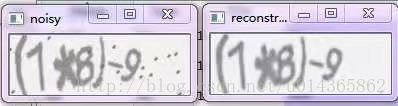
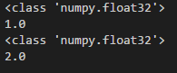
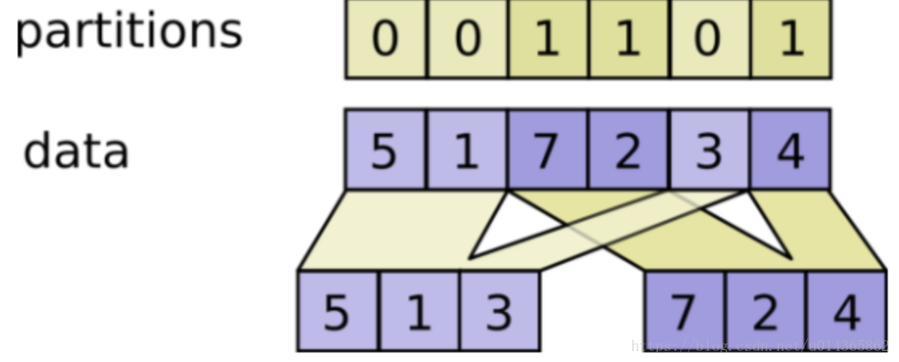
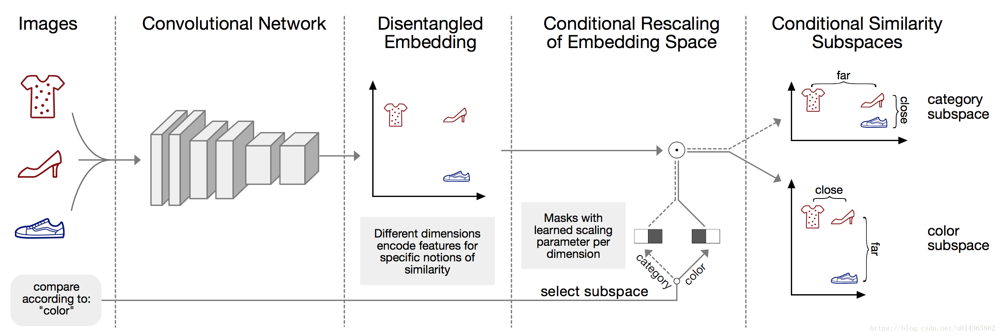
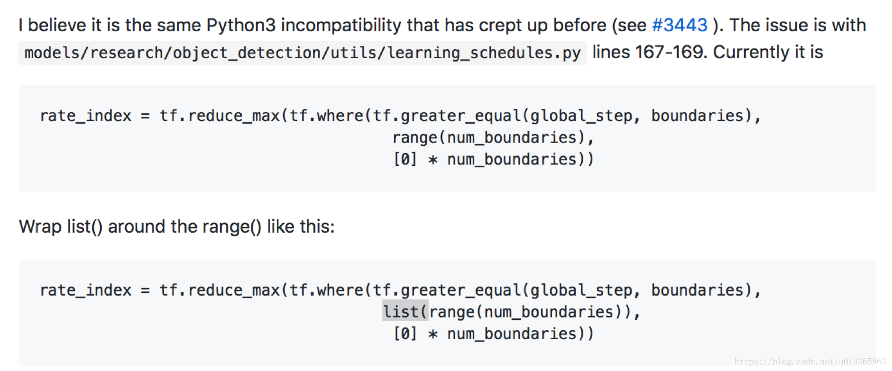
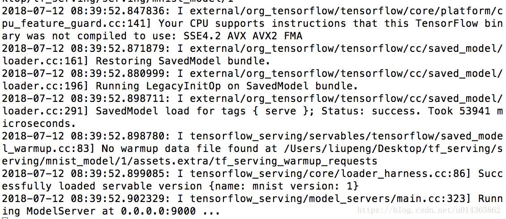
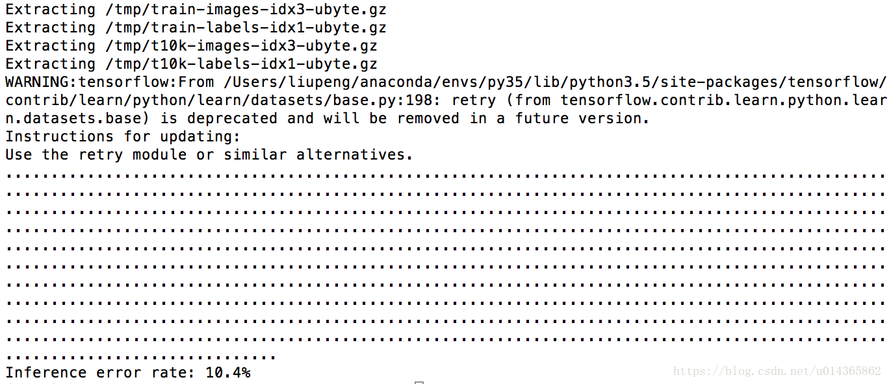

tf32: 一个简单的cnn模型：人脸特征点训练
===


一般在做人脸识别：人脸身份识别，人脸年龄识别，人脸性别识别，人脸表情识别等，都要进行人脸对齐，那么人脸对齐方法就要获取人脸的特征点：


下面是一个很早之前的简单代码，可以根据需要使用目前好的网络：

数据下载：链接：https://pan.baidu.com/s/1oAsq5eU 密码：q952

facial_keypoints_detection.py


```python

import pandas as pd
import numpy as np
import tensorflow as tf
import matplotlib.pyplot as plt

from util import *

import time
import sys


def error_measure(predictions, labels):
    return np.sum(np.power(predictions - labels, 2)) / (2 * predictions.shape[0])


if __name__ == '__main__':
    train_dataset, train_labels = load_data()
    test_dataset, _ = load_data(test=True)

    # Generate a validation set.
    validation_dataset = train_dataset[:VALIDATION_SIZE, ...]
    validation_labels = train_labels[:VALIDATION_SIZE]
    train_dataset = train_dataset[VALIDATION_SIZE:, ...]
    train_labels = train_labels[VALIDATION_SIZE:]

    train_size = train_labels.shape[0]
    print("train size is %d" % train_size)

    train_data_node = tf.placeholder(
        tf.float32,
        shape=(BATCH_SIZE, IMAGE_SIZE, IMAGE_SIZE, NUM_CHANNELS))
    train_labels_node = tf.placeholder(tf.float32, shape=(BATCH_SIZE, NUM_LABELS))

    eval_data_node = tf.placeholder(
        tf.float32,
        shape=(BATCH_SIZE, IMAGE_SIZE, IMAGE_SIZE, NUM_CHANNELS))

    conv1_weights = tf.Variable(
        tf.truncated_normal([5, 5, NUM_CHANNELS, 32],  # 5x5 filter, depth 32.
                            stddev=0.1,
                            seed=SEED))
    conv1_biases = tf.Variable(tf.zeros([32]))

    conv2_weights = tf.Variable(
        tf.truncated_normal([5, 5, 32, 64],
                            stddev=0.1,
                            seed=SEED))
    conv2_biases = tf.Variable(tf.constant(0.1, shape=[64]))

    fc1_weights = tf.Variable(  # fully connected, depth 512.
                                tf.truncated_normal(
                                    [IMAGE_SIZE // 4 * IMAGE_SIZE // 4 * 64, 512],
                                    stddev=0.1,
                                    seed=SEED))
    fc1_biases = tf.Variable(tf.constant(0.1, shape=[512]))

    fc2_weights = tf.Variable(  # fully connected, depth 512.
                                tf.truncated_normal(
                                    [512, 512],
                                    stddev=0.1,
                                    seed=SEED))
    fc2_biases = tf.Variable(tf.constant(0.1, shape=[512]))

    fc3_weights = tf.Variable(
        tf.truncated_normal([512, NUM_LABELS],
                            stddev=0.1,
                            seed=SEED))
    fc3_biases = tf.Variable(tf.constant(0.1, shape=[NUM_LABELS]))

    # We will replicate the model structure for the training subgraph, as well
    # as the evaluation subgraphs, while sharing the trainable parameters.
    def model(data, train=False):
        """The Model definition."""
        # 2D convolution, with 'SAME' padding (i.e. the output feature map has
        # the same size as the input). Note that {strides} is a 4D array whose
        # shape matches the data layout: [image index, y, x, depth].
        conv = tf.nn.conv2d(data,
                            conv1_weights,
                            strides=[1, 1, 1, 1],
                            padding='SAME')
        # conv = tf.Print(conv, [conv], "conv1: ", summarize=10)

        # Bias and rectified linear non-linearity.
        relu = tf.nn.relu(tf.nn.bias_add(conv, conv1_biases))
        # relu = tf.Print(relu, [relu], "relu1: ", summarize=10)

        # Max pooling. The kernel size spec {ksize} also follows the layout of
        # the data. Here we have a pooling window of 2, and a stride of 2.
        pool = tf.nn.max_pool(relu,
                              ksize=[1, 2, 2, 1],
                              strides=[1, 2, 2, 1],
                              padding='SAME')
        # pool = tf.Print(pool, [pool], "pool1: ", summarize=10)

        conv = tf.nn.conv2d(pool,
                            conv2_weights,
                            strides=[1, 1, 1, 1],
                            padding='SAME')
        # conv = tf.Print(conv, [conv], "conv2: ", summarize=10)

        relu = tf.nn.relu(tf.nn.bias_add(conv, conv2_biases))
        # relu = tf.Print(relu, [relu], "relu2: ", summarize=10)

        pool = tf.nn.max_pool(relu,
                              ksize=[1, 2, 2, 1],
                              strides=[1, 2, 2, 1],
                              padding='SAME')
        # pool = tf.Print(pool, [pool], "pool2: ", summarize=10)

        # Reshape the feature map cuboid into a 2D matrix to feed it to the
        # fully connected layers.
        pool_shape = pool.get_shape().as_list()
        reshape = tf.reshape(
            pool,
            [pool_shape[0], pool_shape[1] * pool_shape[2] * pool_shape[3]])
        # reshape = tf.Print(reshape, [reshape], "reshape: ", summarize=10)

        # Fully connected layer. Note that the '+' operation automatically
        # broadcasts the biases.
        hidden = tf.nn.relu(tf.matmul(reshape, fc1_weights) + fc1_biases)
        # hidden = tf.Print(hidden, [hidden], "hidden1: ", summarize=10)

        # Add a 50% dropout during training only. Dropout also scales
        # activations such that no rescaling is needed at evaluation time.
        if train:
            hidden = tf.nn.dropout(hidden, 0.5, seed=SEED)

        hidden = tf.nn.relu(tf.matmul(hidden, fc2_weights) + fc2_biases)
        # hidden = tf.Print(hidden, [hidden], "hidden2: ", summarize=10)

        if train:
            hidden = tf.nn.dropout(hidden, 0.5, seed=SEED)

        # return tf.nn.tanh(tf.matmul(hidden, fc3_weights) + fc3_biases)
        return tf.matmul(hidden, fc3_weights) + fc3_biases

    train_prediction = model(train_data_node, True)

    # Minimize the squared errors
    loss = tf.reduce_mean(tf.reduce_sum(tf.square(train_prediction - train_labels_node), 1))

    # L2 regularization for the fully connected parameters.
    regularizers = (tf.nn.l2_loss(fc1_weights) + tf.nn.l2_loss(fc1_biases) +
                    tf.nn.l2_loss(fc2_weights) + tf.nn.l2_loss(fc2_biases) +
                    tf.nn.l2_loss(fc3_weights) + tf.nn.l2_loss(fc3_biases))
    # Add the regularization term to the loss.
    loss += 1e-7 * regularizers

    # Predictions for the test and validation, which we'll compute less often.
    eval_prediction = model(eval_data_node)

    # Optimizer: set up a variable that's incremented once per batch and
    # controls the learning rate decay.
    global_step = tf.Variable(0, trainable=False)

    # Decay once per epoch, using an exponential schedule starting at 0.01.
    learning_rate = tf.train.exponential_decay(
        1e-3,                      # Base learning rate.
        global_step * BATCH_SIZE,  # Current index into the dataset.
        train_size,                # Decay step.
        0.95,                      # Decay rate.
        staircase=True)

    # train_step = tf.train.AdamOptimizer(5e-3).minimize(loss)
    # train_step = tf.train.GradientDescentOptimizer(1e-4).minimize(loss)
    # train_step = tf.train.MomentumOptimizer(1e-4, 0.95).minimize(loss)
    train_step = tf.train.AdamOptimizer(learning_rate, 0.95).minimize(loss, global_step=global_step)

    init = tf.initialize_all_variables()
    sess = tf.InteractiveSession()
    sess.run(init)

    loss_train_record = list() # np.zeros(n_epoch)
    loss_valid_record = list() # np.zeros(n_epoch)
    start_time = time.gmtime()

    # early stopping
    best_valid = np.inf
    best_valid_epoch = 0

    current_epoch = 0

    while current_epoch < NUM_EPOCHS:
        # Shuffle data
        shuffled_index = np.arange(train_size)
        np.random.shuffle(shuffled_index)
        train_dataset = train_dataset[shuffled_index]
        train_labels = train_labels[shuffled_index]

        for step in xrange(train_size / BATCH_SIZE):
            offset = step * BATCH_SIZE
            batch_data = train_dataset[offset:(offset + BATCH_SIZE), ...]
            batch_labels = train_labels[offset:(offset + BATCH_SIZE)]
            # This dictionary maps the batch data (as a numpy array) to the
            # node in the graph is should be fed to.
            feed_dict = {train_data_node: batch_data,
                         train_labels_node: batch_labels}
            _, loss_train, current_learning_rate = sess.run([train_step, loss, learning_rate], feed_dict=feed_dict)

        # After one epoch, make validation
        eval_result = eval_in_batches(validation_dataset, sess, eval_prediction, eval_data_node)
        loss_valid = error_measure(eval_result, validation_labels)

        print 'Epoch %04d, train loss %.8f, validation loss %.8f, train/validation %0.8f, learning rate %0.8f' % (
            current_epoch,
            loss_train, loss_valid,
            loss_train / loss_valid,
            current_learning_rate
        )
        loss_train_record.append(np.log10(loss_train))
        loss_valid_record.append(np.log10(loss_valid))
        sys.stdout.flush()

        if loss_valid < best_valid:
            best_valid = loss_valid
            best_valid_epoch = current_epoch
        elif best_valid_epoch + EARLY_STOP_PATIENCE < current_epoch:
            print("Early stopping.")
            print("Best valid loss was {:.6f} at epoch {}.".format(best_valid, best_valid_epoch))
            break

        current_epoch += 1

    print('train finish')
    end_time = time.gmtime()
    print time.strftime('%H:%M:%S', start_time)
    print time.strftime('%H:%M:%S', end_time)

    generate_submission(test_dataset, sess, eval_prediction, eval_data_node)

    # Show an example of comparison
    i = 0
    img = validation_dataset[i]
    lab_y = validation_labels[i]
    lab_p = eval_in_batches(validation_dataset, sess, eval_prediction, eval_data_node)[0]
    plot_sample(img, lab_p, lab_y)

    plot_learning_curve(loss_train_record, loss_valid_record)

```


util.py


```python

import matplotlib.pyplot as plt
from sklearn.utils import shuffle
import pandas as pd
import numpy as np
from sklearn.externals import joblib
from sklearn.learning_curve import learning_curve

FTRAIN = 'data/training.csv'
FTEST = 'data/test.csv'
FLOOKUP = 'data/IdLookupTable.csv'

BATCH_SIZE = 64
EVAL_BATCH_SIZE = 64
IMAGE_SIZE = 96
NUM_CHANNELS = 1
SEED = 66478  # Set to None for random seed.
NUM_LABELS = 30
NUM_EPOCHS = 1000
VALIDATION_SIZE = 100  # Size of the validation set.
EARLY_STOP_PATIENCE = 100


def load_data(test=False):
    fname = FTEST if test else FTRAIN
    df = pd.read_csv(fname)

    cols = df.columns[:-1]

    df['Image'] = df['Image'].apply(lambda im: np.fromstring(im, sep=' ') / 255.0)
    df = df.dropna()

    X = np.vstack(df['Image'])
    X = X.reshape(-1, IMAGE_SIZE, IMAGE_SIZE, 1)
    if not test:
        # y = (df[cols].values -48) / 48.0
        y = df[cols].values / 96.0
        X, y = shuffle(X, y)
        joblib.dump(cols, 'data/cols.pkl', compress=3)

    else:
        y = None
    return X, y


def plot_sample(x, y, truth=None):
    img = x.reshape(96, 96)
    plt.imshow(img, cmap='gray')
    if y is not None:
        plt.scatter(y[0::2] * 96, y[1::2] * 96)
    if truth is not None:
        plt.scatter(truth[0::2] * 96, truth[1::2] * 96, c='r', marker='x')
    plt.savefig("data/img.png")


# Small utility function to evaluate a dataset by feeding batches of data to
# {eval_data} and pulling the results from {eval_predictions}.
# Saves memory and enables this to run on smaller GPUs.
def eval_in_batches(data, sess, eval_prediction, eval_data_node):
    """Get all predictions for a dataset by running it in small batches."""
    size = data.shape[0]
    if size < EVAL_BATCH_SIZE:
        raise ValueError("batch size for evals larger than dataset: %d" % size)
    predictions = np.ndarray(shape=(size, NUM_LABELS), dtype=np.float32)
    for begin in xrange(0, size, EVAL_BATCH_SIZE):
        end = begin + EVAL_BATCH_SIZE
        if end <= size:
            predictions[begin:end, :] = sess.run(
                eval_prediction,
                feed_dict={eval_data_node: data[begin:end, ...]})
        else:
            batch_predictions = sess.run(
                eval_prediction,
                feed_dict={eval_data_node: data[-EVAL_BATCH_SIZE:, ...]})
            predictions[begin:, :] = batch_predictions[begin - size:, :]
    return predictions


def plot_learning_curve(loss_train_record, loss_valid_record):
    plt.figure()
    plt.plot(loss_train_record, label='train')
    plt.plot(loss_valid_record, c='r', label='validation')
    plt.ylabel("RMSE")
    plt.legend(loc='upper left', frameon=False)
    plt.savefig("data/learning_curve.png")


def generate_submission(test_dataset, sess, eval_prediction, eval_data_node):
    test_labels = eval_in_batches(test_dataset, sess, eval_prediction, eval_data_node)
    test_labels *= 96.0
    test_labels = test_labels.clip(0, 96)

    lookup_table = pd.read_csv(FLOOKUP)
    values = []

    cols = joblib.load('data/cols.pkl')

    for index, row in lookup_table.iterrows():
        values.append((
            row['RowId'],
            test_labels[row.ImageId - 1][np.where(cols == row.FeatureName)[0][0]],
        ))
    submission = pd.DataFrame(values, columns=('RowId', 'Location'))
    submission.to_csv('data/submission.csv', index=False)


def generate_learning_curve(estimator, title, scoring,  X, y, ylim=None, cv=None,
                            n_jobs=1, train_sizes=np.linspace(.1, 1.0, 5)):
    """
    Generate a simple plot of the test and traning learning curve.
    Parameters
    ----------
    estimator : object type that implements the "fit" and "predict" methods
    An object of that type which is cloned for each validation.
    title : string
    Title for the chart.
    X : array-like, shape (n_samples, n_features)
    Training vector, where n_samples is the number of samples and
    n_features is the number of features.
    y : array-like, shape (n_samples) or (n_samples, n_features), optional
    Target relative to X for classification or regression;
    None for unsupervised learning.
    ylim : tuple, shape (ymin, ymax), optional
    Defines minimum and maximum yvalues plotted.
    cv : integer, cross-validation generator, optional
    If an integer is passed, it is the number of folds (defaults to 3).
    Specific cross-validation objects can be passed, see
    sklearn.cross_validation module for the list of possible objects
    n_jobs : integer, optional
    Number of jobs to run in parallel (default 1).
    """
    plt.figure()
    plt.title(title)
    if ylim is not None:
        plt.ylim(*ylim)
    plt.xlabel("Training examples")
    plt.ylabel("Score")
    train_sizes, train_scores, test_scores = learning_curve(
        estimator, X, y, scoring=scoring, cv=cv, n_jobs=n_jobs, train_sizes=train_sizes)
    train_scores_mean = np.mean(train_scores, axis=1)
    train_scores_std = np.std(train_scores, axis=1)
    test_scores_mean = np.mean(test_scores, axis=1)
    test_scores_std = np.std(test_scores, axis=1)
    plt.grid()
    plt.fill_between(train_sizes, train_scores_mean - train_scores_std,
                     train_scores_mean + train_scores_std, alpha=0.1,
                     color="r")
    plt.fill_between(train_sizes, test_scores_mean - test_scores_std,
                     test_scores_mean + test_scores_std, alpha=0.1, color="g")
    plt.plot(train_sizes, train_scores_mean, 'o-', color="r",
             label="Training score")
    plt.plot(train_sizes, test_scores_mean, 'o-', color="g",
             label="Cross-validation score")
    plt.legend(loc="best")
    plt.savefig("data/learning_curve.png")


def make_submission(test_labels):
    test_labels *= 96.0
    test_labels = test_labels.clip(0, 96)

    lookup_table = pd.read_csv(FLOOKUP)
    values = []

    cols = joblib.load('data/cols.pkl')

    for index, row in lookup_table.iterrows():
        values.append((
            row['RowId'],
            test_labels[row.ImageId - 1][np.where(cols == row.FeatureName)[0][0]],
        ))
    submission = pd.DataFrame(values, columns=('RowId', 'Location'))
    submission.to_csv('data/submission.csv', index=False)


def load_dataframe(test=False):
    fname = FTEST if test else FTRAIN
    df = pd.read_csv(fname)
    cols = df.columns[:-1]
    df['Image'] = df['Image'].apply(lambda im: np.fromstring(im, sep=' ') / 255.0)

    if not test:
        df[cols] = df[cols].apply(lambda y: y / 96.0)
    return df


def extract_test_data(df):
    X = np.vstack(df['Image'].values)
    X = X.astype(np.float32)
    X = X.reshape(-1, IMAGE_SIZE, IMAGE_SIZE, 1)
    return X

def extract_train_data(df, flip_indices, cols):
    data = df[list(cols) + ['Image']].copy()
    data = data.dropna()

    X = np.vstack(data['Image'].values)
    X = X.astype(np.float32)
    X = X.reshape(-1, IMAGE_SIZE, IMAGE_SIZE, 1)

    y = data[data.columns[:-1]].values
    if len(flip_indices) != 0:
        X_flip = X[:, :, ::-1, :]
        X = np.vstack([X, X_flip])
        y_flip = y.copy()
        y_flip[:, ::2] *= -1
        y_flip[:, ::2] += 1
        for a, b in flip_indices:
            y_flip[:, [a, b]] = y_flip[:, [b, a]]

        y = np.vstack([y, y_flip])

    X, y = shuffle(X, y, random_state=42)  # shuffle train data
    y = y.astype(np.float32)

    return X, y


def create_submission(predicted_labels, columns):
    predicted_labels *= 96.0
    predicted_labels = predicted_labels.clip(0, 96)
    df = pd.DataFrame(predicted_labels, columns=columns)
    lookup_table = pd.read_csv(FLOOKUP)
    values = []

    for index, row in lookup_table.iterrows():
        values.append((
            row['RowId'],
            df.ix[row.ImageId - 1][row.FeatureName],
        ))

    submission = pd.DataFrame(values, columns=('RowId', 'Location'))
    submission.to_csv("data/submission.csv", index=False)


SPECIALIST_SETTINGS = [
    dict(
        columns=(
            'left_eye_center_x', 'left_eye_center_y',
            'right_eye_center_x', 'right_eye_center_y',
        ),
        flip_indices=((0, 2), (1, 3)),
        ),

    dict(
        columns=(
            'nose_tip_x', 'nose_tip_y',
        ),
        flip_indices=(),
        ),

    dict(
        columns=(
            'mouth_left_corner_x', 'mouth_left_corner_y',
            'mouth_right_corner_x', 'mouth_right_corner_y',
            'mouth_center_top_lip_x', 'mouth_center_top_lip_y',
        ),
        flip_indices=((0, 2), (1, 3)),
        ),

    dict(
        columns=(
            'mouth_center_bottom_lip_x',
            'mouth_center_bottom_lip_y',
        ),
        flip_indices=(),
        ),

    dict(
        columns=(
            'left_eye_inner_corner_x', 'left_eye_inner_corner_y',
            'right_eye_inner_corner_x', 'right_eye_inner_corner_y',
            'left_eye_outer_corner_x', 'left_eye_outer_corner_y',
            'right_eye_outer_corner_x', 'right_eye_outer_corner_y',
        ),
        flip_indices=((0, 2), (1, 3), (4, 6), (5, 7)),
        ),

    dict(
        columns=(
            'left_eyebrow_inner_end_x', 'left_eyebrow_inner_end_y',
            'right_eyebrow_inner_end_x', 'right_eyebrow_inner_end_y',
            'left_eyebrow_outer_end_x', 'left_eyebrow_outer_end_y',
            'right_eyebrow_outer_end_x', 'right_eyebrow_outer_end_y',
        ),
        flip_indices=((0, 2), (1, 3), (4, 6), (5, 7)),
        ),
    ]


```

上面的facial_keypoints_detection.py代码可以换成这个： 准确率更高。

```python

#coding=utf-8
import pandas as pd
import numpy as np
import tensorflow as tf
import matplotlib.pyplot as plt

from util import *

import time
import sys
import os
os.environ["CUDA_DEVICE_ORDER"] = "PCI_BUS_ID"
os.environ["CUDA_VISIBLE_DEVICES"] = "1"


def error_measure(predictions, labels, sess):
    return np.sum(np.power(predictions - labels, 2)) / (2 * predictions.shape[0])
    #loss = tf.reduce_mean(tf.reduce_sum(tf.square(predictions - labels), 1))
    #loss = sess.run(loss)
    #return loss

def fully_connected(prev_layer, num_units):

    layer = tf.layers.dense(prev_layer, num_units, use_bias=True, activation=None)
    # layer = tf.layers.batch_normalization(layer, training=is_training)
    layer = tf.nn.relu(layer)
    return layer


def conv_layer(prev_layer, layer_depth):

    strides = 2 if layer_depth % 3 == 0 else 1
    conv_layer = tf.layers.conv2d(prev_layer, layer_depth*16, 3, strides, 'same', use_bias=True, activation=None)
    # conv_layer = tf.layers.batch_normalization(conv_layer, training=is_training)
    conv_layer = tf.nn.relu(conv_layer)

    return conv_layer


if __name__ == '__main__':
    train_dataset, train_labels = load_data()
    test_dataset, _ = load_data(test=True)

    # Generate a validation set.
    validation_dataset = train_dataset[:VALIDATION_SIZE, ...]
    validation_labels = train_labels[:VALIDATION_SIZE]
    train_dataset = train_dataset[VALIDATION_SIZE:, ...]
    train_labels = train_labels[VALIDATION_SIZE:]

    train_size = train_labels.shape[0]
    print("train size is %d" % train_size)

    train_data_node = tf.placeholder(
        tf.float32,
        shape=(None, IMAGE_SIZE, IMAGE_SIZE, NUM_CHANNELS))
    train_labels_node = tf.placeholder(tf.float32, shape=(None, NUM_LABELS))

    eval_data_node = tf.placeholder(
        tf.float32,
        shape=(None, IMAGE_SIZE, IMAGE_SIZE, NUM_CHANNELS))


    # We will replicate the model structure for the training subgraph, as well
    # as the evaluation subgraphs, while sharing the trainable parameters.
    def model(data, train=False):
        """The Model definition."""

        # Feed the inputs into a series of 20 convolutional layers
        layer = tf.reshape(data, shape=[-1, IMAGE_SIZE, IMAGE_SIZE, NUM_CHANNELS])
        for layer_i in [2, 4, 8, 16]:
            for n in range(1):
                layer = conv_layer(layer, layer_i)
            layer = tf.nn.max_pool(layer, ksize=[1, 3, 3, 1], strides=[1, 2, 2, 1], padding='SAME')

        # Flatten the output from the convolutional layers
        orig_shape = layer.get_shape().as_list()
        layer = tf.reshape(layer, shape=[-1, orig_shape[1] * orig_shape[2] * orig_shape[3]])

        # Add one fully connected layer
        layer = fully_connected(layer, 512)
        # layer = tf.nn.dropout(layer, keep_prob_fc)
        if train:
            layer = tf.nn.dropout(layer, 0.5)
        else:
            layer = tf.nn.dropout(layer, 1.0)
        layer = fully_connected(layer, 512)

        if train:
            layer = tf.nn.dropout(layer, 0.5)
        else:
            layer = tf.nn.dropout(layer, 1.0)

        logits = tf.layers.dense(layer, NUM_LABELS)

        #if test:
        #    logits = tf.nn.sigmoid(logits)

        return logits


    train_prediction = model(train_data_node, True)

    # Minimize the squared errors
    loss = tf.reduce_mean(tf.reduce_sum(tf.square(train_prediction - train_labels_node), 1))

    # L2 regularization for the fully connected parameters.
    # regularizers = (tf.nn.l2_loss(fc1_weights) + tf.nn.l2_loss(fc1_biases) +
    #                tf.nn.l2_loss(fc2_weights) + tf.nn.l2_loss(fc2_biases) +
    #                tf.nn.l2_loss(fc3_weights) + tf.nn.l2_loss(fc3_biases))
    # Add the regularization term to the loss.
    # loss += 1e-7 * regularizers

    # Predictions for the test and validation, which we'll compute less often.
    eval_prediction = model(eval_data_node)

    # Optimizer: set up a variable that's incremented once per batch and
    # controls the learning rate decay.
    global_step = tf.Variable(0, trainable=False)

    # Decay once per epoch, using an exponential schedule starting at 0.01.
    learning_rate = tf.train.exponential_decay(
        1e-3,                      # Base learning rate.
        global_step * BATCH_SIZE,  # Current index into the dataset.
        train_size,                # Decay step.
        1.0,                      # Decay rate.
        staircase=True)

    # train_step = tf.train.AdamOptimizer(5e-3).minimize(loss)
    # train_step = tf.train.GradientDescentOptimizer(1e-4).minimize(loss)
    # train_step = tf.train.MomentumOptimizer(1e-4, 0.95).minimize(loss)
    train_step = tf.train.AdamOptimizer(learning_rate).minimize(loss, global_step=global_step)

    init = tf.initialize_all_variables()
    sess = tf.InteractiveSession()
    sess.run(init)

    loss_train_record = list() # np.zeros(n_epoch)
    loss_valid_record = list() # np.zeros(n_epoch)
    start_time = time.gmtime()

    # early stopping
    best_valid = np.inf
    best_valid_epoch = 0

    current_epoch = 0

    while current_epoch < NUM_EPOCHS:
        # Shuffle data
        shuffled_index = np.arange(train_size)
        np.random.shuffle(shuffled_index)
        train_dataset = train_dataset[shuffled_index]
        train_labels = train_labels[shuffled_index]

        for step in xrange(train_size / BATCH_SIZE):
            offset = step * BATCH_SIZE
            batch_data = train_dataset[offset:(offset + BATCH_SIZE), ...]
            batch_labels = train_labels[offset:(offset + BATCH_SIZE)]
            # This dictionary maps the batch data (as a numpy array) to the
            # node in the graph is should be fed to.
            feed_dict = {train_data_node: batch_data,
                         train_labels_node: batch_labels}
            _, loss_train, current_learning_rate = sess.run([train_step, loss, learning_rate], feed_dict=feed_dict)

        # After one epoch, make validation
        # eval_result = eval_in_batches(validation_dataset, sess, eval_prediction, eval_data_node)
        # loss_valid = error_measure(eval_result, validation_labels, sess)
        feed_dict = {train_data_node: validation_dataset,
                         train_labels_node: validation_labels}
        loss_valid = sess.run(loss, feed_dict=feed_dict)

        print ('Epoch %04d, train loss %.8f, validation loss %.8f, train/validation %0.8f, learning rate %0.8f' % (
            current_epoch,
            loss_train, loss_valid,
            loss_train / loss_valid,
            current_learning_rate
        ))
        loss_train_record.append(np.log10(loss_train))
        loss_valid_record.append(np.log10(loss_valid))
        sys.stdout.flush()

        if loss_valid < best_valid:
            best_valid = loss_valid
            best_valid_epoch = current_epoch
        elif best_valid_epoch + EARLY_STOP_PATIENCE < current_epoch:
            print("Early stopping.")
            print("Best valid loss was {:.6f} at epoch {}.".format(best_valid, best_valid_epoch))
            break

        current_epoch += 1

    print('train finish')
    end_time = time.gmtime()
    print (time.strftime('%H:%M:%S', start_time))
    print (time.strftime('%H:%M:%S', end_time))

    # feed_dict = {eval_data_node: test_dataset}
    # test_labels  = sess.run(eval_prediction, feed_dict=feed_dict)

    generate_submission(test_dataset, sess, train_prediction, train_data_node)

    # Show an example of comparison
    i = 0
    img = validation_dataset[i]
    lab_y = validation_labels[i]
    lab_p = eval_in_batches(validation_dataset, sess, eval_prediction, eval_data_node)[0]
    plot_sample(img, lab_p, lab_y)

    plot_learning_curve(loss_train_record, loss_valid_record)

```


tf33: 图像降噪：卷积自编码
===

MachineLP的Github（欢迎follow）：https://github.com/MachineLP


以前打比赛的大师，做的卷积自编码用来图像的降噪：样本是噪声图片，标签是没有噪声的图片。

整个结果很简单，跟自动编码器很像，结构上都是降维后升维（encoder-decoder）的过程，但是用途完全不一样。

这只是一个雏形，后面优化的空间很大，前段时间在做图像语义分隔，原理类似，但是图像语义分隔开始扩展到很多领域：无人驾驶，基于图片的三维重建等等，随之而来是：开山之作：FCN、CRF、SegNet/DeconvNet、DeepLab系列、unet、refinenet、mask-rcnn等等。但是都是基于迁移学习来做的，迁移学习一个很大的优势就是可以用少量样本达到很好的效果，不信可以自己搭架模型试一下，所示现在能用迁移学习的绝不从头自己开始训练。

看一下效果图：




要自己生成训练样本可以参考：tf20: CNN—识别字符验证码 http://blog.csdn.net/u014365862/article/details/53869816


代码如下：

```python

import re
import cv2 as cv
import numpy as np
import tensorflow as tf
import sklearn.preprocessing as pre

premn=pre.MinMaxScaler()
premn.fit_transform(range(0,256))

"""加载数据"""
def equalizeHistColor(img):
    """
    equalizeHistColor:对彩色图像进行直方图均衡化.
    img:待处理的图片
    """
    channels=cv.split(img)
    for channel in channels:
        channel=cv.equalizeHist(channel)
    return cv.merge(channels)

def readLabels(folder='./CaptchaImages/labels.txt'):
    labels=[]
    with open('./CaptchaImages/labels.txt','r') as flabel:
        for line in flabel:
            line=line.strip('\n')
            noise,source=re.split(',',line)
            source,label=re.split(':',source)
            labels.append([noise,source,label])
    return np.array(labels)

labels=readLabels()
def readImages(start,num):
    noiseimg=[]
    sourceimg=[]
    for i in range(start,start+num):
        noiseimg.append(cv.cvtColor(equalizeHistColor(cv.imread(labels[i,0])),cv.COLOR_RGB2GRAY))
        sourceimg.append(cv.cvtColor(equalizeHistColor(cv.imread(labels[i,1])),cv.COLOR_RGB2GRAY))
    return np.array(noiseimg),np.array(sourceimg)

input('数据加载完成,任意键继续...')
"""构造模型"""
inputs_ = tf.placeholder(tf.float32, (None, 60, 180, 1), name='inputs_')
targets_ = tf.placeholder(tf.float32, (None, 60, 180, 1), name='targets_')
"""Encoder三层卷积"""
conv1 = tf.layers.conv2d(inputs_, 64, (3,3), padding='same', activation=tf.nn.relu)
conv1 = tf.layers.max_pooling2d(conv1, (2,2), (2,2), padding='same')
conv2 = tf.layers.conv2d(conv1, 64, (3,3), padding='same', activation=tf.nn.relu)
conv2 = tf.layers.max_pooling2d(conv2, (2,2), (2,2), padding='same')
conv3 = tf.layers.conv2d(conv2, 32, (3,3), padding='same', activation=tf.nn.relu)
conv3 = tf.layers.max_pooling2d(conv3, (2,2), (2,2), padding='same')
"""Decoder三层卷积"""
conv7 = tf.image.resize_nearest_neighbor(conv3, (7,7))
conv7 = tf.layers.conv2d(conv7, 32, (3,3), padding='same', activation=tf.nn.relu)
conv8 = tf.image.resize_nearest_neighbor(conv7, (14,14))
conv8 = tf.layers.conv2d(conv8, 64, (3,3), padding='same', activation=tf.nn.relu)
conv9 = tf.image.resize_nearest_neighbor(conv8, (60,180))
conv9 = tf.layers.conv2d(conv9, 64, (3,3), padding='same', activation=tf.nn.relu)
"""logits and outputs"""
logits_ = tf.layers.conv2d(conv9, 1, (3,3), padding='same', activation=None)
outputs_ = tf.nn.sigmoid(logits_, name='outputs_')
"""loss and Optimizer"""
loss = tf.nn.sigmoid_cross_entropy_with_logits(labels=targets_, logits=logits_)
cost = tf.reduce_mean(loss)
optimizer = tf.train.AdamOptimizer(0.001).minimize(cost)
input('构造模型完成,任意键开始训练...')
"""训练"""
sess = tf.Session()
saver = tf.train.Saver(tf.trainable_variables())
noise_factor = 0.5
epochs = 3
batch_size = 70
sess.run(tf.global_variables_initializer())

for e in range(epochs):
    n=0
    for idx in range(labels.shape[0]//batch_size):

        noisy_imgs,imgs=readImages(idx*batch_size,batch_size)
        noisy_imgs=noisy_imgs.astype('float32')
        imgs=imgs.astype('float32')
        for i in range(noisy_imgs.shape[0]):
            noisy_imgs[i]=premn.transform(noisy_imgs[i])
            imgs[i]=premn.transform(imgs[i])
        noisy_imgs=noisy_imgs.reshape(-1, 60, 180, 1)
        imgs=imgs.reshape(-1, 60, 180, 1)

        batch_cost, _ = sess.run([cost, optimizer],
                           feed_dict={inputs_: noisy_imgs,
                                     targets_: imgs})

        print("Epoch: {}/{} ".format(e+1, epochs),
             "Training loss: {:.9f}".format(batch_cost))
        if batch_cost<0.1: n=n+1
        else: n=0
        if n>30: break

input('模型训练完成,任意键开始预测...')
"""预测"""
noisy_imgs,imgs=readImages(3000,5)
for i in range(noisy_imgs.shape[0]):
    noisy_imgs[i]=premn.transform(noisy_imgs[i])
    imgs[i]=premn.transform(imgs[i])
noisy_imgs=noisy_imgs.reshape(-1, 60, 180, 1)

reconstructed = sess.run(outputs_,
                         feed_dict={inputs_: noisy_imgs.reshape((5, 60, 180, 1))})

```

tf34：从ckpt中读取权重值
===

在TensorFlow里，提供了tf.train.NewCheckpointReader来查看model.ckpt文件中保存的变量信息。

一个简单的例子：

```python
import tensorflow as tf

w = tf.Variable(2, dtype=tf.float32, name='w')  
b = tf.Variable(1, dtype=tf.float32, name='b')  

x = tf.placeholder(tf.float32, shape=[1], name='x')  

logit = w * x + b

init = tf.initialize_all_variables()  

saver = tf.train.Saver()  

with tf.Session() as sess:  
    sess.run(init)  
    saver.save(sess, "./model.ckpt")

```

```python

import tensorflow as tf

reader = tf.train.NewCheckpointReader("./model.ckpt")  

variables = reader.get_variable_to_shape_map()  

for v in variables:
    w = reader.get_tensor(v)  
    print(type(w))  
    # print(w.shape)
    # print (w[0])
    print(w)

```




tf35：tf.estimator
====

MachineLP的Github（欢迎follow）：https://github.com/MachineLP

tf.estimator 是Tensorflow的高级API， 可快速训练和评估各种传统机器学习模型。

看下面一段代码， 使用神经网络应用到Iris数据集上。

```python

import os
from six.moves.urllib.request import urlopen

import numpy as np
import tensorflow as tf

# Data sets
IRIS_TRAINING = "iris_training.csv"
IRIS_TRAINING_URL = "http://download.tensorflow.org/data/iris_training.csv"

IRIS_TEST = "iris_test.csv"
IRIS_TEST_URL = "http://download.tensorflow.org/data/iris_test.csv"

def main():
  # If the training and test sets aren't stored locally, download them.
  if not os.path.exists(IRIS_TRAINING):
    raw = urlopen(IRIS_TRAINING_URL).read()
    with open(IRIS_TRAINING, "wb") as f:
      f.write(raw)

  if not os.path.exists(IRIS_TEST):
    raw = urlopen(IRIS_TEST_URL).read()
    with open(IRIS_TEST, "wb") as f:
      f.write(raw)

  # Load datasets.
  training_set = tf.contrib.learn.datasets.base.load_csv_with_header(
      filename=IRIS_TRAINING,
      target_dtype=np.int,
      features_dtype=np.float32)
  test_set = tf.contrib.learn.datasets.base.load_csv_with_header(
      filename=IRIS_TEST,
      target_dtype=np.int,
      features_dtype=np.float32)

  # Specify that all features have real-value data
  feature_columns = [tf.feature_column.numeric_column("x", shape=[4])]

  # Build 3 layer DNN with 10, 20, 10 units respectively.
  classifier = tf.estimator.DNNClassifier(feature_columns=feature_columns,
                                          hidden_units=[10, 20, 10],
                                          n_classes=3,
                                          model_dir="/tmp/iris_model")
  # Define the training inputs
  train_input_fn = tf.estimator.inputs.numpy_input_fn(
      x={"x": np.array(training_set.data)},
      y=np.array(training_set.target),
      num_epochs=None,
      shuffle=True)

  # Train model.
  classifier.train(input_fn=train_input_fn, steps=2000)

  # Define the test inputs
  test_input_fn = tf.estimator.inputs.numpy_input_fn(
      x={"x": np.array(test_set.data)},
      y=np.array(test_set.target),
      num_epochs=1,
      shuffle=False)

  # Evaluate accuracy.
  accuracy_score = classifier.evaluate(input_fn=test_input_fn)["accuracy"]

  print("\nTest Accuracy: {0:f}\n".format(accuracy_score))

  # Classify two new flower samples.
  new_samples = np.array(
      [[6.4, 3.2, 4.5, 1.5],
       [5.8, 3.1, 5.0, 1.7]], dtype=np.float32)
  predict_input_fn = tf.estimator.inputs.numpy_input_fn(
      x={"x": new_samples},
      num_epochs=1,
      shuffle=False)

  predictions = list(classifier.predict(input_fn=predict_input_fn))
  predicted_classes = [p["classes"] for p in predictions]

  print(
      "New Samples, Class Predictions:    {}\n"
      .format(predicted_classes))

if __name__ == "__main__":
    main()

```


tf36：使用tensorbord显示图片
===

MachineLP的Github（欢迎follow）：https://github.com/MachineLP

下面代码是使用tensorboard显示图片：


```python

#coding=utf-8
import tensorflow as tf

# 获取图片数据
file = open('lp.jpg', 'rb')
data = file.read()
file.close()

# 图片处理
image = tf.image.decode_jpeg(data, channels=3)
image = tf.expand_dims(image, 0)

# 添加到日志中
sess = tf.Session()
writer = tf.summary.FileWriter('logs')
summary_op = tf.summary.image("image1", image)

# 运行并写入日志
summary = sess.run(summary_op)
writer.add_summary(summary)

# 关闭
writer.close()
sess.close()

```


更多学习资料可以看：http://geek.csdn.net/news/detail/197155

还可以看：https://segmentfault.com/a/1190000008302430


tf37：tensorflow中将模型的权重值限定范围
===

MachineLP的Github（欢迎follow）：https://github.com/MachineLP

我们在搭建模型的时候，受到一些收敛条件的限制，像wgan_loss需要讲权重设置在[-0.01, 0.01]，这个操作在TF中是这样完成中。

首先， 需要获得你搭建net的左右变量：

D_vars = tf.get_collection(tf.GraphKeys.GLOBAL_VARIABLES, 'Discriminator_dcgan')

    其中，'Discriminator_dcgan' 是net的名字，其下一层包含很多变量的名字。

然后，遍历每一个变量，将其限定在一定的范围：即小于-1的值设定在-1，大于1的值设定在1。

最后，在每个batch更新完参数后，需要run一下： _ = sess.run(clip_disc_weights)


代码如下：

```python

D_vars = tf.get_collection(tf.GraphKeys.GLOBAL_VARIABLES, 'Discriminator_dcgan')
clip_ops = []
for var in D_vars:
    clip_bounds = [-.01, .01]
    clip_ops.append(
        tf.assign(
            var,
            tf.clip_by_value(var, clip_bounds[0], clip_bounds[1])
        )
    )
clip_disc_weights = tf.group(*clip_ops)
......
_ = session.run(clip_disc_weights)


```
总结，wgan_loss不加入权重限制不会收敛，同时wgan时候经过严格的理论推导，当理论不充分时，在使用的时候需要多实验室，实验出好的结果，可以再找理论支撑嘛，哈哈丷


tf37：tensorflow中将模型的权重值限定范围
====


MachineLP的Github（欢迎follow）：https://github.com/MachineLP

我们在搭建模型的时候，受到一些收敛条件的限制，像wgan_loss需要讲权重设置在[-0.01, 0.01]，这个操作在TF中是这样完成中。

首先， 需要获得你搭建net的左右变量：

D_vars = tf.get_collection(tf.GraphKeys.GLOBAL_VARIABLES, 'Discriminator_dcgan')

    其中，'Discriminator_dcgan' 是net的名字，其下一层包含很多变量的名字。

然后，遍历每一个变量，将其限定在一定的范围：即小于-1的值设定在-1，大于1的值设定在1。

最后，在每个batch更新完参数后，需要run一下： _ = sess.run(clip_disc_weights)


代码如下：


```python

D_vars = tf.get_collection(tf.GraphKeys.GLOBAL_VARIABLES, 'Discriminator_dcgan')
clip_ops = []
for var in D_vars:
    clip_bounds = [-.01, .01]
    clip_ops.append(
        tf.assign(
            var,
            tf.clip_by_value(var, clip_bounds[0], clip_bounds[1])
        )
    )
clip_disc_weights = tf.group(*clip_ops)
......
_ = session.run(clip_disc_weights)

```


总结，wgan_loss不加入权重限制不会收敛，同时wgan时候经过严格的理论推导，当理论不充分时，在使用的时候需要多实验室，实验出好的结果，可以再找理论支撑嘛，哈哈丷


tf38：tensorflow使用pipeline通过队列方式读取数据训练
====


MachineLP的Github（欢迎follow）：https://github.com/MachineLP


TF在训练的时候有好多方式，可以用转为TF的tfRecords；也可以通过数组读进内存的方式（数据量小或者内存总够大）；或者数据量大时在每个batch的时候处理数据，这样会加大交互的时间，减少gpu的利用率；那么今天介绍一种借助TF的API使用pipeline通过队列方式读取数据的方式：

先认识两个API：

ops.convert_to_tensor() : 将不是张量的数据转为张量。

tf.dynamic_partition()：用于拆分熟组，可以看下图。




熟悉了这两个API下面代码就不难理解了，可以根据自己的需要自行整理。

```python

import tensorflow as tf  
import random  
from tensorflow.python.framework import ops  
from tensorflow.python.framework import dtypes  

dataset_path      = "/path/to/your/dataset/mnist/"  
test_labels_file  = "test-labels.csv"  
train_labels_file = "train-labels.csv"  

test_set_size = 5  

IMAGE_HEIGHT  = 28  
IMAGE_WIDTH   = 28  
NUM_CHANNELS  = 3  
BATCH_SIZE    = 5  

def encode_label(label):  
  return int(label)  

def read_label_file(file):  
  f = open(file, "r")  
  filepaths = []  
  labels = []  
  for line in f:  
    filepath, label = line.split(",")  
    filepaths.append(filepath)  
    labels.append(encode_label(label))  
  return filepaths, labels  

# reading labels and file path  
train_filepaths, train_labels = read_label_file(dataset_path + train_labels_file)  
test_filepaths, test_labels = read_label_file(dataset_path + test_labels_file)  

# transform relative path into full path  
train_filepaths = [ dataset_path + fp for fp in train_filepaths]  
test_filepaths = [ dataset_path + fp for fp in test_filepaths]  

# for this example we will create or own test partition  
all_filepaths = train_filepaths + test_filepaths  
all_labels = train_labels + test_labels  

all_filepaths = all_filepaths[:20]  
all_labels = all_labels[:20]  

# convert string into tensors  
all_images = ops.convert_to_tensor(all_filepaths, dtype=dtypes.string)  
all_labels = ops.convert_to_tensor(all_labels, dtype=dtypes.int32)  

# create a partition vector  
partitions = [0] * len(all_filepaths)  
partitions[:test_set_size] = [1] * test_set_size  
random.shuffle(partitions)  

# partition our data into a test and train set according to our partition vector  
train_images, test_images = tf.dynamic_partition(all_images, partitions, 2)  
train_labels, test_labels = tf.dynamic_partition(all_labels, partitions, 2)  

# create input queues  
train_input_queue = tf.train.slice_input_producer(  
                                    [train_images, train_labels],  
                                    shuffle=False)  
test_input_queue = tf.train.slice_input_producer(  
                                    [test_images, test_labels],  
                                    shuffle=False)  

# process path and string tensor into an image and a label  
file_content = tf.read_file(train_input_queue[0])  
train_image = tf.image.decode_jpeg(file_content, channels=NUM_CHANNELS)  
train_label = train_input_queue[1]  

file_content = tf.read_file(test_input_queue[0])  
test_image = tf.image.decode_jpeg(file_content, channels=NUM_CHANNELS)  
test_label = test_input_queue[1]  

# define tensor shape  
train_image.set_shape([IMAGE_HEIGHT, IMAGE_WIDTH, NUM_CHANNELS])  
test_image.set_shape([IMAGE_HEIGHT, IMAGE_WIDTH, NUM_CHANNELS])  


# collect batches of images before processing  
train_image_batch, train_label_batch = tf.train.batch(  
                                    [train_image, train_label],  
                                    batch_size=BATCH_SIZE  
                                    #,num_threads=1  
                                    )  
test_image_batch, test_label_batch = tf.train.batch(  
                                    [test_image, test_label],  
                                    batch_size=BATCH_SIZE  
                                    #,num_threads=1  
                                    )  

print "input pipeline ready"  

with tf.Session() as sess:  

  # initialize the variables  
  tf.local_variables_initializer().run()
  tf.global_variables_initializer().run()
  # sess.run(tf.initialize_all_variables())  

  # initialize the queue threads to start to shovel data  
  coord = tf.train.Coordinator()  
  threads = tf.train.start_queue_runners(coord=coord)  

  print "from the train set:"  
  for i in range(20):  
    print sess.run(train_label_batch)  

  print "from the test set:"  
  for i in range(10):  
    print sess.run(test_label_batch)  

  # stop our queue threads and properly close the session  
  coord.request_stop()  
  coord.join(threads)  
  sess.close()  

```

tf39：tensorflow之seq2seq
====

MachineLP的Github（欢迎follow）：https://github.com/MachineLP

seq2seq还是很赞的，既能做翻译、又能做image captioning，还能做多标签。

原理介绍已经有很多了，那我们在看一下TF的seq2seq代码吧：

```python

# coding=utf-8
import tensorflow as tf
import numpy as np
import os, re
from tensorflow.python.layers.core import Dense

MAX_CHAR_PER_LINE = 20

# 加载已有数据进行处理
def load_sentences(path):
    with open(path, 'r', encoding="ISO-8859-1") as f:
        data_raw = f.read().encode('ascii', 'ignore').decode('UTF-8').lower()
        data_alpha = re.sub('[^a-z\n]+', ' ', data_raw)
        data = []
        for line in data_alpha.split('\n'):
            # 只取每行的前20
            data.append(line[:MAX_CHAR_PER_LINE])
    return data

# 得到输入和输出的词典
def extract_character_vocab(data):
    special_symbols = ['<PAD>', '<UNK>', '<GO>',  '<EOS>']
    # 集合  
    set_symbols = set([character for line in data for character in line])
    all_symbols = special_symbols + list(set_symbols)
    int_to_symbol = {word_i: word for word_i, word in enumerate(all_symbols)}
    symbol_to_int = {word: word_i for word_i, word in int_to_symbol.items()}
    return int_to_symbol, symbol_to_int

input_sentences = load_sentences('data/words_input.txt')  
output_sentences = load_sentences('data/words_output.txt')  

# 获取词典
input_int_to_symbol, input_symbol_to_int = extract_character_vocab(input_sentences)
output_int_to_symbol, output_symbol_to_int = extract_character_vocab(output_sentences)

print (input_int_to_symbol)
print (output_int_to_symbol)
# {0: '<PAD>', 1: '<UNK>', 2: '<GO>', 3: '<EOS>', 4: 'q', 5: 'e', 6: 'd', 7: 'u', 8: 'c', 9: 'b', 10: 'j', 11: 'm', 12: 'f', 13: 's', 14: 'l', 15:'i', 16: 'x', 17: 'w', 18: 'z', 19: 'a', 20: 'v', 21: 'p', 22: 'y', 23: 'k', 24: 'h', 25: 'r', 26: 't', 27: ' ', 28: 'o', 29: 'g', 30: 'n'}
# {0: '<PAD>', 1: '<UNK>', 2: '<GO>', 3: '<EOS>', 4: 'q', 5: 'e', 6: 'd', 7: 'u', 8: 'c', 9: 'b', 10: 'j', 11: 'm', 12: 'f', 13: 's', 14: 'l', 15:'i', 16: 'x', 17: 'w', 18: 'z', 19: 'a', 20: 'v', 21: 'p', 22: 'y', 23: 'k', 24: 'h', 25: 'r', 26: 't', 27: ' ', 28: 'o', 29: 'g', 30: 'n'}

# 定义模型超参数
NUM_EPOCS = 300
# 隐含层的单元
RNN_STATE_DIM = 512
# rnn的层数
RNN_NUM_LAYERS = 2
# word embeddimg
ENCODER_EMBEDDING_DIM = DECODER_EMBEDDING_DIM = 64

# 批处理的大小
BATCH_SIZE = int(32)
LEARNING_RATE = 0.0003

 # 词典的长度
INPUT_NUM_VOCAB = len(input_symbol_to_int)
OUTPUT_NUM_VOCAB = len(output_symbol_to_int)

print (INPUT_NUM_VOCAB)
print (OUTPUT_NUM_VOCAB)

# -------------------------------------------------------------------------------------- #
# Encoder placeholders
encoder_input_seq = tf.placeholder(
    tf.int32,
    [None, None],  
    name='encoder_input_seq'
)

encoder_seq_len = tf.placeholder(
    tf.int32,
    (None,),
    name='encoder_seq_len'
)

# Decoder placeholders
decoder_output_seq = tf.placeholder(
    tf.int32,
    [None, None],
    name='decoder_output_seq'
)

decoder_seq_len = tf.placeholder(
    tf.int32,
    (None,),
    name='decoder_seq_len'
)

max_decoder_seq_len = tf.reduce_max(
    decoder_seq_len,
    name='max_decoder_seq_len'
)

# -------------------------------------------------------------------------------------- #
def make_cell(state_dim):
    lstm_initializer = tf.random_uniform_initializer(-0.1, 0.1)
    return tf.contrib.rnn.LSTMCell(state_dim, initializer=lstm_initializer)

def make_multi_cell(state_dim, num_layers):
    cells = [make_cell(state_dim) for _ in range(num_layers)]
    return tf.contrib.rnn.MultiRNNCell(cells)

# Encoder embedding
encoder_input_embedded = tf.contrib.layers.embed_sequence(
    encoder_input_seq,     
    INPUT_NUM_VOCAB,        
    ENCODER_EMBEDDING_DIM  
)
# Encodering output
encoder_multi_cell = make_multi_cell(RNN_STATE_DIM, RNN_NUM_LAYERS)
encoder_output, encoder_state = tf.nn.dynamic_rnn(
    encoder_multi_cell,
    encoder_input_embedded,
    sequence_length=encoder_seq_len,
    dtype=tf.float32
)

del(encoder_output)

decoder_raw_seq = decoder_output_seq[:, :-1]  
go_prefixes = tf.fill([BATCH_SIZE, 1], output_symbol_to_int['<GO>'])  
decoder_input_seq = tf.concat([go_prefixes, decoder_raw_seq], 1)

# 下面仅用于测试。 结果将生成：[[2 1 2]]
'''
BATCH_SIZE = int(1)
decoder_raw_seq = decoder_output_seq[:, :-1]  
go_prefixes = tf.fill([BATCH_SIZE, 1], output_symbol_to_int['<GO>'])  
decoder_input_seq = tf.concat([go_prefixes, decoder_raw_seq], 1)
sess = tf.Session()
print (sess.run(decoder_input_seq, feed_dict={decoder_output_seq:[[1,2,3]] }))'''
# -------------------------------------------------------------------------------------- #
# Decoder embedding。
decoder_embedding = tf.Variable(tf.random_uniform([OUTPUT_NUM_VOCAB, DECODER_EMBEDDING_DIM]))
decoder_input_embedded = tf.nn.embedding_lookup(decoder_embedding, decoder_input_seq)
decoder_multi_cell = make_multi_cell(RNN_STATE_DIM, RNN_NUM_LAYERS)
output_layer_kernel_initializer = tf.truncated_normal_initializer(mean=0.0, stddev=0.1)
output_layer = Dense( OUTPUT_NUM_VOCAB, kernel_initializer = output_layer_kernel_initializer )

#
with tf.variable_scope("decode"):
    training_helper = tf.contrib.seq2seq.TrainingHelper(
        inputs=decoder_input_embedded,
        sequence_length=decoder_seq_len,
        time_major=False
    )
    training_decoder = tf.contrib.seq2seq.BasicDecoder(
        decoder_multi_cell,
        training_helper,
        encoder_state,
        output_layer
    )
    training_decoder_output_seq, _, _ = tf.contrib.seq2seq.dynamic_decode(
        training_decoder,
        impute_finished=True,
        maximum_iterations=max_decoder_seq_len
    )

# 用于inference的seq2seq:
with tf.variable_scope("decode", reuse=True):
    start_tokens = tf.tile(
        tf.constant([output_symbol_to_int['<GO>']],
                    dtype=tf.int32),
        [BATCH_SIZE],
        name='start_tokens')
    # Helper for the inference process.
    inference_helper = tf.contrib.seq2seq.GreedyEmbeddingHelper(
        embedding=decoder_embedding,
        start_tokens=start_tokens,
        end_token=output_symbol_to_int['<EOS>']
    )
    # Basic decoder
    inference_decoder = tf.contrib.seq2seq.BasicDecoder(
        decoder_multi_cell,
        inference_helper,
        encoder_state,
        output_layer
    )
    # Perform dynamic decoding using the decoder
    inference_decoder_output_seq, _, _ = tf.contrib.seq2seq.dynamic_decode(
        inference_decoder,
        impute_finished=True,
        maximum_iterations=max_decoder_seq_len
    )

# -------------------------------------------------------------------------------------- #
# rename the tensor for our convenience
training_logits = tf.identity(training_decoder_output_seq.rnn_output, name='logits')
inference_logits = tf.identity(inference_decoder_output_seq.sample_id, name='predictions')

# Create the weights for sequence_loss
masks = tf.sequence_mask(
    decoder_seq_len,
    max_decoder_seq_len,
    dtype=tf.float32,
    name='masks'
)

cost = tf.contrib.seq2seq.sequence_loss(
    training_logits,
    decoder_output_seq,
    masks
)
# -------------------------------------------------------------------------------------- #

optimizer = tf.train.AdamOptimizer(LEARNING_RATE)
gradients = optimizer.compute_gradients(cost)
capped_gradients = [(tf.clip_by_value(grad, -5., 5.), var) for grad, var in gradients if grad is not None]
train_op = optimizer.apply_gradients(capped_gradients)
# -------------------------------------------------------------------------------------- #
# 长度不够resize的进行padding， 超度超的保持xs
def pad(xs, size, pad):
    return xs + [pad] * (size - len(xs))
# -------------------------------------------------------------------------------------- #

input_seq = [
    [input_symbol_to_int.get(symbol, input_symbol_to_int['<UNK>'])
        for symbol in line]  
    for line in input_sentences  
]

output_seq = [
    [output_symbol_to_int.get(symbol, output_symbol_to_int['<UNK>'])
        for symbol in line] + [output_symbol_to_int['<EOS>']]  
    for line in output_sentences  
]

# -------------------------------------------------------------------------------------- #

sess = tf.InteractiveSession()
sess.run(tf.global_variables_initializer())
saver = tf.train.Saver()  

for epoch in range(NUM_EPOCS + 1):  
    for batch_idx in range(len(input_sentences) // BATCH_SIZE):

        input_batch, input_lengths, output_batch, output_lengths = [], [], [], []
        # encoder的输入操作
        for sentence in input_sentences[batch_idx:batch_idx + BATCH_SIZE]:
            # 按照字典将字母转为int
            symbol_sent = [input_symbol_to_int[symbol] for symbol in sentence]
            # 按照设定的最大长度，不足的补'<PAD>'
            padded_symbol_sent = pad(symbol_sent, MAX_CHAR_PER_LINE, input_symbol_to_int['<PAD>'])
            # seq
            input_batch.append(padded_symbol_sent)
            # seq的长度
            input_lengths.append(len(sentence))
        # decoder的输入操作
        for sentence in output_sentences[batch_idx:batch_idx + BATCH_SIZE]:
            # 按照字典转为int
            symbol_sent = [output_symbol_to_int[symbol] for symbol in sentence]
            # 按照设定的最大长度，不足的补'<PAD>'
            padded_symbol_sent = pad(symbol_sent, MAX_CHAR_PER_LINE, output_symbol_to_int['<PAD>'])
            # seq
            output_batch.append(padded_symbol_sent)
            # seq的长度
            output_lengths.append(len(sentence))

        _, cost_val = sess.run(
            [train_op, cost],
            feed_dict={
                encoder_input_seq: input_batch,
                encoder_seq_len: input_lengths,
                decoder_output_seq: output_batch,
                decoder_seq_len: output_lengths
            }
        )

        if batch_idx % 629 == 0:
            print('Epcoh {}. Batch {}/{}. Cost {}'.format(epoch, batch_idx, len(input_sentences) // BATCH_SIZE, cost_val))

    saver.save(sess, 'model.ckpt')   
sess.close()

sess = tf.InteractiveSession()    
saver.restore(sess, 'model.ckpt')

example_input_sent = "do you want to play games"
example_input_symb = [input_symbol_to_int[symbol] for symbol in example_input_sent]
example_input_batch = [pad(example_input_symb, MAX_CHAR_PER_LINE, input_symbol_to_int['<PAD>'])] * BATCH_SIZE
example_input_lengths = [len(example_input_sent)] * BATCH_SIZE

output_ints = sess.run(inference_logits, feed_dict={
    encoder_input_seq: example_input_batch,
    encoder_seq_len: example_input_lengths,
    decoder_seq_len: example_input_lengths
})[0]

output_str = ''.join([output_int_to_symbol[i] for i in output_ints])
print(output_str)

```

git地址：https://github.com/MachineLP/py_workSpace/tree/master/seq2seq/seq2seq_example


tf40：图像检索(triplet_loss)之Conditional Similarity Networks
===


MachineLP的Github（欢迎follow）：https://github.com/MachineLP

论文地址：Conditional Similarity Networks (CVPR2017) https://arxiv.org/abs/1603.07810

原理比较简单，目的就是按照不同的condition，在embedding上得到一个可变的mask。

下面是原理图，具体细节可以看论文，我的TF实现：https://github.com/MachineLP/conditional-similarity-networks-Tensorflow





tf41：使用TF models训练自己的目标检测器
===

MachineLP的Github（欢迎follow）：https://github.com/MachineLP

（1）目标检测样本集的标定：https://github.com/MachineLP/labelImg

（2）生成训练集和测试集的txt文件：https://github.com/MachineLP/tf-faster-rcnn/blob/master/tools/g_img_path.py

（3）按照pascal_voc的格式组织

tensorflow/models-research-object_detection， 使用说明：https://github.com/tensorflow/models/blob/master/research/object_detection/g3doc/running_pets.md

修改config文件：https://github.com/tensorflow/models/blob/master/research/object_detection/g3doc/configuring_jobs.md

中文参考文档：https://blog.csdn.net/qq_34564947/article/details/75675361

# From tensorflow/models/
(ubuntu下安装protobuf：https://blog.csdn.net/xiexievv/article/details/47396725)protoc object_detection/protos/\*.proto --python_out=.
#From tensorflow/models/research/python setup.py sdist(cd slim && python setup.py sdist)


（4）生成tfRecords：

(export PYTHONPATH=$PYTHONPATH:`pwd`:`pwd`)

python object_detection/dataset_tools/create_pascal_tf_record.py --label_map_path=object_detection/data/pascal_label_map.pbtxt --data_dir=object_detection/VOCdevkit --year=VOC2012 --set=train --output_path=object_detection/train/pascal_train.record

（5）train文件夹的目录：

train:
pascal_train.record
pascal_val.record
faster_rcnn_inception_v2_coco.config (samples/configs) (参数、训练路径和测试路径)
pascal_label_map.pbtxt (data/)
mode.ckpt*

（6）开始训练：

python object_detection/train.py --logtostderr --pipeline_config_path=object_detection/train/faster_rcnn_inception_v2_coco.config --train_dir=object_detection/train

之后会遇到一个bug：

Tried to convert 't' to a tensor and failed. Error: Argument must be a dense tensor: range(0, 3) - got shape [3], but wanted [].
修改方法： https://github.com/tensorflow/models/issues/3705



(7) 转 pb文件：

python object_detection/export_inference_graph.py --pipeline_config_path object_detection/train/faster_rcnn_inception_v2_coco.config --trained_checkpoint_prefix object_detection/train/model.ckpt-1072 --output_directory object_detection/train

(8)进行测试：

pythonw object_detection_tutorial.py

(9) 训练监控有没有新的权重保存：

python object_detection/eval.py --logtostderr --pipeline_config_path=object_detection/train/faster_rcnn_inception_v2_coco.config --checkpoint_dir=object_detection/train --eval_dir=object_detection/val

（10）使用tensorboard查看结果：

tensorboard --logdir val


tf42：tensorflow多GPU训练
===

直接看TF代码吧，代码比较简单：

```python

from __future__ import division, print_function, absolute_import

import numpy as np
import tensorflow as tf
import time

# Import MNIST data
from tensorflow.examples.tutorials.mnist import input_data
mnist = input_data.read_data_sets("./data/", one_hot=True)

# Training Parameters
num_gpus = 2
num_steps = 200
learning_rate = 0.001
batch_size = 1024
display_step = 10

# Network Parameters
num_input = 784 # MNIST data input (img shape: 28*28)
num_classes = 10 # MNIST total classes (0-9 digits)
dropout = 0.75 # Dropout, probability to keep units


# Build a convolutional neural network
def conv_net(x, n_classes, dropout, reuse, is_training):
    # Define a scope for reusing the variables
    with tf.variable_scope('ConvNet', reuse=reuse):
        # MNIST data input is a 1-D vector of 784 features (28*28 pixels)
        # Reshape to match picture format [Height x Width x Channel]
        # Tensor input become 4-D: [Batch Size, Height, Width, Channel]
        x = tf.reshape(x, shape=[-1, 28, 28, 1])

        # Convolution Layer with 64 filters and a kernel size of 5
        x = tf.layers.conv2d(x, 64, 5, activation=tf.nn.relu)
        # Max Pooling (down-sampling) with strides of 2 and kernel size of 2
        x = tf.layers.max_pooling2d(x, 2, 2)

        # Convolution Layer with 256 filters and a kernel size of 5
        x = tf.layers.conv2d(x, 256, 3, activation=tf.nn.relu)
        # Convolution Layer with 512 filters and a kernel size of 5
        x = tf.layers.conv2d(x, 512, 3, activation=tf.nn.relu)
        # Max Pooling (down-sampling) with strides of 2 and kernel size of 2
        x = tf.layers.max_pooling2d(x, 2, 2)

        # Flatten the data to a 1-D vector for the fully connected layer
        x = tf.contrib.layers.flatten(x)

        # Fully connected layer (in contrib folder for now)
        x = tf.layers.dense(x, 2048)
        # Apply Dropout (if is_training is False, dropout is not applied)
        x = tf.layers.dropout(x, rate=dropout, training=is_training)

        # Fully connected layer (in contrib folder for now)
        x = tf.layers.dense(x, 1024)
        # Apply Dropout (if is_training is False, dropout is not applied)
        x = tf.layers.dropout(x, rate=dropout, training=is_training)

        # Output layer, class prediction
        out = tf.layers.dense(x, n_classes)
        # Because 'softmax_cross_entropy_with_logits' loss already apply
        # softmax, we only apply softmax to testing network
        out = tf.nn.softmax(out) if not is_training else out

    return out


def average_gradients(tower_grads):
    average_grads = []
    for grad_and_vars in zip(*tower_grads):
        # Note that each grad_and_vars looks like the following:
        #   ((grad0_gpu0, var0_gpu0), ... , (grad0_gpuN, var0_gpuN))
        grads = []
        for g, _ in grad_and_vars:
            # Add 0 dimension to the gradients to represent the tower.
            expanded_g = tf.expand_dims(g, 0)

            # Append on a 'tower' dimension which we will average over below.
            grads.append(expanded_g)

        # Average over the 'tower' dimension.
        grad = tf.concat(grads, 0)
        grad = tf.reduce_mean(grad, 0)

        # Keep in mind that the Variables are redundant because they are shared
        # across towers. So .. we will just return the first tower's pointer to
        # the Variable.
        v = grad_and_vars[0][1]
        grad_and_var = (grad, v)
        average_grads.append(grad_and_var)
    return average_grads


# By default, all variables will be placed on '/gpu:0'
# So we need a custom device function, to assign all variables to '/cpu:0'
# Note: If GPUs are peered, '/gpu:0' can be a faster option
PS_OPS = ['Variable', 'VariableV2', 'AutoReloadVariable']

def assign_to_device(device, ps_device='/cpu:0'):
    def _assign(op):
        node_def = op if isinstance(op, tf.NodeDef) else op.node_def
        if node_def.op in PS_OPS:
            return "/" + ps_device
        else:
            return device

    return _assign


# Place all ops on CPU by default
with tf.device('/cpu:0'):
    tower_grads = []
    reuse_vars = False

    # tf Graph input
    X = tf.placeholder(tf.float32, [None, num_input])
    Y = tf.placeholder(tf.float32, [None, num_classes])

    # Loop over all GPUs and construct their own computation graph
    for i in range(num_gpus):
        with tf.device(assign_to_device('/gpu:{}'.format(i), ps_device='/cpu:0')):

            # Split data between GPUs
            _x = X[i * batch_size: (i+1) * batch_size]
            _y = Y[i * batch_size: (i+1) * batch_size]

            # Because Dropout have different behavior at training and prediction time, we
            # need to create 2 distinct computation graphs that share the same weights.

            # Create a graph for training
            logits_train = conv_net(_x, num_classes, dropout,
                                    reuse=reuse_vars, is_training=True)
            # Create another graph for testing that reuse the same weights
            logits_test = conv_net(_x, num_classes, dropout,
                                   reuse=True, is_training=False)

            # Define loss and optimizer (with train logits, for dropout to take effect)
            loss_op = tf.reduce_mean(tf.nn.softmax_cross_entropy_with_logits(
                logits=logits_train, labels=_y))
            optimizer = tf.train.AdamOptimizer(learning_rate=learning_rate)
            grads = optimizer.compute_gradients(loss_op)

            # Only first GPU compute accuracy
            if i == 0:
                # Evaluate model (with test logits, for dropout to be disabled)
                correct_pred = tf.equal(tf.argmax(logits_test, 1), tf.argmax(_y, 1))
                accuracy = tf.reduce_mean(tf.cast(correct_pred, tf.float32))

            reuse_vars = True
            tower_grads.append(grads)

    tower_grads = average_gradients(tower_grads)
    train_op = optimizer.apply_gradients(tower_grads)

    # Initialize the variables (i.e. assign their default value)
    init = tf.global_variables_initializer()

    # Start Training
    with tf.Session() as sess:

        # Run the initializer
        sess.run(init)

        # Keep training until reach max iterations
        for step in range(1, num_steps + 1):
            # Get a batch for each GPU
            batch_x, batch_y = mnist.train.next_batch(batch_size * num_gpus)
            # Run optimization op (backprop)
            ts = time.time()
            sess.run(train_op, feed_dict={X: batch_x, Y: batch_y})
            te = time.time() - ts
            if step % display_step == 0 or step == 1:
                # Calculate batch loss and accuracy
                loss, acc = sess.run([loss_op, accuracy], feed_dict={X: batch_x, Y: batch_y})
                print("Step " + str(step) + ": Minibatch Loss= " + \
                      "{:.4f}".format(loss) + ", Training Accuracy= " + \
                      "{:.3f}".format(acc) + ", %i Examples/sec" % int(len(batch_x)/te))
            step += 1
        print("Optimization Finished!")

        # Calculate accuracy for MNIST test images
        print("Testing Accuracy:", \
            np.mean([sess.run(accuracy, feed_dict={X: mnist.test.images[i:i+batch_size],
            Y: mnist.test.labels[i:i+batch_size]}) for i in range(0, len(mnist.test.images), batch_size)]))

```


tf43：tensorflow Serving gRPC 部署实例
===

（1）克隆到本地： git clone https://github.com/tensorflow/serving.git

（2）cd到serving目录下面

（3）pip install tensorflow-serving-api

（4）运行： python tensorflow_serving/example/mnist_saved_model.py ./mnist_model （下载数据需要翻墙）


mnist_saved_model.py的代码如下：完成训练 和 模型及其变量的保存。

```python

from __future__ import print_function

import os
import sys

# This is a placeholder for a Google-internal import.

import tensorflow as tf

import mnist_input_data

tf.app.flags.DEFINE_integer('training_iteration', 1000,
                            'number of training iterations.')
tf.app.flags.DEFINE_integer('model_version', 1, 'version number of the model.')
tf.app.flags.DEFINE_string('work_dir', './tmp', 'Working directory.')
FLAGS = tf.app.flags.FLAGS


def main(_):
  if len(sys.argv) < 2 or sys.argv[-1].startswith('-'):
    print('Usage: mnist_export.py [--training_iteration=x] '
          '[--model_version=y] export_dir')
    sys.exit(-1)
  if FLAGS.training_iteration <= 0:
    print('Please specify a positive value for training iteration.')
    sys.exit(-1)
  if FLAGS.model_version <= 0:
    print('Please specify a positive value for version number.')
    sys.exit(-1)

  # Train model
  print('Training model...')
  mnist = mnist_input_data.read_data_sets(FLAGS.work_dir, one_hot=True)
  sess = tf.InteractiveSession()
  serialized_tf_example = tf.placeholder(tf.string, name='tf_example')
  feature_configs = {'x': tf.FixedLenFeature(shape=[784], dtype=tf.float32),}
  tf_example = tf.parse_example(serialized_tf_example, feature_configs)
  x = tf.identity(tf_example['x'], name='x')  # use tf.identity() to assign name
  y_ = tf.placeholder('float', shape=[None, 10])
  w = tf.Variable(tf.zeros([784, 10]))
  b = tf.Variable(tf.zeros([10]))
  sess.run(tf.global_variables_initializer())
  y = tf.nn.softmax(tf.matmul(x, w) + b, name='y')
  cross_entropy = -tf.reduce_sum(y_ * tf.log(y))
  train_step = tf.train.GradientDescentOptimizer(0.01).minimize(cross_entropy)
  values, indices = tf.nn.top_k(y, 10)
  table = tf.contrib.lookup.index_to_string_table_from_tensor(
      tf.constant([str(i) for i in range(10)]))
  prediction_classes = table.lookup(tf.to_int64(indices))
  for _ in range(FLAGS.training_iteration):
    batch = mnist.train.next_batch(50)
    train_step.run(feed_dict={x: batch[0], y_: batch[1]})
  correct_prediction = tf.equal(tf.argmax(y, 1), tf.argmax(y_, 1))
  accuracy = tf.reduce_mean(tf.cast(correct_prediction, 'float'))
  print('training accuracy %g' % sess.run(
      accuracy, feed_dict={
          x: mnist.test.images,
          y_: mnist.test.labels
      }))
  print('Done training!')

  # Export model
  # WARNING(break-tutorial-inline-code): The following code snippet is
  # in-lined in tutorials, please update tutorial documents accordingly
  # whenever code changes.
  export_path_base = sys.argv[-1]
  export_path = os.path.join(
      tf.compat.as_bytes(export_path_base),
      tf.compat.as_bytes(str(FLAGS.model_version)))
  print('Exporting trained model to', export_path)
  builder = tf.saved_model.builder.SavedModelBuilder(export_path)

  # Build the signature_def_map.
  classification_inputs = tf.saved_model.utils.build_tensor_info(
      serialized_tf_example)
  classification_outputs_classes = tf.saved_model.utils.build_tensor_info(
      prediction_classes)
  classification_outputs_scores = tf.saved_model.utils.build_tensor_info(values)

  classification_signature = (
      tf.saved_model.signature_def_utils.build_signature_def(
          inputs={
              tf.saved_model.signature_constants.CLASSIFY_INPUTS:
                  classification_inputs
          },
          outputs={
              tf.saved_model.signature_constants.CLASSIFY_OUTPUT_CLASSES:
                  classification_outputs_classes,
              tf.saved_model.signature_constants.CLASSIFY_OUTPUT_SCORES:
                  classification_outputs_scores
          },
          method_name=tf.saved_model.signature_constants.CLASSIFY_METHOD_NAME))

  tensor_info_x = tf.saved_model.utils.build_tensor_info(x)
  tensor_info_y = tf.saved_model.utils.build_tensor_info(y)

  prediction_signature = (
      tf.saved_model.signature_def_utils.build_signature_def(
          inputs={'images': tensor_info_x},
          outputs={'scores': tensor_info_y},
          method_name=tf.saved_model.signature_constants.PREDICT_METHOD_NAME))

  legacy_init_op = tf.group(tf.tables_initializer(), name='legacy_init_op')
  builder.add_meta_graph_and_variables(
      sess, [tf.saved_model.tag_constants.SERVING],
      signature_def_map={
          'predict_images':
              prediction_signature,
          tf.saved_model.signature_constants.DEFAULT_SERVING_SIGNATURE_DEF_KEY:
              classification_signature,
      },
      legacy_init_op=legacy_init_op)

  builder.save()

  print('Done exporting!')


if __name__ == '__main__':
  tf.app.run()

```

（5）编译模型服务、启动服务：

bazel build -c opt //tensorflow_serving/model_servers:tensorflow_model_server

bazel-bin/tensorflow_serving/model_servers/tensorflow_model_server --port=9000 --model_name=mnist --model_base_path=/Users/liupeng/Desktop/tf_serving/serving/mnist_model/  （使用绝对路径）

结果显示：



（6）服务测试环节：

python tensorflow_serving/example/mnist_client.py --num_tests=1000 --server=localhost:9000

结果如下：



mnist_client.py的代码：完成服务的调用。


```python

from __future__ import print_function

import sys
import threading

# This is a placeholder for a Google-internal import.

from grpc.beta import implementations
import numpy
import tensorflow as tf

from tensorflow_serving.apis import predict_pb2
from tensorflow_serving.apis import prediction_service_pb2
import mnist_input_data


tf.app.flags.DEFINE_integer('concurrency', 1,
                            'maximum number of concurrent inference requests')
tf.app.flags.DEFINE_integer('num_tests', 100, 'Number of test images')
tf.app.flags.DEFINE_string('server', '', 'PredictionService host:port')
tf.app.flags.DEFINE_string('work_dir', '/tmp', 'Working directory. ')
FLAGS = tf.app.flags.FLAGS


class _ResultCounter(object):
  """Counter for the prediction results."""

  def __init__(self, num_tests, concurrency):
    self._num_tests = num_tests
    self._concurrency = concurrency
    self._error = 0
    self._done = 0
    self._active = 0
    self._condition = threading.Condition()

  def inc_error(self):
    with self._condition:
      self._error += 1

  def inc_done(self):
    with self._condition:
      self._done += 1
      self._condition.notify()

  def dec_active(self):
    with self._condition:
      self._active -= 1
      self._condition.notify()

  def get_error_rate(self):
    with self._condition:
      while self._done != self._num_tests:
        self._condition.wait()
      return self._error / float(self._num_tests)

  def throttle(self):
    with self._condition:
      while self._active == self._concurrency:
        self._condition.wait()
      self._active += 1


def _create_rpc_callback(label, result_counter):
  """Creates RPC callback function.
  Args:
    label: The correct label for the predicted example.
    result_counter: Counter for the prediction result.
  Returns:
    The callback function.
  """
  def _callback(result_future):
    """Callback function.
    Calculates the statistics for the prediction result.
    Args:
      result_future: Result future of the RPC.
    """
    exception = result_future.exception()
    if exception:
      result_counter.inc_error()
      print(exception)
    else:
      sys.stdout.write('.')
      sys.stdout.flush()
      response = numpy.array(
          result_future.result().outputs['scores'].float_val)
      prediction = numpy.argmax(response)
      if label != prediction:
        result_counter.inc_error()
    result_counter.inc_done()
    result_counter.dec_active()
  return _callback


def do_inference(hostport, work_dir, concurrency, num_tests):
  """Tests PredictionService with concurrent requests.
  Args:
    hostport: Host:port address of the PredictionService.
    work_dir: The full path of working directory for test data set.
    concurrency: Maximum number of concurrent requests.
    num_tests: Number of test images to use.
  Returns:
    The classification error rate.
  Raises:
    IOError: An error occurred processing test data set.
  """
  test_data_set = mnist_input_data.read_data_sets(work_dir).test
  host, port = hostport.split(':')
  channel = implementations.insecure_channel(host, int(port))
  stub = prediction_service_pb2.beta_create_PredictionService_stub(channel)
  result_counter = _ResultCounter(num_tests, concurrency)
  for _ in range(num_tests):
    request = predict_pb2.PredictRequest()
    request.model_spec.name = 'mnist'
    request.model_spec.signature_name = 'predict_images'
    image, label = test_data_set.next_batch(1)
    request.inputs['images'].CopyFrom(
        tf.contrib.util.make_tensor_proto(image[0], shape=[1, image[0].size]))
    result_counter.throttle()
    result_future = stub.Predict.future(request, 5.0)  # 5 seconds
    result_future.add_done_callback(
        _create_rpc_callback(label[0], result_counter))
  return result_counter.get_error_rate()


def main(_):
  if FLAGS.num_tests > 10000:
    print('num_tests should not be greater than 10k')
    return
  if not FLAGS.server:
    print('please specify server host:port')
    return
  error_rate = do_inference(FLAGS.server, FLAGS.work_dir,
                            FLAGS.concurrency, FLAGS.num_tests)
  print('\nInference error rate: %s%%' % (error_rate * 100))


if __name__ == '__main__':
  tf.app.run()


```
